# Simple Serialize (SSZ)

## Overview

Simple Serialize (SSZ) is a serialization and Merkleization scheme designed specifically for Ethereum's Beacon Chain. SSZ replaces the [RLP serialization](/docs/wiki/EL/RLP.md) used on the execution layer (EL) everywhere across the consensus layer (CL) except the [peer discovery protocol](https://github.com/ethereum/devp2p). Its development and adoption are aimed at enhancing the efficiency, security, and scalability of Ethereum's CL.

## How SSZ Works - Basic Types

Here’s how SSZ handles the serialization and deserialization of the basic types:

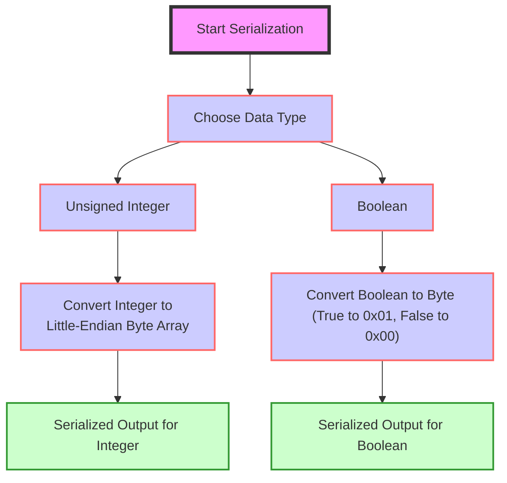

_Figure: Serialization Process for Basic Types._


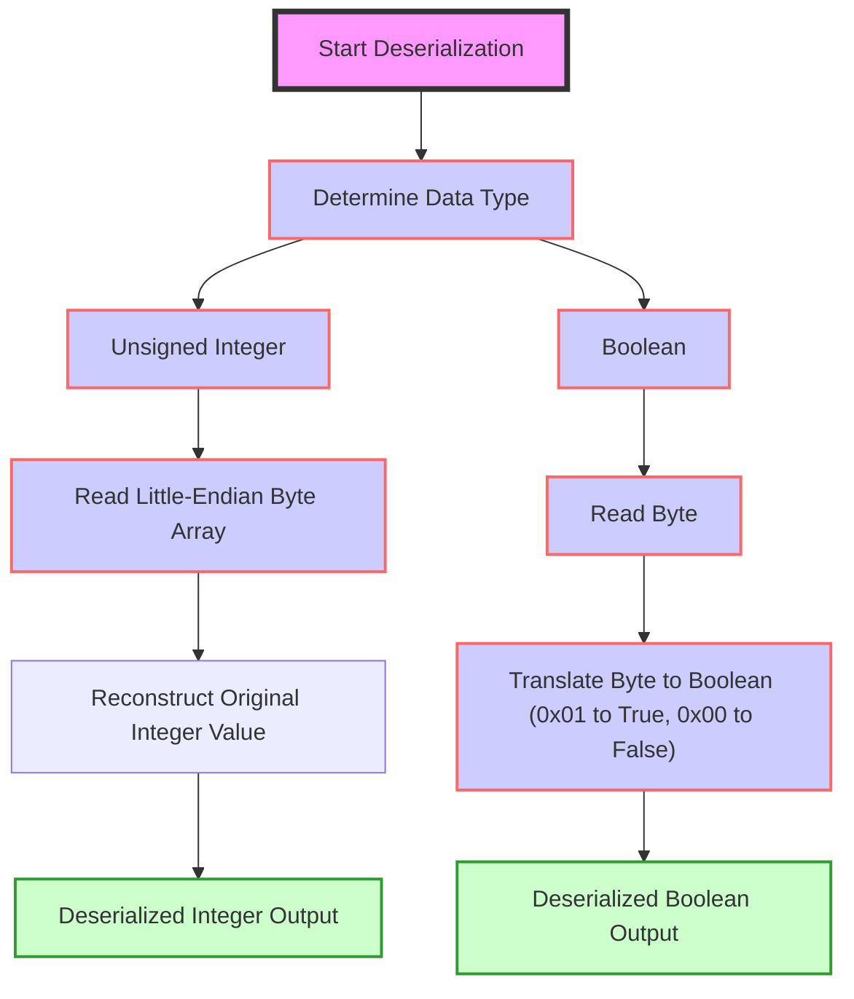

_Figure: Deserialization Process for Basic Types._

### Unsigned Integers

Unsigned integers (`uintN`) in SSZ are denoted where `N` can be any of 8, 16, 32, 64, 128, or 256 bits. These integers are serialized directly to their little-endian byte representation, which is a form well-suited for most modern computer architectures and facilitates easier manipulation at the byte level.

**Serialization Process for Unsigned Integers:**

1. **Input**: Take an unsigned integer of type `uintN`.
2. **Convert to Bytes**: Convert the integer into a byte array of length `N/8`. For instance, `uint16` represents 2 bytes.
3. **Apply Little-Endian Format**: Arrange the bytes in little-endian order, where the least significant byte is stored first.
4. **Output**: The resulting byte array is the serialized form of the integer.

**Example:**
- Integer `1025` as `uint16` would be serialized to `01 04` in hexadecimal. First, convert `1025` to hex which gives `0x0401`. In little-endian format, the least significant byte (LSB) comes first. So, `0x0401` in little-endian is `01 04`. The byte array `[01, 04]` is the serialized output.

**Deserialization Process for Unsigned Integers:**

1. **Input**: Read the byte array representing a serialized `uintN`.
2. **Read Little-Endian Bytes**: Interpret the bytes in little-endian order to reconstruct the integer value.
3. **Output**: Convert the byte array back into the integer.

**Example:**
- Byte array `01 04` (in hex) is deserialized to the integer `1025`. Read the first byte `01` as the lower part and `04` as the higher part of the integer. It translates back to `0401` in hex when reassembled in big-endian format for human readability, which equals 1025 in decimal.

### Booleans

Booleans in SSZ are quite straightforward, with each boolean represented as a single byte.

**Serialization Process for Booleans:**

1. **Input**: Take a boolean value (`True` or `False`).
2. **Convert to Byte**: 
   - If the boolean is `True`, serialize it as `01` (in hex).
   - If the boolean is `False`, serialize it as `00`.
3. **Output**: The resulting single byte is the serialized form of the boolean.

**Example:**
- `True` becomes `01`.
- `False` becomes `00`.

**Deserialization Process for Booleans:**

1. **Input**: Read a single byte.
2. **Interpret the Byte**: 
   - A byte of `01` indicates `True`.
   - A byte of `00` indicates `False`.
3. **Output**: The boolean value corresponding to the byte.

**Example:**
- Byte `01` is deserialized to `True`.
- Byte `00` is deserialized to `False`.

We can run SSZ serialization and deserialization commands using the python Eth2 spec as per the [instructions](https://eth2book.info/capella/appendices/running/) and verify the above byte arrays.

```python
>>> from eth2spec.utils.ssz.ssz_typing import uint64, boolean
# Serializing 
>>> uint64(1025).encode_bytes().hex()
'0104000000000000'
>>> boolean(True).encode_bytes().hex()
'01'
>>> boolean(False).encode_bytes().hex()
'00' 

# Deserializing 
>>> print(uint64.decode_bytes(bytes.fromhex('0104000000000000')))
1025
>>> print(boolean.decode_bytes(bytes.fromhex('01')))
1
>>> print(boolean.decode_bytes(bytes.fromhex('00')))
0
```

## How SSZ Works on Composite Types

### Vectors

Vectors in SSZ are used to handle fixed-length collections of homogeneous elements. Here’s a detailed breakdown of how SSZ handles the serialization and deserialization of vectors.

**SSZ Serialization for Vectors**

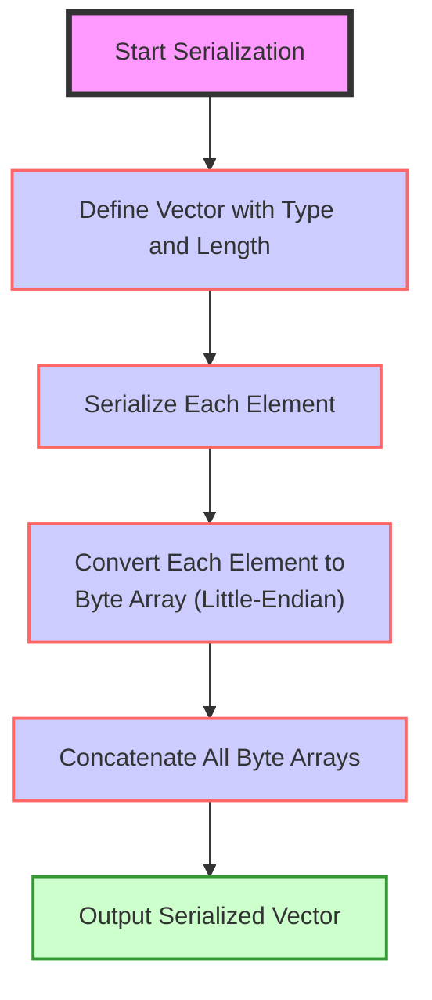

_Figure: SSZ Serialization for Vectors._


1. **Fixed-Length Definition**: Vectors are defined with a specific length and type of elements they can hold, such as `Vector[uint64, 4]` for a vector containing four 64-bit unsigned integers.

2. **Element Serialization**:
   - Each element in the vector is serialized independently according to its type. 
   - For basic types like integers or booleans, this means converting each element to its byte representation. 
   - If the elements are composite types, each element is serialized according to its specific serialization rules.

3. **Concatenation**:
   - The serialized outputs of each element are concatenated in the order they appear in the vector. 
   - Since the length of the vector and the size of each element are known and fixed, no additional metadata (like length prefixes) is needed in the serialized output.

**Example:**
For a `Vector[uint64, 3]` with the elements `[256, 512, 768]`, each element is 64 bits or 8 bytes long. The serialization would proceed as follows:

1. **Convert Each Integer to Little-Endian Byte Array**:
   - `256` as `uint64` becomes `00 01 00 00 00 00 00 00`.
   - `512` as `uint64` becomes `00 02 00 00 00 00 00 00`.
   - `768` as `uint64` becomes `00 03 00 00 00 00 00 00`.

2. **Concatenate These Byte Arrays**:
   - The resulting concatenated byte array will be `00 01 00 00 00 00 00 00 00 02 00 00 00 00 00 00 00 03 00 00 00 00 00 00`.

**Serialized Output**:
   - `00 01 00 00 00 00 00 00 00 02 00 00 00 00 00 00 00 03 00 00 00 00 00 00`.


**SSZ Deserialization for Vectors**

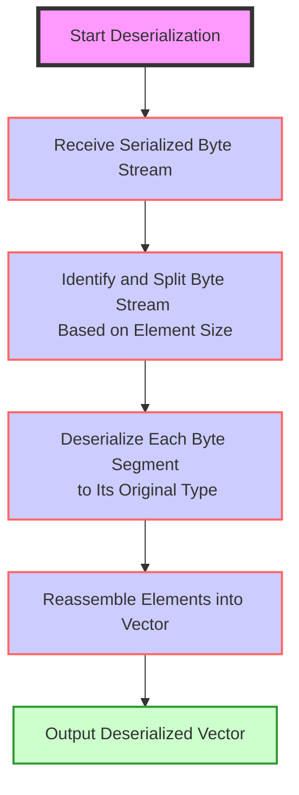

_Figure: SSZ Deserialization for Vectors._


1. **Fixed-Length Utilization**:
   - The deserializer uses the predefined length and type of the vector to parse the serialized data.
   - It knows exactly how many bytes each element takes and how many elements are in the vector.

2. **Element Deserialization**:
   - The byte stream is split into segments corresponding to the size of each element.
   - Each segment is deserialized independently according to the type of elements in the vector.

3. **Reconstruction**:
   - The elements are reconstructed into their original form (e.g., converting byte arrays back into integers or other specified types).
   - These elements are then aggregated to reform the original vector.

**Example:**
Given the serialized data for a `Vector[uint64, 3]`:
- Serialized Byte Array: `00 01 00 00 00 00 00 00 00 02 00 00 00 00 00 00 00 03 00 00 00 00 00 00`.

1. **Parse the Data into Segments**:
   - Each segment consists of 8 bytes.
   - First segment: `00 01 00 00 00 00 00 00` → Represents the integer 256.
   - Second segment: `00 02 00 00 00 00 00 00` → Represents the integer 512.
   - Third segment: `00 03 00 00 00 00 00 00` → Represents the integer 768.

2. **Convert Each Segment from a Little-Endian Byte Array Back to an Integer**:
   - Using little-endian format, each byte array is read and converted back into the respective `uint64` integer.

3. **Reconstruction**:
   - The reconstructed vector is `[256, 512, 768]`.

We can run and verify it in python like below:

```python
>>> from eth2spec.utils.ssz.ssz_typing import uint8, uint16, Vector
>>> Vector[uint16, 3](256, 512, 768).encode_bytes().hex()
'000100000000000000020000000000000003000000000000'
>>> print(Vector[uint64, 3].decode_bytes(bytes.fromhex('000100000000000000020000000000000003000000000000')))
Vector[uint64, 3]<<len=3>>(256, 512, 768)
>>> 

```

### Lists

Lists in SSZ are crucial for managing variable-length collections of homogeneous elements within a specified maximum length (`N`). This flexibility allows for dynamic management of the data structures such as transaction sets or variable state components, adapting to the changing needs of the network.

**SSZ Serialization for Lists**

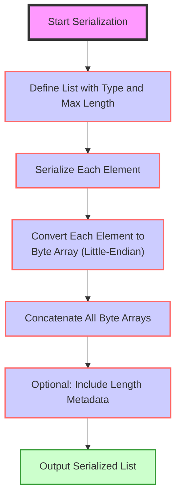

_Figure: SSZ Serialization for Lists._

1. **Define the List**: Lists in SSZ are defined with a specific element type and a maximum length, noted as `List[type, N]`. This definition not only constrains the list's maximum capacity but also informs how elements should be serialized.

2. **Element Serialization**:
   - Each element in the list is serialized based on its type. For `uint64` elements, the serialization process involves converting each integer into a byte array.

3. **Concatenate Serialized Elements**:
   - The outputs of the serialized elements are concatenated sequentially. The total length of the serialized data varies depending on the number of elements present at the time of serialization.

4. **Include Length Metadata (Optional)**:
   - Depending on the implementation requirements, the length of the list might be explicitly included at the start of the serialized data to aid in parsing and validation during deserialization.

**Example**:
For a `List[uint64, 5]` containing the elements `[1024, 2048, 3072]`, the serialization process would involve:
- Converting each integer to a byte array in little-endian format: `00 04 00 00 00 00 00 00`, `00 08 00 00 00 00 00 00`, `00 0C 00 00 00 00 00 00`.
- Concatenating these arrays results in: `00 04 00 00 00 00 00 00 00 08 00 00 00 00 00 00 00 0C 00 00 00 00 00 00`.

**SSZ Deserialization for Lists**

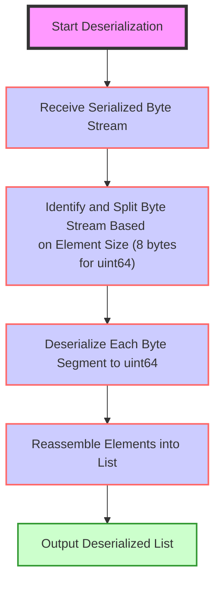

_Figure: SSZ Deserialization for Lists._

1. **Receive Serialized Data**: The serialized byte stream for the list is the input, containing sequences of byte arrays for each element.

2. **Parse and Deserialize Each Element**:
   - Based on the element type, say `uint64`, parse the serialized stream into 8-byte segments.
   - Convert each byte array from little-endian format back into a `uint64`.

3. **Reassemble the List**:
   - The deserialized elements are reassembled to recreate the original list.

**Example**:
Given the serialized data `00 04 00 00 00 00 00 00 00 08 00 00 00 00 00 00 00 0C 00 00 00 00 00 00` for a `List[uint64, 5]`:
- Split the data into segments of 8 bytes: `00 04 00 00 00 00 00 00`, `00 08 00 00 00 00 00 00`, `00 0C 00 00 00 00 00 00`.
- Convert each segment from little-endian to integers: `1024`, `2048`, `3072`.
- The reconstructed list is `[1024, 2048, 3072]`.

We can run and verify the SSZ for the above example as below:

```python
>>> from eth2spec.utils.ssz.ssz_typing import uint8, List, Vector
>>> List[uint64, 5](1024, 2048, 3072).encode_bytes().hex()
'00040000000000000008000000000000000c000000000000'
>>> Vector[uint64, 3](1024, 2048, 3072).encode_bytes().hex()
'00040000000000000008000000000000000c000000000000'
>>> print(List[uint64, 5].decode_bytes(bytes.fromhex('00040000000000000008000000000000000c000000000000')))
List[uint64, 5]<<len=3>>(1024, 2048, 3072)
>>> 
```

Lists are variable sized objects in SSZ they are encoded differently from fixed sized vectors when contained within another object, so there is a small overhead. For example, below `Alice` and `Bob` objects have different encoding.

```python
>>> from eth2spec.utils.ssz.ssz_typing import uint8, Vector, List, Container
>>> class Alice(Container):
...     x: List[uint8, 3] # Variable sized
>>> class Bob(Container):
...     x: Vector[uint8, 3] # Fixed sized
>>> Alice(x = [1, 2, 3]).encode_bytes().hex()
'04000000010203'
>>> Bob(x = [1, 2, 3]).encode_bytes().hex()
'010203'
>>> 
```

### Bitvectors

Bitvectors in SSZ are used to manage fixed-length sequences of boolean values, typically represented as bits. This data structure is particularly efficient for compactly storing binary data or flags, which are common in Ethereum applications for indicating state conditions, permissions, or other binary settings.

**SSZ Serialization for Bitvectors**

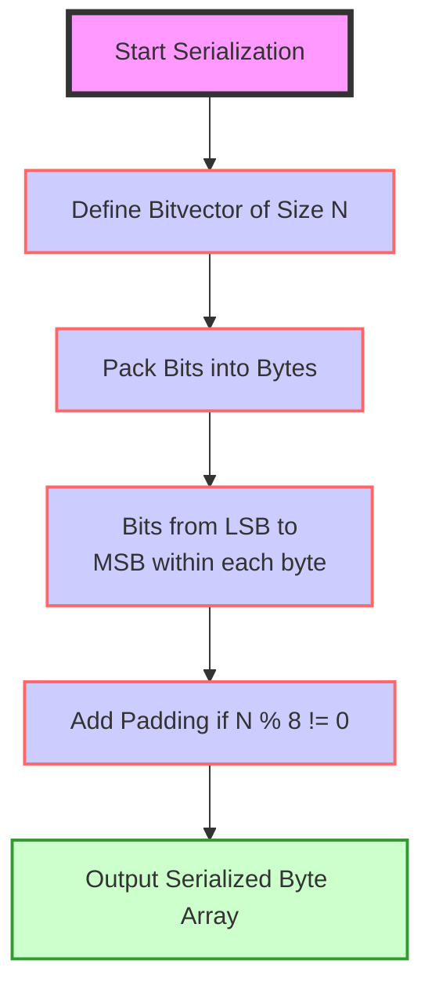

_Figure: SSZ Serialization for Bitvectors._

1. **Define the Bitvector**: A bitvector in SSZ is defined by its length `N`, which specifies the number of bits. For example, `Bitvector[256]` means a bitvector that contains 256 bits.

2. **Convert Bits to Bytes**:
   - Each bit in the bitvector represents a boolean value, where `0` corresponds to `False` and `1` to `True`.
   - These bits are packed into bytes, with the least significant bit (LSB) first within each byte. This means the first bit in the bitvector corresponds to the LSB of the first byte.

3. **Byte Array Formation**:
   - The bits are serialized into a byte array by packing 8 bits into each byte until all bits are accounted for.
   - If `N` is not a multiple of 8, the last byte will contain fewer than 8 bits of data, padded with zeros at the most significant bit positions.

**Example**:
For a `Bitvector[10]` with the pattern `1011010010`:
- The first 8 bits (`10110100`) form the first byte.
- The remaining 2 bits (`10`) are padded with six zeros to form the second byte: `10000000`.
- The serialized output is `B4 80` in hexadecimal.

**SSZ Deserialization for Bitvectors**

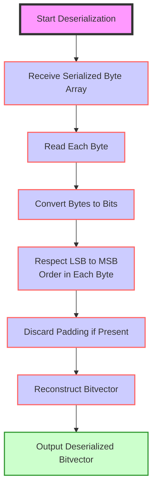

_Figure: SSZ Deserialization for Bitvectors._

1. **Read Serialized Byte Array**: Start with a byte array that encodes the bitvector.

2. **Extract Bits from Bytes**:
   - Convert each byte back into bits. Remember, the bits are stored LSB first within each byte.
   - If the bitvector's length `N` is not a multiple of 8, discard the extraneous padding bits in the final byte.

3. **Reconstruct the Bitvector**:
   - Reassemble the extracted bits into the original bitvector format, adhering to the specified length `N`.

**Example**:
Given the serialized data `B4 80` for a `Bitvector[10]`:
- Convert `B4` (`10110100` in binary) and `80` (`10000000` in binary) back into bits.
- Extract the first 10 bits from the binary sequence: `1011010010`.
- The reconstructed bitvector is `1011010010`.

You can run and verify it in python as below:

```python
>>> from eth2spec.utils.ssz.ssz_typing import Bitvector
>>> Bitvector[8](0,0,1,0,1,1,0,1).encode_bytes().hex()
'b4'
>>> Bitvector[8](0,0,0,0,0,0,0,1).encode_bytes().hex()
'80'
```

Note that, functionally we could use either `Vector[boolean, N]` or `Bitvector[N]` to represent a list of bits. However, the latter will have a serialization up to eight times shorter in practice since the former will use a whole byte per bit.

```python
>>> from eth2spec.utils.ssz.ssz_typing import Vector, Bitvector, boolean
>>> Bitvector[5](1,0,1,0,1).encode_bytes().hex()
'15'
>>> Vector[boolean,5](1,0,1,0,1).encode_bytes().hex()
'0100010001'
```

### Bitlists

Bitlists in SSZ are similar to bitvectors but are designed to handle variable-length sequences of boolean values with a specified maximum length (`N`). 

**SSZ Serialization for Bitlists**

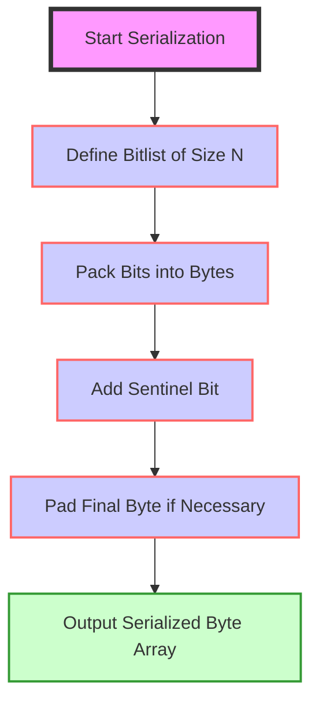

_Figure: SSZ Serialization for Bitlists._


1. **Define the Bitlist**: A bitlist is defined by its maximum length `N`, which determines the upper bound of bits that can be included. The actual number of bits, however, can be less than `N`.

2. **Pack Bits into Bytes**:
   - Each bit in the bitlist represents a boolean value, where `0` corresponds to `False` and `1` to `True`.
   - These bits are serialized into a byte array, packed from the LSB to the MSB within each byte, similar to bitvectors.

3. **Add Sentinel Bit**:
   - To mark the end of the bitlist and distinguish its actual length from its maximum capacity, a sentinel bit (`1`) is added to the end of the bit sequence. This is crucial to ensure that the deserialization process accurately identifies the length of the bitlist.

4. **Byte Array Formation and Padding**:
   - After including the sentinel bit, the bits are packed into bytes, with any necessary padding applied to the last byte to complete it if the total number of bits (including the sentinel) does not divide evenly by 8.


**SSZ Deserialization for Bitlists**

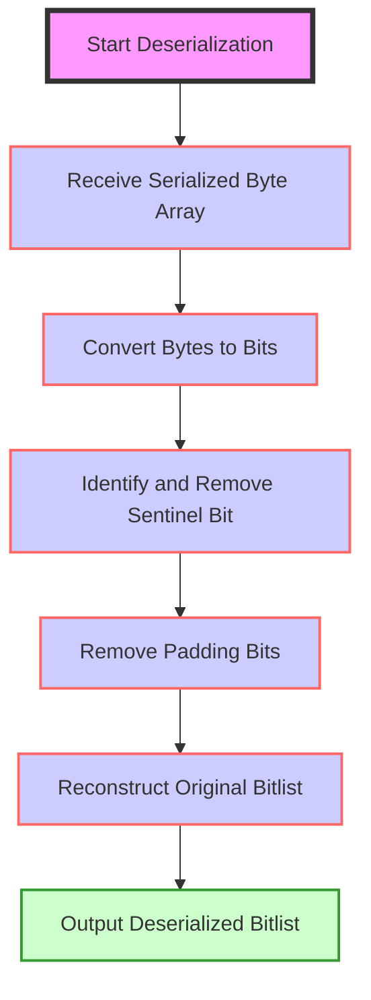

_Figure: SSZ Deserialization for Bitlists._

1. **Receive Serialized Byte Array**: Start with the byte array that encodes the bitlist, including the sentinel bit.

2. **Extract Bits from Bytes**:
   - Convert each byte back into bits, respecting the order (LSB to MSB).
   - Continue this process for each byte in the serialized data.

3. **Identify and Remove the Sentinel Bit**:
   - As bits are extracted, locate the first `1` (sentinel bit) from the end of the bit sequence to determine the actual end of the bitlist data.
   - All bits following the sentinel bit are disregarded as padding.

4. **Reconstruct the Bitlist**:
   - Reassemble the extracted bits (excluding the sentinel bit and any padding) into the original bitlist format.

You can run the encoding of Bitlist like below:

```python
>>> from eth2spec.utils.ssz.ssz_typing import Bitlist
>>> Bitlist[100](0,0,0).encode_bytes().hex()
'08'
```

As a consequence of the sentinel, we require an extra byte to serialize a bitlist if its actual length is a multiple of eight (irrespective of the maximum length `N`). This is not the case for a bitvector.

```python
>>> Bitlist[8](0,0,0,0,0,0,0,0).encode_bytes().hex()
'0001'
>>> Bitvector[8](0,0,0,0,0,0,0,0).encode_bytes().hex()
'00'
```

### Containers

Containers in SSZ are fundamental structures used to group multiple fields into a single composite type. Each field within a container can be of any SSZ-supported type, including basic types like `uint64`, more complex types like other containers, vectors, or lists. Containers are analogous to structures or objects in programming languages, making them integral for representing complex and nested data structures in Ethereum.

**SSZ Serialization for Containers**

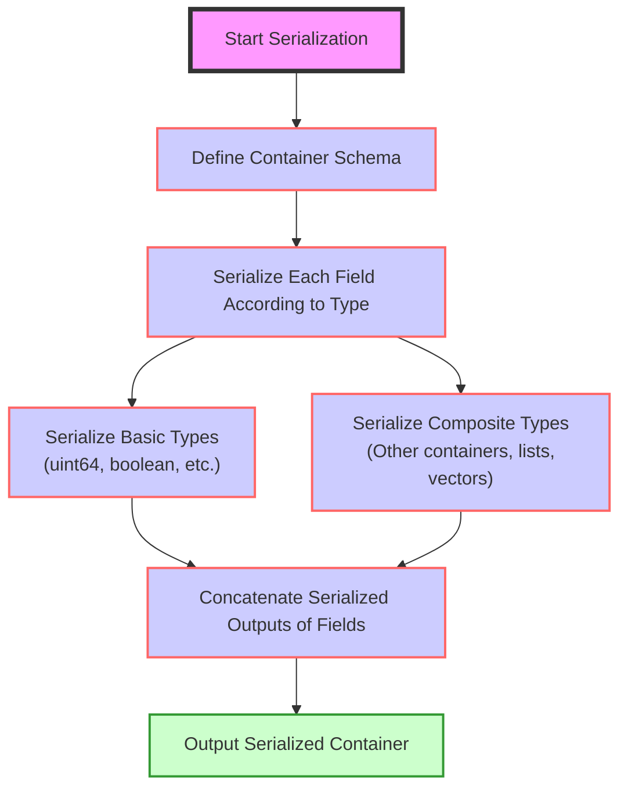

_Figure: SSZ Serialization for Containers._

1. **Define the Container**: A container in SSZ is defined by its schema, which specifies the types and order of its fields. This schema is crucial because it dictates how data should be serialized and deserialized.

2. **Serialize Each Field**:
   - Each field in the container is serialized in the order defined by the schema.
   - The serialization method for each field depends on its type:
     - **Basic types** are converted directly to their byte representations.
     - **Composite types** (other containers, lists, vectors) are serialized recursively according to their own rules.

3. **Concatenate Serialized Fields**:
   - The serialized outputs of all fields are concatenated to form the complete serialized data of the container.
   - If a field is of a variable size (like a list or a vector with variable length), its serialized data includes a length prefix or it may use offsets to indicate the start of the data, depending on the specifics of the implementation and type.

**SSZ Deserialization for Containers**

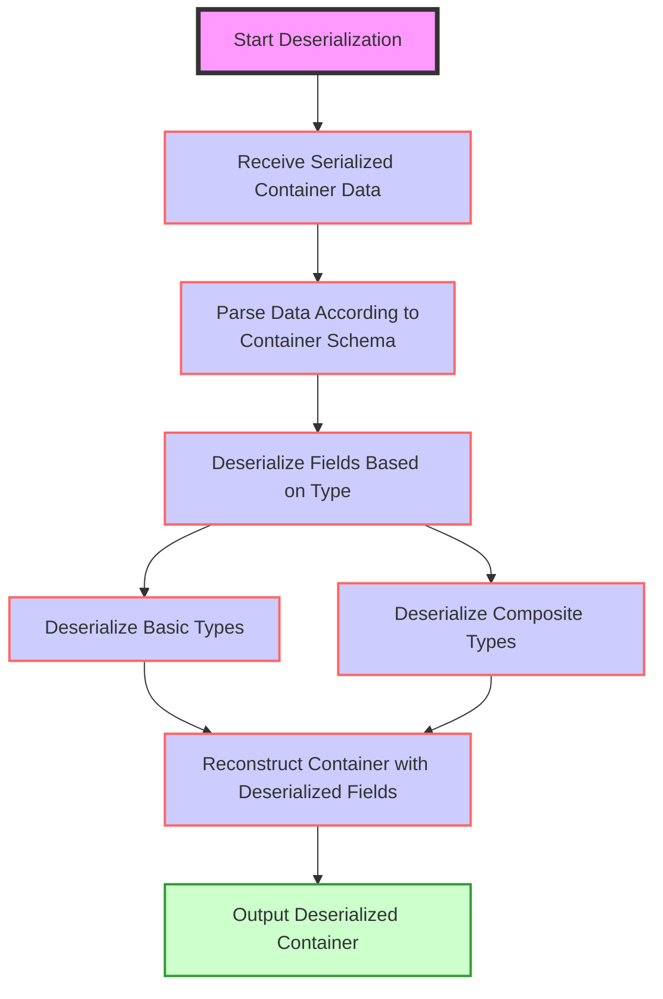

_Figure: SSZ Deserialization for Containers._

1. **Read Serialized Data**: Begin with the serialized byte stream that represents the container.

2. **Parse Serialized Data According to Schema**:
   - Based on the container's schema, parse the serialized data into its constituent fields.
   - This requires knowing the type and size of each field to correctly extract and deserialize each one.

3. **Deserialize Each Field**:
   - Each field's data is deserialized according to its type.
   - Deserialization might involve converting byte arrays back into integers, decoding nested containers, or reconstructing lists and vectors from their serialized forms.

4. **Reconstruct the Container**:
   - As each field is deserialized, reconstruct the container by placing each field back into its defined position.

**Example**:

Let's delve into the SSZ serialization and deserialization process using the specific example of the `IndexedAttestation` container from the Beacon Chain. This example will outline how complex, nested containers are handled and processed in SSZ, particularly those involving both fixed-size and variable-size data types.

The `IndexedAttestation` container looks like this.

```python
class IndexedAttestation(Container):
    attesting_indices: List[ValidatorIndex, MAX_VALIDATORS_PER_COMMITTEE]
    data: AttestationData
    signature: BLSSignature
```

It contains an `AttestationData` container,

```python
class AttestationData(Container):
    slot: Slot
    index: CommitteeIndex
    beacon_block_root: Root
    source: Checkpoint
    target: Checkpoint
```

which in turn contains two `Checkpoint` containers,

```python
class Checkpoint(Container):
    epoch: Epoch
    root: Root
```    

**IndexedAttestation Container Structure**

The `IndexedAttestation` container includes several fields, some of which are fixed-size basic types and others are composite types including another container (`AttestationData`) and lists (like `attesting_indices`).

Here's the structure:

- **attesting_indices**: `List[ValidatorIndex, MAX_VALIDATORS_PER_COMMITTEE]` (variable size)
- **data**: `AttestationData` (composite container)
- **signature**: `BLSSignature` (fixed size)

**AttestationData Container Structure**

- **slot**: `Slot` (fixed size)
- **index**: `CommitteeIndex` (fixed size)
- **beacon_block_root**: `Root` (fixed size)
- **source**: `Checkpoint` (composite container)
- **target**: `Checkpoint` (composite container)

**Checkpoint Container Structure**
- **epoch**: `Epoch` (fixed size)
- **root**: `Root` (fixed size)

**Serialization Process**

- **Serialize Fixed and Variable Components**
The serialization of an `IndexedAttestation` involves serializing each component based on its type:

1. **Serialize Fixed-Size Elements**
   - Each fixed-size element (`Slot`, `CommitteeIndex`, `Epoch`, `Root`, `BLSSignature`) is serialized to its corresponding byte format, typically little-endian for numeric types.

2. **Serialize Variable-Size Elements**
   - The `List[ValidatorIndex, MAX_VALIDATORS_PER_COMMITTEE]` is serialized by first recording the length of the list followed by the serialized form of each index.
   - If a list or another variable-size element is empty or not at maximum capacity, it only consumes the space necessary for the actual data present, plus possibly some length or offset metadata.

- **Concatenate Serialized Data**
1. All serialized bytes are concatenated in the order specified by the container's structure. Fixed-size fields are directly placed in order, while variable-size fields might include offsets or lengths as part of the serialization.

**Example Serialization Output**

```python
from eth2spec.utils.ssz.ssz_typing import *
from eth2spec.capella import mainnet
from eth2spec.capella.mainnet import *

attestation = IndexedAttestation(
    attesting_indices = [33652, 59750, 92360],
    data = AttestationData(
        slot = 3080829,
        index = 9,
        beacon_block_root = '0x4f4250c05956f5c2b87129cf7372f14dd576fc152543bf7042e963196b843fe6',
        source = Checkpoint (
            epoch = 96274,
            root = '0xd24639f2e661bc1adcbe7157280776cf76670fff0fee0691f146ab827f4f1ade'
        ),
        target = Checkpoint(
            epoch = 96275,
            root = '0x9bcd31881817ddeab686f878c8619d664e8bfa4f8948707cba5bc25c8d74915d'
        )
    ),
    signature = '0xaaf504503ff15ae86723c906b4b6bac91ad728e4431aea3be2e8e3acc888d8af'
                + '5dffbbcf53b234ea8e3fde67fbb09120027335ec63cf23f0213cc439e8d1b856'
                + 'c2ddfc1a78ed3326fb9b4fe333af4ad3702159dbf9caeb1a4633b752991ac437'
)

print(attestation.encode_bytes().hex())
```

The resulting serialized blob of data that represents this `IndexedAttestation` object is (in hexadecimal):

```code
e40000007d022f000000000009000000000000004f4250c05956f5c2b87129cf7372f14dd576fc15
2543bf7042e963196b843fe61278010000000000d24639f2e661bc1adcbe7157280776cf76670fff
0fee0691f146ab827f4f1ade13780100000000009bcd31881817ddeab686f878c8619d664e8bfa4f
8948707cba5bc25c8d74915daaf504503ff15ae86723c906b4b6bac91ad728e4431aea3be2e8e3ac
c888d8af5dffbbcf53b234ea8e3fde67fbb09120027335ec63cf23f0213cc439e8d1b856c2ddfc1a
78ed3326fb9b4fe333af4ad3702159dbf9caeb1a4633b752991ac437748300000000000066e90000
00000000c868010000000000
```

**Breakdown of the Serialization Output**

To clearly explain the serialization process and the structure of the serialized data for the `IndexedAttestation` container in the example, let's break down the serialization into its individual components and understand how each part is represented in the byte stream. This unpacking helps illustrate how the SSZ format manages complex data structures.

**Part 1: Fixed Size Elements**
1. **4-byte Offset for Variable Size List (`attesting_indices`)**:
   - **Byte Offset**: `00`
   - **Value**: `e4000000`
   - **Explanation**: This indicates the start of the `attesting_indices` list in the serialized byte stream. The hexadecimal value `e4` converted to decimal is `228`, meaning the list starts at byte `228` from the beginning of the byte stream.

2. **Slot (uint64)**:
   - **Byte Offset**: `04`
   - **Value**: `7d022f0000000000`
   - **Explanation**: Represents the `slot` field serialized as a 64-bit unsigned integer. The hexadecimal `7d022f00` in little-endian format translates to `3080829` in decimal, which is the slot number.

3. **Committee Index (uint64)**:
   - **Byte Offset**: `0c`
   - **Value**: `0900000000000000`
   - **Explanation**: This is the `index` field, representing a committee index as a 64-bit unsigned integer. The value `09` indicates committee index `9`.

4. **Beacon Block Root (Bytes32)**:
   - **Byte Offset**: `14`
   - **Value**: `4f4250c05956f5c2b87129cf7372f14dd576fc152543bf7042e963196b843fe6`
   - **Explanation**: This is a 256-bit hash stored as `Bytes32`, representing the root hash of the beacon block.

5. **Source Checkpoint Epoch (uint64) and Root (Bytes32)**:
   - **Epoch Byte Offset**: `34`
   - **Epoch Value**: `1278010000000000`
   - **Root Byte Offset**: `3c`
   - **Root Value**: `d24639f2e661bc1adcbe7157280776cf76670fff0fee0691f146ab827f4f1ade`
   - **Explanation**: The source checkpoint contains an `epoch` (96274) and a `root`. The root is another 256-bit hash.

6. **Target Checkpoint Epoch (uint64) and Root (Bytes32)**:
   - **Epoch Byte Offset**: `5c`
   - **Epoch Value**: `1378010000000000`
   - **Root Byte Offset**: `64`
   - **Root Value**: `9bcd31881817ddeab686f878c8619d664e8bfa4f8948707cba5bc25c8d74915d`
   - **Explanation**: Similar to the source, the target checkpoint includes an `epoch` (96275) and a `root`, detailing the intended target of the attestation.

7. **Signature (BLSSignature/Bytes96)**:
   - **Byte Offset**: `84`
   - **Value**: Concatenated over several lines due to its length (96 bytes total).
   - **Explanation**: This is the cryptographic signature of the attestation, verifying its authenticity.

**Part 2: Variable Size Elements**
1. **Attesting Indices (List[uint64, MAX_VALIDATORS_PER_COMMITTEE])**:
   - **Byte Offset**: `e4`
   - **Value**: `748300000000000066e9000000000000c868010000000000`
   - **Explanation**: This represents the list of validator indices who are attesting to the block. It starts from the offset `228` and contains indices such as `33652`, `59750`, and `92360`.


## SSZ Tools

There are many tools available for SSZ. Here is a [full list](https://github.com/ethereum/consensus-specs/issues/2138) of SSZ tools. Below are some of the popular ones:

- [py-ssz](https://github.com/ethereum/py-ssz)
- [dafny](https://github.com/ConsenSys/eth2.0-dafny)
- [Eth2.py](https://github.com/protolambda/remerkleable)
- [fastssz](https://github.com/ferranbt/fastssz/)
- [rust-ssz](https://github.com/ralexstokes/ssz-rs)

## SSZ VS RLP Serialization

| CRITERIA   | COMPACT | EXPRESSIVENESS | HASHING  | INDEXING |
|------------|---------|----------------|----------|----------|
| RLP        | Yes     | Flexible       | Possible | No       |
| SSZ        | No      | Yes            | Yes      | Poor     |

_Table: SSZ VS RLP Comparison by [Piper Merriam](https://twitter.com/pipermerriam)._

1. **Expressiveness**:
   - **SSZ**: Supports all necessary data types directly without the need for additional abstraction layers. This makes SSZ inherently more straightforward and robust for handling complex data structures used in Ethereum PoS.
   - **RLP**: Limited to dynamic length byte strings and lists. Additional data types are only supported through abstraction layers, which can introduce complexity and potential inefficiencies.

2. **Hashing**:
   - **SSZ**: Facilitates efficient hashing and re-hashing of objects, particularly beneficial for operations that require frequent updates to data states, such as those in sharding and stateless clients. This efficiency is crucial for maintaining blockchain integrity and performance.
   - **RLP**: While hashing is possible, it does not offer the same performance optimizations, especially when data structures undergo minor modifications.

3. **Indexing**:
   - **SSZ**: Although indexing is described as 'poor', SSZ supports some level of direct access to serialized data without full deserialization, which is beneficial for certain operations within the blockchain.
   - **RLP**: Does not support efficient indexing, potentially leading to `O(N)` complexity when accessing internal data, which can be a significant drawback for performance on large-scale networks.

4. **Data Type Compatibility**:
   - **SSZ**: Designed to be fully compatible with the data types and structures used within the Ethereum protocol, enhancing its utility for consensus mechanisms and network operations.
   - **RLP**: While flexible, the need for additional layers to support various data types can lead to inefficiencies and increased complexity in implementation.

5. **Designed for Ethereum 2.0 Requirements**:
   - **SSZ**: Specifically created to meet the needs of Ethereum PoS, including sharding and proof-of-stake mechanisms, making it better suited for future developments and updates to the protocol.

6. **Deterministic Serialization**:
   - **SSZ**: Provides deterministic serialization results, ensuring that the same data structure serializes to the exact same byte sequence every time, which is crucial for consensus reliability.

For these reasons, there is a strong effort in Ethereum to completely migrate to SSZ serialization for everything and stop the usage of RLP serialization.

## SSZ Merkleization

## Resources
- [Simple serialize](https://ethereum.org/en/developers/docs/data-structures-and-encoding/ssz/)
- [SSZ specs](https://github.com/ethereum/consensus-specs/blob/dev/ssz/simple-serialize.md)
- [eth2book - SSZ](https://eth2book.info/capella/part2/building_blocks/ssz/#ssz-simple-serialize)
- [Go Lessons from Writing a Serialization Library for Ethereum](https://rauljordan.com/go-lessons-from-writing-a-serialization-library-for-ethereum/)
- [Interactive SSZ serializer/deserializer](https://www.ssz.dev/)
- [SSZ encoding diagrams by Protolambda](https://github.com/protolambda/eth2-docs#ssz-encoding)
- [SSZ explainer by Raul Jordan](https://rauljordan.com/go-lessons-from-writing-a-serialization-library-for-ethereum/)
- [SSZ Specifications](https://github.com/ethereum/consensus-specs/blob/v1.3.0/ssz/simple-serialize.md)