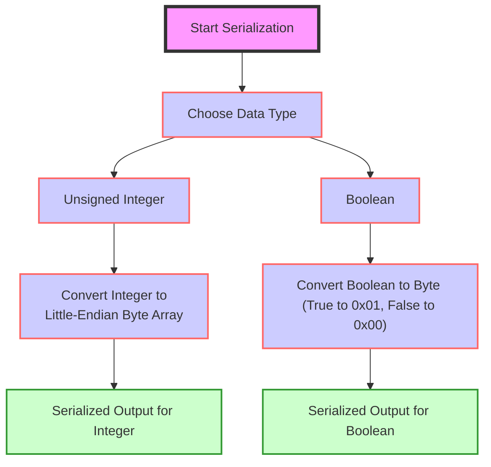
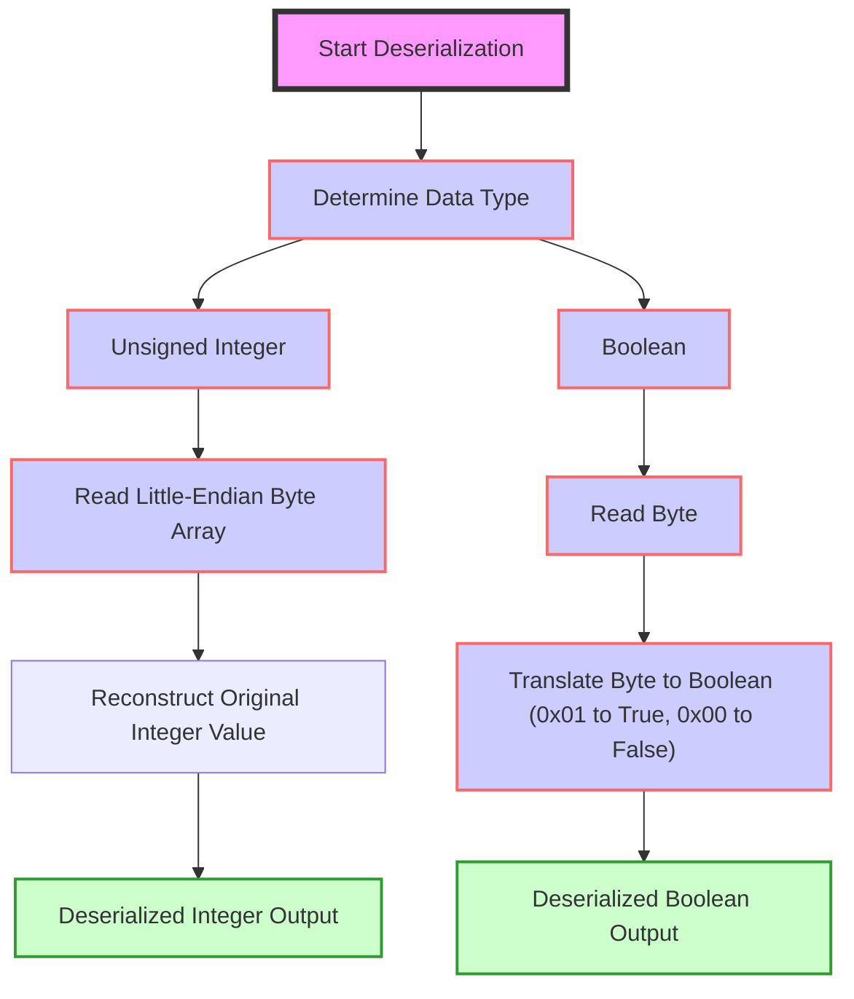

# Simple Serialize (SSZ)

## Overview

Simple Serialize (SSZ) is a serialization and Merkleization scheme designed specifically for Ethereum's Beacon Chain. SSZ replaces the [RLP serialization](/docs/wiki/EL/RLP.md) used on the execution layer (EL) everywhere across the consensus layer (CL) except the [peer discovery protocol](https://github.com/ethereum/devp2p). Its development and adoption are aimed at enhancing the efficiency, security, and scalability of Ethereum's CL.

## How SSZ Works - Basic Types

Here’s how SSZ handles the serialization and deserialization of the basic types:



_Figure: Serialization Process for Basic Types._




_Figure: Deserialization Process for Basic Types._

### Unsigned Integers

Unsigned integers (`uintN`) in SSZ are denoted where `N` can be any of 8, 16, 32, 64, 128, or 256 bits. These integers are serialized directly to their little-endian byte representation, which is a form well-suited for most modern computer architectures and facilitates easier manipulation at the byte level.

**Serialization Process for Unsigned Integers:**

1. **Input**: Take an unsigned integer of type `uintN`.
2. **Convert to Bytes**: Convert the integer into a byte array of length `N/8`. For instance, `uint16` represents 2 bytes.
3. **Apply Little-Endian Format**: Arrange the bytes in little-endian order, where the least significant byte is stored first.
4. **Output**: The resulting byte array is the serialized form of the integer.

**Example:**
- Integer `1025` as `uint16` would be serialized to `01 04` in hexadecimal. First, convert `1025` to hex which gives `0x0401`. In little-endian format, the least significant byte (LSB) comes first. So, `0x0401` in little-endian is `01 04`. The byte array `[01, 04]` is the serialized output.

**Deserialization Process for Unsigned Integers:**

1. **Input**: Read the byte array representing a serialized `uintN`.
2. **Read Little-Endian Bytes**: Interpret the bytes in little-endian order to reconstruct the integer value.
3. **Output**: Convert the byte array back into the integer.

**Example:**
- Byte array `01 04` (in hex) is deserialized to the integer `1025`. Read the first byte `01` as the lower part and `04` as the higher part of the integer. It translates back to `0401` in hex when reassembled in big-endian format for human readability, which equals 1025 in decimal.

### Booleans

Booleans in SSZ are quite straightforward, with each boolean represented as a single byte.

**Serialization Process for Booleans:**

1. **Input**: Take a boolean value (`True` or `False`).
2. **Convert to Byte**: 
   - If the boolean is `True`, serialize it as `01` (in hex).
   - If the boolean is `False`, serialize it as `00`.
3. **Output**: The resulting single byte is the serialized form of the boolean.

**Example:**
- `True` becomes `01`.
- `False` becomes `00`.

**Deserialization Process for Booleans:**

1. **Input**: Read a single byte.
2. **Interpret the Byte**: 
   - A byte of `01` indicates `True`.
   - A byte of `00` indicates `False`.
3. **Output**: The boolean value corresponding to the byte.

**Example:**
- Byte `01` is deserialized to `True`.
- Byte `00` is deserialized to `False`.

We can run SSZ serialization and deserialization commands using the python Eth2 spec as per the [instructions](https://eth2book.info/capella/appendices/running/) and verify the above byte arrays.

```python
>>> from eth2spec.utils.ssz.ssz_typing import uint64, boolean
# Serializing 
>>> uint64(1025).encode_bytes().hex()
'0104000000000000'
>>> boolean(True).encode_bytes().hex()
'01'
>>> boolean(False).encode_bytes().hex()
'00' 

# Deserializing 
>>> print(uint64.decode_bytes(bytes.fromhex('0104000000000000')))
1025
>>> print(boolean.decode_bytes(bytes.fromhex('01')))
1
>>> print(boolean.decode_bytes(bytes.fromhex('00')))
0
```


## How SSZ Works - Composite Types


## Fixed VS Variable Length Types


## SSZ Tools

## Resources
- [Simple serialize](https://ethereum.org/en/developers/docs/data-structures-and-encoding/ssz/)
- [SSZ specs](https://github.com/ethereum/consensus-specs/blob/dev/ssz/simple-serialize.md)
- [eth2book - SSZ](https://eth2book.info/capella/part2/building_blocks/ssz/#ssz-simple-serialize)
- [Go Lessons from Writing a Serialization Library for Ethereum](https://rauljordan.com/go-lessons-from-writing-a-serialization-library-for-ethereum/)
- [Interactive SSZ serialiser/deserialiser](https://simpleserialize.com/)