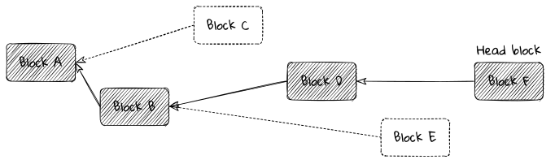
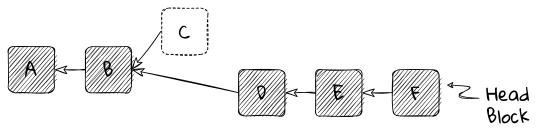
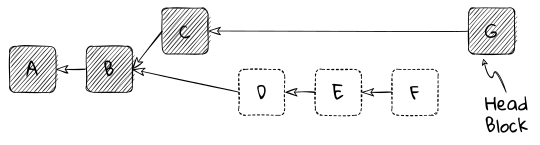
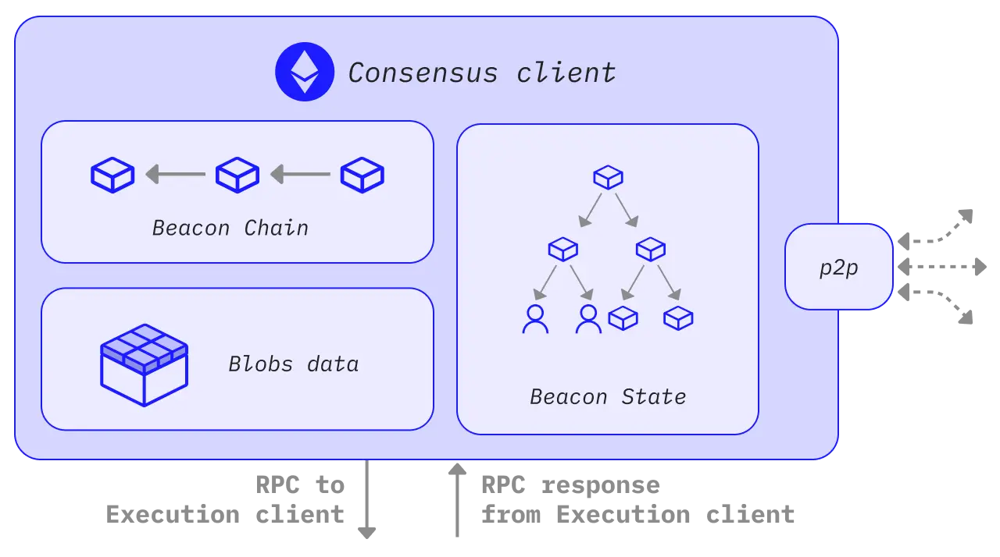
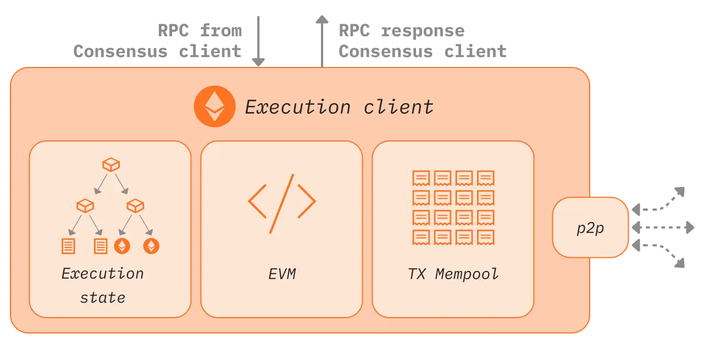

# Consensus Layer (CL) architecture

**tldr;**

> - Many blockchain consensus protocols are "forkful".
> - Forkful chains use a fork choice rule, and sometimes undergo reorganisations.
> - Ethereum's consensus protocol combines two separate consensus protocols.
> - "LMD GHOST" essentially provides liveness.
> - "Casper FFG" provides finality.
> - Together they are known as "Gasper".
> - In a "live" protocol, something good always happens.
> - In a "safe" protocol, nothing bad ever happens.
> - No practical protocol can be always safe and always live.

## Fork-choice Mechanism

As described in [previous section](/wiki/CL/overview.md), for various reasons - like network delays, outages, out-of-order messages, or malicious behavior — nodes in the network can have different views of the network's state. Eventually, we want every honest node to agree on an identical, linear history and a common view of the system's state. The protocol's fork choice rule is what helps achieve this agreement.

#### Block Tree
Given a block tree and decision criteria based on a node's local view of the network, the fork choice rule is designed to select the branch that is most likely to become the final, linear, canonical chain. It chooses the branch least likely to be pruned out as nodes converge on a common view.

<a id="img_blocktree"></a>

<figure class="diagram" style="text-align:center; width:95%">



<figcaption>

_The fork choice rule picks a head block from the candidates. The head block identifies a unique linear blockchain back to the Genesis block._

</figcaption>
</figure>

#### Fork choice rules

The fork choice rule implicitly selects a branch by choosing a block at the branch's tip, called the head block. For any correct node, the first rule of any fork choice is that the chosen block must be valid according to protocol rules, and all its ancestors must also be valid. Any invalid block is ignored, and blocks built on an invalid block are also invalid.

There are several examples of different fork choice rules:

- **Proof-of-Work**: In Ethereum and Bitcoin, the "heaviest chain rule" (sometimes called "longest chain", though not strictly accurate) is used. The head block is the tip of the chain with the most cumulative "work" done.
> Note that contrary to popular belief, Ethereum's Proof-of-Work protocol [did not use](https://ethereum.stackexchange.com/questions/38121/why-did-ethereum-abandon-the-ghost-protocol/50693#50693) any form of GHOST in its fork choice. This misconception is very persistent, probably due to the [Ethereum Whitepaper](https://ethereum.org/en/whitepaper/#modified-ghost-implementation). Eventually when Vitalik was asked about it, he confirmed that although GHOST had been planned under PoW it was never implemented due to concerns about some unspecified attacks. The heaviest chain rule was simpler and well tested. It worked fine.
- **Casper FFG (Proof-of-Stake)**: In Ethereum's PoS Casper FFG protocol, the fork-choice rule is to "follow the chain containing the justified checkpoint of the **greatest height**" and never revert a finalized block.
- **LMD GHOST (Proof-of-Stake)**: In Ethereum's PoS LMD GHOST protocol, the fork-choice rule is to take the "Greediest Heaviest Observed SubTree". It involves counting accumulated votes from validators for blocks and their descendent blocks. It also applies the same rule as Casper FFG.

Each of these fork choice rules assigns a numeric score to a block. The winning block, or head block, has the highest score. The goal is that all correct nodes, when they see a certain block, will agree that it is the head and follow its branch. This way, all correct nodes will eventually agree on a single canonical chain that goes back to Genesis.

#### Reorgs and Reversion

As a node receives new votes (and new votes for blocks in Proof-of-stake), it re-evaluates the fork choice rule with this new information. Usually, a new block will be a child of the current head block, and it will become the new head block.

Sometimes, however, the new block might be a descendant of a different block in the block tree. If the node doesn't have the parent block of the new block, it will ask its peers for it and any other missing blocks.

Running the fork choice rule on the updated block tree might show that the new head block is on a different branch than the previous head block. When this happens, the node must perform a reorg (reorganisation). This means it will remove (revert) blocks it previously included and adopt the blocks on the new head's branch.

For example, if a node has blocks $A, B, D, E,$ and $F$ in its chain, and it views $F$ as the head block, it knows about block $$ but it does not appear in its view of the chain; it is on a side branch.

<a id="img_reorg0"></a>

<figure class="diagram" style="text-align:center">



<figcaption>

_At this point, the node believes that block $F$ is the best head, therefore its chain is blocks $[A \leftarrow B \leftarrow D \leftarrow E \leftarrow F]$_

</figcaption>
</figure>

When the node later receives block $G$, which is built on block $C$, not on its current head block $F$, it must decide if $G$ should be the new head. Just for example, If the fork choice rule says $G$ is the better head block, the node will revert blocks $D, E,$ and $F$. It will remove them from its chain, as if they were never received, and go back to the state after block $B$.

Then, the node will add blocks $C$ and $G$ to its chain and process them. After this reorg, the node's chain will be $A, B, C,$ and $G$.

<a id="img_reorg1"></a>

<figure class="diagram" style="text-align:center">



<figcaption>

_Now the node believes that block $G$ is the best head, therefore its chain must change to the blocks $[A \leftarrow B \leftarrow C \leftarrow G]$_

</figcaption>
</figure>

Later, perhaps, a block $H$ might appear, that's built on $F$, and the fork choice rule says $H$ should be the new head, the node will reorg again, reverting to block $B$ and replaying blocks on $H$'s branch.

Short reorgs of one or two blocks are common due to network delays. Longer reorgs should be rare unless the chain is under attack or there is a bug in the fork choice rule or its implementation.

### Safety and Liveness

In consensus mechanisms, two key concepts are safety and liveness.

**Safety** means "nothing bad ever happens," such as preventing double-spending or finalizing conflicting checkpoints. It ensures consistency, meaning all honest nodes should always agree on the state of the blockchain.

**Liveness** means "something good eventually happens," ensuring the blockchain can always add new blocks and never gets stuck in a deadlock.

**CAP Theorem** states that no distributed system can provide consistency, availability, and partition tolerance simultaneously. This means we can't design a system that is both safe and live under all circumstances when communication is unreliable.

#### Ethereum Prioritizes Liveness

Ethereum’s consensus protocol aims to offer both safety and liveness in good network conditions. However, it prioritizes liveness during network issues. In a network partition, nodes on each side will continue to produce blocks but won't achieve finality (a safety property). If the partition persists, each side may finalize different histories, leading to two irreconcilable, independent chains.

Thus, while Ethereum strives for both safety and liveness, it leans towards ensuring the network remains live and continues to process transactions, even at the cost of potential safety issues during severe network disruptions.

## The Ghosts in the Machine

Ethereum's Proof-of-Stake consensus protocol combines two separate protocols: [LMD GHOST](/wiki/cl/gasper?id=lmd-ghost.md) and [Casper FFG](/wiki/cl/gasper?id=casper-ffg.md). Together, they form the consensus protocol known as "Gasper". Detailed Information about both protocols and how they work in combination are covered in the next section [Gasper].

Gasper aims to combine the strengths of both LMD GHOST and Casper FFG. LMD GHOST provides liveness, ensuring the chain keeps running by producing new blocks regularly. However, it is prone to forks and not formally safe. Casper FFG, on the other hand, provides safety by periodically finalizing the chain, protecting it from long reversions.

In essence, LMD GHOST keeps the chain moving forward, while Casper FFG ensures stability by finalizing blocks. This combination allows Ethereum to prioritize liveness, meaning the chain continues to grow even if Casper FFG can't finalize blocks. Although this combined mechanism isn't always perfect and has some complexities, it is a practical engineering solution that works well in practice for Ethereum.

## Architecture

Ethereum is a decentralized network of nodes that communicate via peer-to-peer connections. These connections are formed by computers running Ethereum's client software.

<a id="img_network"></a>

<figure class="diagram" style="text-align:center">


<figcaption>

_Nodes aren't required to run a validator client (green ones) to be a part of the network, however to take part in consensus one needs to stake 32 ETH and run a validator client._

</figcaption>
</figure>

### Nodes

An Ethereum **node** is a running instance of Ethereum's client software responsible for running the blockchain.

There are 2 primary types of nodes in Ethereum: execution nodes and beacon nodes. Typically, a "node" refers to both types working together. These nodes connect with others to form a decentralized peer-to-peer network that processes Ethereum blocks and transactions.

When users stake 32 ETH to participate in Ethereum's proof-of-stake consensus mechanism, they use a validator client that connects to their beacon node. This special software manages validator keys and duties like producing new blocks and voting on others' blocks. Validator clients connect to the Ethereum network through beacon nodes, which rely on execution nodes.

<a id="img_node-architecture"></a>

<figure class="diagram" style="margin:auto; width:70%; background-color:white">


</figure>

#### Components of the "Node"

- **Execution Node**: Execution nodes use client software to process transactions and smart contracts in Ethereum's execution layer. Examples include Nethermind, Besu, and Go Ethereum (Geth). Execution nodes communicate with other execution nodes via peer-to-peer networking and connect to a local beacon node.

- **Beacon Node**: Beacon nodes use client software to coordinate Ethereum's proof-of-stake consensus. Examples include Prysm, Teku, Lighthouse, and Nimbus. Beacon nodes communicate with other beacon nodes, a local execution node, and optionally, a local validator.

- **Validator**: Validator client is the software that allows people to stake 32 ETH in Ethereum's consensus layer. Validators propose blocks in the Proof-of-Stake system, which replaced Proof-of-Work miners. Validators communicate only with a local beacon node, which instructs them and broadcasts their work to the network.

The main Ethereum network hosting real-world applications is called Ethereum Mainnet. Ethereum Mainnet is the live, production instance of Ethereum that mints and manages real Ethereum (ETH) and holds real monetary value.

There are also test networks that mint and manage test Ethereum for developers, node runners, and validators to test new functionality before using real ETH on Mainnet. Each Ethereum network has two layers: the execution layer (EL) and the consensus layer (CL). Every Ethereum node contains software for both layers: execution-layer client software (like Nethermind, Besu, Geth, and Erigon) and consensus-layer client software (like Prysm, Teku, Lighthouse, Nimbus, and Lodestar).

<a id="img_node-layers"></a>

<figure class="diagram" style="width: 80%;text-align:center">





</figure>

As mentioned earlier and shown in the diagram, an Ethereum node has two main layers/clients sitting on the same node, each with its own networking stack and subprotocols.

**Execution Layer** is where the EVM resides. It is responsible for transaction building, execution & state management, and also sends “Gossip” transactions over the p2p network with encrypted communication amongst peers.

**Consensus Layer** is responsible for maintaining consensus chain (beacon chain) and processing the consensus blocks (beacon blocks) and attestations received from other peers. **Consensus clients** participate in a separate [peer-to-peer network](/wiki/cl/cl-networking.md) with a different specification from execution clients. They need to participate in block gossip to receive new blocks from peers and broadcast blocks when it's their turn to propose.

Both clients run in parallel and need to be connected for communication. The consensus client provides instructions to the execution client, and the execution client passes transaction bundles to the consensus client to include in Beacon blocks. Communication is achieved using a local RPC connection via the **Engine-API**. They share an [ENR](/wiki/cl/cl-networking?id=ethereum-enr) with separate keys for each client (eth1 key and eth2 key).

### Control Flow

**When the consensus client is not the block producer:**
1. Receives a block via the block gossip protocol.
2. Pre-validates the block.
3. Sends transactions in the block to the execution layer as an execution payload.
4. Execution layer executes transactions and validates the block state.
5. Execution layer sends validation data back to the consensus layer.
6. Consensus layer adds the block to its blockchain and attests to it, broadcasting the attestation over the network.

**When the consensus client is the block producer:**
1. Receives notice of being the next block producer.
2. Calls the create block method in the execution client.
3. Execution layer accesses the transaction mempool.
4. Execution client bundles transactions into a block, executes them, and generates a block hash.
5. Consensus client adds transactions and block hash to the beacon block.
6. Consensus client broadcasts the block over the block gossip protocol.
7. Other clients validate the block and attest to it.
8. Once attested by sufficient validators, the block is added to the head of the chain, justified, and finalized.


### State Transitions

The state transition function is essential in blockchains. Each node maintains a state that reflects its view of the world.

Nodes update their state by applying blocks in order using a "state transition function". This function is "pure", meaning its output depends only on the input and has no side effects. Thus, if every node starts with the same state (Genesis state) and applies the same blocks, they all end up with the same state. If they don't, there's a consensus failure.

If $S$ is a beacon state and $B$ a beacon block, the state transition function $f$ is:

$$S' \equiv f(S, B)$$

Here, $S$ is the pre-state and $S'$ is the post-state. The function $f$ is iterated with each new block to update the state.

### Beacon Chain State Transitions

Unlike the block-driven Proof-of-Work, the beacon chain is slot-driven. State updates depend on slot progress, regardless of block presence.

The beacon chain's state transition function includes:

1. **Per-slot transition**: $S' \equiv f_s(S)$
2. **Per-block transition**: $S' \equiv f_b(S, B)$
3. **Per-epoch transition**: $S' \equiv f_e(S)$

Each function updates the chain at specific times, as defined in the beacon chain specification.

### Validity Conditions

The post-state from a pre-state and a signed block is `state_transition(state, signed_block)`. Transitions causing unhandled exceptions (e.g., failed asserts or out-of-range accesses) or uint64 overflows/underflows are invalid.

### Beacon chain state transition function

The post-state corresponding to a pre-state `state` and a signed block `signed_block` is defined as `state_transition(state, signed_block)`. State transitions that trigger an unhandled exception (e.g. a failed `assert` or an out-of-range list access) are considered invalid. State transitions that cause a `uint64` overflow or underflow are also considered invalid.

```python
def state_transition(state: BeaconState, signed_block: SignedBeaconBlock, validate_result: bool=True) -> None:
    block = signed_block.message
    # Process slots (including those with no blocks) since block
    process_slots(state, block.slot)
    # Verify signature
    if validate_result:
        assert verify_block_signature(state, signed_block)
    # Process block
    process_block(state, block)
    # Verify state root
    if validate_result:
        assert block.state_root == hash_tree_root(state)
```

```python
def verify_block_signature(state: BeaconState, signed_block: SignedBeaconBlock) -> bool:
    proposer = state.validators[signed_block.message.proposer_index]
    signing_root = compute_signing_root(signed_block.message, get_domain(state, DOMAIN_BEACON_PROPOSER))
    return bls.Verify(proposer.pubkey, signing_root, signed_block.signature)
```

```python
def process_slots(state: BeaconState, slot: Slot) -> None:
    assert state.slot < slot
    while state.slot < slot:
        process_slot(state)
        # Process epoch on the start slot of the next epoch
        if (state.slot + 1) % SLOTS_PER_EPOCH == 0:
            process_epoch(state)
        state.slot = Slot(state.slot + 1)
```


## Resources

- Vitalik Buterin, ["Parametrizing Casper: the decentralization/finality time/overhead tradeoff"](https://medium.com/@VitalikButerin/parametrizing-casper-the-decentralization-finality-time-overhead-tradeoff-3f2011672735)
- Ethereum, ["Eth2: Annotated Spec"](https://github.com/ethereum/annotated-spec)
- Martin Kleppmann, [Distributed Systems.](https://www.youtube.com/playlist?list=PLeKd45zvjcDFUEv_ohr_HdUFe97RItdiB)
- Leslie Lamport et al., [The Byzantine Generals Problem.](https://lamport.azurewebsites.net/pubs/byz.pdf)
- Austin Griffith, [Byzantine Generals - ETH.BUILD.](https://www.youtube.com/watch?v=c7yvOlwBPoQ)
- Michael Sproul, ["Inside Ethereum"](https://www.youtube.com/watch?v=LviEOQD9e8c) 
