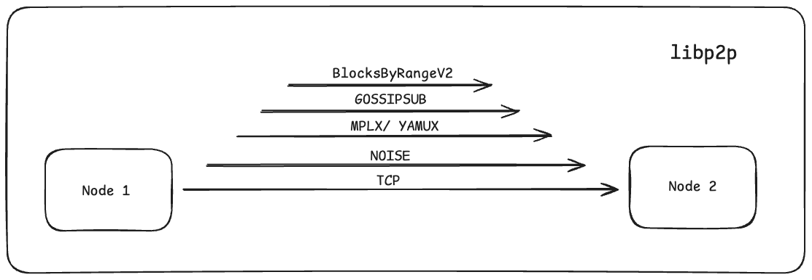

# Networking

The Consensus clients use [libp2p][libp2p] as the peer-to-peer protocol, [libp2p-noise][libp2p-noise] for encryption, [discv5][discv5] for peer discovery, [SSZ][ssz] for encoding, and, optionally, [Snappy][snappy] for compression.

For those looking to deepen their understanding of libp2p, Study Group Session Week-5, [Lecture 19]("https://epf.wiki/#/eps/day19") by Dapplion is a great resource.

## ENR (Ethereum Node Records)

## Specs

The [Phase 0 -- Networking][consensus-networking] page specifies the network fundamentals, protocols, and rationale/design choices.

## libp2p - P2P protocol

[libp2p][libp2p] is used as the peer-to-peer protocol. [libp2p and Ethereum][libp2p-and-eth] is a great article for a deep-dive on the history of libp2p, and its adoption in the Consensus clients.

<figure class="diagram" style="text-align:center">

<figcaption>

_The various protocols which are a part of libp2p._

</figcaption>
</figure>

## libp2p-noise - Encryption

The [Noise framework][noise-framework] is not a protocol itself, but a framework for designing key exchange protocols. The [specification][noise-specification] is a great place to start.

There are many [patterns][noise-patterns] which describe the key exchange process. The pattern used in the consensus clients is [`XX`][noise-xx] (transmit-transmit), meaning that both the initiator, and responder transmit their public key in the initial stages of the key exchange.

## discv5

## SSZ - Encoding

[Simple serialize (SSZ)][ssz] replaces the [RLP][rlp] serialization used on the execution layer everywhere across the consensus layer except the peer discovery protocol. SSZ is designed to be deterministic and also to Merkleize efficiently. SSZ can be thought of as having two components: a serialization scheme and a Merkleization scheme that is designed to work efficiently with the serialized data structure.

## Snappy - Compression

[Snappy][snappy] is a compression scheme created by engineers at Google in 2011. Its main design considerations prioritize compression/decompression speed, while still having a reasonable compression ratio.

## Related R&D

- [EIP-7594][peerdas-eip] - Peer Data Availability Sampling (PeerDAS)

  A networking protocol that allows beacon nodes to perform data availability
  sampling (DAS) to ensure that blob data has been made available while
  downloading only a subset of the data.

  - [Consensus Specs][peerdas-specs]
  - [ETH Research][peerdas-ethresearch]

## Resources

- [ENR rust docs][enr-rust-docs]
- [Eth1+Eth2 client relationship][eth1+2-client]
- Technical Report, ["Gossipsub-v1.1 Evaluation Report"][gossipsub-report]

[consensus-networking]: https://github.com/ethereum/consensus-specs/blob/dev/specs/phase0/p2p-interface.md
[discv5]: https://github.com/ethereum/devp2p/blob/master/discv5/discv5.md
[libp2p-and-eth]: https://blog.libp2p.io/libp2p-and-ethereum/
[libp2p-noise]: https://github.com/libp2p/specs/tree/master/noise
[libp2p]: https://docs.libp2p.io/
[noise-framework]: https://noiseprotocol.org/
[noise-patterns]: https://noiseexplorer.com/patterns/
[noise-specification]: https://noiseprotocol.org/noise.html
[noise-xx]: https://noiseexplorer.com/patterns/XX/
[peerdas-eip]: https://github.com/ethereum/EIPs/pull/8105
[peerdas-ethresearch]: https://ethresear.ch/t/peerdas-a-simpler-das-approach-using-battle-tested-p2p-components/16541
[peerdas-specs]: https://github.com/ethereum/consensus-specs/pull/3574
[rlp]: https://ethereum.org/developers/docs/data-structures-and-encoding/rlp
[snappy]: https://en.wikipedia.org/wiki/Snappy_(compression)
[ssz]: https://ethereum.org/developers/docs/data-structures-and-encoding/ssz
[blog]: https://medium.com/coinmonks/dissecting-the-ethereum-networking-stack-node-discovery-4b3f7895f83f
[enr-rust-docs]: https://docs.rs/enr/latest/enr
[eth1+2-client]: https://ethresear.ch/t/eth1-eth2-client-relationship/7248
[gossipsub-report]: https://research.protocol.ai/publications/gossipsub-v1.1-evaluation-report/vyzovitis2020.pdf