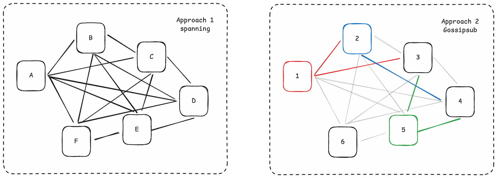

# Networking

The Consensus clients use [libp2p][libp2p-docs] as the peer-to-peer protocol, [libp2p-noise][libp2p-noise] for encryption, [discv5][discv5] for peer discovery, [SSZ][ssz] for encoding, and, optionally, [Snappy][snappy] for compression.

For those looking to deepen their understanding of libp2p, Study Group Session Week-5, [Lecture 19](https://epf.wiki/#/eps/day19) by Dapplion is a great resource.

## Specs

The [Phase 0 -- Networking][consensus-networking] page specifies the network fundamentals, protocols, and rationale/design choices. The subsequent forks also specify the changes done in that respective fork.

## libp2p - P2P protocol

[libp2p][libp2p-docs] is a protocol for peer-to-peer communication, orginally developed for [IPFS](https://ipfs.io). [libp2p and Ethereum][libp2p-and-eth] is a great article for a deep-dive on the history of libp2p, and its adoption in the Consensus layer. It allows communication over multiple transport protocols like TCP, QUIC, WebRTC, etc.

<figure class="diagram" style="text-align:center">

<figcaption>

_The various protocols which are a part of libp2p. Left: current Right: using QUIC_

</figcaption>
</figure>

libp2p protocol is a multi-transport stack.

1. **Transport** : It must support TCP (Transmission Control Protocol), may support [QUIC][quic] (Quick UDP Internet Connections) which must both allow incoming and outgoing connections. TCP and QUIC both support IPv4 and IPv6, but due for better compatibility IPv4 support is required.
2. **Encryption and Identification** : [libp2p-noise][libp2p-noise] secure channel is used for encryption and uses [multiaddress][multiaddr] (often abbreviated as multiaddr) is the convention for encoding multiple layers of addressing into a single "future-proof" path structure.

- **Multiaddress**: Multiaddress defines a human-readable and machine-optimized encodings of common transport and overlay protocols and allows many layers of addressing to be combined and used together.  For example: the below given addressing format is a combination of "location multiaddr" (ip and port) and the identity multiaddr (libp2p peer id).

<figure class="diagram" style="text-align:center">

<figcaption>

_Multiaddr format_

</figcaption>
</figure>

3. **Multiplexing** : Multiplexing allows multiple independent communications streams to run concurrently over a single network connection. Two multiplexers are commonplace in libp2p implementations: [mplex][mplex] and [yamux][yamux]. Their protocol IDs are, respectively: `/mplex/6.7.0` and `/yamux/1.0.0`. Clients must support mplex and may support yamux with precedence given to the latter.
4. **Message Passing** : To pass messages over the network libp2p implements [Gossipsub][gossipsub] (PubSub) and [Req/Resp][req-resp] (Request/Response). Gossipsub uses topics and Req/Resp uses messages for communication.

### **libp2p Protocol Stack**

| **Layer**                 | **Protocol(s)**                                                                       | **Purpose**                                                             |
| ------------------------- | ------------------------------------------------------------------------------------- | ----------------------------------------------------------------------- |
| 🧠 **Application Layer**  | `pubsub`, `gossipsub`, `ping`, custom protocols                                       | Run user-defined or built-in logic (chat, file transfer, pub-sub, etc.) |
| 🔀 **Multiplexing Layer** | `yamux`, `mplex`                                                                      | Allow multiple logical streams over a single connection                 |
| 🔐 **Security Layer**     | `noise`, `tls`, `secio` (deprecated)                                                  | Encrypt and authenticate peer connections                               |
| 🔌 **Transport Layer**    | `tcp`, `websockets`, `quic` (has multiplexing and security), `webrtc`, `webtransport` | Handle physical or virtual data transfer between machines               |
| 🌍 **NAT/Relay Layer**    | `relay`, `dcutr`, `autonat`, `pnet`                                                   | Enable connectivity through NAT/firewalls or in private networks        |
| 📡 **Discovery Layer**    | `mdns`, `kademlia`, `rendezvous`, `identify`                                          | Find and learn about peers on the network                               |

### Notes:

- **Not all protocols are required** — libp2p is modular and you can choose only what you need.
- A minimal connection includes at least: `transport` + `security` + `multiplexing` + `application protocol`.
- `relay` and `dcutr` are used when NATs prevent direct connections.

Key features of libp2p:

1. **Protocol IDs:** are unique string identifiers used for protocol negociation. Their basic structure is: `/app/protocol/version`. Some common protocols, all use protobuf to define message schemes, defined are:

- Ping: `/ipfs/ping/1.0.0` is a simple protocol to test the connectivity and performance of connected peers
- Identify : `/ipfs/id/1.0.0` allows to peers to exchange information about each other, mainly public key and know network addresses. Uses the following protobuf properties:
  | Field | Type | Purpose |
  |-------------------|-----------|-------------------------------------------------------------------------|
  | `protocolVersion` | `string` | libp2p protocol version (e.g., `ipfs/1.0.0`) |
  | `agentVersion` | `string` | Client info (like browser's user-agent, e.g., `go-ipfs/0.1.0`) |
  | `publicKey` | `bytes` | Node's public key (for identity, optional if secure channel is used) |
  | `listenAddrs` | `bytes[]` | Multiaddrs where the peer is listening |
  | `observedAddr` | `bytes` | Your IP address as seen by the peer (helps with NAT detection) |
  | `protocols` | `string[]`| List of supported application protocols (e.g., `/chat/1.0.0`) |
  | `signedPeerRecord`| `bytes` | Authenticated version of `listenAddrs` for sharing with other peers |

- Identify/push: `/ipfs/id/push/1.0.0` same as "Identify" just that this is sent proactivily and not in reponse to a request. It is useful to push a new address to its connected peers.

**kad-dht** : libp2p uses Distributed Hash Table (DHT) based on the [Kademlia][kademlia] routing algorithm for its routing functionality.

2. **Handler Functions:** are invoked during a incoming stream
3. **Bi-Directional Binary Stream:** the medium over which the libp2p protocol transpires

### **Peers**

#### Peer Ids

[Peer Identity][peer-identity] is a unique reference to specific peer in the network and remain constant as long as the peer lives. Peer Ids are [multihashes][multihash], which are a self-describing values having the following format: 

`<varint hash function code><varint digest size in bytes><hash function output>`

<figure class="diagram" style="text-align:center">

<figcaption>

_Multihash Format , in hex_

</figcaption>
</figure>

- Keys are encoded in a protobuf containing key type and encoded key. There are 4 specified methods for encoding: RSA, Ed255199v(must), Secp256k1, ECDSA.
- There are 2 ways of the string representation of peer IDs in text: `base58btc` (starts with `QM` or `1`) and as a multibase encoded CID with libp2p slowly moving to the later.

### **How a connection is establised?**

To understand how setting up a connection works, read this [specs][libp2p-connection].

<figure class="diagram" style="text-align:center">

<figcaption>

_flowchart of setting up a connection_

</figcaption>
</figure>

1. **Discovery**: How to find another peer?

- `mdns` (Multicast DNS) : discover peers on the same local network with zero configuration, very simple. Send query for all peers, receive response and other peers' information into local database.
- `rendezvous` : peers register themselves at a shared common peer or server (rendezvous point) and others query the same point to get peer information
- `kademlia` (DHT) : A distributed hash table for global discovery. Peer query the DHT with peer ID to get its latest multiaddrs.
- `identify` : protocol that allows peers to exchange metadata (addresses, protocols supported, version etc) after connecting

Result: We now have a list of peers identifiable with Peer ID and reachable via multiaddrs (IP + port + protocol stack)

2. **Transport** : How to connect to peers?

- `TCP` : most basic transport, reliable but may be blocked by NAT/firewalls
- `WebSockets` : TCP over HTTP, are NAT/firewall friendly
- `QUIC` : UDP based, faster connection setup, supports multiplexing and encryption (TLS 1.3) natively
- `WebRTC` : enable two private nodes (e.g. two browsers) to establish a direct connection
- `WebTransport` : establish a stream-multiplexed and bidirectional connection to servers, run on top of a HTTP/3 connection with a fallback using HTTP/2

If the peer is behind NAT (when direct connection fails):

- `relay` : it is like TURN , routes through another peer
- `dcutr` (Direct Connection Upgrade Through Relay) : used to try and replace a relay connection with a direct one, using [hole punching][hole-punching]. It involves simultaneous dial attempts from both peers.

3. **Encryption** : How to make the connection private and authenticated?

- `noise` : framework for building security protocols, fast, default choice for many, Noise XX handshake for mutual authentication.
- `tls` (Transport Layer Security) : strong securtity guarantees, mututal authentication done using peer's key
- `secio` : deprecated due to complexity and lower assurance compared to Noise/TLS.

4. **Multiplexing** : How to open multiple logical streams over the same connection?

- `yamux` : Simple, fast, and currently the default in many implementations.
- `mplex` : lightweight and older

5. **Application** : run application protocols over the above setup

- `ping` : basic liveliness check ,measure rount-trip time
- `pubsub`, `gossibsub`, `episub` : for broadcasting messages
- Custom protocols that the implementation defines

### What optimization does Gossibhub provide?

**Approach 1:** Maintain a fully connected mesh (all peers connected to each other 1:1), which scales poorly (O(n^2)). Why this scales poorly? Each node may recieve the same message from other (n-1) nodes , hence wasting a lot of bandwidth. If the message is a block data, then the wasted bandwith is exponentially large.

**Approach 2:** Pubsub (Publish-Subscribe Model) messaging pattern is used where senders (publishers) don’t send messages directly to receivers (subscribers). Instead, messages are published to a common channel (or topic), and subscribers receive messages from that channel without direct interaction with the publisher. The nodes mesh with a particular number of other nodes for a topic, and those with other nodes. Hence, allowing more efficient message passing.

<figure class="diagram" style="text-align:center">

<figcaption>

_Gossipsub Optimization_

</figcaption>
</figure>

###### **Gossipsub : TODO**

###### **Req/Resp : TODO**

###### **QUIC : TODO**

## libp2p-noise - Encryption

The [Noise framework][noise-framework] is not a protocol itself, but a framework for designing key exchange protocols. The [specification][noise-specification] is a great place to start.

There are many [patterns][noise-patterns] which describe the key exchange process. The pattern used in the consensus clients is [`XX`][noise-xx] (transmit-transmit), meaning that both the initiator, and responder transmit their public key in the initial stages of the key exchange.

## ENR (Ethereum Node Records)

[Ethereum Node Records][ENR] provide a structured, flexible way to store and share node identity and connectivity details in Ethereum’s peer-to-peer network. It is a future-proof format that allows easier exchange of identifying information between new peers and is the preferred [network address format][network-add-format] for Ethereum nodes.

Its core components are:

1. **Signature**: Each record is signed using an identity scheme (e.g., secp256k1) to ensure authenticity.
2. **Sequence Number** (seq): A 64-bit unsigned integer that increments whenever the record is updated, allowing peers to determine the latest version.
3. **Key/Value Pairs**: The record holds various connectivity details as key-value pairs.

In its text form, the RLP of ENR is encoded in base64 and can be shared across clients as a string, e.g.:
`
enr:-Jq4QOXd31zNJBTBAT0ZZIRWH4z_NmRhnmAFfwNan0zr_-IUUAsOTbU_Lhzh4BSq8UknFGvr1rXQUYK0P-_ZUVenXkABhGV0aDKQaGGQMVAAEBv__________4JpZIJ2NIJpcIRBbZouiXNlY3AyNTZrMaEDxEArICqVUZNxhUxBYHZjzsm4KxqraeSION3yYorLZSuDdWRwgiMp
`
## discv5

Discovery Version 5 [(discv5)][discv5] (Protocol version v5.1) runs on UDP and meant for peer discovery only. It enables nodes to exchange and update ENRs dynamically, ensuring up-to-date peer discovery. It runs in parallel with libp2p.

<figure class="diagram" style="text-align:center">

<figcaption>

_discv5_

</figcaption>
</figure>

## SSZ - Encoding

[Simple serialize (SSZ)][ssz] replaces the [RLP][rlp] serialization used on the execution layer everywhere across the consensus layer except the peer discovery protocol. SSZ is designed to be deterministic and also to Merkleize efficiently. SSZ can be thought of as having two components: a serialization scheme and a Merkleization scheme that is designed to work efficiently with the serialized data structure.

## Snappy - Compression

[Snappy][snappy] is a compression scheme created by engineers at Google in 2011. Its main design considerations prioritize compression/decompression speed, while still having a reasonable compression ratio.

## Related R&D

- [EIP-7594][peerdas-eip] - Peer Data Availability Sampling (PeerDAS)

  A networking protocol that allows beacon nodes to perform data availability
  sampling (DAS) to ensure that blob data has been made available while
  downloading only a subset of the data.

  - [Consensus Specs][peerdas-specs]
  - [ETH Research][peerdas-ethresearch]

## Resources

- [ENR rust docs][enr-rust-docs]
- [Eth1+Eth2 client relationship][eth1+2-client]
- Libp2p, ["docs"][libp2p-docs] and ["specs"][libp2p-specs]
- Technical Report, ["Gossipsub-v1.1 Evaluation Report"][gossipsub-report]
- [Libp2p resource][PLN-launchpad]
- [Libp2p tutorial][libp2p-tutorial]
- [Hole Punching][hole-punching]

[consensus-networking]: https://github.com/ethereum/consensus-specs/blob/dev/specs/phase0/p2p-interface.md
[libp2p-and-eth]: https://blog.libp2p.io/libp2p-and-ethereum/
[libp2p-noise]: https://github.com/libp2p/specs/tree/master/noise
[libp2p-docs]: https://docs.libp2p.io/
[libp2p-specs]: https://github.com/libp2p/specs
[noise-framework]: https://noiseprotocol.org/
[noise-patterns]: https://noiseexplorer.com/patterns/
[noise-specification]: https://noiseprotocol.org/noise.html
[noise-xx]: https://noiseexplorer.com/patterns/XX/
[discv5]: https://github.com/ethereum/devp2p/blob/master/discv5/discv5.md
[peerdas-eip]: https://github.com/ethereum/EIPs/pull/8105
[peerdas-ethresearch]: https://ethresear.ch/t/peerdas-a-simpler-das-approach-using-battle-tested-p2p-components/16541
[peerdas-specs]: https://github.com/ethereum/consensus-specs/pull/3574
[rlp]: https://ethereum.org/developers/docs/data-structures-and-encoding/rlp
[snappy]: https://en.wikipedia.org/wiki/Snappy_(compression)
[ssz]: https://ethereum.org/developers/docs/data-structures-and-encoding/ssz
[blog]: https://medium.com/coinmonks/dissecting-the-ethereum-networking-stack-node-discovery-4b3f7895f83f
[enr-rust-docs]: https://docs.rs/enr/latest/enr
[eth1+2-client]: https://ethresear.ch/t/eth1-eth2-client-relationship/7248
[gossipsub-report]: https://research.protocol.ai/publications/gossipsub-v1.1-evaluation-report/vyzovitis2020.pdf
[ENR]: https://eips.ethereum.org/EIPS/eip-778
[network-add-format]: https://dean.eigenmann.me/blog/2020/01/21/network-addresses-in-ethereum/
[quic]: https://datatracker.ietf.org/doc/rfc9000/
[yamux]: https://github.com/libp2p/specs/blob/master/yamux/README.md
[mplex]: https://github.com/libp2p/specs/tree/master/mplex
[gossipsub]: https://github.com/libp2p/specs/tree/master/pubsub/gossipsub
[req-resp]: https://github.com/ethereum/consensus-specs/blob/dev/specs/phase0/p2p-interface.md#the-reqresp-domain
[multiaddr]: https://github.com/libp2p/specs/blob/master/addressing/README.md
[PLN-launchpad]: https://pl-launchpad.io/curriculum/libp2p/objectives/
[kademlia]: https://docs.ipfs.tech/concepts/dht/#kademlia
[libp2p-tutorial]: https://proto.school/introduction-to-libp2p
[multihash]: https://github.com/multiformats/multihash?tab=readme-ov-file
[multistream-select]: https://github.com/multiformats/multistream-select
[libp2p-connection]: https://github.com/libp2p/specs/blob/master/connections/README.md
[hole-punching]: https://github.com/libp2p/specs/blob/master/connections/hole-punching.md
[peer-identity]: https://github.com/libp2p/specs/blob/master/peer-ids/peer-ids.md
[hole-punching]: https://blog.ipfs.tech/2022-01-20-libp2p-hole-punching/
