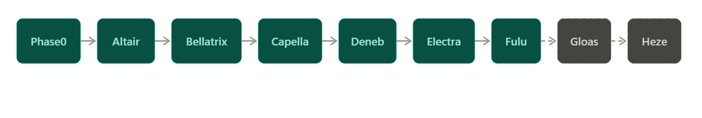
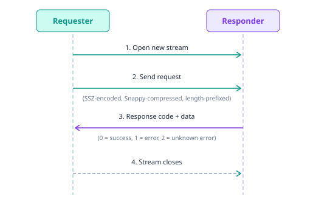

# Consensus layer specification 

> Recommended pre-reading: [Beacon Chain](https://ethereum.org/roadmap/beacon-chain/), [SSZ](https://epf.wiki/#/wiki/CL/SSZ), [Gasper paper](https://arxiv.org/pdf/2003.03052)

As the Ethereum network transitioned from a proof of work to a proof of stake mechanism, splitting the network into the consensus layer and execution layer, there had to be a set of rules for the implementation of both layers. The [consensus specifications](https://github.com/ethereum/consensus-specs/) document the rules for consensus clients to follow, as derived from the research in the [Gasper paper](https://arxiv.org/pdf/2003.03052).

This page provides the architecture of the CL specification, a breakdown of the core spec documents and how client teams use pyspec for testing and conformance.

## Overview

Before the Merge, the CL operated as the Beacon Chain which handled validator management, block proposals, attestations and was the first use case of the Gasper mechanism. The Beacon chain ran in parallel with the Proof-of-work chain. After the Merge, the CL took on the additional role of driving execution by incorporating execution payloads into beacon blocks. 

The consensus specifications are a set of rules that the consensus clients must follow when implementing the CL. It references Gasper, a combination of the [Casper FFG](https://arxiv.org/pdf/1710.09437) algorithm and the [LMD-GHOST](https://arxiv.org/pdf/2003.03052) fork choice algorithm which are the very foundations of the CL. 

Characteristics of the Consensus Specifications.

- The consensus specifications define the consensus protocol that is being run by the consensus layer clients
- It is built into a python program that is executable and verifiable
- The CL clients can run it to generate test vectors to test against their own implementations

The theoretical foundation is defined in the Gasper paper while the principal implementation reference resides in the [ethereum/consensus specifications](https://github.com/ethereum/consensus-specs/) repository. This repository holds a Python specification (pyspec) that defines exactly how consensus client must behave. 


## The Executable Specification (Pyspec)

The consensus specification repository not only contains a prose document of rules for consensus clients, but also executable code written in python to test the CL specifications. Python is used as the language for client specifications for the following reasons-

- Python is a programming language known to nearly all developers as it is easily readable, over the formal mathematical notation used in the EL's [yellow paper](https://ethereum.github.io/yellowpaper/paper.pdf).
- The CL specs take a more practical approach to its implementation, which makes it accessible while still being precise enough to serve as a canonical reference.

The spec files are markdown files, containing embedded Python code blocks that can be extracted and executed by themselves. 
The Build Process- Running `make pyspec` after installation to the local system extracts the Python code from the markdown files and assembles them as importable python modules which can then run on the terminal.
Pyspec defines a set of custom types used throughout the specification. These include basic types like `uint64` and `Bytes32`, as well as composite types like `Container`, `List`, `Vector`, `Bitvector` and `Bitlist`. These types are backed by SSZ (Simple Serialize), which handles both serialization and Merkleization of all spec objects. A deeper treatment of SSZ can be found in the [SSZ article](https://epf.wiki/#/wiki/CL/SSZ).


## The Repository Structure

```
consensus-specs/
├── specs/
│   ├── phase0/
│   │   ├── beacon-chain.md
|   |   ├── deposit-contract.md
|   |   ├── fast-confirmation.md
│   │   ├── fork-choice.md
│   │   ├── p2p-interface.md
│   │   ├── validator.md
│   │   └── weak-subjectivity.md
│   ├── altair/
│   ├── bellatrix/
│   ├── capella/
│   ├── deneb/
│   ├── electra/
|   ├── fulu/
|   ├── gloas/
|   ├── heze/
│   └── _features/
├── ssz/
│   ├── merkle-proofs.md
│   └── simple-serialize.md
|── configs/
|   ├── mainnet.yaml/
│   └── minimal.yaml/
├── presets/
│   ├── mainnet/
│   └── minimal/
├── tests/
|── solidity_deposit_contract/
|── setup.py/
└── pyproject.toml/

```
The block above outlines the consensus-specs repository structure.

| Folder | Description| 
|----------|----------|
| `specs/`   | Contains the actual specification documents outlined based on the fork      |
| `ssz/` | Contains the specification for the serialization format used on the entire consensus layer       |
| `configs/` | Holds the network configuration files   |
| `presets/` | Contains preset parameters in bundles per fork    |
| `tests/` | Contains test setups, formats and generators    |
| `solidity_deposit_contract/` | Contains source contract for depositing ETH as a validator   |
| `setup.py / pyproject.toml/` | Contains building tooling for pyspec  |

#### Fork directories: 
The fork directories are directly listed in the specs folder, and are listed accordingly based on the versioning of the forks, with phase0 as the very first fork and Fulu as the current CL fork as of writing. 




Each fork directory builds on the previous fork directly, instead of implementing from scratch. For example, Altair's `beacon-chain.md` imports all of Phase0's definitions, then overrides or extends specific functions. A function like `process_attestation` in Altair replaces Phase0's version, while functions that didn't change are inherited as they are. This means reading any fork's spec requires understanding the base (Phase0) first, then tracing the modifications layered on by each subsequent fork. Also, each fork directory contains the same core files i.e `beacon-chain.md`, `fork-choice.md`, `validator.md`, and `p2p-interface.md`, with modifications specific to that fork.

The `_features` directory under the `specs` folder is a special directory for EIPs that are yet to be fully developed or not yet assigned to a fork.


## Core Specification Documents

This section describes the purpose of each CL specification file, that is common across all forks. It will take a general approach to the definitions, without detailing of the special features that come with each hard fork. Fork-specific additions are covered in the Fork Evolution section.

#### Beacon Chain
This is the largest spec file and also the central spec file, defining all information about the chain's state and is where all of the major state processing functions are defined. It defines the `BeaconState` container, the `state_transition` function, block processing (`process_block` and its helper functions), epoch processing (`process_epoch`), and the helper functions used for the rest of the spec. A more detailed explanation on the Beacon Chain is available in the [Beacon Chain article](https://ethereum.org/roadmap/beacon-chain/).

#### Fork Choice
This is the specification for the fork choice rule, documented separately from the main state transition. The fork choice in summary, is an algorithm that nodes use to determine which chain gets to be the "head" chain. The fork choice rule is implemented using the "Gasper" mechanism. It exists in the case of disagreements between nodes, which could either be due to network latency or a malicious intent by one or more nodes. The `fork-choice.md` defines a `Store` object, which holds relevant information on the fork choice state i.e (blocks seen, attestations, checkpoints, timing) and also contains a `get_head` function which implements LMD-GHOST algorithm to get the head of a chain, amongst other functionalities. More information about the fork choice can be found in the [Fork choice annotated spec](https://github.com/ethereum/annotated-spec/blob/master/phase0/fork-choice.md).

#### Validator
This outlines the ideal behavior of a consensus node, regardless of the node actively validating or not. It specifies how and when validators should propose blocks, create attestations, perform aggregation duties, and participate in sync committees. It also outlines a guide on the correct way to become a validator. Unlike the other spec files, `validator.md` is not consensus-critical. It serves as a reference for the correct execution of validator duties.

#### P2P Interface
This spec defines how beacon nodes communicate with each other. It covers three main domains-

- The Gossip domain: Which is how nodes broadcast information to the whole network via [gossipsub](https://github.com/libp2p/specs/blob/master/pubsub/gossipsub/README.md). The nodes listen out for specific "topics" and spread the messages peer-to-peer until everyone has them. The topics in question are UTF-8 plain strings that takes a format like `/eth2/ForkDigestValue/Name/Encoding` Topics and messages in gossipsub can be thought of similarly to emails. A topic functions like the subject line, defining what kind of information is being communicated, while the message is the body, carrying the actual data. The fork digest ensures that nodes on different forks or networks don't accidentally mix messages. All gossip messages are SSZ-encoded and then Snappy-compressed. 

- Req/Resp domain: This domain is specifically for one-to-one communication between just two nodes. It is a simple request-response exchange. A sample request-response exchange would be something like the image below



Encoding for request-response domain works similarly to the Gossip domain, except with an extra encoding of the raw SSZ bytes as an unsigned protobuf varint.

- Discovery Domain: Before nodes can exchange information, they first need to be able to locate each other. This is where [discv5](https://github.com/ethereum/devp2p/blob/master/discv5/discv5.md) comes to play, a UDP-based protocol for finding node pairs. It is a much lighter and faster transport layer compared to TCP, and does not require TCP's connection handshake.


#### Fast Confirmation
This contains the specification for a fast block confirmation rule (FCR) that allows nodes to treat a block as confirmed before full finality. It defines `FastConfirmationStore` which is an object for storing information required for the FCR, other miscellaneous helper functions which are mostly for estimating adversarial weight against a block using both LMD-GHOST and FFG analysis, and a safety threshold computation to determine whether a block can be considered confirmed.


#### Weak Subjectivity
This is put forward as a reference for implementing weak subjectivity protections in the consensus layer. The point of weak subjectivity in the first place in summary is to prevent PoS systems from attacks by exited validators. Since validators can exit and withdraw their stake, an attacker with old validator keys could construct an alternative chain at no cost. The spec defines the weak subjectivity period, calculated from the validator set size and churn limit. Within this weak subjectivity period, a checkpoint is safe to sync from. Nodes must obtain a recent trusted checkpoint and verify they remain within this period to sync securely.

#### Deposit Contract
This is more of a description of the deposit contract for potential validators to deposit ETH to the contract, as part of the steps to become an actual validator. The contract accepts 32 ETH deposits along with validator credentials, stores them in an incremental Merkle tree, and emits events that the consensus layer processes to register new validators. The deposit contract source code is written in Solidity, formally verified and immutable.

#### Fork
`fork.md` defines the process of upgrading the beacon chain for every new hard fork. This was introduced in Altair hard fork and has since stuck to other subsequent ones. It specifies how the BeaconState is migrated from one fork version to the next, including adding new fields, restructuring existing ones, and updating the fork version metadata.

#### Light Client
Also introduced with Altair hard fork, this contains specs for a light client sync protocol. It defines structures like `LightClientBootstrap`, `LightClientUpdate`, and `LightClientFinalityUpdate` that allow light clients to verify the chain without processing every block.


## Fork Evolution
As the Ethereum protocol evolves, the consensus architecture undergoes its own changes and upgrades. These changes are first reflected in the CL specification before being implemented by the CL clients. This section gives an insight to what each hard fork added to the CL specification.

##### Summary of changes from each hard fork

| Fork    | Date     | Key Changes                                |
|---------------|---------------|--------------------------------------------|
|    Phase0           |       Dec 2020        |          Base PoS, BeaconState, Casper FFG, LMD-GHOST                                  |                
|    Altair           |       Oct 2021        |          Sync committees, participation flags, inactivity scores                          |
|     Bellatrix          |      Sept 2022         |     The Merge, ExecutionPayload, Engine API coupling                                         |       
|     Capella          |       April 2023        |      Validator withdrawals, BLS-to-execution changes                                    |
|       Deneb        |        March 2024       |        Blob sidecars (EIP-4844), KZG commitments                            |
|    Electra           |   March 2025            |      MaxEB, validator consolidation, on-chain deposits                        |
|       Fulu        |         Dec 2025      |             PeerDAS, data column sampling                               |
|      Gloas*         |         H1 2026      |                  ePBS (EIP-7732)                          |
|       Heze*             |       H2 2027        |               FOCIL, Verkle Trees (tentative)                              |

*In development as of writing, scope subject to change

##### Phase0
Phase0 is the base specification, where everything started. It launched the Beacon chain as a separate PoS chain running alongside Ethereum's PoW chain. At this time, the CL did not execute any transactions, it did the work of managing validators and finalizing its own chain. Phase0 specifications defined the following:
- The BeaconState, validator registry and deposit processing
- Justification and Finalization through checkpoints(Casper FFG), and LMD-GHOST fork choice
- Attestations, proposal and slashing mechanisms
- Reward/punishment mechanisms for validators
- The committee system to assign random validators per slot

##### Altair
Altair was the first hard fork of the Beacon Chain, and introduced three major changes to it:
- Sync committees to support light clients: This introduces a randomly selected group of 512 validators every 256 epoch (which is roughly 27 hours) to sign the canonical chain's block headers. The main purpose of this was to support light client verification, this was done by having the light client follow the chain by checking 512 sync committee signatures instead of processing the full attestation set.
- Introduction of `ParticipationFlags`: Previously, Phase0 stored the full attestation records in the BeaconState via the `PendingAttestation` mechanism and used this to process rewards for validators at the end of each epoch. With ParticipationFlags, there are three key validator flags that are tracked to determine whether a validator attested correctly and at the right time: TIMELY_SOURCE, TIMELY_TARGET and TIMELY_HEAD. This helped to reduce state size and led to a simpler way of calculating rewards.
- Altair also reworked the mechanism for inactivity leaks. Unlike Phase0 where all validators were slashed uniformly during non-finality periods, Altair instead had offline validators penalized more heavily than online validators that were still participating.

##### Bellatrix
The hard fork Bellatrix, was also referred to as the Merge where the PoW chain officially stopped producing blocks and the BeaconChain became the major consensus layer of the network. Bellatrix changes include:
- Introduction of the `ExecutionPayload` object: The execution payload object now carried EL information that was previously in PoW blocks. For a block to be valid, it's execution payload must be valid according to Ethereum's block and transaction execution rules. An `ExecutionPayloadHeader` was added to BeaconState to track the latest execution payload. 
- [Engine API](https://github.com/ethereum/execution-apis/blob/main/src/engine/common.md): Bellatrix introduced a tighter connection between the EL and the CL via the Engine API. The CL calls `engine_newPayload` to validate execution payloads and `engine_forkchoiceUpdated` to tell the EL which head to follow. The Engine API isn't directly defined in the CL specification, it has a separate documentation.

##### Capella
Capella enabled the withdrawal mechanism for validators. Before Capella, validators deposited their ETH without any means to get it out.
- Validator Withdrawals: Validators initially registered with BLS withdrawal credentials, which was not compatible with the Ethereum execution layer address. Capella introduced `BLSToExecutionChange` method that let validators switch to execution layer withdrawal credentials pointing to a regular Ethereum address. There can be up to 16 withdrawals per block, and the withdrawal can either be partial (for validators who have more than 32 ETH staked) or full for exiting validators.
- Historical Accumulators: Capella also introduced independent block and state accumulators in place of singular historical roots. With these, it becomes possible to validate the entire block history leading up to a given state without any additional information beyond the state and the blocks themselves. 

##### Deneb
Deneb is the consensus layer fork of the Dencun upgrade. The central feature around the Deneb CL fork is [EIP-4844](https://eips.ethereum.org/EIPS/eip-4844) (Proto-Danksharding). The primary purpose of this was to reduce costs for L2 roll-ups.
- Blob sidecars: Proto-Danksharding introduced a new transaction type- Blobs. Blobs in summary, are large data chunks that store large amount of transactions and are attached to blocks. Blobs are not stored on the Execution Payload directly. The blobs are rather included in the beacon block body as `blob_kzg_commitments` (KZG polynomial commitments to the blob data), and the actual blob data travels separately as `BlobSidecar` objects on the p2p network. CL nodes also had the responsibility of verifying that the blob sidecars in a block correspond to the commitments in that block to consider the block valid.  
- p2p changes: Bringing in blobs meant a few changes on the gossip domain. Deneb brought in 6 new gossip topics for blob sidecars, structured as subnets. The gossip topic took the format of
`blob_sidecar_{subnet_id}`, where `subnet_id` runs from 0 to 5, as it was maximum of 6 blobs per block. On top of those gossip topics, Deneb also added two new Req/Resp protocols for blob retrieval.


##### Electra
Electra is the consensus layer fork of the Pectra upgrade. Electra focused on a structural overhaul for the staking system in the CL.
- Max Effective Balance Upgrade: In Phase0, validators who had multiples of 32 ETH that was over 32 ETH had to run separate validators per 32 ETH owned. [EIP-7251](https://eips.ethereum.org/EIPS/eip-7251) which proposed an increase in   `MAX_EFFECTIVE_BALANCE` for validators was implemented to raise the effective amount validators could stake from 32 ETH to 2048 ETH. This helped to reduce the total number of validators needed for the same amount of staked ETH, and thus reduced the attestation load and state size.
- Validator consolidation: This meant that two or more validators could merge into a single validator with a higher ETH amount. A new `ConsolidationRequest` operation was added to this effect.
- Deposit and Withdrawal Processing changes: Electra introduced `DepositRequest` objects to allow deposits to be included directly in the Execution Payload. Previously, deposits were read from EL deposit contract logs. This cut deposit activation time from roughly 13 hours to 13 minutes. In addition to this, validators are now able to exit or make partial withdrawals using their withdrawal address (EOA), not just their signing key.
- Attestation format changes: This restructured the `Attestation` container so the committee index is no longer inside the attestation body, but rather aggregated across committees within the same slot.


##### Fulu
Fulu is the consensus layer fork of the Fusaka upgrade, and it's defining feature is PeerDAS.
- PeerDas: [EIP-7594](https://eips.ethereum.org/EIPS/eip-7594)(Peer Data Availability Sampling) was introduced so that nodes only need to download 1/8 of all blob data in a block to satisfy a local availability check. To adapt to this change, blobs are encoded into cells using erasure coding, and each node randomly samples a subset of data columns rather than downloading everything. If a node needs to verify data availability, it samples columns from peers rather than downloading everything.
- More p2p protocols: PeerDAS changes brought newer gossip subnets for data columns, which include `data_column_sidecar_{subnet_id}`. New req/resp were also added.
- Dynamic Blob count: Fulu brought a change in the max amount of blobs per block from 6 to make it more flexible, depending on the final parameters.


##### Gloas
Gloas is the consensus layer of the Glamsterdam upgrade and it's primary feature is the introduction of ePBS (Enshrined Proposer-Builder Separation)
- ePBS: [EIP-7732](https://eips.ethereum.org/EIPS/eip-7732) which proposed the ePBS feature changes the fundamentals of an Ethereum block validation. Block production on Ethereum currently relies on an informal [MEV-Boost](https://docs.flashbots.net/flashbots-mev-boost/introduction) market where validators outsource construction to specialized builders through trusted external relays, which gives little guarantee for trust and reliability. With ePBS, execution validation is decoupled from consensus validation both logically and temporarily. This is a structural change on the consensus layer as a whole, and includes modifications to the beacon chain, fork choice rules, and P2P communication. The ExecutionPayload field is removed from `BeaconBlockBody` and replaced with a signed commitment (a `SignedExecutionPayloadBid` object) from a builder, committing to reveal the corresponding execution payload later.
- Payload Timeless Committee: This is a new validator duty brought by ePBS. It is a committee of validators that attests to whether the builder revealed the block on time. If the builder fails to reveal, the protocol handles it gracefully without halting liveness.
- Other potential Gloas changes include increased gas limit and spec cleanup from Electra and Fulu.

##### Heze
Heze is the CL side of the Hegota upgrade. As of writing, Heze is still in early planning and no headline EIP has been formally confirmed for the CL side. However, the likely topics in Heze include FOCIL ([EIP-7805](https://eips.ethereum.org/EIPS/eip-7805), fork-choice enforced inclusion lists), [Verkle trees](https://math.mit.edu/research/highschool/primes/materials/2018/Kuszmaul.pdf) which are a new data structure designed to store and verify large amounts of data more efficiently, and cleanup of the previous forks.


## Parameterization: Constants, Presets, and Configurations
The consensus layer specs use a three-tier parameterization system that controls every tunable value in the protocol. This section gives context to understanding the hierarchical system for the set values.

##### Constants
Constants are hardcoded values that never change across any Ethereum network. They are defined inline in the spec files and remain the same across mainnet, testnets and other local devnets. These values are embedded into the protocol logic itself and represent fundamental protocol invariants. Examples include
- `FAR_FUTURE_EPOCH` which is set to 2**64 - 1 and used as sentinel for validators who have not yet exited.
- `GENESIS_SLOT` which defines the very first slot in the network and always remains 0.
- Domain type values that separate signature domains to prevent replay attacks.

##### Presets
Presets are values that get fixed before launching a network. These values can differ based on the network configurations. There are two major categories of presets that live under the `preset` directory, the `presets/mainnet` and the `presets/minimal`. The mainnet presets define the protocol parameters for the live network while the minimal presets scales the mainnet values down so that tests and local devnets can run meaningful simulations without needing hundreds of validators or waiting through thousands of slots. For example, `SLOTS_PER_EPOCH` is a preset set to 32 on mainnet but 8 in the minimal configuration. `MAX_VALIDATORS_PER_COMMITTEE` is 2048 on mainnet and 64 in minimal. Preset values are locked for the lifetime of a given network, and cannot be changed without creating a new one.

##### Configurations
Configurations are values that can differ between live networks sharing the same preset. They live in the `configs/` directory (e.g. `configs/mainnet.yaml`, `configs/holesky.yaml`). The most important examples are fork epoch numbers. `ALTAIR_FORK_EPOCH`, `BELLATRIX_FORK_EPOCH`, `CAPELLA_FORK_EPOCH`, and all subsequent fork epochs are configurations because mainnet, Sepolia, and Holesky each activated these forks at different epoch heights. 

This three-tier system exists to enable easier testing for engineers without compromising on mainnet integrity. The minimal preset allows spec tests and CI pipelines to exercise the full state transition logic with committees of 4 validators instead of 2048, epochs of 8 slots instead of 32, and sync committee periods that resolve in seconds rather than days. This reduces compute time and costs for running test and local nets.


## Testing and Quality Assurance for the CL specification.

The consensus layer specs in addition to being a reference document, also serve as a comprehensive test suite that every CL client must pass. Six independently developed clients ([Lighthouse](https://github.com/sigp/lighthouse), [Prysm](https://github.com/prysmaticlabs/prysm), [Teku](https://github.com/Consensys/teku), [Nimbus](https://github.com/status-im/nimbus-eth2), [Lodestar](https://github.com/ChainSafe/lodestar), [Grandine](https://github.com/grandinetech/grandine)) can all agree on the same state transitions because they are all validated against the same generated test vectors.

##### Consensus spec tests with pyspec, and repo structure

Generated test vectors are published to the [consensus-spec-tests](https://github.com/ethereum/consensus-spec-tests) repository as versioned releases. This separation between the generator code (which lives in consensus-specs) and the generated artifacts (which live in consensus-spec-tests) exists for practical reasons. The full test suite is large, often multiple gigabytes of serialized SSZ data, and client teams need stable snapshots they can pin their CI against rather than regenerating from source on every run.

The `tests/` directory in the consensus-specs repository contains test definitions organized by fork phase and by spec function. These are not traditional unit tests that assert behavior of the Python code itself. Instead, they are test generators that use the pyspec to produce input-output pairs. A generator might take a valid `BeaconState` and a `BeaconBlock`, run `state_transition()` on them, and serialize both the pre-state, the block, and the resulting post-state. It might also produce cases where the block is deliberately malformed to confirm that the state transition rejects it.

The generators cover every major spec function, including `process_slot`, `process_epoch`, `process_block_header`, `process_attestation`, `process_deposit`, and all the other helpers. Each generator also produces edge cases. For example, testing what happens when a validator's effective balance drops below the ejection threshold, or when a slashing involves a validator that has already initiated a voluntary exit.


## Resources

- [Consensus specifications repository](https://github.com/ethereum/consensus-specs/), [archived](https://web.archive.org/web/2024/https://github.com/ethereum/consensus-specs/)
- [Gasper paper (Combining GHOST and Casper)](https://arxiv.org/pdf/2003.03052), [archived](https://web.archive.org/web/2024/https://arxiv.org/pdf/2003.03052)
- [Casper FFG paper](https://arxiv.org/pdf/1710.09437), [archived](https://web.archive.org/web/2024/https://arxiv.org/pdf/1710.09437)
- [Annotated consensus spec (Phase0)](https://github.com/ethereum/annotated-spec/blob/master/phase0/beacon-chain.md), [archived](https://web.archive.org/web/2024/https://github.com/ethereum/annotated-spec/blob/master/phase0/beacon-chain.md)
- [Consensus spec tests repository](https://github.com/ethereum/consensus-spec-tests)
- [Engine API specification](https://github.com/ethereum/execution-apis/blob/main/src/engine/common.md)
- [EIP-4844 (Proto-Danksharding)](https://eips.ethereum.org/EIPS/eip-4844)
- [EIP-7251 (Max Effective Balance increase)](https://eips.ethereum.org/EIPS/eip-7251)
- [EIP-7594 (PeerDAS)](https://eips.ethereum.org/EIPS/eip-7594)
- [EIP-7732 (ePBS)](https://eips.ethereum.org/EIPS/eip-7732)
- [EIP-7805 (FOCIL)](https://eips.ethereum.org/EIPS/eip-7805)
- [Verkle trees info](https://math.mit.edu/research/highschool/primes/materials/2018/Kuszmaul.pdf)
- [Ben Edgington's annotated spec](https://eth2book.info/)
- [SSZ article on EPF wiki](https://epf.wiki/#/wiki/CL/SSZ)
- [Beacon Chain article on EPF wiki](https://ethereum.org/roadmap/beacon-chain/)