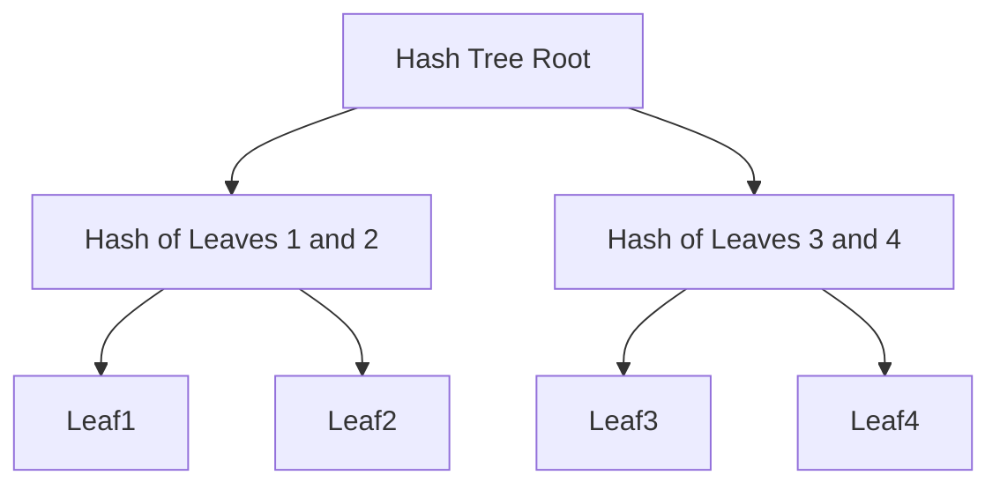
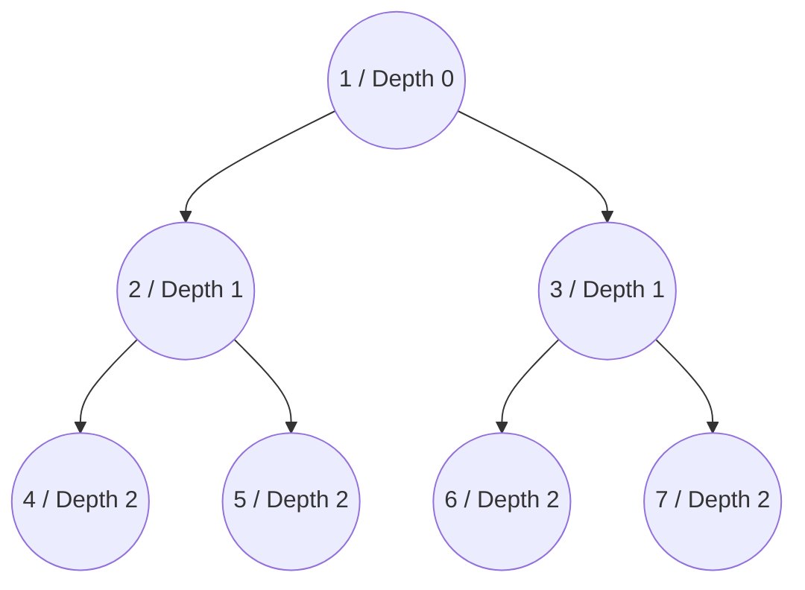
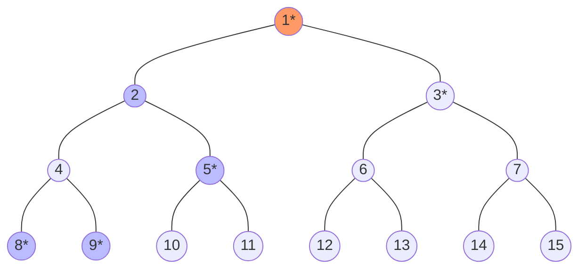
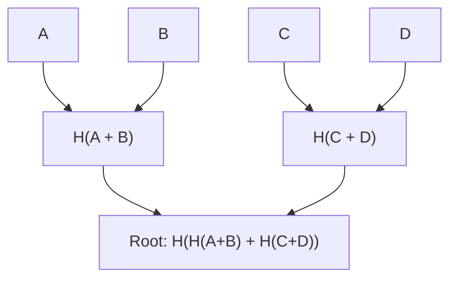

# Merkleization and Hash Tree Roots 

In Ethereum consensus mechanism, it's critical for all participating nodes to agree on the state of the system consistently and efficiently. The [Simple Serialize (SSZ)](/docs/wiki/CL/SSZ.md) framework facilitates this through Merkleization, a process that transforms serialized data into a Merkle tree structure. This wiki page delves into the intricacies of Merkleization and its importance in ensuring a shared state across nodes in a scalable and secure manner.

## Terminology and Methods

- **Merkleization:** Refers to constructing a Merkle tree and deriving its root.
- **Hash Tree Root:** A specific application of Merkleization, used to compute the root hash of complex SSZ container.

## The Need for Merkleization

Cryptographic hash functions provide a solution by generating a compact, unique representation of a data set for a Beacon state. By hashing the serialized state of a Beacon chain, nodes can quickly and efficiently compare states by exchanging these small hash outputs.

## Process of Merkleization

Merkleization involves breaking down the serialized data into 32-byte chunks, which serve as the leaves of a Merkle tree. These chunks are then combined pair-wise, hashed together, and the process is repeated up the tree until a single hash—the Merkle root—is derived. This root hash acts as a unique fingerprint for the entire dataset. The key steps are as below:

- **Chunking:** Divide the serialized data into 32-byte chunks.
- **Tree Construction:** Pair up the chunks and hash each pair to form the next level of the tree. Repeat this step until only one hash remains: the Merkle root.
- **Padding:** If the number of chunks isn't a power of two, additional zero-value chunks are added to round out the tree, ensuring that the tree is balanced.

## Benefits of Merkleization

- **Performance Efficiency:** While the tree requires hashing approximately twice the original data amount, caching mechanisms can store the roots of subtrees that don't change often. This significantly reduces the computational overhead as only altered parts of the data need re-hashing.
- **Light Client Support:** The Merkle tree structure supports the creation of Merkle proofs—small pieces of data that prove the inclusion and integrity of specific parts of the state without needing the entire dataset. This feature is crucial for light clients, which operate with limited resources and rely on these proofs to interact with  Ethereum securely.

## Merkle Tree Structure and Hashing

The Merkle tree structure is organized such that every two adjacent leaf nodes are hashed together to produce a parent node, and this pairing and hashing continue upwards until a single hash is obtained at the top:



_Figure: Merkle Tree Structure._

In some instances, the distribution of the leaves might require a more complex tree with varying depths per branch, especially when certain nodes (like containers with multiple elements) need additional depth.

## Generalized Indices

To facilitate direct referencing and verification within the tree, each node (both leaves and internals) is assigned a generalized index. This index is derived from the node’s position within the tree:



_Figure: Merkle Tree Generalized Indices and Depth Levels._

- **Root Index:** 1 (depth = 0)
- **Subsequent Levels:** $2^{depth} + index$ where index is the node's zero-indexed position at that depth.

## Multiproofs Using Generalized Indices

Multiproofs using generalized indices provide an efficient way to verify specific elements within a Merkle tree without needing to know the entire tree structure. This concept is crucial in Ethereum and cryptographic applications where data integrity and verification speed are paramount. Let's break down the process using an example to understand how multiproofs work:

**Understanding the Structure**
- A Merkle tree is structured in layers, where each node is either a leaf node (containing actual data) or an internal node (containing hashes of its child nodes).
- Generalized indices numerically represent the position of each node in the tree, calculated as $2^{depth} + index$, starting from the root (index 1).

**Tree Layout for the Example**
- The tree is structured as follows, with `*` indicating the nodes required to generate the proof for the element at index 9:



_Figure: Merkle Tree Layout_

**Determining Required Nodes**
- **Identifying Required Hashes**: To validate the data at index 9, you need the hashes of the data at indices 8, 9, 5, 3, and 1.
- **Pairwise Hashing**: Combine the hashes of indices 8 and 9 to compute the hash corresponding to their parent node, which should be `hash(4)`.
- **Further Hash Combinations**:
  - `hash(4)` is then combined with the hash from index 5 to produce the hash of their parent node, `hash(2)`.
  - This result is combined with the hash from index 3 to work up to the next level.
- **Final Verification**: The combined result from the previous step is hashed with the root from the opposite branch (index 3) to produce the ultimate tree root (`hash 1`).
- **Integrity Check**: If the calculated root matches the known good root (`hash 1`), the data at index 9 is verified as accurate. If the data was incorrect, the resulting root would differ, indicating an error or tampering.

There are helper functions in the consensus specs to calculate the multiproofs and generalized indices. You can find [here.](https://github.com/ethereum/consensus-specs/blob/dev/ssz/merkle-proofs.md#merkle-multiproofs)

## Calculating Hash Tree Roots

The hash tree root of an SSZ object is computed recursively. For basic types and collections of basic types, the data is packed into chunks and directly Merkleized. For composite types like containers, the process involves hashing the tree roots of each component. In the below sections we will see the working examples to understand the process.

### Packing and Chunking

Packing and chunking are crucial concepts in the context of Merkleization, especially when dealing with the SSZ used in the Beacon chain. Here's how packing and chunking work:

**Serializing the Data**
- **Serialization** involves converting a data structure (basic types, lists, vectors, or bitlists/bitvectors) into a linear byte array using SSZ serialization rules.
- Each element is serialized based on its type. 

**Padding the Serialization**
- After serialization, the byte array might not perfectly align with the 32-byte chunk size used in Merkle trees.
- **Padding** is added to the serialized data to extend the last segment to a full 32-byte chunk. This padding consists of zero bytes (0x00).

**Dividing into Chunks**
- The padded serialized data is then split into multiple 32-byte segments or "chunks."
- These chunks are the basic units used in the Merkleization process.

**Padding to Full Binary Tree**
- The number of chunks from the previous step may not be a power of two, which is required to form a balanced binary tree (full binary tree).
- Additional zero chunks (chunks filled entirely with zero bytes) are added as necessary to bring the total count up to the nearest power of two.
- This ensures that the resulting Merkle tree is complete and balanced, facilitating efficient cryptographic operations.

**Applying the Merkleization Process**
- With the chunks prepared, they are arranged as the leaves of a binary Merkle tree.
- Merkleization proceeds by hashing pairs of chunks together, layer by layer, until a single hash remains. This final hash is known as the Merkle root.

**Practical Example:**
Suppose we have a list of integers that need to be packed and chunked:
- **Integers**: [10, 20, 30, 40] (Suppose each integer occupies 8 bytes).
- **Serialized Data**: A continuous byte array created from these integers.
- **Padding**: If the total serialized length is not a multiple of 32, padding bytes are added.
- **Chunks**: The data is divided into 32-byte chunks.
- **Zero Padding for Tree**: If the number of chunks is not a power of two, additional zero-filled chunks are appended.
- **Merkleization**: The chunks are then used as leaves in a Merkle tree to compute the root.

### Mixing in the Length

Mixing in the length is a crucial step in the Merkleization process, particularly when handling lists and vectors. This step ensures that the final hash tree root accurately reflects both the content and the structure of the data, including its length. Let's break down how this concept is applied and why it's important.

**Purpose of Mixing in the Length**

Mixing in the length is used to ensure that two different lists or vectors with similar contents but different lengths generate different hash tree roots. This is critical because without incorporating the length into the hash, two lists—one longer than the other but otherwise identical up to the length of the shorter list—would have the same hash tree root if only the content is hashed. This could lead to potential security vulnerabilities and inconsistencies within the data validation process.

**An example of Mixing in the Length**

The example below illustrates that without including the length of the list, the Merkle root hashes for `a_root_hash` and `b_root_hash` remain the same despite representing two lists of different lengths. However, when the length is incorporated, the Merkle root hash `a_mix_len_root_hash` differs from both `a_root_hash` and `b_root_hash`. This distinction is crucial when dealing with lists or vectors of varying lengths in the merkleization.


```python
>>> from eth2spec.utils.ssz.ssz_typing import uint256, List
>>> from eth2spec.utils.merkle_minimal import merkleize_chunks
>>> a = List[uint256, 4](33652, 59750, 92360)
>>> a_len = a.length()
>>> a = List[uint256, 4](33652, 59750, 92360).encode_bytes()
>>> b = List[uint256, 4](33652, 59750, 92360, 0).encode_bytes()
>>> a_root_hash = merkleize_chunks([a[0:32], a[32:64], a[64:96]])
>>> b_root_hash = merkleize_chunks([b[0:32], b[32:64], b[64:96], b[96:128]])
>>> a_mix_len_root_hash = merkleize_chunks([merkleize_chunks([a[0:32], a[32:64], a[64:96]]), a_len.to_bytes(32, 'little')])
>>> print('a_root_hash = ', a_root_hash)
a_root_hash =  0x3effe553b6091b1982a6850fd2a788943363e6f879ff796057503b76802edd9d
>>> print('b_root_hash = ', b_root_hash)
b_root_hash =  0x3effe553b6091b1982a6850fd2a788943363e6f879ff796057503b76802edd9d
>>> print('a_mix_len_root_hash = ', a_mix_len_root_hash)
a_mix_len_root_hash =  0xeca15347139a6ad6e7eabfbcfd3eb3bf463af2a8194c94aef742eadfcc3f1912
>>> 
```

## Summaries and Expansions in SSZ Merkleization

In Ethereum PoS, the concepts of summaries and expansions are integral to managing state data efficiently. Summaries provide a compact representation of data structures, encapsulating essential verification information without the full details. Expansions, on the other hand, deliver the complete data set for thorough processing or when detailed information is required. Here are their benefits:

- **Efficiency and Speed**: By employing summaries, validators can quickly verify state changes or validate transactions without processing entire data sets. This method significantly speeds up validations and reduces computational overhead.  
- **Reduced Data Load**: Summaries minimize the amount of data stored and transmitted, conserving bandwidth and storage resources. This is particularly beneficial for nodes with limited capacity, such as light clients, which rely on summaries for operational efficiency.
- **Security Enhancements**: The cryptographic hashes included in summaries ensure the integrity of the data, enabling secure and reliable verification processes without accessing the full dataset.
- **An Example**:
  - **BeaconBlock and BeaconBlockHeader**: The `BeaconBlockHeader` acts as a summary, allowing nodes to quickly verify the integrity of a block without needing the complete block data. `BeaconBlock` is th expansion.
  - **Proposer Slashing**: Validators use block summaries to efficiently identify and process conflicting block proposals, facilitating swift and accurate slashing decisions.

## Merkleization for Basic Types

Let's understand the Merkleization of basic types using an example. Below is a simple Merkle tree and we will follow the process of merkleization to get the merkle root hash.



_Figure: Sample Merkle Tree._

In the above Merkle tree, the leaves are our four blobs of data, A, B, C, and D.

- **Define the Data:**
  - In this example, we're dealing with four basic data items: A, B, C, and D. These are conceptualized as numbers (`10`, `20`, `30`, and `40` respectively) and will be represented in the Merkle tree as 32-byte chunks.
- **Convert Data to 32-byte Chunks:**
  - Each data item is serialized into a 32-byte format using the `uint256` type from the SSZ typing system. Serialization involves converting the data into a format that is consistent and padded to ensure that each item is 32 bytes long.
- **Pair and Hash the Leaves:**
  - Next, pairs of these serialized data chunks are concatenated and hashed.
- **Hash the Results to Form the Root:**
  - Finally, the hashes from the previous step (`ab` and `cd`) are concatenated and hashed to form the Merkle root.
- **Output the Merkle Root:**
  - The Merkle root is then converted to a hexadecimal string to make it readable.

This final Merkle root is a unique representation of the data `A`, `B`, `C`, and `D`. Any change in the input data would result in a different Merkle root, illustrating the sensitivity of the hash function to the input data. This characteristic is essential for ensuring data integrity in Ethereum.


```python
>>> from eth2spec.utils.ssz.ssz_typing import uint256
>>> from eth2spec.utils.hash_function import hash
>>> a = uint256(10).to_bytes(length = 32, byteorder='little')
>>> b = uint256(20).to_bytes(length = 32, byteorder='little')
>>> c = uint256(30).to_bytes(length = 32, byteorder='little')
>>> d = uint256(40).to_bytes(length = 32, byteorder='little')
>>> ab = hash(a + b)
>>> cd = hash(c + d)
>>> abcd = hash(ab + cd)
>>> abcd.hex()
'1e3bd033dcaa8b7e8fa116cdd0469615b29b09642ed1cb5b4a8ea949fc7eee03'
```

## Merkleization for Composite Types


## Resources
- [Hash Tree Roots and Merkleization](https://eth2book.info/capella/part2/building_blocks/merkleization/)
- [SSZ](https://ethereum.org/en/developers/docs/data-structures-and-encoding/ssz/)
- [Protolambda on Merkleization](https://github.com/protolambda/eth2-docs?tab=readme-ov-file#ssz-hash-tree-root-and-merkleization)