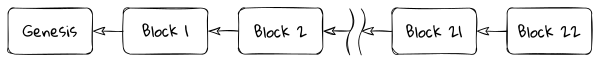
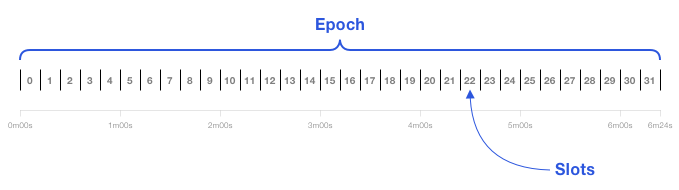
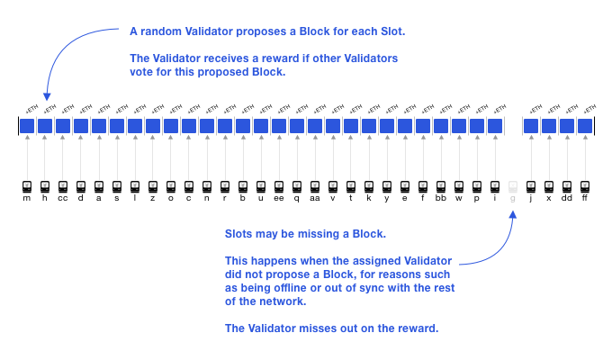
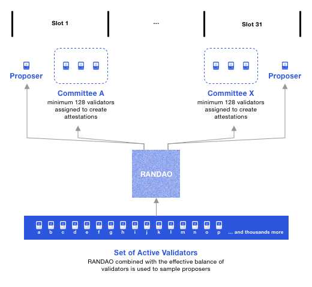
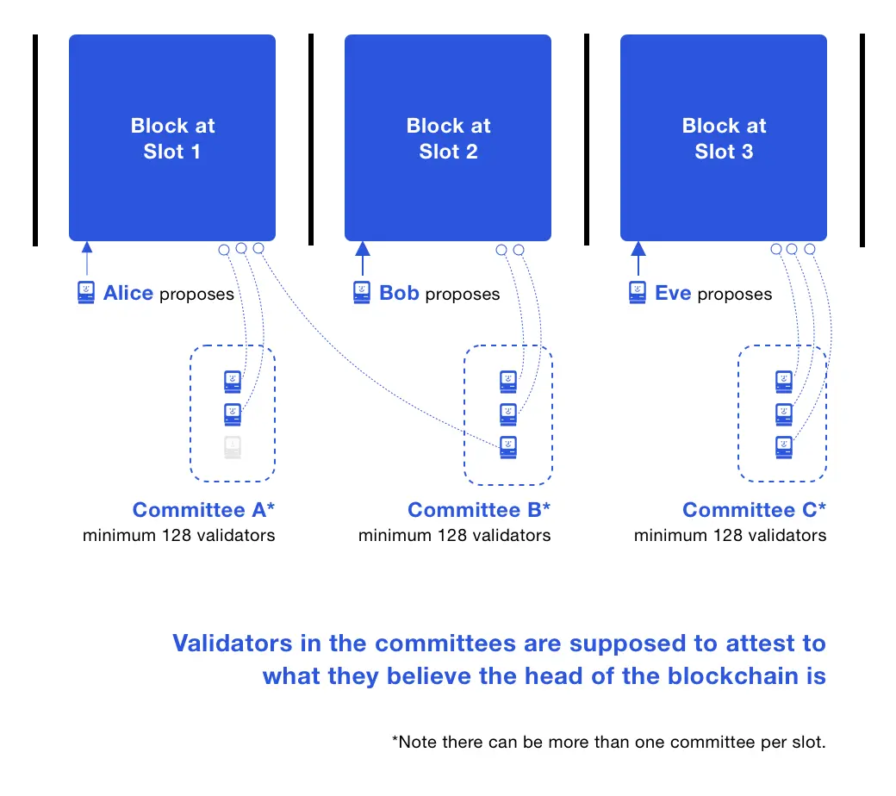
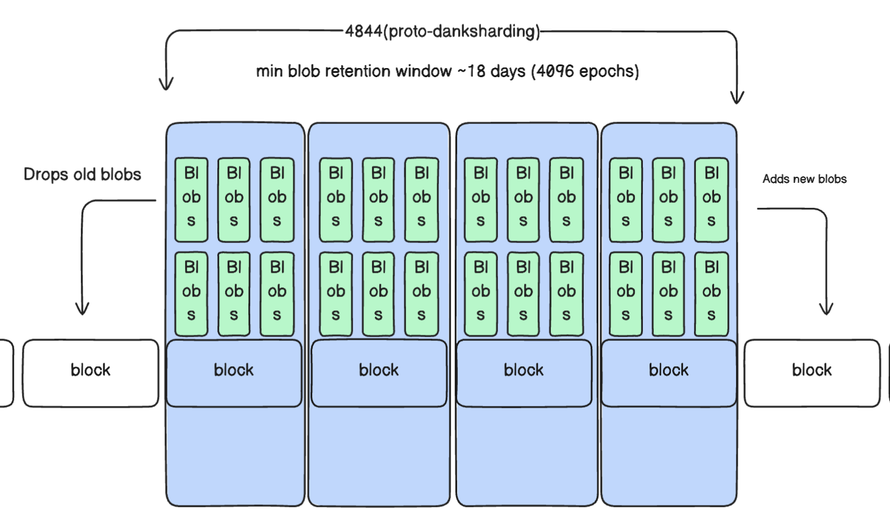
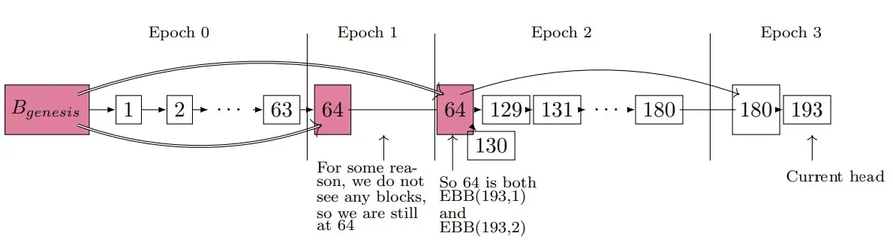
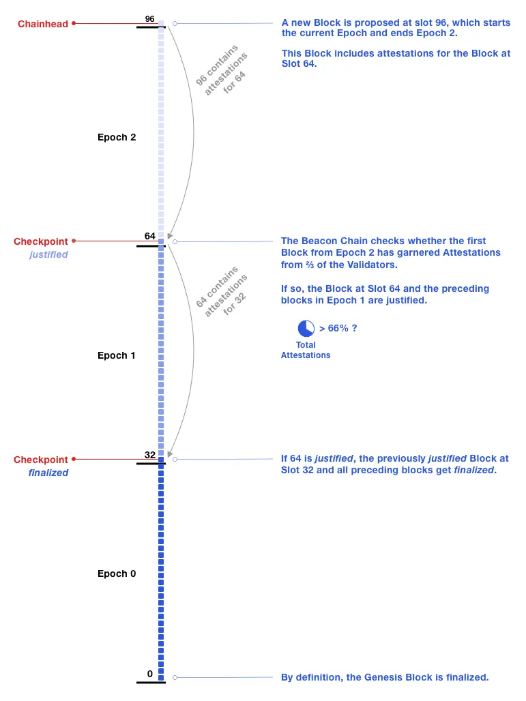
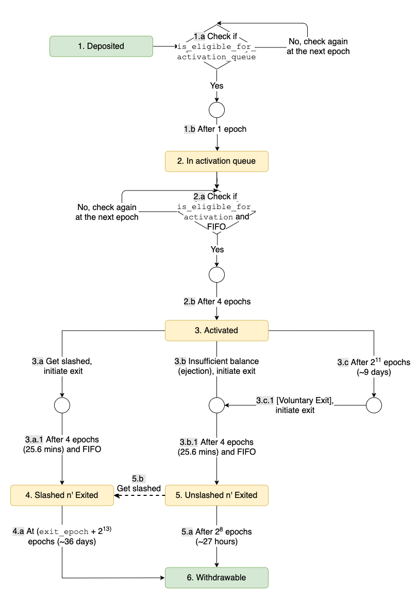

# Consensus Layer Overview

The main challenge a consensus protocol aims to solve is building a reliable distributed system on top of unreliable infrastructure. Research on consensus protocols dates back to the 1970s, but the scale of what Ethereum is trying to achieve far more ambitious.

In Ethereum's consensus layer, the goal is to ensure that tens of thousands of independent nodes around the world stay reasonably synchronized. Each node keeps a ledger with the state of every account, and all these ledgers must match exactly. There can be no differences; the nodes must agree and do so quickly. This is what we mean by "a reliable distributed system."

These nodes often use [consumer grade hardware](https://stakefromhome.com/) and communicate over internet connections that may be slow, lose data, or disconnect unexpectedly. Node operators might misconfigure their software or fail to update it. Additionally, there could be many bad actors running rogue nodes or tampering with communications for personal gain. This is what we mean by "unreliable infrastructure."

### Byzantine Fault Tolerance (BFT) and Byzantine Generals' Problem

Byzantine Fault Tolerance (BFT) is a property of distributed systems that allows them to function correctly even when some components fail or act maliciously. BFT is crucial in decentralized networks, where trust among nodes cannot be assumed. In other words, a system exhibiting BFT can tolerate Byzantine faults, which are arbitrary failures that include malicious behavior. For a system to be Byzantine fault-tolerant, it must reach consensus despite these faults. For more on the problem and practical solutions read [this](https://hackmd.io/@kira50/SknuPZMIC).

## Introduction to Consensus Layer (CL)

> Consensus is a way to build reliable distributed systems with unreliable components. Blockchain-based distributed systems aim to agree on a single history of transactions.
>
> Proof-of-Work and Proof-of-stake are not consensus protocols, but enable consensus protocols. In Ethereum, Nodes and validators are the actors of the consensus system. Slots and epochs regulate consensus time. Blocks and attestations are the currency of consensus.

The Consensus Layer (CL) is a fundamental component that ensures the network's security, reliability, and efficiency. Originally, Ethereum utilized Proof-of-Work (PoW) as its consensus mechanism, similar to Bitcoin. PoW, while effective in maintaining decentralization and security, has significant drawbacks, including high energy consumption and limited scalability. To address these issues, Ethereum has transitioned to Proof-of-Stake (PoS), a more sustainable and scalable consensus mechanism.

The Ethereum network consists of many individual nodes. Each node operates independently and communicates over the Internet, which is often unreliable and asynchronous.

Users send transactions to this network of nodes, and the consensus protocol ensures that all honest nodes eventually agree on a single, consistent transaction history. This means they agree on the order of transactions and their outcomes. For example, if I have 1 ETH and tell the network to send it to both Alice and Bob at the same time, the network must eventually agree on whether I sent it to Alice or Bob. It would be a failure if both Alice and Bob received the Ether, or if neither did. A consensus protocol is the process that enables this agreement on transaction order.

Ethereum's consensus protocol actually _bolts together_ two different consensus protocols. One is called [LMD GHOST](/wiki/CL/gasper.md?lmd-ghost), the other [Casper FFG](/wiki/CL/gasper.md?casper-ffg). The combination has become known as [Gasper](/wiki/CL/gasper.md). In subsequent sections we will be looking at these both separately and in combination.

## Proof-of-Work and Proof-of-stake

This is a good point to clarify that neither Proof-of-Work (PoW) nor Proof-of-Stake (PoS) are consensus protocols by themselves. They are often incorrectly referred to as such, but they are actually mechanisms that enable consensus protocols. Both PoW and PoS primarily serve as Sybil resistance mechanisms, placing a cost on participating in the protocol. This prevents attackers from overwhelming the system cheaply.

However, both PoW and PoS are closely linked to the consensus mechanisms they support through [fork choice](/wiki/CL/cl-architecture.md?id=fork-choice-rules) rules. They help assign a weight or score to a chain of blocks: in PoW, it's the total computational work done; in PoS, it's the total value staked that supports a particular chain. Beyond these basics, PoW and PoS can support various consensus protocols, each with its own dynamics and trade-offs.

### Block chains

The basic element of a blockchain is the block. A block contains a set of transactions assembled by a leader (block proposer). The contents of a block can vary based on the protocol.

- The payload of a block on Ethereum's execution chain is a list of user transactions.
- In the pre-Merge PoS Beacon Chain, a block's payload was mostly a set of attestations by validators.
- Post-Merge Beacon Chain blocks also include the execution payload (user transactions).
- After [EIP-4844](https://eips.ethereum.org/EIPS/eip-4844)(Deneb upgrade), blocks now also contain commitments to opaque data blobs alongside user transactions.

Except for the Genesis block, each block builds on and points to a parent block, forming a chain of blocks: a blockchain. The goal is for all nodes on the network to agree on the same blockchain history.

<a id="img_blockchain"></a>

<figure class="diagram" style="text-align:center">



<figcaption>

_Time moves from left to right and, except for the Genesis block, each block points to the parent block it builds on._

</figcaption>
</figure>

The chain grows as nodes add new blocks to its tip. This is done by temporarily selecting a "leader", the node that extends the chain. In PoW, the leader is the miner who first solves the PoW puzzle for its block. In Ethereum's PoS, the leader is pseudo-randomly selected from active stakers.

The leader (block proposer) adds a block to the chain, choosing and ordering its contents. The block must be valid according to protocol rules, or the network will ignore it. Using blocks is an optimization. Adding individual transactions one by one would create a huge consensus overhead. So blocks are batches of transactions, and sometimes [people argue](https://www.bitrawr.com/bitcoin-block-size-debate-explained) about how big those blocks should be. The size of these blocks can vary:

In Bitcoin, block size is limited by the number of bytes. In Ethereum's execution chain, block size is limited by the block gas limit (the amount of work needed to process the transactions). [Beacon block](link to beaconblock class) sizes are limited by hard-coded constants.

### Forks and ChainId

Since Ethereum is a decentralized network, any participant can attempt to add a new block to an existing chain of blocks. This creates a branching structure of blocks resembling a tree. To determine the main path from the root (the initial genesis block) to the leaf (the most recent block), a consensus mechanism is needed. If nodes disagree on which path represents the official blockchain, this disagreement results in a fork — a split where different nodes might follow different histories beyond a certain point, each considering their chosen history as the correct one. This divergence can lead to incompatible records of transactions, undermining trust in the system.

Since the Paris hard fork, Ethereum manages consensus through a separate protocol known as the Beacon Chain. This is part of Ethereum's consensus layer, which sets the rules for identifying the valid sequence of blocks.

Occasionally actors do not agree on a protocol change (not everybody believes in the 'not entirely serious mantra': ['Move fast and break things'](https://github.com/ethereumbook/ethereumbook/blob/c5ddebd3dbec804463c86d0ae2de9f28fbafb83a/01what-is.asciidoc?plain=1#L240)), leading to a permanent fork, such as Ethereum Classic (ETC). Therefore, In order to distinguish between diverged blockchains, [EIP-155](https://github.com/ethereum/EIPs/blob/master/EIPS/eip-155.md) by Vitalik introduced the concept of chain ID, which is mathematically denoted by $\beta$. For the Ethereum main network $\beta$ is 1, obviously.

The Paris hard fork marked a significant transition for Ethereum, shifting its consensus mechanism from Proof-of-Work (PoW) to Proof-of-Stake (PoS). This change represents a fundamental shift in how blocks are validated and new transactions are added to the blockchain. The transition to Proof-of-Stake (PoS) in Ethereum aimed to address the limitations of Proof-of-Work (PoW), particularly its high energy consumption and scalability issues. PoS is designed to be more efficient and secure by relying on validators who stake ETH as collateral. As I mentioned earlier, not everyone agrees to protocol changes, so there are still some clients who didn't upgrade and now run a separate chain/fork called Ethereum PoW (ETHW).

## Transition to Proof-of-Stake

> The engine was changed mid-flight! September 15, 2022 — the day Ethereum switched to Proof-of-Stake. That new engine is the Consensus Layer, formerly known as Ethereum 2.0’s Beacon Chain.

### Transition Criteria and Terminal Block

Unlike previous hard forks in Ethereum, which typically occurred at a predetermined block height, the Paris hard fork was designed to activate based on a specific condition known as the "terminal total difficulty" (TTD). This approach was chosen to mitigate potential risks associated with the transition, such as avoiding malicious forks.
 
- **Avoiding Malicious Forks:** By using total difficulty instead of block height, the transition avoids scenarios where a minority of hash power could potentially extend a competing PoW chain to reach a predefined block height first, thus creating a malicious fork (smart but evil). This method ensures that the transition to PoS would occur only when the cumulative difficulty of mined blocks reaches a critical, predefined threshold, making it much harder for any minority group to influence or hijack the transition (smarter). So the terminal block was defined as follows.


The **terminal block**, which is the last block mined using PoW, was defined by the following criteria:
   - The total difficulty of the block ($B_t$) must exceed a predefined threshold (`58750000000000000000000` in this case).
   - The total difficulty of its parent block $P(B_H)_t$ must be less than this threshold.

or mathematically
 - $B_t        \geq     58750000000000000000000$
 - $P(B_H)_t   <        58750000000000000000000$

##### Formula for Total Difficulty

Total difficulty ($B_t$) of a block in the PoW system was calculated recursively as:
   - $B_t$ ≡ $P(B_H)_t$ + $H_d$

This calculation accumulates the difficulty of each block, adding up to a total that reflects the overall computational effort expended to reach the current state of the blockchain.

The notations are taken from the Ethereum yellowpaper, It might be confusing to understand but allow me explain it clearly. After knowing the notations properly try to read it again, it would be easier to understand. 
   - $B_H$ represent Block $B$ with the Block Header $H$
   - $B_t$ represents total difficulty of Block $B$, $H_d$ also represent total difficulty but of Block with the Block Header $H$
   - $P(B_H)$ represent parent of $B_H$ and $P(B_H)_t$ means total difficulty of the parent block $P(B_H)$

Upon reaching the terminal block:
- **Beacon Chain Takes Over**: The Beacon Chain, already running in parallel with the Ethereum mainnet, assumes the responsibility for processing new blocks. Under PoS, blocks are validated by validators who stake their ETH to participate in the consensus mechanism, rather than by miners solving cryptographic puzzles.

- **Security and Efficiency**: This transition not only aims to enhance the security of the Ethereum network by making it more decentralized but also significantly reduces its energy consumption, addressing one of the major criticisms of traditional PoW systems.

- **New Consensus Mechanism**: The consensus under PoS is achieved through a combination of staking, attestation by validators, and algorithms that randomly select block proposers and committees to ensure the network remains secure and transactions are processed efficiently.

### Beacon Chain Introduction
The Beacon Chain plays a crucial role in managing the PoS consensus. It oversees validators who propose and attest to new blocks, ensuring the network’s integrity and security. Validators are selected based on a number of criteria, one of them being the amount of ETH they stake, which also acts as collateral against dishonest behavior. Some high level responsibilities of validators are:

- **Staking ETH**: Validators must stake a minimum of 32 ETH to participate.
- **Proposing Blocks**: A Validator is randomly selected to propose a new block. They must construct valid blocks and broadcast them to the network
- **Attesting Blocks**: Validators attest to the validity of blocks proposed by others. Attestations are essentially votes on the validity of the blocks, ensuring consensus.
- **Rewards and Penalties**: Validators earn rewards for honest participation and face slashing penalties for malicious actions or inactivity.
- **Participating in Consensus**: Validators participate in consensus by voting on the state of the blockchain at regular intervals, helping to finalize the blockchain's state.

The Paris hard fork was a pivotal event in Ethereum's history, setting the stage for more scalable, sustainable, and secure operations. It represents Ethereum's commitment to innovation and its responsiveness to the broader societal concerns about the environmental impact of cryptocurrency mining.

## Beacon Chain and its preliminaries

The Beacon Chain is the backbone of Ethereum’s consensus. It coordinates validators, manages the PoS protocol, and ensures consensus across the network. This section with cover the anatomy of Beacon chain.

### Validators

Validators are essentially the participants in the PoS Protocol. They propose and validate new blocks, ensuring the integrity and security of the blockchain. Validators must stake ETH as collateral, aligning their interests with the network’s health. Validators are chosen to propose blocks based on several factors:

- **Staked Ether**: Each validator can stake a maximum of 32 ETH. Stakers with more ETH can increase their influence by running multiple validator nodes, each staking 32 ETH. This system ensures decentralization and aligns the interests of validators with the network's security and integrity.
- **Randomness**: The selection process incorporates cryptographic randomness to prevent predictability and manipulation. This is achieved through the [RANDAO](https://inevitableeth.com/home/ethereum/network/consensus/randao) and [VDF (Verifiable Delay Function)](https://inevitableeth.com/home/ethereum/upgrades/consensus-updates/vdf) mechanisms.
- **Committees**: Validators are grouped into committees for block proposal and attestation. Each committee is responsible for validating and attesting to blocks, ensuring a decentralized and secure validation process.
- **Staking Requirements**: To become a validator, an individual must deposit a minimum of 32 ETH into the official deposit contract. This ETH acts as collateral to incentivize honest behavior. The validator's ETH is at risk if they fail to perform their duties or engage in malicious activities.

### Slots and Epochs

Each slot is 12 seconds and an epoch is 32 slots: 384 seconds or 6.4 minutes. Each slot has a validator assigned to propose a block, while committees of validators attest to the block’s validity.

A slot is a chance for a block to be added to the Beacon Chain. Every 12 seconds, one block is added. Validators need to be roughly [synchronized with time](https://ethresear.ch/t/network-adjusted-timestamps/4187). A slot is like the block time, but slots can be empty. The Beacon Chain genesis block is at Slot 0.


<a id="img_slots_epochs"></a>

<figure class="diagram" style="margin-left:10%; width:80%">



<figcaption style="margin-left: 15%">

_The first 32 slots are in Epoch 0. Genesis block is at Slot 0._

</figcaption>
</figure>


### Validators and Attestations

A block proposer is a validator that has been pseudo-randomly selected to build a block. Validators propose blocks and attest to the blocks proposed by others. Most of the time, validators are attesters that vote on blocks. These votes are recorded in the Beacon Chain and determine the head of the Beacon Chain.

Attestations are votes on the validity of the blocks, which are aggregated into the Beacon Chain to ensure consensus. 

<a id="img_validators"></a>

<figure class="diagram" style="margin-left:10%; width:80%">



<figcaption style="margin-left: 15%">

_A slot can be missed as you can see in this diagram on 28th slot_

</figcaption>
</figure>

An **attestation** is a validator’s vote, weighted by the validator’s balance.  Attestations are broadcasted by validators in addition to blocks. Validators also police each other and are rewarded for reporting other validators that make conflicting votes, or propose multiple blocks.

The contents of the Beacon Chain is primarily a registry of validator addresses, the state of each validator, and attestations.  Validators are activated by the Beacon Chain and can transition to states

**IMPORTANT NOTE on Staking Validators Semantics:** *In Ethereum's PoS, users activate validators by staking ETH, similar to buying hardware in PoW. Stakers are associated with the amount staked, while validators have a maximum balance of 32 ETH each. For every 32 ETH staked, one validator is activated. Validators are run by validator clients, which use a beacon node to follow and read the Beacon Chain. A single validator client can manage multiple validators.*

### Committees

Committees are groups of at least 128 validators assigned to each slot for added security. An attacker has less than a 1 in a trillion chance of controlling ⅔ of a committee.

The concept of a randomness beacon that emits random numbers for the public, is how Beacon Chain got it's name. The Beacon Chain enforces consensus on a pseudorandom process called RANDAO.

<a id="img_randao"></a>
<figure class="diagram" style="text-align:center">



<figcaption>

_At every epoch, a pseudorandom process RANDAO selects proposers for each slot, and shuffles validators to committees._

</figcaption>
</figure>

**Validator Selection:**
- As mentioned earlier, Proposers are chosen by RANDAO, weighted by validator balance.
- A validator can be both a proposer and a committee member for the same slot, but this is rare (1/32 probability).

The sketch depicts a scenario with less than 8,192 validators, otherwise there would be at least two committees per slot.


<a id="img_committee"></a>
<figure class="diagram" style="margin: auto; width:80%">



</figure>

The diagram is a combined depiction of what happened in 3 slots:
- Slot 1: A block is proposed and attested by two validators; one validator is offline.
- Slot 2: A block is proposed, but one validator misses it and attests to the previous block.
- Slot 3: All validators in Committee C attest to the same head, following the LMD GHOST rule.

Validators attest to their view of the Beacon Chain head using the LMD GHOST rule.
Attestations help finalize blocks by reaching consensus on the blockchain’s state.

**Committee Size and Security:**
- With more than 8,192 validators, multiple committees per slot are formed.
- Committees must be at least 128 validators for optimal security.
- Security decreases with fewer than 4,096 validators, as committee sizes drop below 128.

> At every epoch, validators are evenly divided across slots and then subdivided into committees of appropriate size. All of the validators from that slot attest to the Beacon Chain head. A shuffling algorithm scales up or down the number of committees per slot to get at least 128 validators per committee. More details on shuffling can be found in [proto's repo.](https://github.com/protolambda/eth2-docs#shuffling)

### Blobs

[EIP-4844](https://eips.ethereum.org/EIPS/eip-4844), also known as proto-danksharding, is part of the Deneb/Cancun hardfork. It introduces a data availability layer to Ethereum, allowing for the temporary storage of arbitrary data on the blockchain. This arbitrary data stored this way are called `blobs`, and each block can have 3 ~ 6 blob sidecars (wrappers for blobs). EIP-4844 marks Ethereum's first step towards sharding and scalability, enabling Layer 2 solutions (L2s) to use this data availability layer to lower gas fees and process more transactions.

### Design and Implementation

A key design decision in EIP-4844 is the use of [KZG commitments](/wiki/Cryptography/kzg.md) to verify blobs and support future proposer-builder separation. To use KZG commitments, a Trusted Setup is needed. For the Deneb hardfork, a [KZG Ceremony](https://github.com/ethereum/kzg-ceremony) was conducted to create this Trusted Setup.

<a id="img_blobs"></a>

<figure class="diagram" style="text-align:center">



</figure>

### Storage Requirements

The most significant impact on node operators is the increased storage requirement. Node runners will need more storage:

```
131,928 ssz bytes per blob * 4096 blobs retention period * 
32 potential blocks per epoch * 3~6 blob sidecars per block

= 52~104GB
```

By default, these blobs will be retained for 4096 epochs, and clients would prune the oldest blobs once the retention period is reached.

### Checkpoints and Finality

At the end of each epoch, checkpoints are created. A checkpoint is a block in the first slot of an epoch.  If there is no such block, then the checkpoint is the preceding most recent block.  There is always one checkpoint block per epoch. A block can be the checkpoint for multiple epochs.

A block becomes a checkpoint if it receives attestations from a majority of validators. Checkpoints are used to finalize the blockchain's state. A block is considered final when it is included in two-thirds of the most recent checkpoint attestations, ensuring it cannot be reverted.

<a id="img_checkpoints"></a>
<figure class="diagram" style="text-align:center">



<figcaption>

_Checkpoints for a scenario where epoch contain 64 slots_

</figcaption>
</figure>

For example, if Slots 65 to 128 are empty, the Epoch 2 checkpoint defaults to the block at Slot 64. Similarly, if Slot 192 is empty, the Epoch 3 checkpoint is the block at Slot 180. **Epoch boundary blocks (EBB)** is a term in some literature (such as the [Gasper](https://arxiv.org/abs/2003.03052) paper, the source of the diagram above and a later one), and they can be considered synonymous with checkpoints.

Validators cast two types of votes: **LMD GHOST** votes for blocks and **Casper FFG** votes for checkpoints. An **FFG** vote includes a source checkpoint from a previous epoch and a target checkpoint from the current epoch. For example, a validator in Epoch 1 might vote for a source checkpoint at the genesis block and a target checkpoint at Slot 64, repeating the same vote in Epoch 2. Only Validators assigned to a slot cast LMD GHOST votes, while all validators cast FFG votes for epoch checkpoints.

#### Supermajority and Finality:

A supermajority, defined as ⅔ of the total validator balance, is required for a checkpoint to be justified. For instance, if validators have balances of 8 ETH, 8 ETH, and 32 ETH, a supermajority needs the vote of the 32 ETH validator. Once a checkpoint receives a supermajority, it becomes justified. If the subsequent epoch's checkpoint also achieves justification, the previous checkpoint is finalized, securing all preceding blocks. Typically, this process spans two epochs (12.8 minutes).

When a user transaction is included in a block, On average it would be somewhere in the middle of an epoch. It takes half an epoch (about 3.2 minutes) to reach the next checkpoint, suggesting transaction finality of 2.5 epochs: 16 minutes. Optimally, more than ⅔ of attestations will have been included by the 22nd (2/3rd of 32) slot of an epoch. Thus, transaction finality is an average of 14 minutes (16+32+22 slots). Block confirmations emerge from a block’s attestations, then move to its justification, to its finality. Use cases can decide whether they need finality or an earlier safety threshold is sufficient.

<a id="img_finality"></a>
<figure class="diagram" style="text-align:center">



<figcaption>

_Example of one checkpoint getting justified (Slot 64) nd finalizing a prior checkpoint (Slot 32)._

</figcaption>
</figure>

**What happened at the Beacon Chain head:**
At Slot 96, a block is proposed that includes attestations (votes) for the Epoch 2 checkpoint. These attestations reach the required two-thirds supermajority, justifying the Epoch 2 checkpoint. This action finalizes the previously justified Epoch 1 checkpoint. When the Epoch 1 checkpoint is finalized, all preceding blocks (up to Slot 32) also become final. Finality calculations happen at epoch boundaries, but attestations accumulate with each block.

**What could have happened from genesis to the head:**
- **Scenario 1:**
   - Proposers from Slot 1 to Slot 63 propose blocks.
   - Each block in Epoch 1 contributes attestations for the checkpoint at Slot 32, eventually reaching 55%.
   - The block at Slot 64 includes additional attestations, bringing support for the Slot 32 checkpoint to 70%, causing its justification.
   - Throughout Epoch 2, the Slot 64 checkpoint gathers attestations but doesn't reach the two-thirds threshold until Slot 96, where it is justified.
   - Justifying the Epoch 2 checkpoint finalizes the Epoch 1 checkpoint and all preceding blocks.

- **Scenario 2:**
   - The checkpoint at Epoch 1 could reach the two-thirds supermajority before the next epoch.
   - For example, blocks from Slot 32 to Slot 54 could provide enough attestations to justify the checkpoint at Slot 32.
   - In this case, the Slot 32 checkpoint would be justified within its current epoch but would need the next epoch to finalize.

**Special Cases:**
The justification of a checkpoint can sometimes finalize blocks from two or more epochs ago, especially during periods of high latency, network partitions, or attacks, You can find more such cases, discussed in the Gasper paper. These scenarios are exceptional and not the norm.


#### Closer look on Attestations

Validators submit one attestation per epoch, containing both an LMD GHOST and an FFG vote. These attestations have 32 chances per epoch for inclusion on-chain, with earlier inclusions receiving higher rewards. This means a validator may have two attestations included on-chain in a single epoch. Validators are rewarded the most when their attestation is included on-chain at their assigned slot; later inclusion has a decayed reward. To give validators time to prepare, they are assigned to committees one epoch in advance. Proposers are only assigned to slots once the epoch starts. Nonetheless, [secret leader election](https://ethresear.ch/t/low-overhead-secret-single-leader-election/5994) research aims to mitigate attacks or bribing of proposers.

Consider a block proposed at Slot 64 containing attestations for the Epoch 2 checkpoint. This scenario can finalize the checkpoint at Slot 32. The finality of the Slot 32 checkpoint, once achieved, propagates backward, securing all preceding blocks.

In essence, Committees allow for the technical optimization of combining signatures from each attester into a single aggregate signature.  When validators in the same committee make the same LMD GHOST and FFG votes, their signatures can be aggregated.

### Staking Rewards and Penalties

Ethereum’s PoS system employs a comprehensive set of rewards and penalties to incentivize validator behavior and maintain network security. This section covers six key aspects of these incentives:

**1. Attester Rewards:**
Validators earn rewards for making attestations (LMD GHOST and FFG votes) that align with the majority of other validators. Attestations included in finalized blocks are more valuable.

**2. Attester Penalties:**
Validators are penalized for failing to attest or for attesting to blocks that do not get finalized. These penalties ensure validators remain active and aligned with the network’s consensus.

**3. Typical Downside Risk for Stakers:**
Stakers can estimate their downside risk by comparing potential earnings and penalties. An honest validator earning 10% in a year could lose up to 7.5% for poor performance. Minor penalties apply for short-term inactivity, while prolonged offline periods incur larger penalties.

**4. Slashings and Whistleblower Rewards:**
Slashing penalizes validators for serious protocol violations. Penalties range from over 0.5 ETH up to the entire stake. For example, a validator committing a slashable offense loses at least 1/32 of their balance and is deactivated. Additional penalties are proportional to the number of validators slashed simultaneously. A whistleblower who reports a slashable offense receives a reward, which currently goes to the block proposer.

**5. Proposer Rewards:**
Block proposers receive substantial rewards for proposing blocks that get finalized. Consistently performing validators gain approximately a 1/8 boost to their total rewards. Additionally, proposers receive small rewards for including slashing evidence in their blocks.

**6. Inactivity Leak Penalty:**
The inactivity leak is a severe penalty designed to ensure the network’s finality. If finality is delayed for more than four epochs, validators suffer increasing penalties until a checkpoint is finalized. This mechanism drains the balances of inactive validators, leading to their forced exit, thus allowing active validators to form a ⅔ majority to resume finality. During an inactivity leak, only proposer and whistleblower rewards are earned, while attester rewards are zero.

<!-- Can be expanded more in future-->
### **Slashable Offenses:**
There are four conditions under which a validator can be slashed:
- **Double Proposal:** Proposing more than one block for their assigned slot.
- **LMD GHOST Double Vote:** Attesting to different Beacon Chain heads for the same slot.
- **FFG Surround Vote:** Casting an FFG vote that surrounds or is surrounded by a previous FFG vote by the same validator.
- **FFG Double Vote:** Casting two FFG votes for different targets in the same epoch.

## Beacon Chain Validator Activation and Lifecycle:

A validator requires 32 ETH to be activated. Validators are deactivated if their balance falls to 16 ETH, with any remaining balance withdrawable. Validators can also voluntarily exit after serving 2,048 epochs (approximately nine days). 

Upon exit, there is a delay of four epochs before withdrawal, during which validators can still be slashed. 

Honest validators can withdraw their balance in about 27 hours, whereas slashed validators face a delay of approximately 36 days (8,192 epochs).

<a id="img_randao"></a>
<figure class="diagram" style="text-align:center">



</figure>

To prevent rapid changes in the validator set, mechanisms limit how many validators can be activated or exited per epoch. The Beacon Chain also employs effective balances for technical optimization, which change less frequently than actual validator balances.

#### Overall Effects
At every epoch, validators are evenly divided across slots and then subdivided into committees of appropriate size. Validators can only be in one slot, and in one committee. Collectively:

- All validators in an epoch attempt to finalize the same checkpoint: FFG vote
- All validators assigned to a slot attempt to vote on the same Beacon Chain head: LMD GHOST vote
Optimal behavior rewards validators the most.

The Beacon Chain's introduction on December 1, 2020, began with 21,063 validators. The number of validators can decrease with slashings or voluntary exits, or more stakers can join and be activated. Fast forward to today(15th May, 2024) there are more than 1,000,000 validators that are active on Ethereum Network. The world has never seen a scalable platform for decentralized systems and applications like Ethereum.

<!-- #### TODO in future-->
<!-- Can add a section on Evolution of Ethereum PoS that covers
Historical context and early proposal
Research and developmental phases for future -->

### Resources and References used to write this:

- [Beacon Chain Explainer from ethos.dev](https://ethos.dev/beacon-chain)
- [Evolution of Ethereum Proof-of-Stake](https://github.com/ethereum/pos-evolution/blob/master/pos-evolution.md)
- Alt Explainer, [Ethereum's Proof-of-Stake consensus explained](https://www.youtube.com/watch?v=5gfNUVmX3Es)
- [Eth2 Handbook by Ben Edgington](https://eth2book.info/capella/part2/consensus/)

### Further Reading Resources