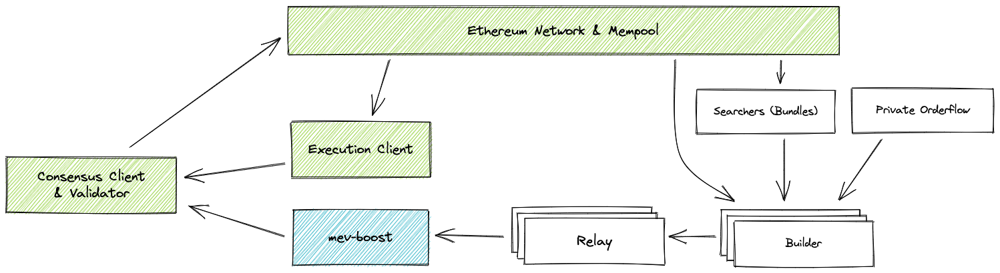
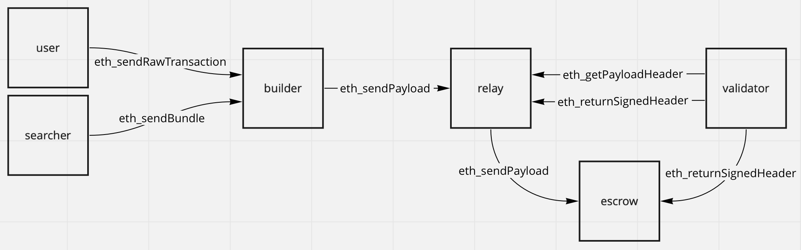

# Proposer-Builder Separation 

Ever since the Beacon Chain Merge in September 15th, 2022, Ethereum has been a proof-of-stake network. On that day, miners were replaced by validators who, instead of solving the proof of work, stake their ether for a chance to add the next block to the chain, thus earning the corresponding reward. Initially, just as in PoW Ethereum, both bundling the validated transactions into a block and proposing said block for the next slot were done by the same node. However, separating these tasks has been gaining popularity and is likely to become standard practice for the Ethereum consensus mechanism.

This practice is known as Proposer-Builder Separation, often referred to as PBS, which consists of having two different entities involved in the process of new block generation. Instead of the validator pseudo-randomly selected for block proposal adding a block it created itself, in PBS we have:
- Builder: The entity that aggregates transactions into a block.
- Proposer: The entity (validator) that proposes the block built by the builder for the next slot of the chain.
- Relay: The entity responsible for escrowing blocks from builders to proposers.

In this entry we will examine different aspects of PBS, including how it works, why it is relevant or how it may impact the future of Ethereum.

## PBS and Consensus

PBS being an emergent approach to consensus on Ethereum, it is important to examine in detail how the process integrates into the Beacon Chain, Ethereum's consensus layer. 

As eloquently explained in the [Beacon Chain Explainer](https://ethos.dev/beacon-chain), slots are the time frames allowed in the consensus layer for a block to be added to the chain, they last 12 seconds and there are 32 of them per epoch. Epochs are significant for the consensus mechanism, serving as checkpoints where the network can finalize blocks, update validator committees, etc., but such explanations are out of this entry's scope. 

For each slot, a validator is chosen through [RANDAO](https://inevitableeth.com/home/ethereum/network/consensus/randao) to propose a block. Once proposed and added to the canonical chain, the validators chosen for that slot's committees attest to the validity of the block, which shall eventually reach finality. This whole process, which is core to the Ethereum protocol, happens irrespectively of whether the node that proposed the block was also the one who built it. Thus, PBS is irrelevant for consensus, implementing it or not is up to each validator and they are free to do so in whichever way they see fit, as long as the blocks proposed are valid.

## Origins of PBS

As explained in this [BlockNative post](https://www.blocknative.com/blog/ethereum-block-building), before the merge miners were in charge of both building the new blocks and adding them to the chain. This allowed them to control the flow of transactions to profit from on-chain activities, prioritizing those with higher priority fees. This gave rise to the concept of Miner Extractable Value (MEV). As increasingly sophisticated activity ocurred on Ethereum, MEV searchers started to emerge, who specialized in monitoring the mempool looking for opportunities to profit by strategically ordering the contents of a block, to then sell that bundle of transactions to a miner (win-win). 

Since being a good searcher required highly specialized knowledge, it was rare for mining pool operators to have this know-how, and therefore collaboration between searchers and miners was required. For this, the necessary communication channel was provided by [Flashbots](https://docs.flashbots.net/), whose open MEV marketplace allowed searchers to submit transaction bundles to miners (with whom MEV profit was shared) for inclusion in blocks. Specialized clients such as [MEV-Geth](https://github.com/flashbots/mev-geth) made it possible for miners to build blocks with the transactions they picked from the mempool themselves or the bundles created by searchers.

This was very attractive to miners, who this way had three source of income: block rewards, priority fees and MEV. Unsurprisingly, according to Flashbots, [over 90% of Ethereum miners outsourced some of their block construction](https://writings.flashbots.net/why-run-mevboost/) to them, as of June, 2022.

However, in post-merge Ethereum, the entry barrier for participating in consensus decreased significantly. Although still considerable, it became endogenous to the network (32 ETH, instead of mining rigs) and physically more convenient (removing the need for equipment powering, storage, maintenance, etc.), thus paving the way for hobbyist/solo validators and increasing Ethereum's decentralization. 

Another key difference between PoW and PoS Ethereum is that before the merge only miners could build the blocks (since they had to find the right nonce for the proof of work hash), so searchers could only suggest transaction bundles for them to include in a block. However, in PoS Ethereum anyone can build a complete block for a validator to propose for the next slot. This together with the increase in the number of validators, most of which lacked the skill to build maximally profitable blocks, gave rise to the role of block builders.

## PBS Block Creation (MEV-Boost)

In today's Ethereum, most validators use the [MEV-Boost](https://github.com/flashbots/mev-boost) client (MEV now meaning Maximal Extractable Value), which allows them to source high-MEV blocks from a competitive builder marketplace, in a similar fashion as MEV-Geth did with transaction bundles in PoW Ethereum. This Ethereum client makes it possible for validators to create such bundles taking transactions directly from the mempool, however, this is becoming less frequent, as specialized builders provide more profitable blocks to proposers.

The process works as outlined by the following image and explained below.

<figure style="text-align: center;">
  
  <figcaption style="text-align: center;">Outline of the PBS process using MEV-Boost. Source: <a href="https://github.com/flashbots/mev-boost">Flashbots</a></figcaption>
</figure>

### Block Construction

- Builders continuously monitor the transaction pool (mempool) for new transactions. They assess these transactions based on potential MEV opportunities. They select the transactions that best align with their MEV optimization criteria. Also, block builders can take transaction bundles from private orderflows, or from MEV searchers, just as miners did in PoW Ethereum with the original Flashbots auctions. In the latter case, builders accept sealed-price bids from searchers and run optimizations to find the most suitable ordering.
- Once the transactions are selected, builders assemble them into a block, which involves, as mentioned above, determining optimal order of transactions to maximize profitability and ensure that the block adheres to the Ethereum protocol's rules, e. g., the gas limit is not surpassed.

### Block Auction

Although builders can directly offer their assembled blocks to validators, specifying a price, the standard practice is to use relays. Relays validate the transaction bundles before passing them onto the proposer (validator). Also, MEV Boost introduces escrows responsible for providing data availability by storing blocks sent by builders and commitments sent by validators. The auction process works as follows:
- Builders submit their constructed blocks to relays. This submission includes the block's data (transactions, execution payload, etc.) and a bid that they are willing to pay to have their block proposed.
- Relays receive blocks from multiple builders, confirm their validity and submit the valid block with the highest bid to the escrow for the validator to sign.
- Proposers, who can connect to multiple relays, review the blocks submitted by each relay, and select the most profitable one. Once they have chosen a block, they sign its header by sending its hash back to the relay's escrow. This is the commitment that they will add that block to the chain: by sending the block's header's hash (signing it), they are committing to that specific block. 

This whole process is illustrated in the figure below. See [Flashbots' docs](https://docs.flashbots.net/) for further explanations.

<figure style="text-align: center;">
  
  <figcaption style="text-align: center;">Outline of the communication between the MEV-Boost PBS participants. Source: <a href="https://ethresear.ch/t/mev-boost-merge-ready-flashbots-architecture/11177">ethresear.ch</a></figcaption>
</figure>

### Block Proposal

- The proposer adds the selected block to the next slot of the Ethereum canonical chain, for it to be attested to by the corresponding committees of validators.

### Rewards Distribution

- Once the block is successfully added to the blockchain, the proposer receives the block rewards (ether new issuance) and the priority fees payed by the users who got their transactions included in that block. 
- Once received, the proposer shares with the builder the portion of these rewards agreed upon through the auction.

## PBS' impact on MEV

Considering the process of adding a block to the chain explained above, the key takeaway regarding MEV is that its extraction is no longer performed by validators. Of course, they are not excluded completely from MEV-related income, since builders shall bid more, the higher the priority fees of the transactions they managed to include in a block, to make sure the block gets proposed and they get their share of those fees. Nevertheless, since validators are no longer focused on optimizing MEV income, the threat of [time-bandit attacks](https://www.mev.wiki/attack-examples/time-bandit-attack) is reduced significantly.

Also, proposer-builder separation reduces the risks of centralization MEV entails. The fact that a commit-reveal scheme is used, in which blocks are sent to the relays by builders and committed to by validators removes the need for the former to trust the latter not to steal a MEV opportunity. If this were not the case, builders would favor large validator pools with off-chain reputation, which would be a high entrance barrier for hobbyist validators.

# Further ideas

Mentioning the potential for increased security, efficiency, or reduction in validator requirements could provide readers with immediate insight into PBS's value.

## Resources

## Further readings

Timing games Chorus One