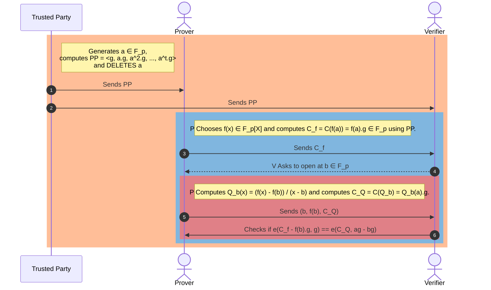

# KZG Commitments Unveiled: A Beginner's Guide 

## [DRAFT MODE - WORK IN PROGRESS]

## [TLDR](#tldr)
The KZG commitment scheme is like a cryptographic vault for securely locking away polynomials (mathematical equations) so that you can later prove you have them without giving away their secrets. It's like making a sealed promise that you can validate without ever having to open it up and show the contents. Using advanced math based on elliptic curves, it enables efficient, verifiable commitments that are a key part of making blockchain transactions more private and scalable. This scheme is especially important for Ethereum's upgrades, where it helps to verify transactions quickly and securely without compromising on privacy.

## [Motivation](#motivation)

### [ZKSNARKs](#zksnarks)
Learning about Polynomial Commitment Schemes (PCS) is important because they play a key role in creating Zero-Knowledge Succinct Non-Interactive Arguments of Knowledge (ZKSNARKs). ZKSNARKs are special cryptographic methods that allow someone (the prover) to show to someone else (the verifier) that they know a specific piece of information (like a number) without revealing that information. This is done by using PCS and Interactive Oracle Proofs (IOP) together.

*Modern ZKSNARK = Functional Commitment Scheme + Compatible Interactive Oracle Proof (IOP)*

PCS is a way to prove that you know a secret function (represented by a polynomial) without showing the function itself. It's like promising to show a secret recipe to someone, but you only show them the final dish without revealing the recipe. This is crucial for ZKSNARKs because it allows the prover to prove they know a secret function without revealing it.

IOP is another method that helps in proving that you know a secret value without revealing it. It's used along with PCS to make a ZKSNARK. The IOP helps in proving the knowledge, while PCS makes the proof short and easy to check. This combination allows for creating efficient ZKSNARKs that can be used in many areas, like blockchain and privacy-preserving computations.

To make ZKSNARKs, you need to choose a PCS and IOP that work well together. The PCS is used to commit to a polynomial and prove the evaluation of the polynomial at a certain point without revealing the polynomial. The IOP is used to create a proof of knowledge, which is then turned into a non-interactive proof using a method called the Fiat-Shamir heuristic. This makes it possible to generate and verify the proof without needing to communicate in real-time, making ZKSNARKs useful for blockchain and distributed systems.

### [Ethereum Danksharding](#ethereum-danksharding)
KZG commitment scheme has emerged as a pivotal technology in the Ethereum ecosystem, particularly in the context of Proto-Danksharding and its anticipated evolution into Danksharding. This commitment scheme is a cornerstone of many Zero-Knowledge (ZK) related applications within Ethereum, enabling efficient and secure verification of data without revealing the underlying information.

The adoption of KZG commitments in Proto-Danksharding and its future application in Danksharding represents a significant step towards Ethereum's full sharding implementation. Sharding is a long-term scaling solution for Ethereum, aiming to improve the network's scalability and capacity by dividing the network into smaller, more manageable pieces. The KZG commitment scheme plays a vital role in this process by facilitating the efficient verification of data across shards, thereby enhancing the overall security and performance of the Ethereum network.

Moreover, the KZG commitment scheme is not only limited to Ethereum but has broader applications in the blockchain and cryptographic communities. Its ability to commit to a polynomial and verify evaluations of the polynomial without revealing the polynomial itself makes it a versatile tool for various cryptographic protocols and applications. 

## [Goal](#goal)
Now that we are motivated to learn PCS, let us get started with defining what is our goal i.e. what is the exact problem we want to solve with KZG scheme. 

Say we have a function or polynomial $f(x)$ defined as $f(x) = f_0 + f_1x + f_2x^2 + \ldots + f_dx^t$. The degree of $f(x)$ is $t$.

Our main goal with KZG scheme is that we want to prove to someone that we know this polynomial without revealing the polynomial. What do we mean by without revealing by polynomial? We meant that without revealing the coefficients of the polynomial. 

In practice what we exactly do is that we prove that we know a specific evaluation of this polynomial at a point $x=a$. 

We write this, $f(a)$, for some $x=a$. 

## [What we need to know before we discuss KZG](#what-we-need-to-know-before-we-discuss-kzg)

There are some important concepts we need to know before we can move further to understand KZG scheme. Fortunately, we can get an Engineering level understanding of the KZG scheme from just enough high school mathematics. We will try to gain some intuition on advanced concepts and their important properties without knowing them intimately. This can help us see the KZG protocol flow without bogged down by the advanced mathematics.

We need to know:

### [Modular Arithmetic](#modular-arithmetic)
- Can you read a clock? Can you add/subtract two time values? In general can you do clock arithmetic? This is called Modular arithmetic. We only need to know how to add, subtract, multiply or divide numbers and apply modulus operation (the clock scale). 
- We usually write this mod $p$ to mean modulo $p$, where $p$ is some number. 

### [Finite Field of order prime p](#finite-field-of-order-prime)

A finite field of order prime $p$, we denote it by $\mathbb F_p$, is a special set of numbers, { $\{1, 2, 3, \ldots, p-1\}$ },  where you can do all the usual math operations (addition, subtraction, multiplication, and division, except by zero) and still follow the rules of arithmetic. 

The "order" of this set is the number of elements it contains, and for a finite field of order prime $p$, this number is a prime number. The most common way to create a $\mathbb F_p$ is by taking the set of all integers greathan or equal to $0$ and dividing them by $p$, keeping only the remainders. This gives us a set of numbers from $0$ to $p-1$ that can be used for arithmetic operations. For example, if $p = 5$, the set would be {0, 1, 2, 3, 4}, and you can add, subtract, multiply, and divide these numbers in a way that follows the rules of arithmetic. This set is a finite field of order 5, we denote this by $\mathbb F_5$, because it has exactly 5 elements, and it's a prime number.

When we do modular arithmetic operations in the finite field $\mathbb F_p$, we have a nice "wrap around" property i.e. the field behaves as if it "wraps around" after reaching $(p - 1)$. 

In genral, when we define a finite field, we define, the order $p$ of the field and an arithemetic operation like addition or multiplication. If it is addition, we denote the field by $(\mathbb F_p, +)$. If it is multiplication, we denote it by $(\mathbb F^*_p, +)$. The `*` is telling us to exclude the zero element from our field so that we can satisfy all the required properties of the finite field i.e. mainly we can divide the numbers and find inverse of all elements. If we include the zero element, we can't find the inverse of zero element.

### [Group](#group)
A Group is a similar concept as finite field with some small changes. In a Group, we only have one arithmetic operation on the set, usually addition or multiplication as opposed to in a finite field we have addition and multiplication both and this group must satisfy few properties which we will discuss below with an example. We denote a Group by ($\mathbb G, +)$ for a Group with addition as the group operation, ($\mathbb G^*, .)$ for Group with multiplication operation; the `*` is telling to exclude zero element to avoid division by zero.

In the next section we use an example to define a Group. This will help develop an intuition on when we call a set of numbers a Group.

### [Generator of a Group](#generator-of-a-group)
A generator is an element within a group that, when combined with itself repeatedly through the group's operation, can eventually produce every other element within the group. 

In mathematical sense, if you have a group ($\mathbb G, .)$  and an element $g$ in $\mathbb G$  we say that $g$ is a generator of $\mathbb G$ if the set of all powers of $g$, $(g, g^2, g^3, ...)$, is equal to $\mathbb G$ for a finite group, or covers all elements of $\mathbb G$ through this repeated operation in the case of an infinite group.

This concept is best explained with an example.

We will work with ($\mathbb G_7, +)$ of group elements { ${0,1,2,3,4,5,6}$ } and ($\mathbb G^*_7, .)$  of group elements { ${1,2,3,4,5,6}$ } with modulo $7$ to find the generator of the Groups.

**Generator of Additive Group**

Our set ($\mathbb G_7, +)$ with elements { ${0,1,2,3,4,5,6}$ } is a Group because it satisfies the definition of a Group.

**Closure:** When you add any two numbers in the set and take the remainder when divided by $7$, you end up with a result that's still in the set.
**Associativity:** For any numbers $a, b$ and $c$ in the set, $(a+b)+c$ is always the same as $a+(b+c)$, even with modulo $7$.
**Identity element:** The number $0$ acts as an identity element because when you add $0$ to any number in the set, you get the same number back.
**Inverse elements:** Every number in the set has an inverse such that when you add them together, you end up back at the identity element $0$. For example, the inverse of $3$ is $4$ because $3 + 4 = 7$, which is $0$ modulo $7$.

Now, for the generator. Since our group has a prime order $7$, any element except for the identity element $0$ is a generator. Let's pick the element $1$ as our generator i.e $g = 1$. Since we are working with an additive group, our group elements with generator g will be $\{0, g, 2g, 3g, 4g, 5g, 6g\}$.

Starting with $1$ and adding it to itself modulo $7$, we get:
- $1 + 1 = 2$ (which is $2*1$ modulo 7)
- $1 + 1 + 1 = 3$ (which is $3*1$ modulo 7)
- $1 + 1 + 1 + 1 = 4$ (which is $4*1$ modulo 7)
- $1 + 1 + 1 + 1 + 1 = 5$ (which is $5*1$ modulo 7)
- $1 + 1 + 1 + 1 + 1 + 1 = 6$ (which is $6*1$ modulo 7)
- $1 + 1 + 1 + 1 + 1 + 1 + 1 = 7$, which is $0$ modulo 7 (which is $7*1$ modulo 7)

As you can see, by repeatedly adding $1$ modulo $7$, we can generate every other element in the group. Hence, $1$ is a generator of the group ($\mathbb G_7, +)$. Similarly, we could pick $2, 3, 4, 5, or 6$ as our generator, and by performing repeated addition modulo $7$, we would still generate the entire group. This is a special property of groups with a prime number of elements.

**Generator of Multiplicative Group**
For the multiplicative group of integers modulo a prime $p$, the group ($\mathbb G_p, .$) consists of the integers { ${1, 2, 3, \ldots, p-1}$ }, where the operation is multiplication modulo $p$. We'll choose a small prime to make it simple, say $p = 7$. So, our group ($\mathbb G^*_7, .)$ under multiplication modulo $7$ consists of the elements { ${1, 2, 3, 4, 5, 6}$ }. Remember, division by zero element is excluded, that's why we have `*` in the notation.

Here's the group structure:

- **Closure:** The product of any two elements, when reduced modulo $7$, is still an element of the set.
- **Associativity:** For any numbers $a, b, c$ in the set, $(a \cdot b) \cdot c$ is always the same as $a \cdot (b \cdot c)$, even when considering modulo $7$.
- **Identity element:** The number $1$ acts as an identity element because when you multiply any number in the set by $1$, you get the same number back.
- **Inverse elements:** Every number in the set has a multiplicative inverse in the set such that when you multiply them together, you get the identity element $1$. For example, the multiplicative inverse of $3$ is $5$ because $3 \cdot 5 = 15$, which is $1$ modulo $7$.

Let's verify that each element is indeed a generator by multiplying it repeatedly modulo $7$:

- Starting with $2$, we multiply by $2$ each time and take the result modulo $7$:
  - $2^1 = 2$
  - $2^2 = 4$
  - $2^3 = 8 \equiv 1 \mod 7$
  - $2^4 = 16 \equiv 2 \mod 7$ (and here we cycle back to the beginning, showing that $2$ is not a generator)

- Let's try $3$:
  - $3^1 = 3$
  - $3^2 = 9 \equiv 2 \mod 7$
  - $3^3 = 27 \equiv 6 \mod 7$
  - $3^4 = 81 \equiv 4 \mod 7$
  - $3^5 = 243 \equiv 5 \mod 7$
  - $3^6 = 729 \equiv 1 \mod 7$ (and since we've reached the identity after hitting all elements, $3$ is a generator)

You can verify that $5$ is also a generator for our multiplicative group ($\mathbb G^*_7, .)$ modulo $7$. 

In the next section, we will learn how generators enable the KZG commitment scheme to function as an efficient, secure, and verifiable method of committing to polynomials, making it a powerful tool for cryptographic protocols, particularly in blockchain technologies where these qualities are very important.

### [Why choosing a prime number for modulo operations in finite fields](#why-choosing-a-prime-number-for-modulo-operations-in-finite-fields)

Choosing a prime number as the modulus for operations in a finite field offers several benefits and simplifies various aspects of field arithmetic:

1. **Well-defined Division:** In a finite field, every non-zero element must have a multiplicative inverse. If the modulus is prime, every number in the set  { ${1, 2, 3, \ldots, p-1}$ } has a multiplicative inverse modulo $p$. This property allows for well-defined division operations within the field, which wouldn't be possible if the modulus wasn't prime (except in special cases like Galois fields of order $p^n$, where $p$ is prime).

2. **Simplicity of Construction:** When the modulus is a prime number, the field's construction is straightforward. The elements of the field are simply the set of integers  { ${1, 2, 3, \ldots, p-1}$ }, and the field operations (addition, subtraction, multiplication, and division) are performed modulo $p$. For non-prime moduli, constructing a field requires more complex structures, such as polynomial rings.

3. **Guaranteed Field Properties:** The use of a prime modulus guarantees the satisfaction of field properties. A finite field (also known as a Galois field) is a field that contains a finite number of elements. For a set to be a field, it must satisfy several properties, including the existence of additive and multiplicative identities, the existence of additive and multiplicative inverses for every element, and the commutative, associative, and distributive laws for addition and multiplication. A prime modulus ensures all these properties are met.

4. **Uniform Distribution of Non-zero Elements:** In a finite field with a prime modulus, the non-zero elements have a uniform distribution with respect to multiplication. This means that the multiplication table of the field does not have any 'gaps' and every element appears exactly once in each row and column of the multiplication table (except the row and column for the zero element).

5. **Simplified Algorithms:** Many algorithms in number theory and cryptography are simpler and more efficient when working with prime fields. For example, finding multiplicative inverses can be done efficiently using the Extended Euclidean Algorithm, and there's no need for complex polynomial arithmetic that is necessary in non-prime fields.

6. **Cryptographic Security:** In the context of cryptography, the difficulty of certain problems, such as the discrete logarithm problem, is well-understood in prime fields. This difficulty is crucial for the security of cryptographic systems. For composite moduli (especially when the factors are not known), the structure can introduce vulnerabilities or make the problem's difficulty less predictable.
7. **Optimization in Computation:** Some prime numbers, like 31 or primes of the form $2^n - 1$, are easily optimized by CPUs for multiplication operations. This optimization can lead to faster computation times, which is beneficial in applications where performance is a critical factor.

Using a prime number as the modulus for finite fields simplifies the field arithmetic and ensures that all field properties are satisfied, which is essential for both theoretical and practical applications, particularly in cryptography.

### [Cryptographic Assumptions needed for KZG Scheme](#cryptographic-assumptions-needed-for-kzg-scheme)

In order to work with KZG commitment scheme, we need two additional assumptions. We won't go deep into why these assumptions are needed but we will give an intuition to why these cryptographic assumptions are needed to make KZG more secure.

**Discrete Logarithm**

Say we have a generator $g$ in the group $\mathbb G^\*_p$ and $a$ is any element in the finite field $\mathbb F^*_p$ and $g^a$ is some element in the group $\mathbb G^\*_p$. The Discrete Logarithm assumption says that it is practically impossible to find $a$, for given $g$ and $g^a$. This means we can't easily find the exponent $a$ that will give us these elements.

**Developing an intuition for Discrete Logarithm Problem**

Imagine you have a special kind of lock that works with numbers (let's call this lock a "generator", and we'll name it $g$). This lock is part of a magic set of locks and keys, all living in a magical land called $\mathbb G^\*_p$. Now, you pick a secret number $a$ and use it to turn your lock $g$ a certain number of times. The lock ends up in a new position, let's call this $g^a$.

If someone walks by and sees your lock at $g^a$, even if they know it started at $g$ and the magical land it belongs to, figuring out how many times you turned it (finding your secret number $a$) is incredibly difficult. 

In simpler terms, the Discrete Logarithm problem tells us that even though it's easy to turn the lock around if you know your secret number, going backwards — seeing the result and trying to guess the secret number — is like finding a needle in a haystack. This concept is crucial in cryptography, ensuring that some secrets are incredibly hard to uncover.

**Strong Diffie-Hellman**

Say we have a generator $g$ in the group $\mathbb G^\*_p$ and $a, b$ are any elements in the finite field $\mathbb F^*_p$ and $g^a$, $g^b$ are some elements in the group $\mathbb G^\*_p$. The Strong Diffie-Hellman assumption says that $g^a$ and $g^b$ are indistinguishable from $g^{ab}$. This means we can't extract any extra information aboout $g^{ab}$ given $g^a$ and $g^b$.

**Developing an intuition for Strong Diffie-Hellman**

Imagine you're in a world, famous for its magical cookies, and there's a secret ingredient (our "generator", $g$) that makes them special. Two master bakers, Alice and Bob, each know a unique twist to using this ingredient, represented by their own secret recipes $a$ and $b$, respectively.

When Alice bakes her cookies using her secret recipe, she creates a special batch $g^a$. Bob does the same with his recipe, resulting in another unique batch $g^b$.

Now, suppose Alice and Bob decide to collaborate and combine their secret recipes to create a super-secret batch of cookies $g^{ab}$. The Strong Diffie-Hellman assumption is saying that even if someone has tasted both Alice's and Bob's individual batches, they can't decipher what their combined super-secret batch would taste like. The flavors of the combined recipe are indistinguishable from any other batch without knowing the exact combination of Alice's and Bob's recipes.

So, in essence, the Strong Diffie-Hellman assumption tells us that just knowing the outcomes of individual secrets (recipes) doesn't help anyone crack the result of combining those secrets. This is a cornerstone of secure communication, ensuring that even if someone knows the separate pieces, the combined secret remains safe and unguessable.

### [Pairing Function](#pairing-function)
Say we have a generator $g$ in the group $\mathbb G^\*_p$ and $a, b$ are any elements in the finite field $\mathbb F^*_p$ and $g^a$, $g^b$ are some elements in the group $\mathbb G^\*_p$. 

A pairing function is a special kind of function that takes two inputs and produces a single output with two important properties, biliner and non-degenrate.

Bilinear means, we can move around in a reversible way. 
Non-degenerate means, if we apply pairing function to teh same element, it doesn't result in the identity element of the Group.

Let's define these properties a bit more rigorously.

A pairing function $e:$  $\mathbb G_1 X \mathbb G_2 \rightarrow \mathbb G_T$  such that it satisfies,

Bilinear property: $e(g^a, g^b) = e(g, g^{ab}) = e(g^{ab}, g) = e(g,g)^{ab}$

Non-degenerate property: $e(g,g) \neq 1$, means the output is not an identity element.

When $\mathbb G_1$ and $\mathbb G_2$ are the same Group, we call this symmetric pairing function. Otherwise, it is an assymetric pairing function. 

**Developing an intuition for Pairing function**

Imagine two separate islands, each inhabited by a unique species of magical creatures. The first island is home to Unicorns, each with a distinct color, and the second island is inhabited by Dragons, each with a unique fire color. A pairing function is like a magical bridge that connects a Unicorn with a Dragon, creating a unique, new magical creature, a Dracorn, that embodies characteristics of both.

Here's how to think about this pairing function without getting bogged down by technicalities:

- **Two Groups:** Think of the Unicorns and Dragons as belonging to two different groups (in mathematical terms, these are usually called groups $\mathbb G_1$ and $\mathbb G_2$.
- **Pairing Function:** The magical bridge acts as the pairing function. When a Unicorn and a Dragon meet on this bridge, the pairing function combines them into a Dracorn. This Dracorn has a special glow that uniquely corresponds to the combination of that specific Unicorn and Dragon (reversable).
- **Unique Outcome:** Just like every Unicorn and Dragon pair produces a Dracorn with a unique glow, in mathematics, a pairing function takes one element from each group and produces a unique output in a third group (often denoted as $\mathbb G_T$).

**Why is this magical?** Because even though there are countless possible combinations of Unicorns and Dragons, each combination (pairing) produces a unique Dracorn. This is powerful in cryptography because it allows for complex operations that underpin many security protocols, ensuring that each combination is distinct and traceable to its original pair.

**In simpler terms,** imagine you have two sets of keys (Unicorns and Dragons), and when you combine one key from each set, you get a unique lock (Dracorn). The magic is in how predictable yet secure this combination is, allowing for secure interactions that rely on the certainty of these unique outcomes without revealing the original keys.

Pairing functions enable advanced cryptographic techniques, such as those used in certain types of digital signatures and encryption, by allowing this kind of "cross-group" interaction to occur securely and predictably.

## [Important Properties of Commitments](#important-properties-of-commitments)

Commitment schemes are like the secret-keeping wizards of the digital world. They let someone make a promise about a piece of information (we'll call this the secret message) in a way that ties them to their promise without letting anyone else know what the secret is. Here's how it works:

1. **Making the Promise (Commitment):** You decide on a secret message and use a special spell (the commitment scheme) to create a magic seal (the commitment). This seal proves you have a secret, but it keeps the secret hidden.

2. **Keeping It Secret (Hiding):** Even though you've made this seal, nobody else can see what your secret message is. It's like you've locked it in a chest and only you have the key.

3. **Proving You're Honest (Binding):** The magic of the commitment is that you can't change your secret message later without breaking the seal. This means once you've made your commitment, you're bound to it.

Later, when the time comes to reveal your secret, you can show the original message and prove that it matches the seal you made before. This lets someone else (the verifier) check and confirm that your secret message is the same one you committed to in the beginning, proving that you kept your word.

The Binding and Hiding properties are extremely important and they tie back to the above cryptographic assumptions we made with the Discrete Logarithm and Strong Diffie-Hellman assumptions.

But for now, we don't need to go deep into the technicalities. 

With this background, we are ready to explain KZG protocol flow and understand its construction.

## [KZG Protocol Flow](#kzg-protocol-flow)

Let us reiterate on what is the problem we are solving with KZG protocol.

We want prove that we know a specific evaluation of a function or polynomial at a point $x=a$ without revealing it.

In the KZG commitment scheme, the roles of the Trusted Third Party, Prover, and Verifier are critical to its function and security. Here's how each contributes to the process:

1. **Trusted Third Party (Setup Authority):** This entity is responsible for the initial setup phase of the KZG scheme. They generate the public parameters (PP) or Common Reference String (CRS) that will be used in the commitments and proofs, based on a secret that only they know. This secret is crucial for the construction of commitments but must be discarded (or kept extremely secure) after the setup to ensure the system's integrity. The trust in this party is fundamental because if the secret is mishandled or leaked, it could compromise the entire system.

2. **Prover:** The Prover is the one who wants to commit to a certain piece of data (like a polynomial) without revealing it. Using the CRS provided by the Trusted Third Party, the Prover computes a commitment to their data. When it's time to prove certain properties of their data (like a polynomial evaluation at a specific point), the Prover can generate a proof based on their commitment. This proof shows that their data has certain properties without revealing the data itself.

3. **Verifier:** The Verifier is the party interested in checking the Prover's claims about their secret data. The Verifier uses the proof provided by the Prover, along with the CRS from the Trusted Third Party, to verify that the Prover's claim about their data is true. This is done without the Verifier ever directly accessing the secret data. The strength of the KZG scheme ensures that if the proof verifies correctly, the Verifier can be confident in the Prover's claim, assuming the Trusted Third Party has correctly performed their role and the secret has not been compromised.

This interaction between the three parties allows for secure and efficient verification of data properties in a variety of cryptographic applications, including blockchain protocols and secure computation, providing a balance between transparency and privacy.

Below is a detailed sequence diagram that explains the flow in a typical KZG protocol.

### [Trusted Setup](#trusted-setup)
A trusted third party picks a random element $a \in \mathbb{F}_p$. They compute the public parameter (PP) or common reference string (CRS), as < $g, {a^1}.g, {a^2}.g, \ldots, {a^t}.g$ >. Then, they **delete** $a$. This step of deleteing $a$ is extremely important to secure the system.

Then, the trusted party sends the public paramters to the Prover and the Verifier.

In practice, this process is wrapped around a multi-party computation (MPC) where a secret is generated in such a way that, as long as at least one participant remains honest, the randomness of the secret can be guaranteed. 

The trusted setup is a one-time procedure that generates a piece of data necessary for the cryptographic protocol to function. This data must be used every time the protocol is run, but once generated and the secrets are forgotten, no further participation from the creators of the ceremony is required. The trust in the setup comes from the fact that the secrets used to generate the data are securely discarded after the setup, ensuring that the data remains secure for future use

Modern protocols often use a powers-of-tau setup, which involves hundreds of participants. The security of the final output depends on the honesty of at least one participant who does not publish their secret. This approach is considered "close enough to trustless" in practice, making it a practical solution for cryptographic protocols that require a trusted setup

### [Initial Configuration](#initial-configuration)

Say the Prover has a function or polynomial $f(x)$ defined as $f(x) = f_0 + f_1x + f_2x^2 + \ldots + f_dx^t$ in a finite field $\mathbb F_p$. The degree of $f(x)$ is $t$ which is less than $p$, the order of the finite field $\mathbb F_p$.

We often denote this as $f(x) \in \mathbb{F}_p[x]$.

$\mathbb{G}_p$ is an Elliptic Curve group of order $p$ with a generator $g$.

Often, the prime order $p$ is choosen such that $p \gt 2^k$, for some security parameter k. The prime number $p$ is very large in practice.

Prover also picks a pairing function that satisfies both bilinear and non-degenerate properties. The pairing is denoted as below:

$e:$  $\mathbb G_1 X \mathbb G_2 \rightarrow \mathbb G_T$ 

To simplify this step, Prover picks a polynomial $f(x) \in \mathbb{F}_p[x]$, the degree of $f(x)$ is at most $t$ which is less than $p$, the order of the finite field $\mathbb{F}_p$. Prover also picks a pairing function $e$ on the Elliptic Curve group $\mathbb{G}_p$.

### [Commitment of the Polynomial](#commitment-of-the-polynomial)

Say, the commitment of the polynomial $f(x)$ is denoted as $C_f$. The commitment is like hash function. 

So $C_f = {f(a)} \cdot g  = {(f_0 + f_1a + f_2a^2 + \ldots + f_ta^t)} \cdot g$. Here $f(a)$ is the polynomial evaluted at $x=a$.

Though, the Prover doesn't know $a$, he or she can still cmpute the commitment of the polynomial at $x=a$.

So we have, $C_f = {f(a)} \cdot g  = {(f_0 + f_1a + f_2a^2 + \ldots + f_ta^t)} \cdot g$.

$C_f =  {f_0} \cdot g + {f_1a} \cdot g + {f_2a^2} \cdot g + \ldots + {f_ta^t} \cdot g $.

$C_f =  {f_0} \cdot g +  {f_1} \cdot (ag) + {f_2} \cdot ({a^2}g) + \ldots  + {f_t} \cdot ({a^t}g)$.

From the CRS, the Prover knows these values < $g, {a^1}.g, {a^2}.g, \ldots, {a^t}.g$ >, he or she can compute this value as commitment of the polynomial, $C_f$ and sends to the Verifier.

### [Opening of the Polynomial](#opening-of-the-polynomial)

Upon receiving a commitment to a polynomial, denoted by $C_f$, from the Prover, the Verifier takes the next step in the protocol by selecting a random point, which we'll call $b$, from the field $\mathbb F_p$. The Verifier then requests the Prover to open or reveal the value of the polynomial at this specific point.

**What does 'opening the polynomial' mean?**
Opening the polynomial at $x=b$ involves calculating the value of the polynomial at that point, which is mathematically represented as $f(b)$. This is done by evaluating the polynomial using the chosen point $b$:

$f(b) = f_0 + f_1b + f_2b^2 + \ldots + f_tb^t$.

Let's assume that this computation results in $f(b) = d$. The Prover's task is now to provide the Verifier with an Evaluation Proof, which is evidence that $f(b)$ truly equals $d$.

Let's unpack this step by step. 

**Calculating the Evaluation Proof:**
The Prover determines the Quotient polynomial, which we will denote as $Q(x)$, and computes a commitment to it. This step is essential for creating a verifiable proof. Since we know $f(b)=d$, the polynomial $(f(x)−d)$ will have a root at $x=b$, meaning that $(f(x)−d)$ is divisible by $x−b$ with no remainder—this is a consequence of Little Bezout’s Theorem.

Expressed in mathematical terms, the Quotient polynomial is:
$Q(x) = \frac{f(x) - f(b)}{x - b} = \frac{f(x) - d}{x - b}$

The commitment to the Quotient Polynomial, $Q(x)$, is represented by $C_Q$. Using the Common Reference String (CRS) provided during the Trusted Setup, the Prover calculates $C_Q$:
$C_Q = {Q(a)} \cdot g$.

The Prover can calculate $C_Q$ as long as $(f(x) - f(b))$ is divisible by $(x−b)$. If this were not the case, $Q(x)$ would not be a proper polynomial i.e. the Quotient polynomial will have a denominator and some negative exponents, and the Prover could not compute the Evaluation Proof $C_Q$ using only the CRS.

Finally, the Prover sends the tuple < $b, f(b), C_Q$ > to the Verifier, completing this stage of the protocol.

### [Verification Proof](#verification-proof)
Let's first summarize what data does the Verifier has so far in the protocol. 

**Data in hand:** The Verifier knows:
- The commitment of the polynomial, $C_f$.
- The opening point $b$.
- The value of the polynomial at $b$, denoted as $f(b)$.
- The commitment to the Quotient polynomial at $b$, denoted as $C_Q = {Q(a)} \cdot g$.

**Properties of a commitment scheme:**
- **Completeness:** A commitment scheme is said to be **complete** if anything which is true is provable. 
- **Soundness:** It is said to be **sound** if everything which is provable is true - i.e. anything which is false cannot be proven by the scheme.

**Quotient polynomial and verification:**

Recall that the Quotient polynomial is given by
$Q(x) = \frac{f(x) - f(b)}{x - b} = \frac{f(x) - d}{x - b}$.

So, $(x - b) \cdot Q(x) = f(x) - d$

Evaluating this at $x=a$, we get
$(a - b) \cdot Q(a) = f(a) - d$

Multiplying both sides by the generator $g$, we get

$(a−b) \cdot Q(a) \cdot g = f(a) \cdot g − d \cdot g$

Now, the Verifier knows that $C_Q = Q(a) \cdot g$ and $C_f = f(a) \cdot g$.

So substituting, we get

$(a−b) \cdot C_Q = C_f − d \cdot g$

If the verifier can confirm the validity of the above equality, it means the commitment has been verified. However, since the verifier is unaware of the value of $a$, they cannot directly validate the truth of this equality.

However, the Verifier can use Elliptic Curve Pairings as outlined above to verify the equality constraint even without knowing $a$. Remember that the pairing function is denoted as:

$e:$  $\mathbb G_1 X \mathbb G_2 \rightarrow \mathbb G_T$  such that it satisfies,

Bilinear property: $e(g^a, g^b) = e(g, g^{ab}) = e(g^{ab}, g) = e(g,g)^{ab}$

Non-degenerate property: $e(g,g) \neq 1$, means the output is not an identity element.

Let us for now, use a symmetric pairing function where $e:$  $\mathbb G X \mathbb G \rightarrow \mathbb G_T$ 

The Prover has to check he equality $(a−b) \cdot C_Q = C_f − d \cdot g$.

The pairing function takes any two elements from the group $\mathbb G$ and maps it to an element in $\mathbb G_T$. 

- A commitment, like $C_f$ or $C_Q$, is obtained by multiplying a number (a scalar) with the group's generator, $g$.
- Since both $C_f$ and $C_Q$) are the result of this operation, they belong to the group $\mathbb G$.
- When we multiply $C_Q$ by the difference of two numbers $a$ and $b$, which is also a scalar, the result, $(a−b) \cdot C_Q$, stays within the group $\mathbb G$.
- Similarly, $C_f$ is a group element, and so is $d \cdot g$ because it's the generator multiplied by a scalar.
- Subtracting $d \cdot g$  from $C_f$ gives us another element in the group, $C_f − d \cdot g$.
- All these resulting elements are part of the group $\mathbb G$ and can be used in the pairing function.

So, applying the pairing function on the both sides using the generator $g$ as the second parameter, the equality constraint becomes, 

$e((a−b) \cdot C_Q, g) = e(C_f − d \cdot g, g)$

We still can't calculate $a-b$ as nobody knows $a$. But we can use the bilinear property of the pairing function 

$e(g^a, g^b) = e(g, g^{ab}) = e(g^{ab}, g) = e(g,g)^{ab}$

So we can rewrite the equality constraint as
$e(C_Q, (a−b) \cdot g) = e(C_f − d \cdot g, g)$
$e(C_Q, a \cdot g − b \cdot g) = e(C_f − d \cdot g, g)$

Though the Verifier doesn’t know $a$, he or she knows $a \cdot g$ from the Common Reference String. So now the Verifier can check whether the above equality is true or not. This ends the verification of the Evaluation Proof.

**Full Opening VS Partial Opening of the polynomial**

- **Full Open Process:**
  - The Prover sends the complete polynomial to the Verifier.
  - Using the CRS, the Verifier independently computes the polynomial's commitment.
  - The Verifier then checks if this independently computed commitment matches the one originally sent by the Prover.

- **Partial Open Process in KZG:**
  - Instead of opening the whole polynomial, the Prover can opt for a partial open.
  - This means the Prover reveals the polynomial's value at a single specific point.
  - This partial revelation is known as the Evaluation Proof.

## [KZG by Hands](#kzg-by-hands)

### [KZG by Hands - Initial Configuration](#kzg-by-hands---initial-configuration)

### [KZG by Hands - Trusted Setup](#kzg-by-hands---trusted-setup)

### [KZG by Hands - Commitment of the polynomial](#kzg-by-hands---commitment-of-the-polynomial)

### [KZG by Hands - Opening of the Polynomial](#kzg-by-hands---opening-of-the-polynomial)

### [KZG by Hands - Verification](#kzg-by-hands---verification)

## [Security of KZG - Deleting the toxic waste](#security-of-kzg---deleting-the-toxic-waste)

## [Implementing KZG in Sagemath](#implementing-kzg-in-sagemath)

## [KZG using Assymetic Pairing Fuctions](#kzg-using-assymetic-pairing-fuctions)

## [KZG Batch Mode Single Polynomial, multiple points](#kzg-batch-mode-single-polynomial-multiple-points)

## [KZG Batch Mode Multiple Polynomials, same point](#kzg-batch-mode-multiple-polynomials-same-point)

## [KZG Batch Mode Multiple Polynomials, multiple points](#kzg-batch-mode-multiple-polynomials-multiple-points)

