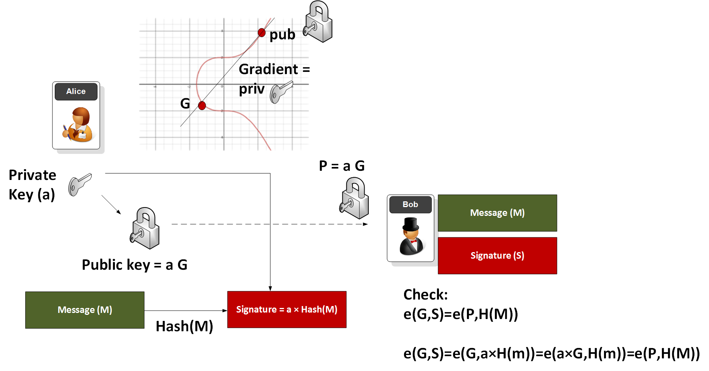
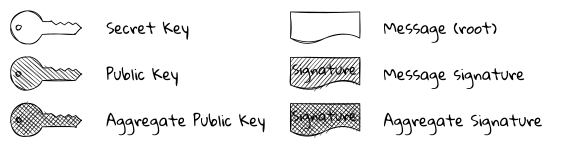
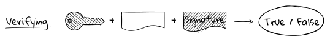

<!-- @format -->

# Boneh-Lynn-Shacham (BLS) signature

### TLDR;

- Proof of stake protocols use digital signatures to identify their participants and hold them accountable.
- BLS signatures can be aggregated together, making them efficient to verify at large scale.
- Signature aggregation allows the beacon chain to scale to hundreds of thousands of validators.
- Ethereum transaction signatures on the execution (Eth1) layer remain as-is.

BLS is a digital signature scheme with aggregation properties. Given set of signatures (_signature_1_, ..., _signature_n_) anyone can produce an aggregated signature. Aggregation can also be done on secret keys and public keys. Furthermore, the BLS signature scheme is deterministic, non-malleable, and efficient. Its simplicity and cryptographic properties allows it to be useful in a variety of use-cases, specifically when minimal storage space or bandwidth are required. This page will cover general idea and Math behind BLS signatures, further cover BLS in context of Ethereum.

## How BLS works?

At the core of BLS signatures is the concept of bilinear mapping through pairings on elliptic curves. A key component is a pairing function $e$, defined between two groups derived from elliptic curves:

$$e: G_1 \times G_2 \rightarrow G_T$$

This function is efficiently computable and must satisfy bilinear properties:

- For all $P,Q$ in $G_1$ and $a$ in integers, bilinearity is defined as:
  $$ e(aP, Q) = e(P, Q)^a $$
  $$ e(P, aQ) = e(P, Q)^a $$

- Additionally, it must distribute over addition:
  $$ e(P + Q, R) = e(P, R) \times e(Q, R) $$
  $$ e(P, Q + R) = e(P, Q) \times e(P, R) $$

These properties enable the cryptographic mechanisms necessary for functions like signature aggregation, which is a pivotal feature in blockchain applications and cryptographic consensus.

#### Transition from ECDSA to BLS

Traditional ECDSA signatures, as commonly used in Bitcoin, depend heavily on the randomness of number generation and necessitate verification of all involved public keys, which can be computationally intensive. This prompted a shift towards the Schnorr signature scheme, which allows for some aggregation but still lacks the full efficiencies gained from BLS.

BLS signatures, employing bilinear pairings, offer robust protection against certain cryptographic attacks and produce shorter signatures. Unlike Schnorr, BLS does not rely on random number generation for securing signatures, making it inherently more secure against randomness-related vulnerabilities.

#### Example of BLS Signature Generation and Verification:

<figure class="diagram" style="width:80%">



<figcaption>

_Visual Aid to understand how BLS sigatures work_

</figcaption>
</figure>

Consider Alice creating a BLS signature. She starts with her private key $a$, and computes her public key $P$ using a generator point $G$ on the elliptic curve:

$$ P = aG $$

She hashes her message and maps this hash to a point on the curve, $H(M)$. Her signature $S$ is then:

$$ S = a \times H(M) $$

The signature is verified using the pairing function:

$$ e(G, S) = e(P, H(M)) $$

This can be proven as: $$e(G,S)=e(G,a×H(m))=e(a×G,H(m))=e(P,H(M))$$ where $G$ is the generator point on the elliptic curve.

This equation proves that the signature was indeed created by the holder of the private key corresponding to $P$.

#### Example

For BLS signatures using a curve like BLS12-381 example values would look like:

```
Message: "Hello"
Secret Key: 26daf744780a51072aa8de191259bf7ff080b8457512cfd0eedfb4f8c71b131d
Public Key: bfdab807246849b76b7bdf5229619b9ccb33713633644a48b7ab3a7e67af7c1ae9d597a1c0fac6f61e63c1278b26c2f527be3d58bce95451b36f0c692ee90e1f
Signature: dee15784b458419b4b8bbdbb13838da13c27dccab6ef50f0dcb4ff7352048c0b
```

For ECDSA using a curve like secp256k1, there's an $R$ and an $S$ value, which produces a longer signature whose example values would look like:

```
Message: "Hello"
Private Key: 2aabe11b7f965e8b16f525127efa01833f12ccd84daf9748373b66838520cdb7
Public Key (EC Point):
    x: 39516301f4c81c21fbbc97ada61dee8d764c155449967fa6b02655a4664d1562
    y: d9aa170e4ec9da8239bd0c151bf3e23c285ebe5187cee544a3ab0f9650af1aa6
Signature:
    R: 905eceb65a8de60f092ffb6002c829454e8e16f3d83fa7dcd52f8eb21e55332b
    S: 8f22e3d95beb05517a1590b1c5af4b2eaabf8e231a799300fffa08208d8f4625
```

### Aggregation in BLS:

A major advantage of BLS is the ability to aggregate multiple signatures into a single compact signature. This is particularly useful in scenarios involving multiple transactions or signers, greatly reducing the blockchain space and computational power needed for verifications. For example if there are 100 transactions, where signature for each one is represented by $S_i$ and each are associated with a public key of $P_i$ (and a message $M_i$), rather than storing 100 separate signatures, BLS allows combining them into one:

$$ S = S*1 + S_2 + \ldots + S*{100} $$

which can then verified with (using a multiply operation):
$$e(G,S)=e(P_1,H(M_1))⋅e(P_2,H(M_2))⋅…⋅e(P_{100},H(M_{100}))$$

Verification of this aggregated signature would involve a corresponding aggregation of public keys and message hashes, maintaining the integrity and non-repudiation of all individual signatures.

## BLS Signatures in Ethereum

With respect to Blockchain, digital signatures typically leverage elliptic curve groups. Ethereum primarily employs [ECDSA](/wiki/Cryptography/ecdsa.md) signatures using the [secp256k1](https://en.bitcoin.it/wiki/Secp256k1) curve, while the beacon chain protocol adopts BLS signatures based on the [BLS12-381](https://hackmd.io/@benjaminion/bls12-381) curve. Unlike ECDSA, BLS signatures utilize a unique feature of certain elliptic curves known as "[pairing](https://medium.com/@VitalikButerin/exploring-elliptic-curve-pairings-c73c1864e627)." This allows for the aggregation of multiple signatures, enhancing the efficiency of the consensus protocol. While ECDSA signatures are [much quicker](https://datatracker.ietf.org/doc/html/draft-irtf-cfrg-bls-signature-04#section-1.1) to process, the aggregative capability of BLS signatures offers significant advantages for blockchain scalability and consensus efficiency.

The process to create and verify a BLS signature is straightforward, involving a series of steps that can be explained through diagrams, descriptions, and mathematical principles, although understanding the mathematical detail is not essential for practical application.

There are **4** component pieces of data within the BLS digital signature process.

- **The secret key:** Every participant in the protocol, specifically a validator, possesses a secret key, also referred to as a private key. This key is crucial for signing messages and maintaining the confidentiality of the validator's actions within the network.
- **The public key:** Derived directly from the secret key using cryptographic methods, the public key, while linked to the secret key, cannot be reverse-engineered from it without extreme computational effort. It serves as the public identity of the validator within the protocol and is accessible to all participants.
- **The message:** In Ethereum, messages consist of byte strings whose structure and purpose will be explored in further detail later in the context. Initially, understand these messages as basic data units processed within the blockchain protocol.
- **The signature:** The signature is the result of the cryptographic process where the message is combined with the secret key. This signature uniquely identifies that a message was authored by the holder of the secret key. By verifying the signature with the corresponding public key, one can confirm that the message originated from a specific validator and has not been altered post-signing.

In Mathematical terms, We use 2 subgroups of BLS12-381 elliptic curve: $G_1$ defined over a base field $F_q$, and $G_2$ defined over the field extension $F_{q^2}$. The order of both the subgroups is $r$, a 77 digit prime number. The (arbitrarily chosen) generator of $G_1$ is $g_1$, and of $G_2$ is $g_2$.

1. The secret key, $sk$, is a number between $1$ and $r$ (technically the range includes $1$, but not $r$. However, very small values of $sk$ would be hopelessly insecure).
2. The public key, $pk$, is $[sk]g_1$ where the square brackets represent scalar multiplication of the elliptic curve group point. The public key is therefore a member of the $G_1$ group.
3. The message, $m$ is a sequence of bytes. During the signing process this will be mapped to some point $H(m)$ that is a member of the $G_2$ group.
4. The signature, $\sigma$, is also a member of the $G_2$ group, namely $[sk]H(m)$.

<figure class="diagram" style="margin-left:5%; width:80%">



<figcaption>

_The key to the keys. This is how we will depict the various components in the diagrams below. Variants of the same object are hatched differently. The secret key is mathematically a scalar; public keys are $G_1$ group members; message roots are mapped to $G_2$ group members; and signatures are $G_2$ group members._

</figcaption>
</figure>

### Key pairs

A key pair is a secret key along with its public key. Together these irrefutably link each validator with its actions.

Each validator is equipped with atleast 1 primary "signing key" used for routine operations like creating blocks, making attestations etc. Depending on their withdrawal credentials, a validator may also have a secondary "withdrawal key," which is stored offline for added security.

The secret key should be randomly generated within the range $[1,r)$, adhering to the [EIP-2333](https://github.com/ethereum/EIPs/blob/master/EIPS/eip-2333.md) standard, which recommends using the [`KeyGen`](https://datatracker.ietf.org/doc/html/draft-irtf-cfrg-bls-signature-04#section-2.3) method from the draft IRTF BLS signature standard. Although compliance with this method is not mandatory, deviating from it is generally discouraged. Most stakers generate their keys using the [`eth2.0-deposit-cli`](https://github.com/ethereum/eth2.0-deposit-cli) tool from the Ethereum Foundation. For security, key pairs are typically stored in password-protected [EIP-2335](https://github.com/ethereum/EIPs/blob/master/EIPS/eip-2335.md) keystore files.

The secret key, $sk$, is a 32-byte unsigned integer. The public key, $pk$, is represented as a point on the $G_1$ curve and serialized in a compressed format as a 48-byte string within the protocol.

<a id="img_bls_setup"></a>

<figure class="diagram" style="margin-left:20%; width:50%">


<figcaption>

_A validator randomly generates its secret key. Its public key is then derived from that._

</figcaption>
</figure>

### Signing in the Beacon Chain

In Ethereum's beacon chain, the only messages that get signed are the [hash tree roots](https://eth2book.info/capella/part2/building_blocks/merkleization/) of objects. These roots, called "signing roots," are 32-byte strings. The [`compute_signing_root()`](/wiki/CL/functions#compute_signing_root) function integrates the hash tree root with a specific "domain," enhancing the security.

<!-- define and link context (domain separation and forks) in CL-->

The signing root is mapped onto an elliptic curve point within the $G_2$ group. This mapping, $H(m)$, where $m$ is the signing root, transforms the hash into a format suitable for cryptographic operations. This complex process is outlined in the [Hash-to-Curve draft standard](https://datatracker.ietf.org/doc/draft-irtf-cfrg-hash-to-curve/), but typically, developers rely on cryptographic libraries to manage this step efficiently.

#### Signature Creation:

The actual signing involves multiplying the $G_2$ point $H(m)$ by the signer's secret key $sk$:

$$
\sigma = [sk]H(m)
$$

The signature $\sigma$ thus generated is also part of the $G_2$ group and is typically compressed into a 96-byte string for practical use.

<figure class="diagram" style="margin-left:10%; width:65%">


<figcaption>

_A validator uses their secret key to sign a message, producing a unique digital signature_

</figcaption>

</figure>

### Verifying Signatures

To validate a signature, the public key of the corresponding validator is necessary. This key is readily available in the beacon state, accessible by the validator’s index, ensuring that key retrieval is straightforward and reliable.

Verification is streamlined: input the message, public key, and signature into the verification process. If the signature is authentic—matching both the public key and the message—it is accepted; otherwise, it’s rejected due to potential corruption, incorrect key usage, or message tampering.

Formally, this verification utilizes elliptic curve pairings. For the BLS12-381 curve, the pairing takes a point $P$ from $G_1$ and a point $Q$ from $G_2$, resulting in a point from group $G_T$:

$$
e: G_1 \times G_2 \rightarrow G_T
$$

Pairings are expressed as $e(P, Q)$ and are crucial for validating the correspondence between the signature and the public key:

$$
e(g_1, \sigma) = e(pk, H(m))
$$

This checks whether the message signed with the secret key $sk$ matches the observed signature $\sigma$, using the fundamental properties of [pairings](/wiki/Cryptography/bls#how-bls-works).

<figure class="diagram" style="margin-left:10%; width:80%">



<figcaption>

_Verification uses the validator's public key and the original message to confirm the authenticity of the signature._

</figcaption>

</figure>

**Verification Output**: The process returns `True` if the signature aligns with both the public key and the message, confirming its validity. If not, it returns `False`, indicating issues with the signature’s integrity or origin.

## Resources and References

- [BLS and key-pairing](https://asecuritysite.com/encryption/js_bls)
- [BLS signatures and key-pairing concepts](https://www.youtube.com/watch?v=cVgJBdM5E2M)
- [BLS aggregation by Vitalik Buterin and Justin Drake](https://www.youtube.com/watch?v=DpV0Hh9YajU)
- [Pragmatic Signature Aggregation By Justin Drake](https://ethresear.ch/t/pragmatic-signature-aggregation-with-bls/2105?u=benjaminion)
- [Building blocks from Eth2 Handbook](https://eth2book.info/capella/part2/building_blocks/signatures/)
- [formal IETF Draft Standard](https://www.ietf.org/archive/id/draft-irtf-cfrg-bls-signature-05.html)
- [Pairing Friendly curves](https://datatracker.ietf.org/doc/html/draft-irtf-cfrg-pairing-friendly-curves-10)
- [Hasing to elliptic curves](https://datatracker.ietf.org/doc/html/draft-irtf-cfrg-hash-to-curve-09)
- [ERC2333](https://github.com/ethereum/ercs/blob/master/ERCS/erc-2333.md) provides a method for deriving a tree-hierarchy of BLS12-381 keys based on an entropy seed.
- [ERC2334](https://github.com/ethereum/ercs/blob/master/ERCS/erc-2334.md) defines a deterministic account hierarchy for specifying the purpose of keys.
- [ERC2335](https://github.com/ethereum/ercs/blob/master/ERCS/erc-2335.md) specifies a standard keystore format for storage and interchange of BLS12-381 keys.
