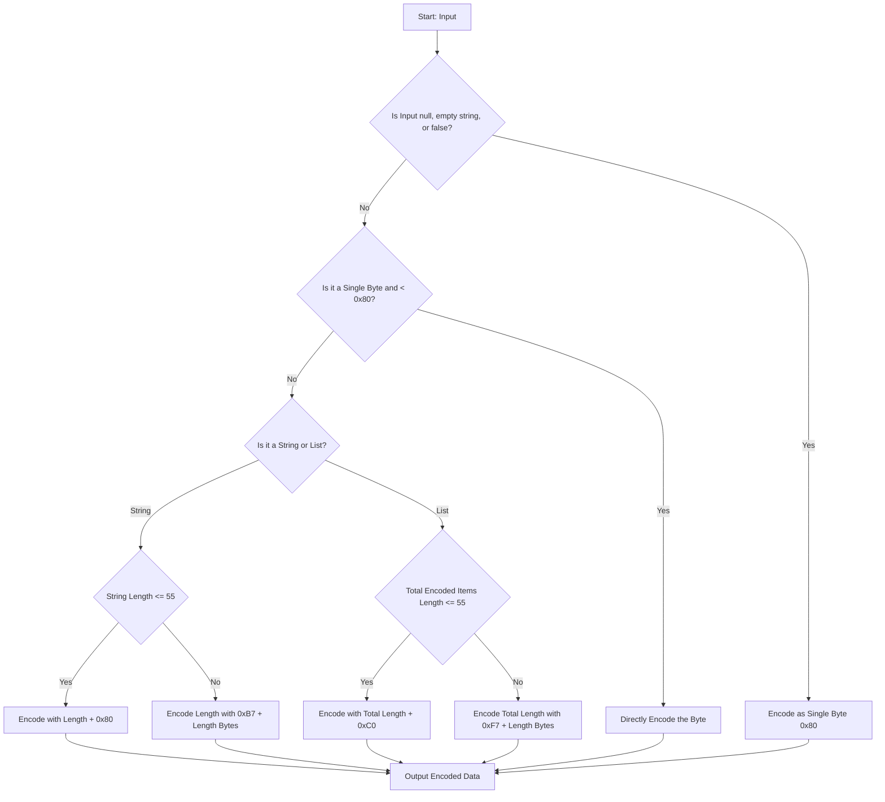
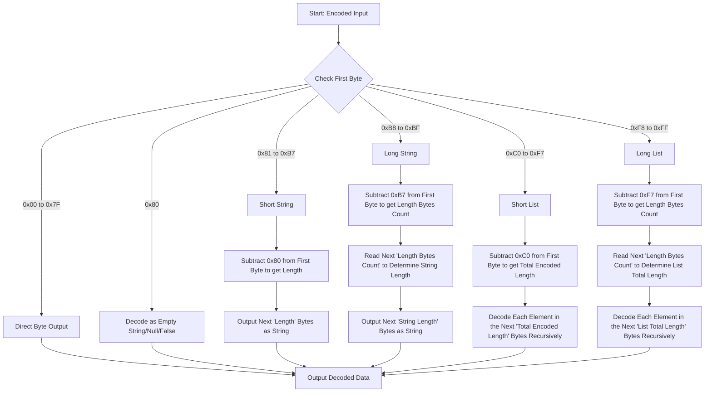

# Recursive-Length Prefix (RLP) Serialization

## Overview

Recursive Length Prefix (RLP) is a core serialization protocol used within the execution layer to encode data. It is designed to serialize data to produce a structure readable by all client software. It is used for everything from transaction data to the entire state of the blockchain. This wiki page explores the internals of RLP, its encoding/decoding rules, tools available and its role in Ethereum's functionality.

## Understanding Data Serialization in Ethereum

_Figure: Data Serialization Flow_

Data serialization is the process of converting data structures or objects into a byte stream for storage, transmission, or later reconstruction. In distributed systems like Ethereum, serialization is crucial for transmitting data across network nodes reliably and efficiently. While common serialization formats include JSON and XML, Ethereum uses RLP due to its simplicity and effectiveness in encoding nested arrays of bytes.

## The Need for RLP in Ethereum

> RLP is intended to be a highly minimalistic serialization format; its sole purpose is to store nested arrays of bytes. Unlike protobuf, BSON and other existing solutions, RLP does not attempt to define any specific data types such as booleans, floats, doubles or even integers; instead, it simply exists to store structure, in the form of nested arrays, and leaves it up to the protocol to determine the meaning of the arrays.
> -- Ethereum's design rationale

RLP was created with Ethereum and is tailored to meet its specific needs:
- Minimalistic Design: It focuses purely on storing structure without imposing data type definitions.
- Consistency: It guarantees byte-perfect consistency across different implementations, crucial for the deterministic nature required in blockchain operations.

## RLP Encoding Rules

Understanding how RLP encoding is derived requires a grasp of the specific rules applied based on the type and size of the data. Let's explore these rules using an example to demonstrate how different types of data are encoded.

If you are not familiar with converting the strings to hex, you may refer to this [ASCII chart](https://www.asciitable.com/). 

### Detailed Explanation of RLP Encoding Rules with Example

Recursive Length Prefix (RLP) is a fundamental data serialization technique used in Ethereum to encode structured data into a sequence of bytes. Understanding how RLP encoding is derived requires a grasp of the specific rules applied based on the type and size of the data. Let's explore these rules step-by-step using an example to demonstrate how different types of data are encoded.

**Single Byte Encoding**
  - **Condition**: If the input is a single byte and its value is between `0x00` and `0x7F` (inclusive).
  - **Encoding**: The byte is encoded directly, unchanged.
  - **Example**: Encoding the byte `0x2a` directly yields `0x2a`.

**Single Byte String Encoding**
  - **Condition**: If the input is a single byte string.
  - **Encoding**: The byte is encoded directly, unchanged.
  - **Example**: Encoding the byte `0x74` directly yields `0x74`.
  - 
**Short String Encoding (1-55 bytes)**
  - **Condition**: If the string (or byte array) length is between 1 and 55 bytes.
  - **Encoding**: The output is the length of the string plus `0x80`, followed by the string itself.
  - **Example**: Encoding the string "dog" (`0x64, 0x6f, 0x67`) results in `0x83, 0x64, 0x6f, 0x67`. Here, `0x83` is `0x80 + 3` (the length of "dog").

**Long String Encoding (over 55 bytes)**
  - **Condition**: If the string length exceeds 55 bytes.
  - **Encoding**: The length of the string is encoded as a byte array in big-endian format, prefixed by `0xb7` plus the length of this length array.
  - **Example**: For a string of length 56, the length `0x38` is encoded, preceded by `0xb8` (`0xb7 + 1`). The resulting encoding starts with `0xb8, 0x38`, followed by the string's bytes.

**Short List Encoding (total payload 1-55 bytes)**
  - **Condition**: If the total encoded payload of the list's items is between 1 and 55 bytes.
  - **Encoding**: The list is prefixed with `0xc0` plus the total length of the encoded items.
  - **Example**: For a list `["cat", "dog"]`, each item is first encoded to `0x83, 0x63, 0x61, 0x74` and `0x83, 0x64, 0x6f, 0x67`. The total length is 8, so the prefix is `0xc8` (`0xc0` + 8 = `0xc8`). The entire encoding is `0xc8, 0x83, 0x63, 0x61, 0x74, 0x83, 0x64, 0x6f, 0x67`.

**Long List Encoding (total payload over 55 bytes)**
  - **Condition**: If the total encoded payload of the list's items exceeds 55 bytes.
  - **Encoding**: Similar to long strings, the length of the payload is encoded in big-endian format, prefixed by `0xf7` plus the length of this length array.
  - **Example**: For a list `["apple", "bread", ...]` exceeding 55 bytes, suppose the payload length is 57. The length `0x39` is encoded, preceded by `0xf8` (`0xf7 + 1`), followed by the encoded list items.

**Null, Empty String, Empty List and False**
  - Rule for Empty string, Null and False: Encoded as a single byte `0x80`.
  - Rule for Empty List: Encoded as `0xc0`.
  - Examples:
    - Encoding an empty string or a null value or false, (` `, `null`, `false`), result in `0x80`.
    - Encoding an empty list, `[]`, results in `0xc0`.

## RLP Decoding Rules 

The RLP decoding process is based on the structure and specifics of the encoded data:

**Determine Data Type**:
  - The first byte (prefix) of the encoded data determines the type and length of the data that follows. This byte is critical in guiding the decoding process.
**Decoding Single Bytes**:
  - If the prefix byte is in the range `0x00` to `0x7F`, the byte itself represents the decoded data. This case is straightforward as the byte is encoded directly.
**Decoding Strings and Lists**:
  - The complexity in decoding arises with strings and lists, which have varying lengths and may contain nested structures.
**Short Strings (0x80 to 0xB7)**:
  - If the prefix byte is between `0x80` and `0xB7`, it indicates a string whose length can be directly determined by subtracting `0x80` from the prefix. The following bytes equal the length are the string.
**Long Strings (0xB8 to 0xBF)**:
  - For longer strings, if the prefix byte is between `0xB8` and `0xBF`, the number of length bytes is determined by subtracting `0xB7` from the prefix. The subsequent bytes represent the length of the string, and the bytes following represent the string itself.
**Short Lists (0xC0 to 0xF7)**:
  - Similar to short strings, a prefix between `0xC0` and `0xF7` indicates a list. The length of the list's encoded data can be determined by subtracting `0xC0` from the prefix. The bytes that follow must then be decoded recursively as individual RLP encoded items.
**Long Lists (0xF8 to 0xFF)**:
  - For longer lists, a prefix between `0xF8` and `0xFF` indicates that the next few bytes (determined by subtracting `0xF7` from the prefix) will tell the length of the list's encoded data. The data following these length bytes is then recursively decoded into RLP items.

**Examples of RLP Decoding of `[0xc8, 0x83, 0x63, 0x61, 0x74, 0x83, 0x64, 0x6f, 0x67]`**

- **Identify the Prefix**
  - The sequence starts with the byte `0xc8`. In RLP, a list's length prefix starts at `0xc0`. The difference between `0xc8` and `0xc0` gives us the length of the list content.
    - `0xc8 - 0xc0 = 8`
  - This tells us that the next 8 bytes are part of the list.
- **Decode the List Content**
  - The list content in this example is `[0x83, 0x63, 0x61, 0x74, 0x83, 0x64, 0x6f, 0x67]`.
  - We will decode this content byte by byte to extract the individual items.
- **Decode the First Item**
  - The first byte of the list content is `0x83`. In RLP, for strings where the length is between 1 and 55 bytes, the length prefix starts at `0x80`. Thus:
    - `0x83 - 0x80 = 3`
  - This tells us that the first string has a length of `3` bytes.
  - The next three bytes are `0x63, 0x61, 0x74`, which correspond to the ASCII values for "cat".
  - We have now decoded the first item: "cat".
- **Decode the Second Item**
  - After decoding the first item, the next byte in the sequence is another `0x83`.
  - Following the same rule as before:
    - `0x83 - 0x80 = 3`
  - This indicates the next string also has a length of 3 bytes.
  - The following three bytes are `0x64, 0x6f, 0x67`, corresponding to "dog".
  - We have now decoded the second item: "dog".
- The decoded output is `["cat", "dog"]`.

## How RLP Algorithm works

**RLP encoding algorithm**

Here is a flow chart describing how RLP encoding algorithm works.

_Note that in some RLP tools, some clients may add additional conditional cases to the flow. These additional cases are not part of the standard specification but they are useful for the clients for the correct data serialization, e.g. geth client node communicating with a Nethermind client node._

_Figure: RLP Encoding Flow_

**RLP decoding algorithm**

Here is a flow chart describing how RLP decoding algorithm works.

_Figure: RLP Decoding Flow_

## RLP Tools

There are many libraries available for RLP implementations in Ethereum. Here are few tools:
- [Geth RLP](https://github.com/ethereum/go-ethereum/tree/master/rlp)
- [RLP for Node.js and the browser.](https://github.com/ethereumjs/ethereumjs-monorepo/tree/master/packages/rlp)
- [Python RLP serialization library.](https://github.com/ethereum/pyrlp)
- [RLP for Rust](https://docs.rs/ethereum-rlp/latest/rlp/)
- [Nethermind RLP Serialization](https://github.com/NethermindEth/nethermind/tree/master/src/Nethermind/Nethermind.Serialization.Rlp)

## Resources
- [Ethereum Yellow Paper](https://ethereum.github.io/yellowpaper/paper.pdf)
- [Ethereum RLP documentation](https://ethereum.org/vi/developers/docs/data-structures-and-encoding/rlp/)
- [A Comprehensive Guide to RLP Encoding in Ethereum by Mark Odayan](https://medium.com/@markodayansa/a-comprehensive-guide-to-rlp-encoding-in-ethereum-6bd75c126de0)
- [Ethereum's RLP serialization in Elixir](https://www.badykov.com/elixir/rlp/)
- [Ethereum Under The Hood Part 3 (RLP Decoding)](https://medium.com/coinmonks/ethereum-under-the-hood-part-3-rlp-decoding-df236dc13e58)
- [Ethereum's Recursive Length Prefix in ACL2](https://arxiv.org/abs/2009.13769)

