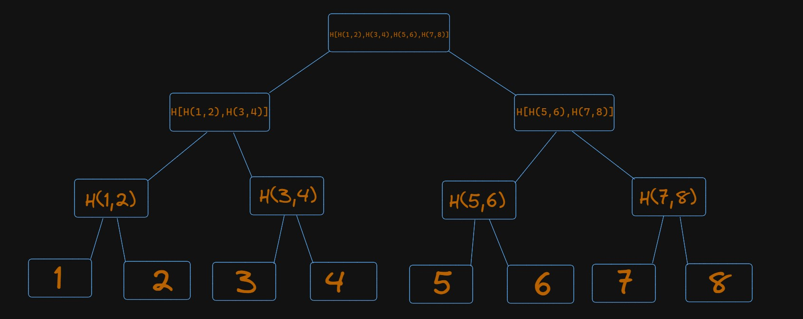
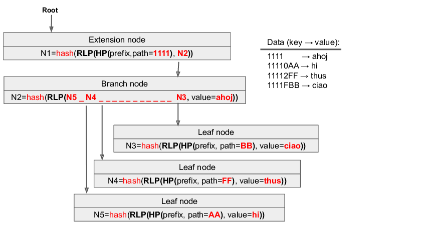
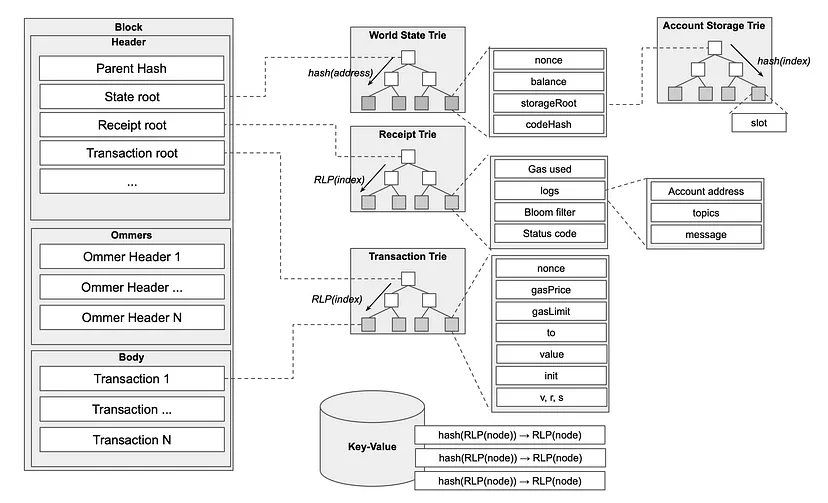
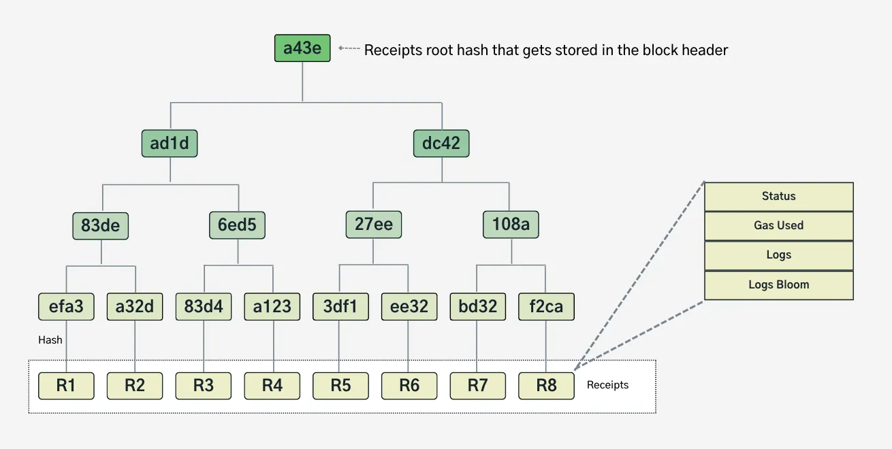
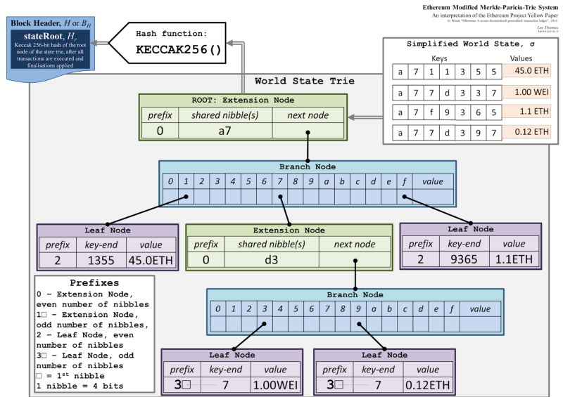
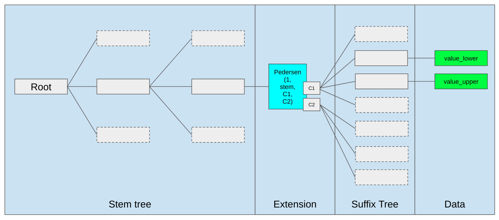

# Data Structures in Execution Layer

The execution client stores the current state and historical blockchain data. In practice, the Ethereum data are stored in trie like structures, mainly Merkle Patricia Tree.

## RLP

[Wiki - RLP](/wiki/EL/RLP.md)

## Primer on Merkle Tree

Merkle tree is a hash-based data structure which is very efficient at data integrity and verification. It is a tree based structure where the leaf nodes hold the data values and each non-leaf node is a hash of its child nodes.

A Merkle tree stores all the transactions in a block by producing a digital fingerprint of the entire set of transactions. It allows the user to verify whether a transaction is included in a block or not. Merkle trees are created by repeatedly calculating hashing pairs of nodes until there is only one hash left. This hash is called the **Merkle Root**, or the Root Hash. The Merkle Trees are constructed in a bottom-up approach.

It is important to note that Merkle trees are in a **binary tree**, so it requires an even number of leaf nodes. If there is an odd number of transactions, the last hash will be duplicated once to create an even number of leaf nodes.

Merkle Trees provide a tamper-proof structure to store transaction data. Hash functions have an Avalanche Effect i.e. a small change in the data will result in a huge change in the resulting hash. Hence, if the data in the leaf nodes are ever modified, the Root Hash will not match the expected value.
You can try out [SHA-256](https://emn178.github.io/online-tools/sha256.html) hashing function yourself as well.
To learn more about Hashing, you may refer to [this](https://github.com/ethereumbook/ethereumbook/blob/develop/04keys-addresses.asciidoc).

Merkle Root is stored in the **Block Header**. Read more about the structure of a Block inside Ethereum (_will be linked this to relevant doc once its ready_)

The main parent node is called Root, hence the hash inside is Root Hash. There is an infinitesimally small chance(1 in 1.16x10^77 for a single SHA-256 hash) to create two different states with the same root hash, and any attempt to modify state with different values will result in a different state root hash.

The image below depicts a simplified version of the working of a Merkle Tree:

- The leaf nodes contain the actual data(for simplicity, we have taken numbers).
- Every non-leaf node is a hash of its children.
- The first level of non-leaf nodes contains the Hash of its child leaf nodes.
  `Hash(1,2)`
- The same process continues till we reach the top of the tree, which the Hash of all the previous Hashes.
  `Hash[Hash[Hash(1,2),Hash(3,4)],Hash[Hash(5,6),Hash(7,8)]]`

More on [Merkle Trees in Ethereum](https://blog.ethereum.org/2015/11/15/merkling-in-ethereum)

## Primer on Patricia Tree

Patricia Tries (also called Radix tree) are n-ary trees that, unlike Merkle Trees, are used for efficient storage of data instead of verification.

Simply put, Patricia Tries is a tree data structure where:
 - The number of children of each node is at most the radix r of the radix trie, where r = 2^x for some integer x ≥ 1.
 - Unlike regular trees, edges can be labeled with sequences of characters, making the structure much more space-efficient.
 - Each node that is the only child is merged with its parent, which is also more space efficient compared to a Merkle Tree for example.

A simple diagram will display how Patricia Trie traversal works. Suppose we are searching for the value associated with the key "romulus". The value will be held at the leaf node.
- Unlike a regular trie, where data might be stored in intermediary nodes, Patricia Tries store values only in leaf nodes. This improves space efficiency and makes cryptographic verification easier.

1. Start at the root node, which serves as the entry point, and contains "r", which will be the starting prefix for all stored keys.
2. Follow the edge labels (compressed path representation) such as "om".  Patricia Trie merges common prefixes into a single edge instead of how standard tries store each character in a separate node.  This prefix compression makes the trie more compact leading to storage efficiency and efficient lookups.
3. Continue traversing until a leaf node for the key "romulus" is reached to obtain the value.

## Merkle Patricia Trie

Now that we have a fair understanding of both Merkle Trees and Patricia Tries, we can dive into Ethereum's primary data structure for storing the execution layer state, the **Merkle Patricia Trie** (pronounced "try"). It is named so, since it is a Merkle tree that uses features of PATRICIA (Practical Algorithm To Retrieve Information Coded in Alphanumeric), and because it is designed for efficient data retrieval of items that comprise the Ethereum state.

- From Merkle Trees, it inherits the cryptographic verification properties where each node contains hashes of its children.
- From Patricia Tries, it inherits efficient key-value storage and retrieval capabilities through prefix-based node organization.

There are three types of nodes within the MPT:

- **Branch Nodes**: A branch node consists of a 17-element array, which includes one node value and 16 branches. This node type is the primary mechanism for branching and navigating through the trie.
- **Extension Nodes**: These nodes function as optimized nodes within the MPT. They come into play when a branch node has only one child node. Instead of duplicating the path for every branch, the MPT compresses it into an extension node, housing both the path and the child's hash.
- **Leaf Nodes**: A leaf node represents a key-value pair. The value is the MPT node's content, while the key is the node's hash. Leaf nodes store specific key-value data.

Every single node has a hash value. The node's hash is calculated as the SHA-3 hash value of its contents. This hash also acts as a key to refer that specific node.
Nibbles serve as the distinguishing unit for key values in the MPT. It represents a single hexadecimal digit. Each trie node can branch out to as many as 16 offshoots, ensuring a concise representation and efficient memory usage.

The following diagram illustrates how traversal and hashing work together in the MPT. As an example of data retrieval from a leaf node, let's obtain the value `hi` using the key `11110AA`.

### 1. Start at the Root (Extension Node in this Scenario)
- The key we are searching for is `11110AA`.
- The root node is an **extension node** because all keys in this trie share the common prefix `1111`.
  - Instead of storing `1111` across multiple branch nodes, it is compressed into a single edge, making the lookup more efficient.
- The extension node's hash is the root hash and is computed as:
  `N1 = hash(RLP(HP(prefix, path=1111), N2))`.
  - Since `N1` depends on `N2`, any change in `N2` would alter the root hash.

### **2. Navigate to the Branch Node (N2)**
- After `1111`, the next hex character in our key (`11110AA`) is `0`, so we take the `0` branch from `N2`, which leads us to **leaf node (`N5`)**.
- The branch node’s hash is computed as:
  `N2 = hash(RLP(N5, ...))`.
  - Since `N2` depends on `N5`, any modification to `N5` affects `N2`, which in turn affects `N1`.

### **3. Arrive at the Leaf Node (N5)**
- `N5` is a **leaf node** where the search ends.
- The leaf node stores:
  - **Prefix**: `AA` (the remaining unique part of the key after `11110`).
  - **Value**: `"hi"`.

> This [excellent post](https://easythereentropy.wordpress.com/2014/06/04/understanding-the-ethereum-trie/) explains PATRICIA trie in detail along with a [python implementation](https://github.com/ebuchman/understanding_ethereum_trie) for practice.

# Ethereum

Ethereum state is stored in four different modified Merkle Patricia Tries (MMPTs):

- Transaction Trie
- Receipt Trie
- World State Trie
- Account State Trie

At each block there is one transaction, receipt, and state trie which are referenced by their root hashes in the block Header.
For every contract deployed on Ethereum there is a storage trie used to hold that contract's persistent variables, each storage trie is referenced by their root hash in the state account object stored in the state trie leaf node corresponding to that contract's address.

## Transaction Trie

The Transaction Trie is a data structure responsible for storing all the transactions within a specific block. Every block has its own Transaction Trie, corresponding to the respective transactions that are included in that block.
Ethereum is a transaction based state machine. This means every action or change in Ethereum is due to a transaction. Every block is made up of a block header and a transaction list(among other things). Thus, once a transaction is executed and a block is finalized the transaction trie for that block can never be changed.(in contrast to the World State trie).

A transaction is mapped in the trie so that the key is a transaction index and the value is the transaction T . Both the
transaction index and the transaction itself are RLP encoded. It compose a key-value pair, stored in the trie:
`𝑅𝐿𝑃 (𝑖𝑛𝑑𝑒𝑥) → 𝑅𝐿𝑃 (𝑇)`

The structure `T` consists of the following:

- **Nonce**: For every new transaction submitted by the same sender, the nonce is increased. This value allows for tracking order of transactions and prevents replay attacks.
- **maxPriorityFeePerGas** - The maximum price of the consumed gas to be included as a tip to the validator.
- **gasLimit**: The maximum amount of gas units that can be consumed by the transaction.
- **maxFeePerGas** - the maximum fee per unit of gas willing to be paid for the transaction (including baseFeePerGas and maxPriorityFeePerGas).
- **from** – The address of the sender, that will be signing the transaction. This must be an externally-owned account as contract accounts cannot send transactions.
- **to**: Address of an account to receive funds, or zero for contract creation.
- **value**: amount of ETH to transfer from sender to recipient.
- **input data**: optional field to include arbitrary data.
- **data**: Input data for a message call together with the message signature.
- **(v, r, s)**: Values encoding signature of a sender. Serves as identifier of the sender.

##  Receipt Trie

The Receipt Trie is similar to the Transaction Trie in that it is a block level data structure, and each leaf of the trie represents some RLP-encoded data related to the transaction. However, the Receipt Trie is used to verify that the instructions in each transaction were actually executed.  This verification data is held in the leaf node and contains a few fields, which are described in the [transaction anatomy](wiki/EL/transaction.md#receipts) section of the wiki.

In this section, we will focus on the `Receipt Trie` itself.

The `ReceiptRoot` of the `Receipt Trie` is the keccak 256-bit hash of the root node.

Here is a simple diagram of a Receipt Trie, which follows the Merkle Patricia Trie flow for value lookups.

If you know the index of a transaction in a block, you can easily find it's corresponding receipt in the `Receipt Trie`.  This is because the transaction's position (index) in a block is used as the key in the `Receipt Trie`'s leaf node containing the receipt for that transaction.  Using the transaction's index as the receipt's key provides some nice benefits such as avoiding needing to calculate or look up transaction hashes to locate receipts in the trie.

The primary role of the receipts trie is to provide a canonical, authenticated record of transaction results, primarily used for indexing historical data without having to re-execute transactions. During snap sync, full nodes download block bodies — which contain both transactions and their corresponding receipts — and locally reconstruct the receipt trie for each block. The reconstructed trie is then validated against the receiptsRoot in the block header. Snap sync avoids the need for full nodes to re-execute historical transactions solely to regenerate receipts, significantly accelerating the sync process.

While receipts enable light clients to verify transaction outcomes via Merkle proofs against the receiptsRoot, this is a secondary use. Since light clients only store block headers, they rely on full nodes to query for these proofs and `receiptsRoot`.  This structure allows light clients to independently verify the legitimacy of the data without storing the full transaction history.

## World State Trie

The **World State Trie** is the core data structure that represents Ethereum's current state. It maps the keccak-256 hashed 20 byte account addresses to their RLP encoded states utilizing a **Merkle Patricia Trie** where the key-value pairs are stored as byte arrays to byte arrays in the leaves of the trie.

Accounts can be categorized as either smart contract accounts with code or Externally Owned Accounts (EOAs) associated with private keys. EOAs are used to initiate transactions with other EOAs or smart contract accounts, triggering the execution of the associated contract code.

Each account consists of the following fields:
- **Nonce**: A scalar value identifying the number of transactions successfully sent from this account.
- **Balance**: The amount of ETH in Wei owned by this account.
- **Code Hash**: The hash of the EVM code if it's a contract account. For EOAs, it's the keccak-256 hash of an empty string `(keccak256(''))`, which uniquely identifies the account as an EOA.
- **Storage Root Hash**: The 32 byte hash that points to the root of the account’s ***Storage Trie***, which would be an empty trie for an EOA.

The **World State Trie** is not stored in the chain, but the 32-byte keccak-256 **state root** of the trie is stored in every block header after all transactions in a block have been processed.  The **state root** is used as a cryptographic commitment for the entire system state since it's cryptographically dependent on all the data in the trie.  For example, a node can prove an account's existence given the **state root** and a **Merkle proof** containing the account and it's sibling nodes needed to recreate the **state root**.  Furthermore, the **state root** in each block anchors Ethereum’s consensus: any node can independently compute or verify this root by applying the block’s transactions to the previous state trie.

Below is a simplified diagram of the ***World State Trie***.

Let's traverse the trie to find the account with a **45 ETH** balance. The key for this account is shown as `a711355`, meaning these seven hex digits direct us from the root node down to the leaf node.

> This short key `a711355` is just for demonstration. Actual addresses in Ethereum get hashed (32 bytes) and thus typically yield up to 64 nibbles in the trie. But the traversal steps are the same—each nibble selects the next branch/extension node until we arrive at the leaf node storing the final account data.

1. **Key to Nibbles**
   - The key string `a711355` represents seven hex digits: `a`, `7`, `1`, `1`, `3`, `5`, `5`.
   - Each digit is a nibble (4 bits), so the entire key is a sequence of seven nibbles.

2. **Path Through the Trie**
   - **Extension node** at the root might store a prefix like `a7`, consuming the first two nibbles.
   - **Branch node** follows, allowing navigation by each subsequent nibble (`1`, `1`, `3`, `5`, `5`).

3. **Leaf Node**
   - Consuming all nibbles brings us to the **leaf node**. In our simplified example, its stored value is **“45 ETH”**.
   - In Ethereum’s real MPT, this leaf node actually holds the RLP-encoded account object `[nonce, balance, storageRoot, codeHash]`.

### Persistent Storage

The **World State Trie** is a living structure that evolves with each block, unlike the transaction and receipt tries which are rebuilt from scratch for every block.  Ethereum operates as a state machine, where the current state is updated by executing transactions in a block. Each node must track this current state to verify transactions and update it accordingly. Therefore, intermediate states exist during block processing, but nodes retain only the final post-block state.  A full node will keep track of the current state of the **World State Trie** and enough trie nodes required to rewind during a re-org.  Archival nodes will keep track of all previous states since genesis.

In summary, Ethereum's world state is a secure and verifiable representation of the current state of all accounts at a given block height.

## Storage Trie

In the previous section, we described how each account leaf in the **World State Trie** contains a `storageRoot`, which is the keccak-256 hash of the root node of a separate Merkle Patricia Trie, the **Storage Trie**. This trie is not embedded in the **World State Trie** but referenced via the `storageRoot`, enabling storage to be updated and proven independently while still contributing to the global state root.

The **Storage Trie** represents a contract’s persistent state as a mapping of 256-bit storage slots indices (keys) to 256-bit RLP-encoded values.  Each such key-value pair is referred to as a storage slot.  Like the **World State Trie**, it uses a secure key scheme where each slot index is hashed with keccak-256 before insertion.  This prevents attackers from crafting keys that cause long traversal paths or highly unbalanced trie structures, which could otherwise be exploited for DOS attacks by inducing excessive computation during trie lookups or updates.

> While high-level languages (e.g., Solidity) define how contract variables are laid out across storage slots, this layout abstraction originates in the language itself.  The execution layer merely implements this abstraction. At the EL layer level, the trie treats all slots as uniform key-value entries.

Each account has its own **Storage Trie**, which starts as an empty trie. The trie is modified via the `SSTORE` opcode and read via `SLOAD` during contract execution. For EOAs, the storage trie remains empty and is never accessed. These opcodes are defined in the EVM and described further in the [EVM documentation’s storage section](wiki/EL/evm.md#evm-data-locations).

To retrieve the value of a storage slot (e.g., index `0x00`) from the leaf of **Storage Trie**:
1. RLP-encode the slot index and keccak-256 hash the result.
2. Use the resulting hash as a key to traverse the trie, starting at `storageRoot`.
3. Follow the path using the nibbles of the hash to reach the corresponding leaf node.
4. Extract and decode the RLP-encoded value stored at the leaf.

Proofs can be constructed from the nodes along this path to verify a slot’s value against the `storageRoot`.

In summary, the **Storage Trie** is fundamental to Ethereum’s account model, providing each contract with its own isolated and verifiable storage space. Unlike the **World State Trie**, which maps addresses to account metadata, the **Storage Trie** maintains contract-specific key-value state across blocks.

## Future Implementations

## Verkle Trees

[Verkle tree](https://verkle.info/) is a new data structure that is being proposed to replace the current Merkle Patricia Trie. Named by combining the "Vector commitment" and "Merkle Tree", it is designed to be more efficient and scalable than the current MPT. It is a trie-based data structure that replaces the heavy witness used in the MPT with a lightweight witness. Verkle trees are the key part of The Verge upgrade of [Ethereum Roadmap](https://ethereum.org/en/roadmap/#what-about-the-verge-splurge-etc). They can enable [stateless](https://ethereum.org/en/roadmap/statelessness/#statelessness) clients to be more efficient and scalable.

### Structure of Verkle Tree

The layout structure of a Verkle tree is just like a MPT but with different base of the tree i.e. number of children. Just like [MPT](https://ethereum.org/en/developers/docs/data-structures-and-encoding/patricia-merkle-trie/#optimization) it has root node, inner nodes, extension nodes and leaf nodes. There a slight difference in the key size, on which the tree is made. MPT uses 20 byte key which Verkle tree uses 32 byte key in which the 31 bytes are used as a stem of the tree while last 1 byte is used for storage with almost the same stem address or neighboring code chunks (opening the same commitment is cheaper). Also due to the fact that while computing the witness data the algorithms take 252 bit as field element so it is convenient to use 31 bytes as a suffix of the tree. Using this, the stem data can commit to two difference commitments ranging from 0-127 and 128-255, aka lower value and upper value of the same key, thus covering the whole suffix space. For more on this refer [here](https://blog.ethereum.org/2021/12/02/verkle-tree-structure).

### Key differences between MPT and Verkle Tree

A Merkle/MP tree has a lot of depth since the tree structure is binary (2/16-ary tree) at every node. This means that the witness data for a leaf node is the path from the root to the leaf. Due to the fact that sibling hash data is also required at each level, this makes the witness data very large for a large tree. A Verkle tree has a lot of width since the tree structure is n-ary at every node. This means that the witness data for a leaf node is the path from the leaf to the root. This can be very small for a large tree. Currently the Verkle tree is proposed to have 256 children per node. More on this [here](https://ethereum.org/en/roadmap/verkle-trees/)

The intermediate nodes of Merkle/MP tree are hashes of the children. The nodes of a Verkle tree carry a special type of hash called "vector commitments" to commit to their children. This means that the witness data for a leaf node in a Verkle tree is the commitment of the children of the path from the leaf to the root. On top of this a proof is computed by aggregating the commitments which makes the verification process very compact. More on [Proof System](https://dankradfeist.de/ethereum/2021/06/18/pcs-multiproofs.html?ref=hackernoon.com).

### Why Verkle Trees?

To make a client stateless it is essential that to validate a block, client should not have to store the entire/previous blockchain state. The incoming block should be able to provide the client with the necessary data to validate the block. This extra proof data are called _witness_ enabling a stateless client validating the data without the full state.
Using the information inside the block, client should also be able to maintain/grow a local state with each incoming block. Using this a client guarantees that for the current block (and succeeding ones that it validates) the state transition is correct. It doesn't guarantee that the state is correct for the previous blocks that the current block refers to because block producer can build on an invalid or non-canonical block.

Verkle trees are designed to be more efficient in terms of storage and communication cost. For a 1000 leaves/data, a binary Merkle Tree takes around 4MB of witness data, Verkle tree reduces it to 150 kB. If we include the witness data in the block then it will not impact the blocksize that much but it would enable the stateless clients to be more efficient and scalable. Using this the stateless client will be able to trust the computation done without having to store the entire state.

The transition to new verkle tree database poses a major challenge. To securely create the new verkle data, clients needs to generate them from the existing MPT which takes a lot of computation and space. Distribution and verification of the verkled database is currently being researched.

## Resources

- [Merkle in Ethereum](https://blog.ethereum.org/2015/11/15/merkling-in-ethereum)
- [More on Merkle Patricia Trie](https://ethereum.org/developers/docs/data-structures-and-encoding/patricia-merkle-trie)
- [More on Verkle Tree](https://notes.ethereum.org/@vbuterin/verkle_tree_eip#Simple-Summary)
- [Verge transition](https://notes.ethereum.org/@parithosh/verkle-transition)
- [Implementing Merkle Tree and Patricia Trie](https://medium.com/coinmonks/implementing-merkle-tree-and-patricia-trie-b8badd6d9591) • [archived](https://web.archive.org/web/20210118071101/https://medium.com/coinmonks/implementing-merkle-tree-and-patricia-trie-b8badd6d9591)
- [Radix Trie](https://en.wikipedia.org/wiki/Radix_tree#) • [archived](https://web.archive.org/web/20250105072609/https://en.wikipedia.org/wiki/Radix_tree)
- [Radix Trie Diagram](https://samczsun.com/content/images/2021/05/1920px-Patricia_trie.svg-1-.png)  • [archived](https://web.archive.org/web/20231209235318/https://samczsun.com/content/images/2021/05/1920px-Patricia_trie.svg-1-.png)
- [Merkle Patricia Trie Diagram](https://www.researchgate.net/publication/353863430/figure/fig2/AS:1056193841741826@1628827643578/Ethereum-Encoded-Merkle-Patricia-Trie.png)
- [Merkle Patricia Trie Diagram Explanation](https://www.researchgate.net/publication/353863430_Ethereum_Data_Structures)
- [Receipts Trie Including Diagram](https://medium.com/coinmonks/ethereum-data-transaction-receipt-trie-and-logs-simplified-30e3ae8dc3cf) • [archived](https://web.archive.org/web/20250000000000/https://medium.com/coinmonks/ethereum-data-transaction-receipt-trie-and-logs-simplified-30e3ae8dc3cf)
- [Ethereum Data Structures](https://arxiv.org/pdf/2108.05513/1000) • [archived](https://web.archive.org/web/20240430050355/https://arxiv.org/pdf/2108.05513/1000)
- [DevP2P Wire Protocol](https://github.com/ethereum/devp2p/blob/master/caps/eth.md)  • [archived](https://web.archive.org/web/20250328095848/https://github.com/ethereum/devp2p/blob/master/caps/eth.md)
- [Snap Sync](https://geth.ethereum.org/docs/fundamentals/sync-modes) • [archived](https://web.archive.org/web/20250228111146/https://geth.ethereum.org/docs/fundamentals/sync-modes)
- [More on Merkle Patricia Trie](https://ethereum.org/developers/docs/data-structures-and-encoding/patricia-merkle-trie)
- [Ethereum Yellow Paper](https://ethereum.github.io/yellowpaper/paper.pdf) • [archived](https://web.archive.org/web/20250228142704/https://ethereum.github.io/yellowpaper/paper.pdf)
- [State Trie Keys](https://medium.com/codechain/secure-tree-why-state-tries-key-is-256-bits-1276beb68485#:~:text=This%20is%20because%20when%20Ethereum,the%20secure%20tree%20in%20Ethereum) • [archived](https://web.archive.org/web/20230524084537/https://medium.com/codechain/secure-tree-why-state-tries-key-is-256-bits-1276beb68485)
