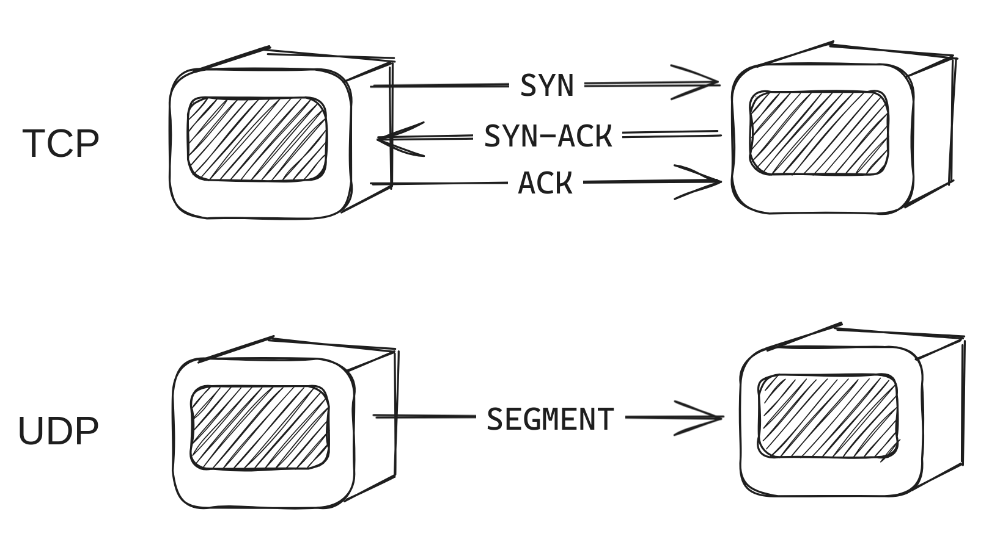
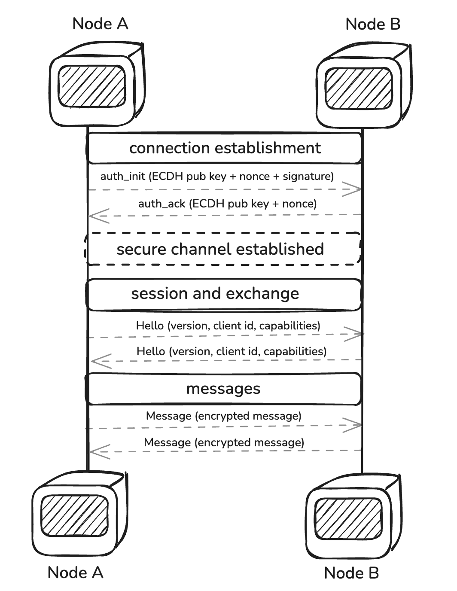

# DevP2P

This section will cover the networking protocol used by the Execution Layer (EL).
First, as it is referred in the [networking section](../dev/cs-resources.md?id=networking), focusing on the transport layer, the two protocols used by DevP2P are TCP (Transmission Control Protocol) and UDP (User Datagram Protocol).
Both protocols are used to send data over the internet, but they have different characteristics. Just as Tanenbaum points it out (2021),TCP is a connection-oriented protocol, which means that it establishes a connection between the sender and the receiver before sending data.
It is reliable because it ensures that the data is delivered in the correct order and without errors. UDP is a connectionless protocol, which means that it does not establish a connection before sending data.
It is faster than TCP because it does not have to establish a connection before sending data, but it is less reliable because it does not ensure that the data is delivered in the correct order or without errors.




## EL's networking specs
As a peer-to-peer network Ethereum implies a series of rules to enable communication between its participant nodes. This section cover an explanation of which are those rules and how they are implemented in the EL.
Considering each Ethereum node is built upon two different components: the execution client and the consensus client, each one of them has its own peer-to-peer network with its own purpose.
The execution client is responsible for gossiping transactions, while the consensus client is responsible for gossiping the blocks.
>  There are historical reasons for different CL/EL p2p networks and their underlying technologies. Ethereum was originally built on devp2p as its own custom networking stack. By the time Beacon Chain was created, libp2p was ready for production and adopted there.
Keeping this in mind, the scope of the EL network covers two different stacks working in parallel: the discovery one, and the information transport itself. 
The discovery stack is responsible for finding the node peers, while the transport stack is responsible for sending and receiving messages between them.
Taking the computer networks background into account, then we can infer that the discovery stack relies on the UDP protocol, while the information exchange stack relies on the TCP protocol.
The reason behind this is that the information exchange requires a reliable connection between the nodes,
so they can be able to both confirm the connection before sending the data and have a way to ensure that the data is delivered in the correct order and without errors (or at least to have a way to detect and correct them),
while the discovery process does not require the reliable connection, since it is enough to let other knows that the node is available to communicate.

### Discv protocol (Discovery)
The process of how the nodes find each other in the network starts with [the hard-coded bootnodes listed in the specification](https://github.com/ethereum/go-ethereum/blob/master/params/bootnodes.go).
The bootnodes are nodes that are known by all the other nodes in the networks (both Mainnet and testnets), and they are used to bootstrap the discovery peers process.
Using the Kademlia-like DHT (Distributed Hash Table) algorithm, the nodes are able to find each other in the network by referring to a routing table where the bootnodes are listed.
The TLDR of the Kademlia is that it is a peer-to-peer protocol that enables nodes to find each other in the network by using a distributed hash table, as Leffew mentioned in his article (2019).

That is to say, the connection process starts with a PING-PONG game where the new node send a PING message to the bootnode, and the bootnode responds with a PONG hashed message.
If both messages match, then the new node is able to bond with the bootnode. In addition to this, the new node sends a FIND-NEIGHBOURS request to the bootnode, so it can receive a list of neighbours that able to connect with,
so it can repeat the PING-PONG game with them and bond with them as well.


#### Wire protocol
The PING/PONG game is better known as the wire subprotocol, and it includes the next specifications:

**PING packet structure**
```
version = 4
from = [sender-ip, sender-udp-port, sender-tcp-port]
to = [recipient-ip, recipient-udp-port, 0]
packet-data = [version, from, to, expiration, enr-seq ...]
```

**PONG packet structure**
```
packet-data = [to, ping-hash, expiration, enr-seq, ...]
```

The packet-data is wrapped in 1280 bytes UDP datagram alongside with the header:
```
packet-header = hash || signature || packet-type
hash = keccak256(signature || packet-type || packet-data)
signature = sign(packet-type || packet-data)
packet = packet-header || packet-data
```

**FindNode packet structure** (called FIND-NEIGHBOURS above)
```
packet-data = [target, expiration, ...]
```
Where the target is a 64-byte secp256k1 node's public key.

**Neighbours packet structure**
```
packet-data = [expiration, neighbours, ...]
neighbours = [ip, udp-port, tcp-port, node-id, ...]
```
Where the neighbours are the list of 16 nodes that are able to connect with the new node.

**ENR Request packet structure**
```
packet-data = [expiration]
```

**ENR Response packet structure**
```
packet-data = [request-hash, ENR]
```
Where ENR is the Ethereum Node Record, a standard format for connectivity for nodes. Which it is explained below.

---


This Kademlia-like protocol includes the routing table, which keeps information about other nodes in the neighbourhood consisting of *k-buckets* (where *k* is the number of nodes in the bucket, currently defined as 16).
Worth mentioning that all the table entries are sorted by *last seen/least-recently seen* at the head, and most-recently seen at the tail.
If one of the entities has not been responded to in 12 hours, it is removed from the table, and the next encounter node is added to the tail of the list.


#### Discovery Protocols (Discv4 & Discv5)
Currently, most execution clients have adopted the [Discv5 protocol](https://github.com/ethereum/devp2p/blob/master/discv5/discv5.md) for the discovery process, while some are still transitioning from [Discv4](https://github.com/ethereum/devp2p/blob/master/discv4.md). Below is a table categorizing execution clients based on their Discv5 support status (as of May 2025).

| **Category**       | **Execution Clients**                     |
|---------------------|-------------------------------------------|
| **Supports Discv5** | [Geth](https://github.com/search?q=repo%3Aethereum%2Fgo-ethereum%20discv5&type=code), [Nethermind](https://github.com/search?q=repo%3ANethermindEth%2Fnethermind+discv5&type=issues), [Reth](https://github.com/search?q=repo%3Aparadigmxyz%2Freth%20discv5&type=code)                    |
| **Pending Migration** | [Besu](https://github.com/search?q=repo%3Ahyperledger%2Fbesu+discv5&type=issues), [Ethereumjs](https://github.com/ethereumjs/ethereumjs-monorepo/tree/master/packages/devp2p), [Erigon](https://github.com/search?q=repo%3Aerigontech%2Ferigon+discv4&type=code)                    |
##### Discv4
A structured, distributed system that allows Ethereum nodes to discover peers without central coordination.  

- **Node Identities**  
  - Each node is identified by a secp256k1 key pair.  
  - The public key serves as the node’s unique identifier (Node ID).  
  - Distance between nodes is computed using XOR of hashed public keys.  

- **Node Records (ENR)**  
  - Nodes store and share connection details using Ethereum Node Records (ENRs).  
  - The "v4" identity scheme is used to verify node authenticity.  
  - Peers can request a node’s latest ENR via an **ENRRequest** packet.  

- **[Kademlia Table](https://en.wikipedia.org/wiki/Kademlia)**  
  - Nodes maintain a **routing table** with 256 **[k-buckets](https://en.wikipedia.org/wiki/Kademlia#Fixed-size_routing_tables)** (each holding up to 16 entries).  
  - A bucket stores nodes within a specific distance range (e.g., `[2^i, 2^(i+1))`).  
  - Nodes are sorted by last-seen time, ensuring stale nodes are replaced when the table is full.  

- **Endpoint Verification (Proof-of-Participation)**  
  - Prevents amplification attacks by verifying nodes before responding to queries.  
  - A node is considered verified if it has sent a valid **Pong** response to a recent **Ping** request.  

- **Recursive Lookup Algorithm**  
  - Finds the `k` (typically 16) closest nodes to a target.  
  - The search begins by querying a small, selected subset of the closest known nodes (`α`, often set to 3).  
  - The lookup is **iterative**, querying new nodes found in previous steps until no closer nodes are discovered.  

- **Wire Protocol & Message Types**  
  - Messages are sent over **UDP** .  
  - Each packet contains a header (`hash`, `signature`, `packet-type`) followed by encoded data.  
  - Core message types:  
    - **Ping (0x01):** Verify node availability.  
    - **Pong (0x02):** Response to a Ping, proving reachability.  
    - **FindNode (0x03):** Request nodes near a target ID.  
    - **Neighbors (0x04):** Reply to FindNode with closest known peers.  
    - **ENRRequest (0x05):** Request a node’s latest ENR.  
    - **ENRResponse (0x06):** Provide an ENR in response to a request.  


##### Discv5

Discv5 is Ethereum’s improved decentralized peer discovery protocol, building upon the foundation of Discv4 with enhanced service discovery and security mechanisms. Like its predecessor, Discv5 enables nodes to locate and connect with peers in a decentralized manner, without relying on centralized directories. However, it introduces encrypted communication, service discovery, and adaptive routing.

Inspired by the Kademlia DHT, discv5 differs by storing only signed node records (ENR) instead of arbitrary key-value pairs. This ensures authenticity and integrity in peer discovery.This ensures authenticity and integrity in peer discovery while maintaining flexibility for protocol extensions.

- **Ethereum Node Records (ENR)**
  - Each node maintains an **Ethereum Node Record (ENR)**, storing **connectivity details, cryptographic keys, and metadata**.
  - ENRs are signed, self-contained, and update dynamically.
  - Peers can request the latest ENR using an **ENRRequest packet**.

- **Encrypted Wire Protocol**
  - Uses **[AES-GCM encryption](https://en.wikipedia.org/wiki/AES-GCM-SIV)** for confidentiality and authenticity.
  - Establishes **session keys via ECDH** ([Elliptic Curve Diffie-Hellman](https://en.wikipedia.org/wiki/Elliptic-curve_Diffie%E2%80%93Hellman)).
  - Implements a **WHOAREYOU challenge-response mechanism** to prevent spoofing.

- **Kademlia-Based Routing & Node Table**
  - Nodes maintain a **routing table (k-buckets)** with peers sorted by XOR distance.
  - The lookup process recursively queries the closest known nodes.
  - The protocol supports **adaptive routing and self-healing**.

- **Recursive Node Lookup & Peer Discovery**
  - Nodes find peers through **iterative Kademlia-based lookups**.
  - Uses parallelized queries to **increase resilience against adversaries**.
  - Bootstrap nodes facilitate new node entry.

- **Topic Advertisement & Service Discovery**
  - Nodes advertise services via **topic advertisements**.
  - Searches for nodes providing a service use **Kademlia lookups within a topic radius**.
  - Adaptive **radius estimation** ensures efficient searches.

- **Wire Protocol & Message Types**
  | **Message**    | **Function** |
  |---------------|-------------|
  | **Ping** (0x01) | Checks if a node is alive. |
  | **Pong** (0x02) | Response to Ping, confirms reachability. |
  | **FindNode** (0x03) | Requests peers near a target ID. |
  | **Nodes** (0x04) | Responds to FindNode with known peers. |
  | **ENRRequest** (0x05) | Requests the latest ENR of a node. |
  | **ENRResponse** (0x06) | Provides the requested ENR. |
  | **WhoAreYou** (0x07) | Authentication challenge. |
  | **Handshake** (0x08) | Establishes encrypted sessions. |
  | **TalkReq / TalkResp** (0x09/0x0A) | Enables custom application protocols. |


##### Comparison: Discv4 vs. Discv5
| Feature                 | Discv4 | Discv5 |
|-------------------------|--------|--------|
| **Node Records**        | Basic ENR | Extensible ENR with metadata |
| **Security**            | Plaintext | AES-GCM encrypted |
| **Handshake**           | None | Secure session establishment |
| **Service Discovery**   | Limited | Topic-based lookup |
| **Extensibility**       | Static | Supports multiple identity schemes |
| **Clock Dependence**    | Required | Eliminated |
| **Scalability**         | Moderate | Optimized for large networks |

### ENR: Ethereum Node Records
The ENR is a standard format for p2p connectivity, which was originally proposed in the [EIP-778](https://eips.ethereum.org/EIPS/eip-778).
A node record contains the node's network endpoints, such as the IP address and port, as well as the node's public key and the sequence number of the record.

The record content structure is as follows:

| Key | Value                                     |
| --- |-------------------------------------------|
| id | id scheme, e.g "v4"                       |
| secp256k1 | compressed public key, 33 bytes           |
| ip | IPv4 address, 4 bytes                     |
| tcp | TCP port, big endian integer              |
| udp | UDP port, big endian integer              |
| ip6 | IPv6 address, 16 bytes                    |
| tcp6 | IPv6-specific TCP port, big endian integer |
| udp6 | IPv6-specific UDP port, big endian integer |

All the fields are optional, except for the `id` field, which is required. If no `tcp6`/`udp6` port are provided, the `tcp`/`udp` ports are used for both IPv4 and IPv6.

The node record is composed of a `signature`, which is the cryptographic signature of record contents, and a `seq` field, which is the sequence number of the record (a 64-bit unsigned integer).
#### Encoding

The record is encoded as an RLP list of `[signature, seq, k, v,...]` with a maximum size of 300 bytes.
Signed records are encoded as follows:
```
content = [seq, k, v, ...]
signature = sign(content)
record = [signature, seq, k, v, ...]
```
In addition to the RLP encoding, there is a textual representation of the record, which is a base64 encoding of the RLP encoding. It is prefixed with `enr:`.
i.e. `enr:-IS4QHCYrYZbAKWCBRlAy5zzaDZXJBGkcnh4MHcBFZntXNFrdvJjX04jRzjzCBOonrkTfj499SZuOh8R33Ls8RRcy5wBgmlkgnY0gmlwhH8AAAGJc2VjcDI1NmsxoQPKY0yuDUmstAHYpMa2_oxVtw0RW_QAdpzBQA8yWM0xOIN1ZHCCdl8` which contains the loopback address `127.0.0.1` and the UDP port 30303. The node ID is `a448f24c6d18e575453db13171562b71999873db5b286df957af199ec94617f7`.

Despite of the fact that the ENR is a standard format for p2p connectivity, it is not mandatory to use it in the Ethereum network. The nodes can use any other format to exchange the information about their connectivity.
There are two additional formats able to be understand by an Ethereum node: multiaddr and enode.

* The multiaddr was the original one. For example, the multiaddr for a node with a loopback IP listening on TCP port 30303 and node ID `a448f24c6d18e575453db13171562b71999873db5b286df957af199ec94617f7`  is `/ip4/127.0.0.1/tcp/30303/a448f24c6d18e575453db13171562b71999873db5b286df957af199ec94617f7`.
* The enode is a more human-readable format. For example, the enode for the same node is `enode://a448f24c6d18e575453db13171562b71999873db5b286df957af199ec94617f7@127.0.0.1:30303?discport=30301`. It is a URL-like format describing the node ID encoded before de @ sign, the IP address, the TCP port and the UDP port specified as "discport".

### RLPx protocol (Transport)

So far, this article has been referring to the discovering protocol only, but what about the secure information exchange process? Well, RLPx is the TCP-based transport protocol that enables secure peer-to-peer communication in the EL. It handles connection establishment, and message exchange between Ethereum nodes. The name comes from the [RLP serialization format](../EL/RLP.md).

Before deep diving on the protocol, here it is a summary followed by a digram:

* Secure connection through an encrypted authentication
* Session establishment
* Message framing and information exchange




#### Secure connection establishment

Once the nodes are discovered, RLPx establishes a secure connection between them by authenticating each other through cryptographic-based handshake.
This process begins by initating an authentication where the initiator node generates an ephemeral key pair using the secp256k1 elliptic curve. This ephemeral key plays a crucial role in establishing perfect forward secrecy for the session. Then the initiator sends an authentication message including the ephemeral public key and a nonce to the recipient, which accepts the connection, decrypts and verify the auth message with the public key exchanged during the communication.

The recipient sends an acknowledge message back to the initiator, and then sends a first encrypted frame containing a [Hello message](https://github.com/ethereum/devp2p/blob/master/rlpx.md#hello-0x00) which includes the port, their IDs and their client's IDs, and the protocol information. Once the nodes have authenticated each other, they can start with the communication.

#### Session and multiplexing
Once the authentication is proven they can interact by creating a secure session first through the following process:
- RLPx uses **Elliptic Curve Integrated Encryption Scheme ([ECIES](https://cryptobook.nakov.com/asymmetric-key-ciphers/ecies-public-key-encryption))** for secure **handshaking and session establishment**.
- The cryptosystem consists of:
  - **Elliptic Curve**: secp256k1
  - **Key Derivation Function (KDF)**: NIST SP 800-56 Concatenation KDF
  - **Message Authentication Code (MAC)**: HMAC-SHA-256
  - **Encryption Algorithm**: AES-128-CTR

##### Encryption Process

1. **Initiator generates a random ephemeral key pair**.
2. Computes **shared secret** using **Elliptic Curve Diffie-Hellman (ECDH)**.
3. Derives encryption (`kE`) and MAC (`kM`) keys from the **shared secret**.
4. Encrypts the message using **AES-128-CTR**.
5. Computes a **MAC** over the encrypted message for integrity.
6. Sends the encrypted payload.

##### Decryption Process

1. **Recipient extracts the sender’s ephemeral public key**.
2. Computes the **shared secret** using **ECDH**.
3. Derives `kE` and `kM`, then verifies the **MAC**.
4. **Decrypts** the message using **AES-128-CTR**.


##### Node Identity

- **Ethereum nodes maintain a persistent secp256k1 key pair** for identity.
- The **public key** serves as the **Node ID**.
- The **private key is stored securely** and remains unchanged across sessions.

##### Generated Secrets

| Secret | Description |
|--------|------------|
| `static-shared-secret` | `ECDH(node-private-key, remote-node-pubkey)` |
| `ephemeral-key` | `ECDH(ephemeral-private-key, remote-ephemeral-pubkey)` |
| `shared-secret` | `keccak256(ephemeral-key || keccak256(nonce || initiator-nonce))` |
| `aes-secret` | `keccak256(ephemeral-key || shared-secret)` |
| `mac-secret` | `keccak256(ephemeral-key || aes-secret)` |

##### Static-Shared-Secret vs. Ephemeral-Key

###### Static-Shared-Secret

- Derived using Elliptic Curve Diffie-Hellman (ECDH) between a node’s long-term (static) private key and the peer’s long-term public key.
- Remains unchanged across multiple sessions with the same peer.

If an attacker compromises a node’s private key, past and future communications with that peer can be decrypted, making it vulnerable to long-term key exposure.

###### Ephemeral-Key (Forward Secrecy)

- A temporary key pair generated for each handshake, used to derive a fresh session secret.
- Computed using ECDH between ephemeral private keys exchanged during the handshake.

Since ephemeral keys are discarded after a session ends, even if an attacker later obtains a node’s long-term private key, past communications remain secure. This property is known as forward secrecy


##### Message Framing

- **Frames encapsulate encrypted messages** for efficient and secure communication.
- **Multiplexing** allows multiple protocols to run over a single RLPx connection.

##### Frame Structure

| Field | Description |
|-------|------------|
| `header-ciphertext` | AES-encrypted **header** containing frame metadata. |
| `header-mac` | **MAC** over the header for integrity verification. |
| `frame-ciphertext` | AES-encrypted **message data**. |
| `frame-mac` | **MAC** over the encrypted message data. |

##### MAC Calculation

- Uses **two keccak256 MAC states** (one for **ingress**, one for **egress**).
- The MAC state is updated as frames are sent or received.
- Ensures **message integrity** and prevents **tampering**.


##### Capability Messaging

- **Capabilities** define the supported protocols on a given connection.
- **Multiplexing** enables concurrent usage of multiple capabilities.

##### Message Structure

| Field | Description |
|-------|------------|
| `msg-id` | Unique identifier for the message type. |
| `msg-data` | **RLP-encoded** message payload. |
| `frame-size` | **Compressed size** of `msg-data`. |


#### P2P Capability Messages

- The **"p2p" capability** is **mandatory** and used for initial negotiation.

#### Core Messages

| Message | ID | Function |
|---------|----|----------|
| `Hello` | `0x00` | Announces supported capabilities. |
| `Disconnect` | `0x01` | Initiates a graceful disconnection. |
| `Ping` | `0x02` | Checks if the peer is alive. |
| `Pong` | `0x03` | Responds to a `Ping`. |

#### Disconnect Reasons

| Code | Reason |
|------|--------|
| `0x00` | Requested disconnect. |
| `0x02` | Protocol violation. |
| `0x03` | Useless peer. |
| `0x05` | Already connected. |
| `0x06` | Incompatible protocol version. |
| `0x09` | Unexpected identity. |


### Application-Level Subprotocols  

- **RLPx supports multiple application-level subprotocols** that enable specialized communication between Ethereum nodes.
- These subprotocols are **built on top of the RLPx transport layer** and are used for  data exchange, state synchronization, and light client support.

#### Common Ethereum Subprotocols  

| **Subprotocol** | **Purpose** |
|---------------|------------|
| **Ethereum Wire Protocol (`eth`)** | Handles **blockchain data exchange**, including block propagation and transaction relaying. |
| **Ethereum Snapshot Protocol (`snap`)** | Used for **state synchronization**, allowing nodes to download portions of the state trie. |
| **Light Ethereum Subprotocol (`les`)** | Supports **light clients**, enabling them to request data from full nodes without storing the full state. |
| **Portal Network (`portal`)** | A decentralized **state, block, and transaction retrieval network** for lightweight clients. |


### Further Reading
* [Geth devp2p docs](https://geth.ethereum.org/docs/tools/devp2p)
* [Ethereum devp2p GitHub](https://github.com/ethereum/devp2p)
* [Ethereum networking layer](https://ethereum.org/en/developers/docs/networking-layer/)
* [Ethereum Addresses](https://ethereum.org/en/developers/docs/networking-layer/network-addresses/)
* Alchemy (2022). [How are Ethereum transactions propagated (broadcast)?](https://www.alchemy.com/overviews/transaction-propagation)
* Andrew S. Tanenbaum, Nick Feamster, David J. Wetherall (2021). *Computer Networks*. 6th edition. Pearson. London.
* Kevin Leffew (2019). "Kademlia usage in the Ethereum protocol". [*A brief overview of Kademlia, and its use in various decentralized platforms*](https://medium.com/coinmonks/a-brief-overview-of-kademlia-and-its-use-in-various-decentralized-platforms-da08a7f72b8f). Medium.
