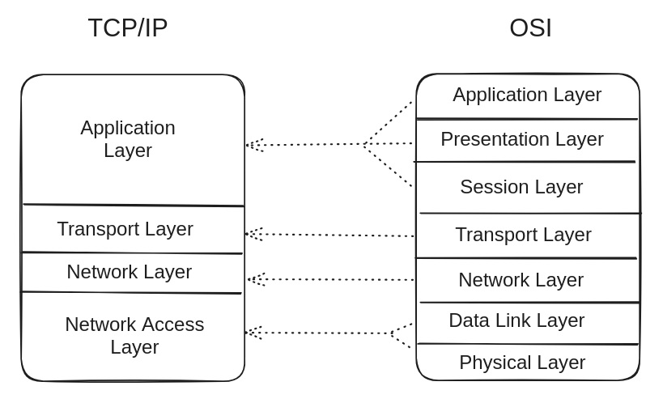

# DevP2P

This section will cover the networking protocol used by the Execution Layer (EL).
First, we will provide some background on computer networks and then we will dive into the
specifics of the EL's networking protocol.

## Computer networks background
This section covers a brief overview of the differences and similarities between the OSI (Open Systems Interconnection) and TCP/IP (Transmission Control Protocol/Internet Protocol) models,
as well as the protocols involved in the transport layer used in DevP2P: TCP and UDP.

In terms of networking, both models refer to the same process of communication between layers.
Just as Kurose and Ross explain (2020), the computer networks are divided into different layers, and each one of them has a specific responsibility. The OSI model has seven layers, while the TCP/IP model has four layers. The OSI model is more theoretical and the TCP/IP model is more practical.
The OSI model is a reference model created by the International Organization for Standardization (ISO) to provide a framework for understanding networks. The TCP/IP model was created by the Department of Defense (DoD) to ensure that messages could be transmitted between computers regardless of the types of computers involved.
The TCP/IP model is a concise version of the OSI model:



In summary, the OSI model layers are:
1. Physical layer: responsible for the transmission and reception of raw data between devices.
2. Data link layer: responsible for the node-to-node delivery of the message.
3. Network layer: responsible for the delivery of packets from the source to the destination.
4. Transport layer: responsible for the delivery of data between the source and the destination.
5. Session layer: responsible for the establishment, management, and termination of connections between applications.
6. Presentation layer: responsible for the translation, compression, and encryption of data.
7. Application layer: responsible for providing network services directly to the end-user.

Assuming the communication schema proposed by Claude Shannon (1948), every communication implies both a sender and a receiver, a message to be exchanged between them, a transmission medium, and a protocol to be followed.
This is important to mention because regardless of the computer architecture, it could be part of a network if it follows the communication and protocol specifications of the models mentioned above.

Focusing on the transport layer, the two protocols used by DevP2P are TCP (Transmission Control Protocol) and UDP (User Datagram Protocol).
Both protocols are used to send data over the internet, but they have different characteristics. Just as Tanenbaum points it out (2021),TCP is a connection-oriented protocol, which means that it establishes a connection between the sender and the receiver before sending data.
It is reliable because it ensures that the data is delivered in the correct order and without errors. UDP is a connectionless protocol, which means that it does not establish a connection before sending data.
It is faster than TCP because it does not have to establish a connection before sending data, but it is less reliable because it does not ensure that the data is delivered in the correct order or without errors.


## EL's networking specs
As a peer-to-peer network Ethereum implies a series of rules to enable communication between its participant nodes. This section cover an explanation of which are those rules and how they are implemented in the EL.
Considering each Ethereum node is built upon two different components: the execution client and the consensus client, each one of them has its own peer-to-peer network with its own purpose.
The execution client is responsible for gossiping transactions, while the consensus client is responsible for gossiping the blocks.

Keeping this in mind, the scope of the EL network covers two different stacks working in parallel: the discovery one, and the information transport itself. 
The discovery stack is responsible for finding the node peers, while the transport stack is responsible for sending and receiving messages between them.
Taking the computer networks background into account, then we can infer that the discovery stack relies on the UDP protocol, while the information exchange stack relies on the TCP protocol.
The reason behind this is that the information exchange requires a reliable connection between the nodes,
so they can be able to both confirm the connection before sending the data and have a way to ensure that the data is delivered in the correct order and without errors (or at least to have a way to detect and correct them),
while the discovery process does not require the reliable connection, since it is enough to let other knows that the node is available to communicate.

### Discv protocol (Discovery)
The process of how the nodes find each other in the network starts with [the hard-coded bootnodes listed in the specification](https://github.com/ethereum/go-ethereum/blob/master/params/bootnodes.go).
The bootnodes are nodes that are known by all the other nodes in the networks (both Mainnet and testnets), and they are used to bootstrap the discovery peers process.
Using the Kademlia-like DHT (Distributed Hash Table) algorithm, the nodes are able to find each other in the network by referring to a routing table where the bootnodes are listed.
The TLDR of the Kademlia is that it is a peer-to-peer protocol that enables nodes to find each other in the network by using a distributed hash table, as Leffew mentioned in his article (2019).

That is to say, the connection process starts with a PING-PONG game where the new node send a PING message to the bootnode, and the bootnode responds with a PONG hashed message.
If both messages match, then the new node is able to bond with the bootnode. In addition to this, the new node sends a FIND-NEIGHBOURS request to the bootnode, so it can receive a list of neighbours that able to connect with,
so it can repeat the PING-PONG game with them and bond with them as well.


#### Wire protocol
The PING/PONG game is better known as the wire subprotocol, and it includes the next specifications:

**PING packet structure**
```
version = 4
from = [sender-ip, sender-udp-port, sender-tcp-port]
to = [recipient-ip, recipient-udp-port, 0]
packet-data = [version, from, to, expiration, enr-seq ...]
```

**PONG packet structure**
```
packet-data = [to, ping-hash, expiration, enr-seq, ...]
```

The packet-data is wrapped in 1280 bytes UDP datagram alongside with the header:
```
packet-header = hash || signature || packet-type
hash = keccak256(signature || packet-type || packet-data)
signature = sign(packet-type || packet-data)
packet = packet-header || packet-data
```

**FindNode packet structure** (called FIND-NEIGHBOURS above)
```
packet-data = [target, expiration, ...]
```
Where the target is a 64-byte secp256k1 node's public key.

**Neighbours packet structure**
```
packet-data = [expiration, neighbours, ...]
neighbours = [ip, udp-port, tcp-port, node-id, ...]
```
Where the neighbours are the list of 16 nodes that are able to connect with the new node.

**ENR Request packet structure**
```
packet-data = [expiration]
```

**ENR Response packet structure**
```
packet-data = [request-hash, ENR]
```
Where ENR is the Ethereum Node Record, a standard format for connectivity for nodes. Which it is explained below.

---
Currently, the execution clients are using the [Discv4 protocol](https://github.com/ethereum/devp2p/blob/master/discv4.md) for the discovery process, although it is planned to be migrated to [Discv5](https://github.com/ethereum/devp2p/blob/master/discv5/discv5.md) in the future. 
This Kademlia-like protocol includes the routing table, which keeps information about other nodes in the neighbourhood consisting of *k-buckets* (where *k* is the number of nodes in the bucket, currently defined as 16).
Worth mentioning that all the table entries are sorted by *last seen/least-recently seen* at the head, and most-recently seen at the tail.
If one of the entities has not been responded to in 12 hours, it is removed from the table, and the next encounter node is added to the tail of the list.

### ENR: Ethereum Node Records
The ENR is a standard format for p2p connectivity, which was originally proposed in the [EIP-778](https://eips.ethereum.org/EIPS/eip-778).
A node record contains the node's network endpoints, such as the IP address and port, as well as the node's public key and the sequence number of the record.

The record content structure is as follows:

| Key | Value                                     |
| --- |-------------------------------------------|
| id | id scheme, e.g "v4"                       |
| secp256k1 | compressed public key, 33 bytes           |
| ip | IPv4 address, 4 bytes                     |
| tcp | TCP port, big endian integer              |
| udp | UDP port, big endian integer              |
| ip6 | IPv6 address, 16 bytes                    |
| tcp6 | IPv6-specific TCP port, big endian integer |
| udp6 | IPv6-specific UDP port, big endian integer |

All the fields are optional, except for the `id` field, which is required. If no `tcp6`/`udp6` port are provided, the `tcp`/`udp` ports are used for both IPv4 and IPv6.

The node record is composed of a `signature`, which is the cryptographic signature of record contents, and a `seq` field, which is the sequence number of the record (a 64-bit unsigned integer).
#### Encoding

The record is encoded as an RLP list of `[signature, seq, k, v,...]` with a maximum size of 300 bytes.
Signed records are encoded as follows:
```
content = [seq, k, v, ...]
signature = sign(content)
record = [signature, seq, k, v, ...]
```
In addition to the RLP encoding, there is a textual representation of the record, which is a base64 encoding of the RLP encoding. It is prefixed with `enr:`.
i.e. `enr:-IS4QHCYrYZbAKWCBRlAy5zzaDZXJBGkcnh4MHcBFZntXNFrdvJjX04jRzjzCBOonrkTfj499SZuOh8R33Ls8RRcy5wBgmlkgnY0gmlwhH8AAAGJc2VjcDI1NmsxoQPKY0yuDUmstAHYpMa2_oxVtw0RW_QAdpzBQA8yWM0xOIN1ZHCCdl8` which contains the loopback address `127.0.0.1` and the UDP port 30303. The node ID is `a448f24c6d18e575453db13171562b71999873db5b286df957af199ec94617f7`.

Despite of the fact that the ENR is a standard format for p2p connectivity, it is not mandatory to use it in the Ethereum network. The nodes can use any other format to exchange the information about their connectivity.
There are two additional formats able to be understand by an Ethereum node: multiaddr and enode.

* The multiaddr was the original one. For example, the multiaddr for a node with a loopback IP listening on TCP port 30303 and node ID `a448f24c6d18e575453db13171562b71999873db5b286df957af199ec94617f7`  is `/ip4/127.0.0.1/tcp/30303/a448f24c6d18e575453db13171562b71999873db5b286df957af199ec94617f7`.
* The enode is a more human-readable format. For example, the enode for the same node is `enode://a448f24c6d18e575453db13171562b71999873db5b286df957af199ec94617f7@127.0.0.1:30303?discport=30301`. It is a URL-like format describing the node ID encoded before de @ sign, the IP address, the TCP port and the UDP port specified as "discport".

### RLPx protocol (Transport)

So far, this article has been refering to the discovering protocol only, but what about the secure information exchange process? Well, RLPx is the TCP-based transport protocol that enables secure peer-to-peer communication in the EL. It handles connection establishment, and message exchange between Ethereum nodes. The name comes from the RLP serialization format.

Before deep diving on the protocol, here it is a summary followed by a digram:

* Secure connection through an encrypted authentication
* Session establishment
* Message framing and information exchange


#### Secure connection establishment

Once the peers are discovered, RLPx establishes a secure connection between them by authenticating them through cryptographic-based handshake.
This process begins with an authentication initiation where the initiator node generates an ephemeral key pair using the secp256k1 elliptic curve. This ephemeral key plays a crucial role in establishing perfect forward secrecy for the session.

#### Session and multiplexing

#### Messaging framing

### Further Reading
* [Geth devp2p docs](https://geth.ethereum.org/docs/tools/devp2p)
* [Ethereum devp2p GitHub](https://github.com/ethereum/devp2p)
* [Ethereum networking layer](https://ethereum.org/en/developers/docs/networking-layer/)
* [Ethereum Addresses](https://ethereum.org/en/developers/docs/networking-layer/network-addresses/)
* Andrew S. Tanenbaum, Nick Feamster, David J. Wetherall (2021). *Computer Networks*. 6th edition. Pearson. London.
* Clause E. Shannon (1948). "A Mathematical Theory of Communication". *Bell System Technical Journal*. Vol. 27.
* Jim Kurose and Keith Ross (2020). *Computer Networking: A Top-Down Approach*. 8th edition. Pearson.
* Kevin Leffew (2019). "Kademlia usage in the Ethereum protocol". [*A brief overview of Kademlia, and its use in various decentralized platforms*](https://medium.com/coinmonks/a-brief-overview-of-kademlia-and-its-use-in-various-decentralized-platforms-da08a7f72b8f). Medium.
