# The Ethereum Virtual Machine (EVM)

You have likely observed that Ethereum transactions take some time to finalise, [around 12 seconds](https://web.archive.org/web/20240304145956/https://etherscan.io/chart/blocktime) at the time of writing. A series of crucial steps occur during this timeframe. The transaction is first queued in a pool. Then, it is selected by a node and executed by a special program - **the Ethereum Virtual Machine (EVM)**, the result of which is stored on the blockchain.

This article describes the role of EVM in ethereum ecosystem and how it works. As the EVM executes transactions, it modifies the overall state of ethereum. In that regard, ethereum can be modeled as a **state machine**.

## The Ethereum state machine

In computer science, **state machine** is an abstraction used to model the behavior of a system. It illustrates how a system can be represented by a set of distinct states and how inputs can drive changes in the state.

A familiar example of a state machine is the vending machine, an automated system dispensing products upon receiving payment.

We can model the vending machine existing in three distinct states: idle, awaiting user selection, and dispensing a product. Inputs such as coin insertion or product selection trigger transitions between these states, as depicted in the state diagram:

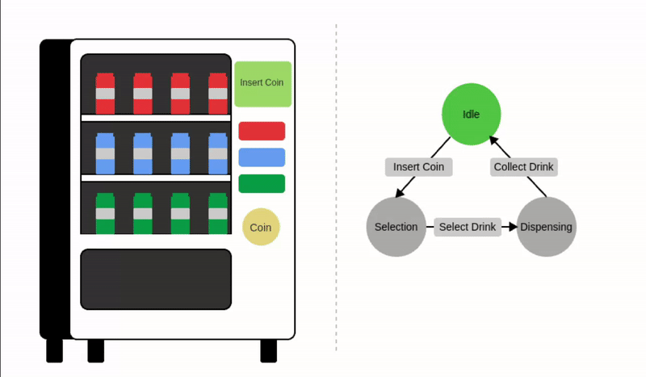

Let's formally define the components of a state machine:

1. **State ($S$)**: A State represents distinct conditions or configurations that a system can be in at a given point in time.
   For the vending machine, possible states are:

$$ S\in \set {Idle, Selection, Dispensing} $$

2. **Inputs ($I$)**: Inputs are actions, signals, or changes in the system's environment. Input triggers the **state transition function**.
   For the vending machine, possible inputs include:

$$ I\in \set {InsertCoin, SelectDrink, CollectDrink} $$

3. **State transition function ($\Upsilon$)**: State transition function defines how the system transitions from one state to another (or back to the same state) based on an input and its current state. Essentially, it determines how the system evolves in response to inputs.

$$\Upsilon (S,I) \Longrightarrow S'  $$

> Where S' = next state, S= current state and, I= input.

Example state transition for the vending machine:

$$\Upsilon (Idle,InsertCoin) \Longrightarrow Selection $$
$$\Upsilon (Selection,SelectDrink) \Longrightarrow Dispensing $$
$$\Upsilon (Idle,SelectDrink) \Longrightarrow Idle $$

Notice in the last case, the current state transitions back to itself.

### Ethereum as a state machine

Ethereum, as a whole, can be viewed as a **transaction-based state machine**. It receives transactions as inputs and transitions into a new state. The current state of Ethereum is referred to as the **world state**.

Let's consider a simple Ethereum application - an NFT marketplace.

In the current world state **S3** (green), Alice owns an NFT. The animation below shows a transaction transferring ownership to you (**S3** ➡️ **S4**). Similarly, selling the NFT back to Alice would transition the state to **S5**:

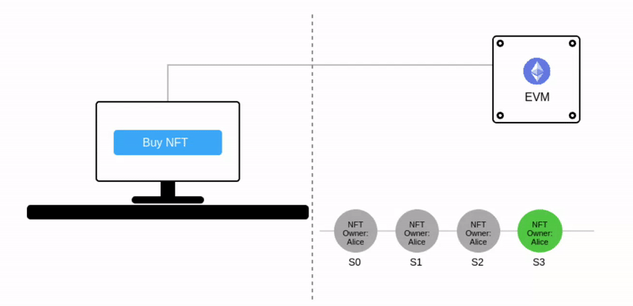

Notice that the world state is animated _as a pulsating green bubble_.

In the model above, each transaction is committed to a new state. However, in reality, a group of transactions is bundled into a **block**, and the resulting state is added to the chain of previous states. It must be apparent now why this technology is called **blockchain**.

Considering the definition of the state transition function, we draw the following conclusion:

> ℹ️ Note  
> **EVM is the state transition function of the Ethereum state machine. It determines how Ethereum transitions into a new (world) state based on input (transactions) and current state.**

## Virtual machine paradigm

Given our grasp of state machines, the next challenge is **implementation**.

Software needs conversion to the target processor's machine language (Instruction Set Architecture, ISA) for execution. This ISA varies across hardware (e.g., Intel vs. Apple silicon). Modern software also relies on the host operating system for memory management and other essentials.

Ensuring functionality within a fragmented ecosystem of diverse hardware and operating systems is a major hurdle. Traditionally, software had to be compiled into native binaries for each specific target platform:

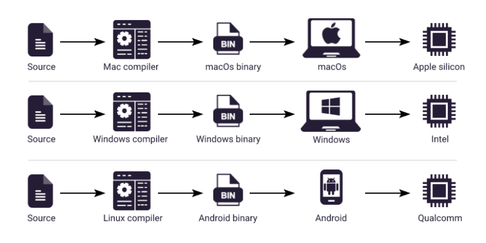

To address this challenge, a two-part solution is employed.

First, the implementation targets a **virtual machine**, an abstraction layer. Source code is compiled into **bytecode**, a sequence of bytes representing instructions. Each bytecode maps to a specific operation the virtual machine executes.

The second part involves a platform-specific virtual machine that translates the bytecode into native code for execution.

This offers two key benefits: portability (bytecode runs on different platforms without recompiling) and abstraction (separates hardware complexities from software). Developers can thus write code for a single, virtual machine:

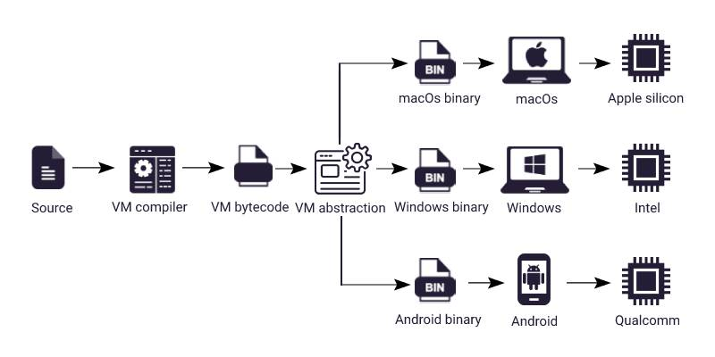

## EVM and the world state

This virtual machine concept serves as an abstraction. Ethereum Virtual Machine (EVM) is a specific software implementation of this abstraction. The anatomy of the EVM is described below:

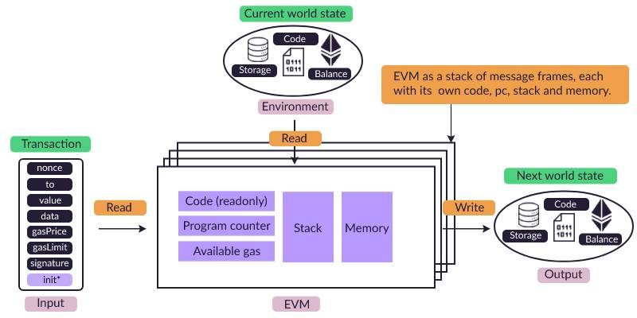

_For clarity, the figure above simplifies the Ethereum state. The actual state includes additional elements like Message Frames and Transient Storage._

> In Ethereum, the world state is essentially a mapping of 20-byte addresses to account states.

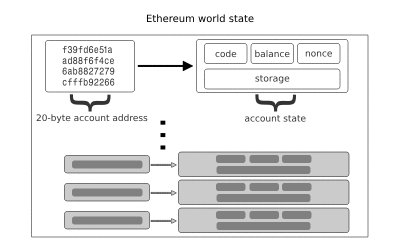

Each account state consists of various components such as storage, code, balance among other data and is associated with a specific address.

Ethereum has two kinds of accounts:

- **External account:** An account [controlled by an associated private key](/wiki/Cryptography/ecdsa.md) and empty EVM code.
- **Contract account:** An account controlled by an associated non-empty EVM code. The EVM code as part of such an account is colloquially known as a _smart contract._

In the anatomy described above, EVM is shown to be manipulating the storage, code, and balance of an account instance.

In a real-world scenario, EVM may execute transactions involving multiple accounts (each with independent storage, code, and balance) enabling complex interactions on Ethereum.

With a better grasp of virtual machines, lets extend our definition:

> ℹ️ Note  
> EVM is the state transition function of the Ethereum state machine. It determines how Ethereum transitions into a new (world) state based on
> input (transactions) and current state. **It is implemented as a virtual machine so that it can run on any platform, independent of the
> underlying hardware.**

## EVM bytecode

EVM bytecode is a representation of a program as a sequence of [**bytes** (8 bits).](https://en.wikipedia.org/wiki/Byte) Each byte within the bytecode is either:

- an instruction known as **opcode**, or
- input to an opcode known as **operand**.

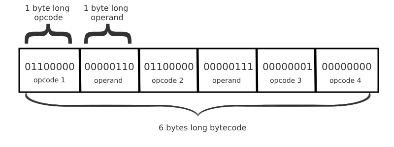

For brevity, EVM bytecode is commonly expressed in [**hexadecimal**](https://en.wikipedia.org/wiki/Hexadecimal) notation:

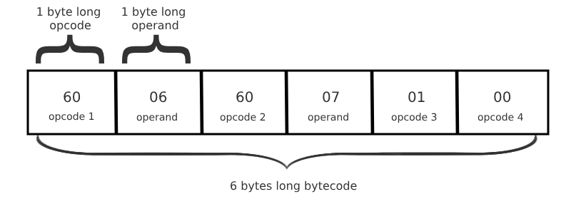

To further enhance comprehension, opcodes have human-readable mnemonics. This simplified bytecode, called **EVM assembly**, is the lowest human-readable form of EVM code:

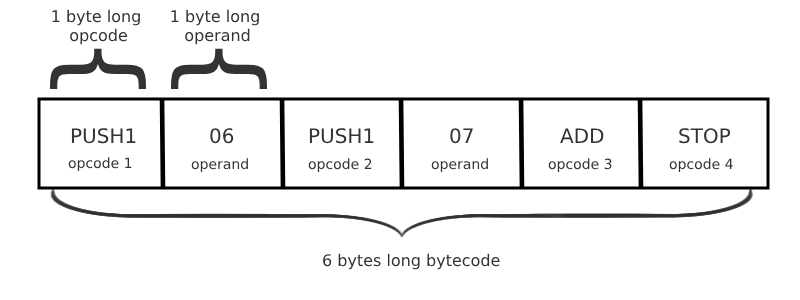

Identifying opcodes from operands is straightforward. Currently, only `PUSH*` opcodes have operands (this might change with [EOF](https://eips.ethereum.org/EIPS/eip-7569)). `PUSHX` defines operand length (X bytes after PUSH).

Select Opcodes used in this discussion:

| Opcode | Name     | Description                                        |
| ------ | -------- | -------------------------------------------------- |
| 60     | PUSH1    | Push 1 byte on the stack                           |
| 01     | ADD      | Add the top 2 values of the stack                  |
| 02     | MUL      | Multiply the top 2 values of the stack             |
| 39     | CODECOPY | Copy code running in current environment to memory |
| 51     | MLOAD    | Load word from memory                              |
| 52     | MSTORE   | Store word to memory                               |
| 53     | MSTORE8  | Store byte to memory                               |
| 59     | MSIZE    | Get the byte size of the expanded memory           |
| 54     | SLOAD    | Load word from storage                             |
| 55     | SSTORE   | Store word to storage                              |
| 56     | JUMP     | Alter the program counter                          |
| 5B     | JUMPDEST | Mark destination for jumps                         |
| f3     | RETURN   | Halt execution returning output data               |

Refer [Appendix H of Yellow Paper](https://ethereum.github.io/yellowpaper/paper.pdf) for a comprehensive list.

> ℹ️ Note  
> [EIPs](https://eips.ethereum.org/) can propose EVM modifications. For instance, [EIP-1153](https://eips.ethereum.org/EIPS/eip-1153) introduced `TSTORE`, and `TSTORE` opcodes.

We have covered **what** EVM is, let's explore **how** it works.

## Stack

Stack is a simple data structure with two operations: **PUSH** and **POP**. Push adds an item to top of the stack, while pop removes the top-most item. Stack operates on Last-In-First-Out (LIFO) principle - the last element added is the first removed. If you try to pop from an empty stack, a **stack underflow error** occurs.

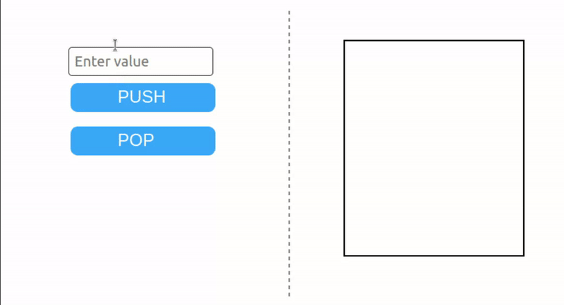

> The EVM stack has a maximum size of 1024 items.

During bytecode execution, EVM stack functions as a _scratchpad_: opcodes consume data from the top and push results back (See the `ADD` opcode below). Consider a simple addition program:

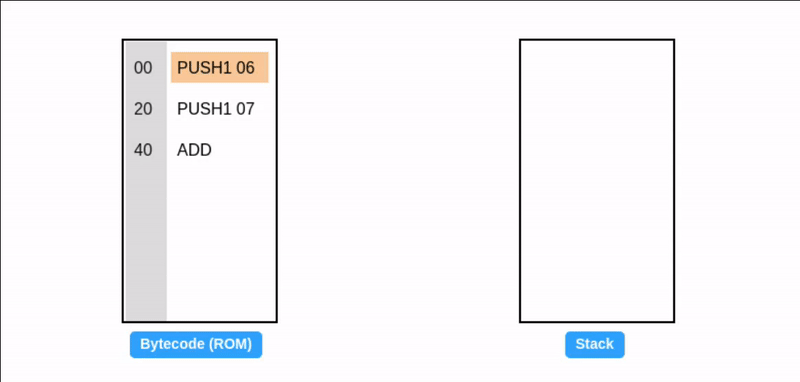

Reminder: All values are in hexadecimal, so `0x06 + 0x07 = 0x0d (decimal: 13)`.

Let's take a moment to celebrate our first EVM assembly code 🎉.

## Program counter

In the example above, the values on the left of the assembly code represent the byte offset (starting at 0) of each opcode within the bytecode:

| Bytecode | Assembly | Length of Instruction in bytes | Offset in hex |
| -------- | -------- | ------------------------------ | ------------- |
| 60 06    | PUSH1 06 | 2                              | 00            |
| 60 07    | PUSH1 07 | 2                              | 02            |
| 01       | ADD      | 1                              | 04            |

EVM **program counter** stores the byte offset of the next opcode (highlighted) to be executed.


The `JUMP` opcode directly sets the program counter, enabling dynamic control flow and contributing to the EVM's [Turing completeness](https://en.wikipedia.org/wiki/Turing_completeness) by allowing flexible program execution paths.

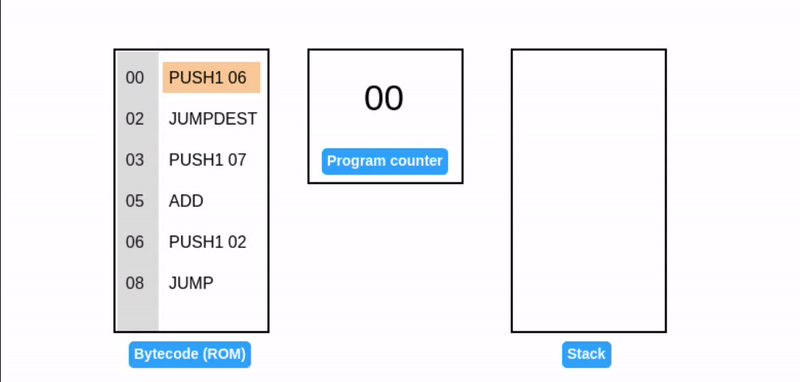

The code runs in an infinite loop, repeatedly adding 7. It introduces two new opcodes:

- **JUMP**: Sets the program counter to stack top value (02 in our case), determining the next instruction to execute.
- **JUMPDEST**: Marks the destination of a jump operation, ensuring intended destinations and preventing unwanted control flow disruptions.

> High level languages like [Solidity](https://soliditylang.org/) leverage jumps for constructs like if conditions, for loops, and internal functions calls.

## Gas

Our innocent little program may seem harmless. However, infinite loops in EVM pose a significant threat: they can **devour resources**, potentially causing network [**DoS attacks**.](https://en.wikipedia.org/wiki/Denial-of-service_attack)

The EVM's **gas** mechanism tackles such threats by acting as a currency for computational resources. Transactions pay gas in Ether (ETH) to use the EVM, and if they run out of gas before finishing (like an infinite loop), the EVM halts them to prevent resource hogging.

This protects the network from getting clogged by resource-intensive or malicious activities. Since gas restricts computations to a finite number of steps, the EVM is considered **quasi Turing complete**.


Our example assumed 1 unit of gas per opcode for simplicity, but the actual cost varies based on complexity. The core concept, however, remains unchanged.

Refer [Appendix G of Yellow Paper](https://ethereum.github.io/yellowpaper/paper.pdf) for specific gas costs.

## Memory

EVM memory is designed as a **word-addressed byte array**. In computer architecture, a word refers to a fixed-size unit of data that the CPU can process at once. EVM has a word size of **32 bytes**.

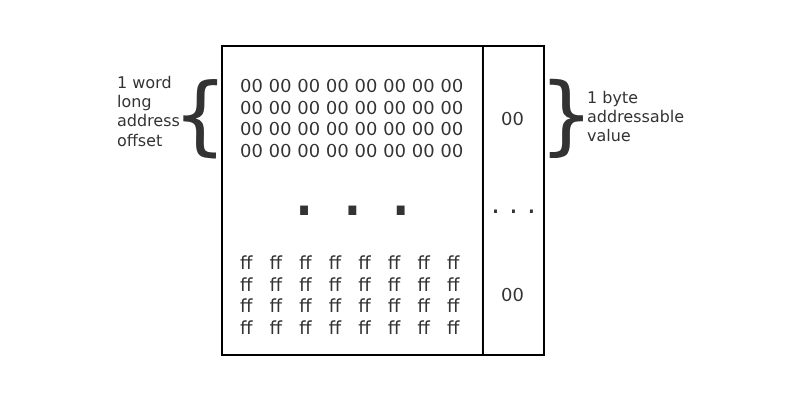

Unlike stack, which provides data to individual instructions, memory stores data that is relevant to the entire program.

### Writing to memory

`MSTORE` takes two values from the stack: an address **offset** and a 32-byte **value**. It then writes the value to memory at the specified offset.

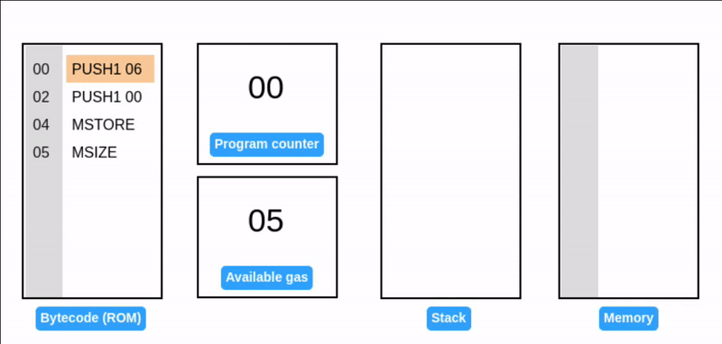

`MSIZE` reports currently used memory size (in bytes) on the stack (32 bytes or 20 hex in this case).

`MSTORE8` takes same arguments as `MSTORE`, but writes 1 byte instead of 1 word.


Notice: When writing 07 to memory, the existing value (06) remains unchanged. It's written to the adjacent byte offset.

The size of active memory is still 1 word.

### Memory expansion

In EVM, memory is dynamically allocated in multiples of 1 word “pages”. Gas is charged for the number of pages expanded. All locations in memory are well-defined initially as zero.

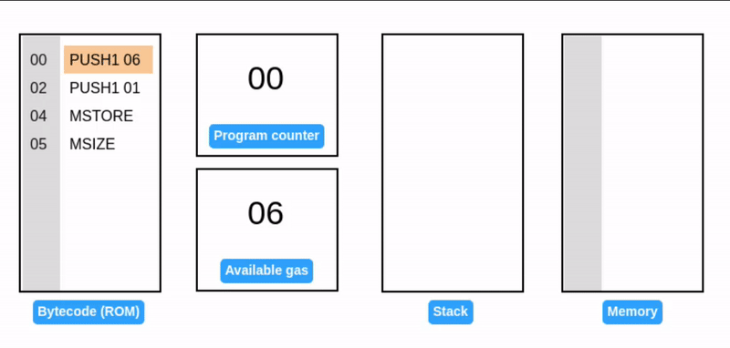

Writing a word at a 1-byte offset overflows the initial memory page, triggering an expansion to 2 words (64 bytes or 0x40).

### Reading from memory

`MLOAD` reads a value from memory and pushes it onto the stack.


EVM doesn't have a direct equivalent to `MSTORE8` for reading. You must read the entire word using `MLOAD` and then extract the desired byte using a [mask](<https://en.wikipedia.org/wiki/Mask_(computing)>).

> EVM memory is shown as blocks of 32 bytes to illustrate how memory expansion works. In reality, it is a seamless sequence of bytes, without any inherent divisions or blocks.

## Storage

Storage is designed as a **word-addressed word array**. Unlike memory, storage is associated with an Ethereum account and is **persisted** across transactions as part of the world state.


Storage can only be accessed via the code of its associated account. External accounts don't have code and therefore cannot access their own storage.

## Writing to storage

`SSTORE` takes two values from the stack: a storage **slot** and a 32-byte **value**. It then writes the value to storage of the account.


We've been running a contract account's bytecode all this time. Only now we see the account and the world state, and it matches the code inside the EVM.

Again, it’s important to note that storage is not part of the EVM itself, rather the currently executing contract account.

The example above shows only a small section of the account's storage. Like memory, all the values in storage are well-defined as zero.

### Reading from storage

`SLOAD` takes the storage **slot** from the stack and loads its value back onto it.

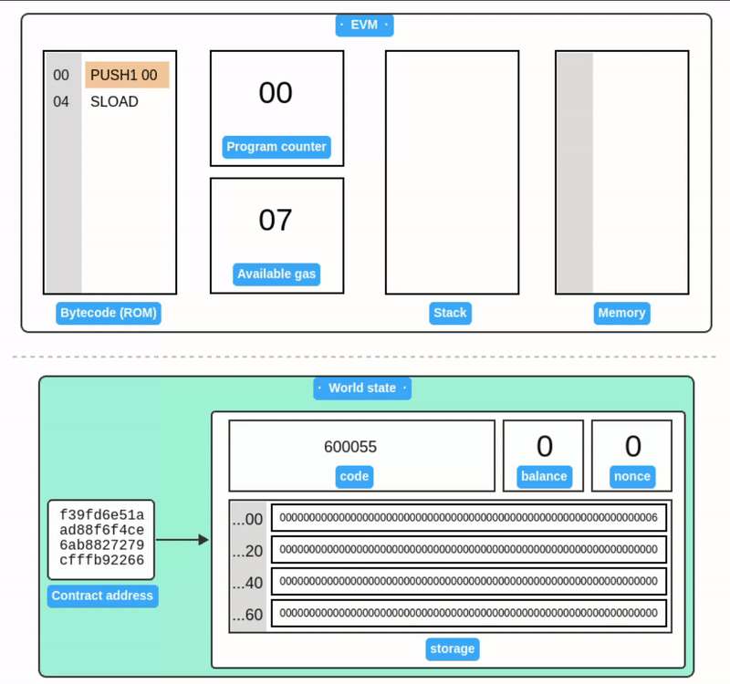

> Notice that the storage value persists between examples. This demonstrating its persistence within the world state. Since the world state is replicated across all nodes, storage operations are gas expensive.

## Transaction

A **transaction** is a cryptographically-signed instruction issued by **an external account**, broadcasted to the entire network using [JSON-RPC](/wiki/EL/json-rpc.md).

A transaction contains following fields:

- **nonce ($T_n$)**: An integer value equal to the number of transactions sent by the sender. Nonce is used to:

  - **Prevent replay attack**: Let's say Alice sends 1 ETH to Bob in a transaction, Bob might try to rebroadcast the same transaction into the network to get additional funds from Alice's account. Since the transaction is signed with a unique nonce, EVM will simply reject it if Bob sends it again. Thus safeguarding Alice's account from unauthorized duplicate transactions.
  - **Determine contract account address**: In `contract creation` mode, nonce along with the sender's address is used to determine the contract account address.
  - **Replace a transaction**: When a transaction gets stuck due to low gas price, miners often allow a replacement transaction that has the same nonce. Some wallets may provide the option to cancel a transaction by exploiting this behavior. Essentially, a new transaction with the same nonce, higher gas price, and 0 value is sent, effectively overshadowing the original pending transaction. However, it's crucial to understand that the success of replacing a pending transaction is not guaranteed, as it relies on the behavior of miners and network conditions.

- **gasPrice ($T_p$)**: An integer value equal to the number wei to be paid per unit of gas. **Wei** is the smallest denomination of ether. $1 ETH = 10^{18} Wei$. Gas price is used to prioritize the execution of a transaction. Higher the gas price, more likely that a miner will include the transaction as part of a block.

- **gasLimit ($T_g$)**: An integer value equal to the maximum amount of gas to be used in execution of this transaction. Execution of this transaction will stop if the gasLimit is exhausted.

- **to ($T_t$)**: The 20 byte address of the recipient of this transaction. The `to` also field determines the mode or purpose of the transaction:

| Value of `to`    | Transaction Mode   | Description                                               |
| ---------------- | ------------------ | --------------------------------------------------------- |
| _Empty_          | Contract creation  | The transaction creates a new contract account.           |
| External Account | Value transfer     | The transaction transfers Ether to an external account.   |
| Contract Account | Contract execution | The transaction invokes the existing smart contract code. |

- **value ($T_v$)**: An integer value equal to the number of Wei to be transferred to this transaction's recipient. In `Contract creation` mode, value becomes the initial balance of the newly created contract account.

- **data ($T_d$) or init($T_i$)**: An unlimited size byte array specifying the input to the EVM. In contract `creation mode`, this value is considered as `init bytecode`, otherwise byte array of `input data`.

- **Signature ($T_v, T_r, T_s$)**: [ECDSA](/wiki/Cryptography/ecdsa.md) signature of the sender.

### Contract creation

Let's deploy the following code onto a new contract account:

```bash
[00] PUSH1 06 // Push 06
[02] PUSH1 07 // Push 07
[04] MUL      // Multiply
[05] PUSH1 0  // Push 00 (storage address)
[07] SSTORE   // Store result to storage location 00
```

The brackets indicate instruction offset. The corresponding bytecode becomes:

```bash
6006600702600055
```

Now, let's prepare the `init` value of our transaction to deploy this bytecode. Init actually consists of two fragments:

```
<init bytecode> <runtime bytecode>
```

`init` is executed by EVM only once at account creation. The return value of init code execution is the **runtime bytecode**, which is stored as part of the contract account. Runtime bytecode is executed every time a contract account receives a transaction.

Let's prepare our init code such that it returns our runtime code:

```bash
// 1. Copy to memory
[00] PUSH1 08 // PUSH1 08 (length of our runtime code)
[02] PUSH1 0c // PUSH1 0c (offset of the runtime code in init)
[04] PUSH1 00 // PUSH1 00 (destination in memory)
[06] CODECOPY // Copy code running in current environment to memory
// 2. Return from memory
[07] PUSH1 08 // PUSH1 08 (length of return data)
[09] PUSH1 00 // PUSH1 00 (memory location to return from)
[0b] RETURN   // Return the runtime code and halt execution
// 3. Runtime code (8 bytes long)
[0c] PUSH1 06
[0e] PUSH1 07
[10] MUL
[11] PUSH1 0
[13] SSTORE
```

The code does 2 simple things: First, copy the runtime bytecode to memory and then return the runtime bytecode from memory.

Init bytecode becomes:

```javascript
6008600c60003960086000f36006600702600055
```

Next, prepare the transaction payload:

```javascript
[
  "0x", // nonce (zero nonce, since first transaction)
  "0x77359400", // gasPrice (we're paying 2000000000 wei per unit of gas)
  "0x13880", // gasLimit (80000 is standard gas for deployment)
  "0x", // to address (empty in contract creation mode)
  "0x05", //value (we'll be nice and send 5 wei to our new contract)
  "0x6008600c60003960086000f36006600702600055", // init code
];
```

> Order of the values in the payload is important!

Install [foundry](https://getfoundry.sh/) to deploy the transaction locally and launch [anvil](https://book.getfoundry.sh/anvil/) local node.

```
$ anvil


                             _   _
                            (_) | |
      __ _   _ __   __   __  _  | |
     / _` | | '_ \  \ \ / / | | | |
    | (_| | | | | |  \ V /  | | | |
     \__,_| |_| |_|   \_/   |_| |_|

    0.2.0 (5c3b075 2024-03-08T00:17:08.007462509Z)
    https://github.com/foundry-rs/foundry

Available Accounts
==================

(0) "0xf39Fd6e51aad88F6F4ce6aB8827279cffFb92266" (10000.000000000000000000 ETH)
.....

Private Keys
==================

(0) 0xac0974bec39a17e36ba4a6b4d238ff944bacb478cbed5efcae784d7bf4f2ff80
.....
Listening on 127.0.0.1:8545
```

Sign the transaction using one of anvil's dummy account:

```bash
$ node sign.js '[ "0x", "0x77359400", "0x13880", "0x", "0x05", "0x6008600c60003960086000f36006600702600055" ]' ac0974bec39a17e36ba4a6b4d238ff944bacb478cbed5efcae784d7bf4f2ff80

f864808477359400830138808005946008600c60003960086000f360066007026000551ca01446316c9bdcbe0cb87fac0b08a00e59552634c96d0d6e2bd522ea0db827c1d0a0170680b6c348610ef150c1b443152214203c7f66288ea6332579c0cdfa86cc3f
```

> See **Appendix A** below for the source of `sign.js` helper script.

Finally, submit the transaction using [cast](https://book.getfoundry.sh/cast/):

```javascript
$ cast publish f864808477359400830138808005946008600c60003960086000f360066007026000551ca01446316c9bdcbe0cb87fac0b08a00e59552634c96d0d6e2bd522ea0db827c1d0a0170680b6c348610ef150c1b443152214203c7f66288ea6332579c0cdfa86cc3f

{
  "transactionHash": "0xdfaf2817f19963846490b330ae33eba7b42872e8c8bd111c8d7ea3846c84cd51",
  "transactionIndex": "0x0",
  "blockHash": "0xfde1475a716583d847f858c5db3e54156983b39e3dbefaa5829416e6e60a788a",
  "blockNumber": "0x1",
  "from": "0xf39fd6e51aad88f6f4ce6ab8827279cfffb92266",
  "to": null,
  "cumulativeGasUsed": "0xd67e",
  "gasUsed": "0xd67e",
  // Newly created contract address 👇
  "contractAddress": "0x5fbdb2315678afecb367f032d93f642f64180aa3",
  "logs": [],
  "status": "0x1",
  "logsBloom": "0x0...",
  "effectiveGasPrice": "0x77359400"
}
```

Querying the local `anvil` node confirms that code is deployed:

```bash
$ cast code 0x5fbdb2315678afecb367f032d93f642f64180aa3
0x6006600702600055
```

And the initial balance is available:

```bash
$ cast balance 0x5fbdb2315678afecb367f032d93f642f64180aa3
5
```

---

Simulation of contract creation:

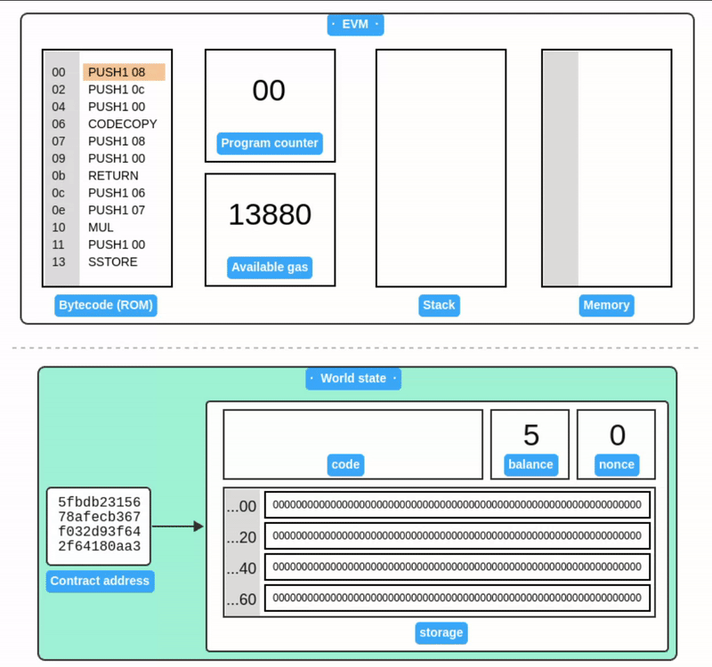

### Contract code execution

Our simple contract multiplies 6 and 7, then stores the result to storage slot 0. Let's execute the contract code with another transaction.

The transaction payload is similar, except `to` address points to the smart contract, `value` and `data` is empty:

```javascript
[
  "0x1", // nonce (increased by 1)
  "0x77359400", // gasPrice (we're paying 2000000000 wei per unit of gas)
  "0x13880", // gasLimit (80000 is standard gas for deployment)
  "0x5fbdb2315678afecb367f032d93f642f64180aa3", // to address ( address of our smart contract)
  "0x", // value (empty; not sending any ether)
  "0x", // data (empty)
];
```

Sign the transaction:

```bash

$ node sign.js '[ "0x1", "0x77359400", "0x13880", "0x5fbdb2315678afecb367f032d93f642f64180aa3", "0x", "0x"]' ac0974bec39a17e36ba4a6b4d238ff944bacb478cbed5efcae784d7bf4f2ff80

f86401847735940083013880945fbdb2315678afecb367f032d93f642f64180aa380801ba047ae110d52f7879f0ad214784168406f6cbb6e72e0cab59fa4df93da6494b578a02c72fcdea5b7838b520664186707d1465596e4ad4eaf8781a721530f8b8dd5f2
```

Publish the transaction:

```bash
$ cast publish f86401847735940083013880945fbdb2315678afecb367f032d93f642f64180aa380801ba047ae110d52f7879f0ad214784168406f6cbb6e72e0cab59fa4df93da6494b578a02c72fcdea5b7838b520664186707d1465596e4ad4eaf8781a721530f8b8dd5f2

{
  "transactionHash": "0xc82a658b947c6083de71a0c587322e8335448e65e7310c04832e477558b2b0ef",
  "transactionIndex": "0x0",
  "blockHash": "0x40dc37d9933773598094ec0147bef5dfe72e9654025bfaa80c4cdbf634421384",
  "blockNumber": "0x2",
  "from": "0xf39fd6e51aad88f6f4ce6ab8827279cfffb92266",
  "to": "0x5fbdb2315678afecb367f032d93f642f64180aa3",
  "cumulativeGasUsed": "0xa86a",
  "gasUsed": "0xa86a",
  "contractAddress": null,
  "logs": [],
  "status": "0x1",
  "logsBloom": "0x0...",
  "effectiveGasPrice": "0x77359400"
}
```

Read storage **slot 0** using cast:

```
$ cast storage 0x5fbdb2315678afecb367f032d93f642f64180aa3 0x
0x000000000000000000000000000000000000000000000000000000000000002a
```

Sure enough, the result is indeed [42](<https://simple.wikipedia.org/wiki/42_(answer)>) (0x2a) 🎉.

---

Simulation of contract execution:

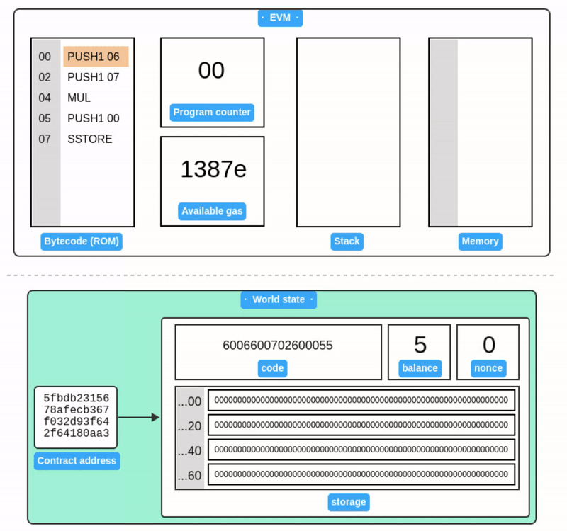

## Wrapping up

Developers rarely write EVM assembly code directly unless performance optimization is crucial. Instead, most developers work with higher-level languages like Solidity, which is then compiled into bytecode.

Ethereum is a continuously evolving protocol e.g., [EIP-155](https://eips.ethereum.org/EIPS/eip-155) extends transaction payload. While the fundamentals we've discussed will remain largely relevant, following [Ethereum Improvement Proposals (EIPs)](https://eips.ethereum.org/) is encouraged to stay informed of the latest developments in the Ethereum ecosystem.

## Appendix A: Transaction signer

`signer.js`: A simple [node.js](https://nodejs.org/) script for signing transactions. See comments for explanation:

```javascript
/**
 * Utility script to sign a transaction payload array.
 * Usage: node sign.js '[payload]' [private key]
 */

const { rlp, keccak256, ecsign } = require("ethereumjs-util");

// Parse command-line arguments
const payload = JSON.parse(process.argv[2]);
const privateKey = Buffer.from(process.argv[3].replace("0x", ""), "hex");

//valdiate privatekey length
if (privateKey.length != 32) {
  console.error("Private key must be 64 characters long!");
  process.exit(1);
}

// STEP 1: Encode payload to RLP
// Learn more: https://ethereum.org/en/developers/docs/data-structures-and-encoding/rlp/
const unsignedRLP = rlp.encode(payload);

// STEP 2: Hash the RLP encoded payload
// Learn more: https://ethereum.org/en/glossary/#keccak-256
const messageHash = keccak256(unsignedRLP);

// STEP 3: Sign the message
// Learn more: https://epf.wiki/#/wiki/Cryptography/ecdsa
const { v, r, s } = ecsign(messageHash, privateKey);

// STEP 4: Append signature to payload
payload.push(
  "0x".concat(v.toString(16)),
  "0x".concat(r.toString("hex")),
  "0x".concat(s.toString("hex"))
);

// STEP 5: Output RLP encoded signed transaction
console.log(rlp.encode(payload).toString("hex"));
```

## Resources

### State machines and theory of computation

- 📝 Mark Shead, ["Understanding State Machines."](https://medium.com/free-code-camp/state-machines-basics-of-computer-science-d42855debc66) • [archived](https://web.archive.org/web/20210309014946/https://medium.com/free-code-camp/state-machines-basics-of-computer-science-d42855debc66)
- 🎥 Prof. Harry Porter, ["Theory of computation."](https://www.youtube.com/playlist?list=PLbtzT1TYeoMjNOGEiaRmm_vMIwUAidnQz)
- 📘 Michael Sipser, ["Introduction to the Theory of Computation."](https://books.google.com/books/about/Introduction_to_the_Theory_of_Computatio.html?id=4J1ZMAEACAAJ)
- 🎥 Shimon Schocken et al., ["Build a Modern Computer from First Principles: From Nand to Tetris"](https://www.coursera.org/learn/build-a-computer)

### EVM

- 📝 Gavin Wood, ["Ethereum Yellow Paper."](https://ethereum.github.io/yellowpaper/paper.pdf)
- 📘 Andreas M. Antonopoulos, Gavin Wood, ["Mastering Ethereum."](https://github.com/ethereumbook/ethereumbook)
- 📝 NOXX, ["EVM Deep Dives: The Path to Shadowy Super Coder."](https://noxx.substack.com/p/evm-deep-dives-the-path-to-shadowy) • [archived](https://web.archive.org/web/20240106034644/https://noxx.substack.com/p/evm-deep-dives-the-path-to-shadowy)
- 📝 Shafu, ["EVM from scratch."](https://evm-from-scratch.xyz/)
- 📝LeftAsExercise, ["Smart contracts and the Ethereum virtual machine."](https://leftasexercise.com/2021/08/08/q-smart-contracts-and-the-ethereum-virtual-machine/) • [archived](https://web.archive.org/web/20230324200211/https://leftasexercise.com/2021/08/08/q-smart-contracts-and-the-ethereum-virtual-machine/)

### Code / tools

- 💻 Brock Elmore, ["solvm: EVM implemented in solidity."](https://github.com/brockelmore/solvm)
- 🧮 smlXL, ["evm.codes: Opcode reference and interactive playground."](https://www.evm.codes/)
- 🧮 smlXL, ["evm.storage: Interactive storage explorer."](https://www.evm.storage/)
- 🧮 Paradigm, ["Foundry: Ethereum development toolkit."]("https://github.com/foundry-rs/foundry")
