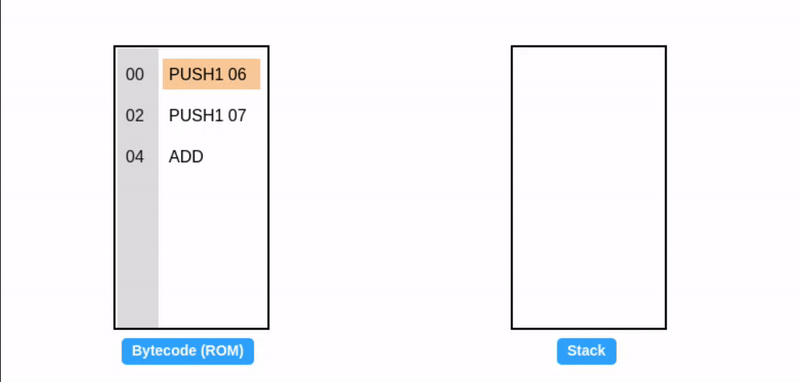

# The Ethereum Virtual Machine (EVM)

The Ethereum Virtual Machine (EVM) is the heart of the Ethereum World Computer. It performs the crucial computations needed to finalise transactions, permanently storing the results on the blockchain. This article explores the EVM's role in the Ethereum ecosystem and how it works.

## The Ethereum state machine

As the EVM processes transactions, it alters the overall state of Ethereum. In that regard, Ethereum can be viewed as a **state machine**.

In computer science, **state machine** is an abstraction used to model the behavior of a system. It illustrates how a system can be represented by a set of distinct states and how inputs can drive changes in the state.

A familiar example is a vending machine, an automated system for dispensing products upon receiving payment.

We can model a vending machine existing in three distinct states: idle, awaiting user selection, and dispensing a product. Inputs such as coin insertion or product selection trigger transitions between these states, as depicted in the state diagram:

Let's formally define the components of a state machine:

1. **State ($S$)**: A State represents distinct conditions or configurations that a system can be in at a given point in time.
   For the vending machine, possible states are:

$$ S\in \set {Idle, Selection, Dispensing} $$

2. **Inputs ($I$)**: Inputs are actions, signals, or changes in the system's environment. Input triggers the **state transition function**.
   For the vending machine, possible inputs include:

$$ I\in \set {InsertCoin, SelectDrink, CollectDrink} $$

3. **State transition function ($\Upsilon$)**: State transition function defines how the system transitions from one state to another (or back to the same state) based on an input and its current state. Essentially, it determines how the system evolves in response to inputs.

$$\Upsilon (S,I) \Longrightarrow S'  $$

> Where S' = next state, S= current state, and I= input.

Example state transition for the vending machine:

$$\Upsilon (Idle,InsertCoin) \Longrightarrow Selection $$
$$\Upsilon (Selection,SelectDrink) \Longrightarrow Dispensing $$
$$\Upsilon (Idle,SelectDrink) \Longrightarrow Idle $$

Notice in the last case, the current state transitions back to itself.

### Ethereum as a state machine

Ethereum, as a whole, can be viewed as a **transaction-based state machine**. It receives transactions as input and transitions into a new state. The current state of Ethereum is referred to as the **world state**.

Consider a simple Ethereum application - an [NFT](https://ethereum.org/en/nft/) marketplace.

In the current world state **S3** (green), Alice owns an NFT. The animation below shows a transaction transferring ownership to you (**S3** ➡️ **S4**). Similarly, selling the NFT back to Alice would transition the state to **S5**:

Notice the current world state is animated _as a pulsating green bubble_.

In the figure above, each transaction is committed to a new state. However, in reality, a group of transactions is bundled into a **block**, and the resulting state is added to the chain of previous states. It must be apparent now why this technology is called **blockchain**.

Considering the definition of the state transition function, we draw the following conclusion:

> ℹ️ Note
> **EVM is the state transition function of the Ethereum state machine. It determines how Ethereum transitions into a new (world) state based on input (transactions) and current state.**

In Ethereum, the world state is essentially a mapping of 20-byte addresses to account states.

Each account state consists of various components such as storage, code, balance among other data and is associated with a specific address.

Ethereum has two kinds of accounts:

- **External account:** An account [controlled by an associated private key](/wiki/Cryptography/ecdsa.md) and empty EVM code.
- **Contract account:** An account controlled by an associated non-empty EVM code. The EVM code as part of such an account is colloquially known as a _smart contract._

Refer [Ethereum data structures](wiki/EL/data-structures.md) for details on how the world state is implemented.

## Virtual machine paradigm

Given our grasp of state machines, the next challenge is **implementation**.

Software needs conversion to the target processor's machine language (Instruction Set Architecture, ISA) for execution. This ISA varies across hardware (e.g., Intel vs. Apple silicon). Modern software also relies on the host operating system for memory management and other essentials.

Ensuring functionality within a fragmented ecosystem of diverse hardware and operating systems is a major hurdle. Traditionally, software had to be compiled into native binaries for each specific target platform:

To address this challenge, a two-part solution is employed.

First, the implementation targets a **virtual machine**, an abstraction layer. Source code is compiled into **bytecode**, a sequence of bytes representing instructions. Each bytecode maps to a specific operation the virtual machine executes.

The second part involves a platform-specific virtual machine that translates the bytecode into native code for execution.

This offers two key benefits: portability (bytecode runs on different platforms without recompiling) and abstraction (separates hardware complexities from software). Developers can thus write code for a single, virtual machine:

[JVM](https://en.wikipedia.org/wiki/Java_virtual_machine) for Java and LuaVM for Lua are popular examples of Virtual machines. They create platform-neutral bytecode, enabling code to run on various systems without recompiling.

## EVM

The virtual machine concept serves as an abstraction. Ethereum Virtual Machine (EVM) is a _specific_ software implementation of this abstraction. The anatomy of the EVM is described below:

In computer architecture, a word refers to a fixed-size unit of data that the CPU can process at once. EVM has a word size of **32 bytes**.

_For clarity, the figure above simplifies the Ethereum state. The actual state includes additional elements like Message Frames and Transient Storage._

In the anatomy described above, EVM is shown to be manipulating the storage, code, and balance of an account instance.

In a real-world scenario, EVM may execute transactions involving multiple accounts (each with independent storage, code, and balance) enabling complex interactions on Ethereum.

With a better grasp of virtual machines, let's extend our definition:

> ℹ️ Note
> EVM is the state transition function of the Ethereum state machine. It determines how Ethereum transitions into a new (world) state based on
> input (transactions) and current state. **It is implemented as a virtual machine so that it can run on any platform, independent of the
> underlying hardware.**

## EVM bytecode

EVM bytecode is a representation of a program as a sequence of [**bytes** (8 bits).](https://en.wikipedia.org/wiki/Byte) Each byte within the bytecode is either:

- an instruction known as **opcode**, or
- input to an opcode known as **operand**.

For brevity, EVM bytecode is commonly expressed in [**hexadecimal**](https://en.wikipedia.org/wiki/Hexadecimal) notation:

To further enhance comprehension, opcodes have human-readable mnemonics. This simplified bytecode, called **EVM assembly**, is the lowest human-readable form of EVM code:

Identifying opcodes from operands is straightforward. Currently, only `PUSH*` opcodes have operands (this might change with [EOF](https://eips.ethereum.org/EIPS/eip-7569)). `PUSHX` defines operand length (X bytes after PUSH).

Select Opcodes used in this discussion:

| Opcode | Name           | Description                                        |
| ------ | -------------- | -------------------------------------------------- |
| 60     | `PUSH1`        | Push 1 byte on the stack                           |
| 01     | `ADD`          | Add the top 2 values of the stack                  |
| 02     | `MUL`          | Multiply the top 2 values of the stack             |
| 39     | `CODECOPY`     | Copy code running in current environment to memory |
| 51     | `MLOAD`        | Load word from memory                              |
| 52     | `MSTORE`       | Store word to memory                               |
| 53     | `MSTORE8`      | Store byte to memory                               |
| 59     | `MSIZE`        | Get the byte size of the expanded memory           |
| 54     | `SLOAD`        | Load word from storage                             |
| 55     | `SSTORE`       | Store word to storage                              |
| 56     | `JUMP`         | Alter the program counter                          |
| 5B     | `JUMPDEST`     | Mark destination for jumps                         |
| f3     | `RETURN`       | Halt execution returning output data               |
| 35     | `CALLDATALOAD` | Copy 32 bytes from calldata to stack               |
| 37     | `CALLDATACOPY` | Copy input data from calldata to memory            |
| 80–8F  | `DUP1–DUP16`   | Duplicate Nth stack item to top                    |
| 90–9F  | `SWAP1–SWAP16` | Swap top with N+1th stack item                     |

Refer [Appendix H of Yellow Paper](https://ethereum.github.io/yellowpaper/paper.pdf) for a comprehensive list.

> ℹ️ Note
> [EIPs](https://eips.ethereum.org/) can propose EVM modifications. For instance, [EIP-1153](https://eips.ethereum.org/EIPS/eip-1153) introduced `TSTORE`, and `TSTORE` opcodes.

Ethereum clients such as [geth](https://github.com/ethereum/go-ethereum) implement the [EVM specifications](https://github.com/ethereum/execution-specs). This ensures all nodes agree on how transactions alter the system's state, creating a uniform execution environment across the network.

We have covered **what** EVM is, let's explore **how** it works.

# EVM Data Locations

The EVM has four main places to store data during execution:

- **Stack**
- **Memory**
- **Storage**
- **Calldata**

Let's explore each of these data stores more in depth.

## Stack

Stack is a simple data structure with two operations: **PUSH** and **POP**. Push adds an item to top of the stack, while pop removes the top-most item. Stack operates on Last-In-First-Out (LIFO) principle - the last element added is the first removed. If you try to pop from an empty stack, a **stack underflow error** occurs.

Since the stack is where most opcodes operate, it is responsible for holding the values used to read from and write to **memory** and **storage**, which we'll detail later.

The primary utility of the stack by the EVM is to store intermediate values in computations and to supply arguments to opcodes.

> The EVM stack has a maximum size of 1024 items consisting of 32 bytes each and is reset after each contract execution. Only the top 16 items are accessible. If you run out of stack, the contract execution will fail.

The reason behind this 16 item stack size is due to the **DUP** and **SWAP** opcodes.

- **`DUPn`**: Duplicate nth stack item to top.
- **`SWAPn`**: Swap top with n+1th stack item.

The maximum n for **DUP** and **SWAP** is `16`, corresponding to opcodes 0x80–0x8f and 0x90–0x9f respectively. These opcodes are explicitly defined in the EVM and form a fixed set — making the 16-item limit an EVM-level constraint.

During bytecode execution, EVM stack functions as a _scratchpad_: opcodes consume data from the top and push results back (See the `ADD` opcode below). Consider a simple addition program:

Reminder: All values are in hexadecimal, so `0x06 + 0x07 = 0x0d (decimal: 13)`.

Let's take a moment to celebrate our first EVM assembly code 🎉.

### Program counter

Recall that the bytecode is a flat array of bytes with each opcode being a 1 byte. The EVM needs a way to track what is the next byte (opcode) to execute in the bytecode array. This is where the EVM **program counter** comes in. It will keep track of the next opcode's offset, which is the location in the byte array of the next instruction to execute on the stack.

In the example above, the values on the left of the assembly code represent the byte offset (starting at 0) of each opcode within the bytecode:

| Bytecode | Assembly | Length of Instruction in bytes | Offset in hex |
| -------- | -------- | ------------------------------ | ------------- |
| 60 06    | PUSH1 06 | 2                              | 00            |
| 60 07    | PUSH1 07 | 2                              | 02            |
| 01       | ADD      | 1                              | 04            |

Notice how the table above doesn't include offset 01. This is because the operand 06 takes position of offset 01, and the same concept applies for operand 07 taking position of offset 03.

Essentially, the **program counter** ensures the EVM knows the position of each next instruction to execute and when to stop executing as illustrated in the example below.

The `JUMP` opcode directly sets the program counter, enabling dynamic control flow and contributing to the EVM's [Turing completeness](https://en.wikipedia.org/wiki/Turing_completeness) by allowing flexible program execution paths.

The code runs in an infinite loop, repeatedly adding 7. It introduces two new opcodes:

- **JUMP**: Sets the program counter to stack top value (02 in our case), determining the next instruction to execute.
- **JUMPDEST**: Marks the destination of a jump operation, ensuring intended destinations and preventing unwanted control flow disruptions.

> High level languages like [Solidity](https://soliditylang.org/) leverage jumps for constructs like if conditions, for loops, and internal functions calls.

### Gas

Our innocent little program may seem harmless. However, infinite loops in EVM pose a significant threat: they can **devour resources**, potentially causing network [**DoS attacks**.](https://en.wikipedia.org/wiki/Denial-of-service_attack)

The EVM's **gas** mechanism tackles such threats by acting as a currency for computational resources. Gas costs are [designed to mirror](https://web.archive.org/web/20170904200443/https://docs.google.com/spreadsheets/d/15wghZr-Z6sRSMdmRmhls9dVXTOpxKy8Y64oy9MvDZEQ/edit#gid=0) the limitations of hardware, such as storage capacity or processing power. Transactions pay gas in **Ether (ETH)** to use the EVM, and if they run out of gas before finishing (like an infinite loop), the EVM halts them to prevent resource hogging.

This protects the network from getting clogged by resource-intensive or malicious activities. Since gas restricts computations to a finite number of steps, the EVM is considered **quasi Turing complete**.

Our example assumed 1 unit of gas per opcode for simplicity, but the actual cost varies based on complexity. The core concept, however, remains unchanged.

Refer [Appendix G of Yellow Paper](https://ethereum.github.io/yellowpaper/paper.pdf) for specific gas costs.

## Memory

EVM memory is a byte array of $2^{256}$ (or [practically infinite](https://www.talkcrypto.org/blog/2019/04/08/all-you-need-to-know-about-2256/)) bytes. All locations in memory are well-defined initially as zero.

Unlike stack, which provides data to individual instructions, memory stores ephemeral data that is relevant to the entire program. Since the stack has a hard limit of one word slots, **memory** supplements the stack by allowing indexed access to arbitrarily sized data. Stack values can be stored to or loaded from **memory** on demand.

### Writing to memory

`MSTORE` takes two values from the stack: an address **offset** and a 32-byte **value**. It then writes the value to memory at the specified offset.

`MSIZE` reports currently used memory size (in bytes) on the stack (32 bytes or 20 hex in this case).

`MSTORE8` takes same arguments as `MSTORE`, but writes 1 byte instead of 1 word.

Notice: When writing 07 to memory, the existing value (06) remains unchanged. It's written to the adjacent byte offset.

The size of active memory is still 1 word.

### Memory expansion

In EVM, memory is dynamically allocated in multiples of 1 word “pages”. Gas is charged for the number of pages expanded.

Writing a word at a 1-byte offset overflows the initial memory page, triggering an expansion to 2 words (64 bytes or 0x40).

### Reading from memory

`MLOAD` reads a value from memory and pushes it onto the stack.

EVM doesn't have a direct equivalent to `MSTORE8` for reading. You must read the entire word using `MLOAD` and then extract the desired byte using a [mask](<https://en.wikipedia.org/wiki/Mask_(computing)>).

> EVM memory is shown as blocks of 32 bytes to illustrate how memory expansion works. In reality, it is a seamless sequence of bytes, without any inherent divisions or blocks.

## Calldata

The **calldata** is read-only input data passed to the EVM via message call instructions or from a transaction and is stored as a sequence of bytes that are accessible via specific opcodes.

### Reading from calldata

The calldata for the current environment can be accessed using either:

- `CALLDATALOAD` opcode which reads 32 bytes from a desired offset onto the stack, [learn more](https://veridelisi.medium.com/learn-evm-opcodes-v-a59dc7cbf9c9).
- or, using `CALLDATACOPY` to copy a portion of calldata to memory.

## Storage

Storage is designed as a **word-addressed word array**. Unlike memory, storage is associated with an Ethereum account and is **persisted** across transactions as part of the world state. It can be thought of as a key-value **database** associated with the smart contract, which is why it contains the contract's "state" variables. Storage size is fixed at 2^256 slots, 32 bytes each.

Storage can only be accessed via the code of its associated account. External accounts don't have code and therefore cannot access their own storage.

## Writing to storage

`SSTORE` takes two values from the stack: a storage **slot** and a 32-byte **value**. It then writes the value to storage of the account. Notice: Slots can be thought of as the basic unit of storage, so when writing to storage, we deal with slots as opposed to individual bytes. Writing to storage is expensive. High-level languages like Solidity optimize storage by packing multiple variables into a single 32-byte slot when their combined size is less than or equal to 32 bytes.

We've been running a contract account's bytecode all this time. Only now we see the account and the world state, and it matches the code inside the EVM.

Again, it’s important to note that storage is not part of the EVM itself, rather the currently executing contract account.  More specifically, the contract account contains a **storage root** that points to a separate Merkle Patricia Trie for that contract's storage.

The example above shows only a small section of the account's storage. Like memory, all the values in storage are well-defined as zero. Also, when a contract executes an `SSTORE` opcode that sets a storage slot’s value from non-zero back to zero, the operation becomes eligible for a gas refund (the gas is not returned immediately but is credited to the transaction’s refund counter)​.  This refund serves as a reward to accounts for freeing up valuable storage from the state trie and is applied at the end of the transaction to offset some of the gas cost. 

### Reading from storage

`SLOAD` takes the storage **slot** from the stack and loads its value back onto it.

Notice that the storage value persists between examples, demonstrating its persistence within the world state. Since the world state is replicated across all nodes, storage operations are gas expensive.

> ℹ️ Note
> Check out the wiki on [transaction](/wiki/EL/transaction.md) to see EVM in action.

## Wrapping up

We've explored how opcodes are the core instructions executed by the EVM, operating on the stack to perform computations. Computed results can be stored ephemerally in memory or persisted in contract storage.

Developers rarely write EVM assembly code directly unless performance optimization is crucial. Instead, most developers work with higher-level languages like [Solidity](https://soliditylang.org/), which is then compiled into bytecode.

Ethereum is a continuously evolving protocol and while the fundamentals we've discussed will remain largely relevant, following [Ethereum Improvement Proposals (EIPs)](https://eips.ethereum.org/) and [network upgrades](https://ethereum.org/history) is encouraged to stay informed of the latest developments in the Ethereum ecosystem.

## EVM upgrades

While Ethereum protocol undergoes many changes in each upgrade, changes in EVM are rather subtle. Major change in EVM might break contracts and languages, requiring keeping multiple versions of EVM which introduces a lot of complexity overhead. There are still certain upgrades done on EVM itself like new opcodes or changes to existing ones which don't break their logic. Some examples are EIPs like [1153](https://eips.ethereum.org/EIPS/eip-1153), [4788](https://eips.ethereum.org/EIPS/eip-4788), [5000](https://eips.ethereum.org/EIPS/eip-5000), [5656](https://eips.ethereum.org/EIPS/eip-5656) and [6780](https://eips.ethereum.org/EIPS/eip-6780). These are proposing to add new opcodes except the last one which is especially interesting because it's neutralizing `SELFDESTRUCT` opcode without breaking compatibility. Another important upgrade to EVM which would mark rather a major change is [EOF](https://notes.ethereum.org/@ipsilon/mega-eof-specification). It creates a format to bytecode which EVM can understand and process more easily, it encompasses various EIPs and has been discussed and polished for quite some time.

## Resources

### State machines and theory of computation

- 📝 Mark Shead, ["Understanding State Machines."](https://medium.com/free-code-camp/state-machines-basics-of-computer-science-d42855debc66) • [archived](https://web.archive.org/web/20210309014946/https://medium.com/free-code-camp/state-machines-basics-of-computer-science-d42855debc66)
- 🎥 Prof. Harry Porter, ["Theory of computation."](https://www.youtube.com/playlist?list=PLbtzT1TYeoMjNOGEiaRmm_vMIwUAidnQz)
- 📘 Michael Sipser, ["Introduction to the Theory of Computation."](https://books.google.com/books/about/Introduction_to_the_Theory_of_Computatio.html?id=4J1ZMAEACAAJ)
- 🎥 Shimon Schocken et al., ["Build a Modern Computer from First Principles: From Nand to Tetris."](https://www.coursera.org/learn/build-a-computer)

### EVM

The resources below has been categorized into different sections based on different EVM learning stages.

#### Basics of EVM

- 🎥 Whiteboard Crypto, ["EVM: An animated non-technical introduction."](https://youtu.be/sTOcqS4msoU)
- 📝 Vasa, [Getting Deep Into EVM: How Ethereum Works Backstage](https://medium.com/swlh/getting-deep-into-evm-how-ethereum-works-backstage-ab6ad9c0d0bf)
- 📝 Zaryab Afser, [The ABCs of Ethereum Virtual Machine](https://www.decipherclub.com/the-abcs-of-ethereum-virtual-machine/)
- 📝 Preethi, [EVM Tweet Thread](https://twitter.com/iam_preethi/status/1483459717670309895)
- 📝 Decipher Club, [EVM learning resources based on your level of expertise](https://www.decipherclub.com/evm-learning-resources/)

#### Understanding EVM Architecture & Core Components

- 📝 Gavin Wood, ["Ethereum Yellow Paper."](https://ethereum.github.io/yellowpaper/paper.pdf)
- 📝 Ethereum Book, [Chapter 13, Ethereum Book](https://cypherpunks-core.github.io/ethereumbook/13evm.html?ref=decipherclub.com)
- 📘 Andreas M. Antonopoulos & Gavin Wood, ["Mastering Ethereum."](https://github.com/ethereumbook/ethereumbook)
- 🎥 Jordan McKinney, ["Ethereum Explained: The EVM."](https://www.youtube.com/watch?v=kCswGz9naZg)
- 📝 LeftAsExercise, ["Smart contracts and the Ethereum virtual machine."](https://leftasexercise.com/2021/08/08/q-smart-contracts-and-the-ethereum-virtual-machine/) • [archived](https://web.archive.org/web/20230324200211/https://leftasexercise.com/2021/08/08/q-smart-contracts-and-the-ethereum-virtual-machine/)
- 📝 Femboy Capital, ["A Playdate with the EVM."](https://femboy.capital/evm-pt1) • [archived](https://web.archive.org/web/20221001113802/https://femboy.capital/evm-pt1)
- 🎥 Alex, [EVM - Some Assembly Required](https://www.youtube.com/watch?v=yxgU80jdwL0)

#### Deep-Dive into EVM

- 📝 Takenobu Tani, [EVM illustrated](https://github.com/takenobu-hs/ethereum-evm-illustrated)
- 📝 Shafu, ["EVM from scratch."](https://evm-from-scratch.xyz/)
- 📝 NOXX, ["3 part series: EVM Deep Dives - The Path to Shadowy Super Coder."](https://noxx.substack.com/p/evm-deep-dives-the-path-to-shadowy) • [archived](https://web.archive.org/web/20240106034644/https://noxx.substack.com/p/evm-deep-dives-the-path-to-shadowy)
- 📝 OpenZeppelin, ["6 part series: Deconstructing a Solidity."](https://blog.openzeppelin.com/deconstructing-a-solidity-contract-part-i-introduction-832efd2d7737) • [archived](https://web.archive.org/web/20240121025651/https://blog.openzeppelin.com/deconstructing-a-solidity-contract-part-i-introduction-832efd2d7737)
- 📝 TrustLook, ["Understand EVM bytecode."](https://blog.trustlook.com/understand-evm-bytecode-part-1/) • [archived](https://web.archive.org/web/20230603080857/https://blog.trustlook.com/understand-evm-bytecode-part-1/)
- 📝 Degatchi, ["A Low-Level Guide To Solidity's Storage Management."](https://degatchi.com/articles/low_level_guide_to_soliditys_storage_management) • [archived](https://web.archive.org/web/20231202105650/https://degatchi.com/articles/low_level_guide_to_soliditys_storage_management/)
- 📝 Zaryab Afser, ["Journey of smart contracts from Solidity to Bytecode"](https://www.decipherclub.com/ethereum-virtual-machine-article-series/)
- 🎥 Ethereum Engineering Group, [EVM: From Solidity to byte code, memory and storage](https://www.youtube.com/watch?v=RxL_1AfV7N4&t=2s)
- 📝 Trust Chain, [7 part series about how Solidity uses EVM under the hood.](https://trustchain.medium.com/reversing-and-debugging-evm-smart-contracts-392fdadef32d)
- [Learn EVM Opcodes](https://veridelisi.medium.com/learn-evm-opcodes-v-a59dc7cbf9c9) • [archived](https://web.archive.org/web/20240806231824/https://veridelisi.medium.com/learn-evm-opcodes-v-a59dc7cbf9c9)
- [More on EVM Storage](https://medium.com/coinmonks/solidity-storage-how-does-it-work-8354afde3eb) • [archived](https://web.archive.org/web/20230808231549/https://medium.com/coinmonks/solidity-storage-how-does-it-work-8354afde3eb)
- [Storage, Memory, and Stack Overview](https://ethereum.stackexchange.com/questions/23720/usage-of-memory-storage-and-stack-areas-in-evm) • [archived](https://web.archive.org/web/20240529150647/https://ethereum.stackexchange.com/questions/23720/usage-of-memory-storage-and-stack-areas-in-evm)
- [Calldata](https://learnevm.com/chapters/fn/calldata) • [archived](https://web.archive.org/web/20250306133755/https://learnevm.com/chapters/fn/calldata)

### Tools & EVM Puzzles

- 🧮 smlXL, ["evm.codes: Opcode reference and interactive playground."](https://www.evm.codes/)
- 🧮 smlXL, ["evm.storage: Interactive storage explorer."](https://www.evm.storage/)
- 🧮 Ethervm, [Low level reference for EVM opcodes](https://ethervm.io/)
- 🎥 Austin Griffith, ["ETH.BUILD."](https://www.youtube.com/watch?v=30pa790tIIA&list=PLJz1HruEnenCXH7KW7wBCEBnBLOVkiqIi)
- 💻 Franco Victorio, ["EVM puzzles."](https://github.com/fvictorio/evm-puzzles)
- 💻 Dalton Sweeney, ["More EVM puzzles."](https://github.com/daltyboy11/more-evm-puzzles)
- 💻 Zaryab Afser, ["Decipher EVM puzzles."](https://www.decipherclub.com/decipher-evm-puzzles-game/)

## Implementations

- 💻 Solidity: Brock Elmore, ["solvm: EVM implemented in solidity."](https://github.com/brockelmore/solvm)
- 💻 Go: [Geth](https://github.com/ethereum/go-ethereum)
- 💻 C++: [EVMONE](https://github.com/ethereum/evmone)
- 💻 Python: [py-evm](https://github.com/ethereum/py-evm)
- 💻 Rust: [revm](https://github.com/bluealloy/revm)
- 💻 Js/CSS: Riley, ["The Ethereum Virtual Machine."](https://github.com/jtriley-eth/the-ethereum-virtual-machine)

### EVM based programming languages

- 🗄 [Solidity](https://soliditylang.org/)
- 🗄 [Huff](https://github.com/huff-language/)
- 🗄 [Vyper](https://docs.vyperlang.org/en/stable/)
- 🗄 [Fe](https://fe-lang.org/)
