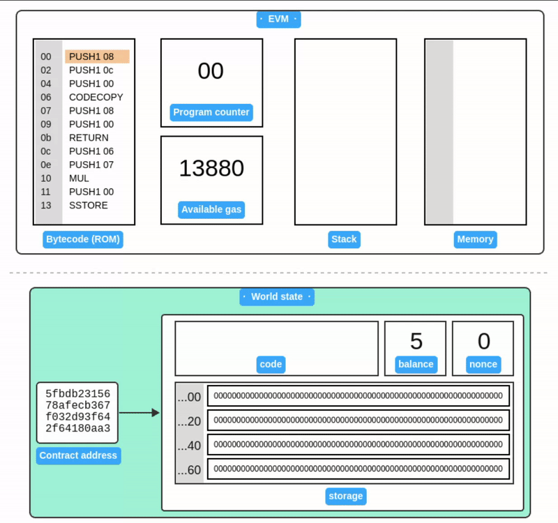
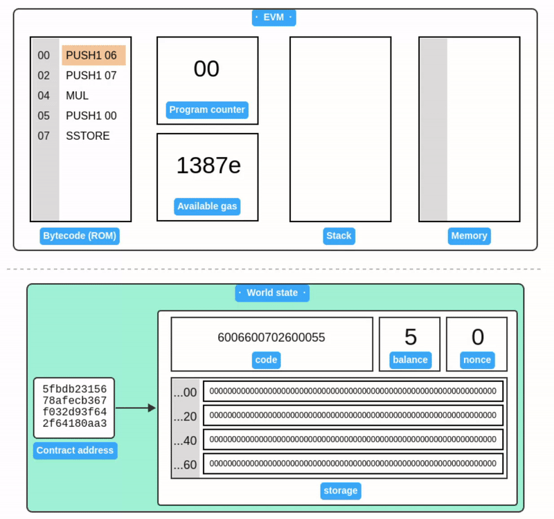

# Transaction

A **transaction** is a cryptographically-signed instruction issued by **an external account**, broadcasted to the entire network using [JSON-RPC](/wiki/EL/JSON-RPC.md).

A transaction contains following fields:

- **nonce ($T_n$)**: An integer value equal to the number of transactions sent by the sender. Nonce is used to:

  - **Prevent replay attack**: Let's say Alice sends 1 ETH to Bob in a transaction, Bob might try to rebroadcast the same transaction into the network to get additional funds from Alice's account. Since the transaction is signed with a unique nonce, EVM will simply reject it if Bob sends it again. Thus safeguarding Alice's account from unauthorized duplicate transactions.
  - **Determine contract account address**: In `contract creation` mode, nonce along with the sender's address is used to determine the contract account address.
  - **Replace a transaction**: When a transaction gets stuck due to low gas price, miners often allow a replacement transaction that has the same nonce. Some wallets may provide the option to cancel a transaction by exploiting this behavior. Essentially, a new transaction with the same nonce, higher gas price, and 0 value is sent, effectively overshadowing the original pending transaction. However, it's crucial to understand that the success of replacing a pending transaction is not guaranteed, as it relies on the behavior of miners and network conditions.

- **gasPrice ($T_p$)**: An integer value equal to the number wei to be paid per unit of gas. **Wei** is the smallest denomination of ether. $1  \textnormal{ETH} = 10^{18} \textnormal{Wei}$. Gas price is used to prioritize the execution of a transaction. Higher the gas price, more likely that a miner will include the transaction as part of a block.

- **gasLimit ($T_g$)**: An integer value equal to the maximum amount of gas to be used in execution of this transaction. Execution of this transaction will stop if the gasLimit is exhausted.

- **to ($T_t$)**: The 20-byte address of the recipient of this transaction. The `to` also field determines the mode or purpose of the transaction:

| Value of `to`    | Transaction Mode   | Description                                               |
| ---------------- | ------------------ | --------------------------------------------------------- |
| _Empty_          | Contract creation  | The transaction creates a new contract account.           |
| External Account | Value transfer     | The transaction transfers Ether to an external account.   |
| Contract Account | Contract execution | The transaction invokes the existing smart contract code. |

- **value ($T_v$)**: An integer value equal to the number of Wei to be transferred to this transaction's recipient. In `Contract creation` mode, value becomes the initial balance of the newly created contract account.

- **data ($T_d$) or init($T_i$)**: An unlimited size byte array specifying the input to the EVM. In contract `creation mode`, this value is considered as `init bytecode`, otherwise byte array of `input data`.

- **Signature ($T_v, T_r, T_s$)**: [ECDSA](/wiki/Cryptography/ecdsa.md) signature of the sender.


## Contract creation

Let's deploy the following code onto a new contract account:

```bash
[00] PUSH1 06 // Push 06
[02] PUSH1 07 // Push 07
[04] MUL      // Multiply
[05] PUSH1 0  // Push 00 (storage address)
[07] SSTORE   // Store result to storage slot 00
```

The brackets indicate instruction offset. Corresponding bytecode:

```bash
6006600702600055
```

Now, let's prepare the `init` value of our transaction to deploy this bytecode. Init actually consists of two fragments:

```
<init bytecode> <runtime bytecode>
```

`init` is executed by EVM only once at account creation. The return value of init code execution is the **runtime bytecode**, which is stored as part of the contract account. Runtime bytecode is executed every time a contract account receives a transaction.

Let's prepare our init code such that it returns our runtime code:

```bash
// 1. Copy to memory
[00] PUSH1 08 // PUSH1 08 (length of our runtime code)
[02] PUSH1 0c // PUSH1 0c (offset of the runtime code in init)
[04] PUSH1 00 // PUSH1 00 (destination in memory)
[06] CODECOPY // Copy code running in current environment to memory
// 2. Return from memory
[07] PUSH1 08 // PUSH1 08 (length of return data)
[09] PUSH1 00 // PUSH1 00 (memory location to return from)
[0b] RETURN   // Return the runtime code and halt execution
// 3. Runtime code (8 bytes long)
[0c] PUSH1 06
[0e] PUSH1 07
[10] MUL
[11] PUSH1 0
[13] SSTORE
```

The code does 2 simple things: First, copy the runtime bytecode to memory and then return the runtime bytecode from memory.

`init` bytecode:

```javascript
6008600c60003960086000f36006600702600055
```

Next, prepare the transaction payload:

```javascript
[
  "0x", // nonce (zero nonce, since first transaction)
  "0x77359400", // gasPrice (we're paying 2000000000 wei per unit of gas)
  "0x13880", // gasLimit (80000 is standard gas for deployment)
  "0x", // to address (empty in contract creation mode)
  "0x05", //value (we'll be nice and send 5 wei to our new contract)
  "0x6008600c60003960086000f36006600702600055", // init code
];
```

> Order of the values in the payload is important!

For this example, we'll use [Foundry](https://getfoundry.sh/) to deploy the transaction locally. Foundry is an ethereum development toolkit that provides following cli tools:

- **Anvil** : A local Ethereum node, designed for development.
- **Cast**: A tool for performing Ethereum RPC calls.

Install and launch [anvil](https://book.getfoundry.sh/anvil/) local node.

```
$ anvil


                             _   _
                            (_) | |
      __ _   _ __   __   __  _  | |
     / _` | | '_ \  \ \ / / | | | |
    | (_| | | | | |  \ V /  | | | |
     \__,_| |_| |_|   \_/   |_| |_|

    0.2.0 (5c3b075 2024-03-08T00:17:08.007462509Z)
    https://github.com/foundry-rs/foundry

Available Accounts
==================

(0) "0xf39Fd6e51aad88F6F4ce6aB8827279cffFb92266" (10000.000000000000000000 ETH)
.....

Private Keys
==================

(0) 0xac0974bec39a17e36ba4a6b4d238ff944bacb478cbed5efcae784d7bf4f2ff80
.....
Listening on 127.0.0.1:8545
```

Sign the transaction using one of anvil's dummy account:

```bash
$ node sign.js '[ "0x", "0x77359400", "0x13880", "0x", "0x05", "0x6008600c60003960086000f36006600702600055" ]' ac0974bec39a17e36ba4a6b4d238ff944bacb478cbed5efcae784d7bf4f2ff80

f864808477359400830138808005946008600c60003960086000f360066007026000551ca01446316c9bdcbe0cb87fac0b08a00e59552634c96d0d6e2bd522ea0db827c1d0a0170680b6c348610ef150c1b443152214203c7f66288ea6332579c0cdfa86cc3f
```

> See **Appendix A** below for the source of `sign.js` helper script.

Finally, submit the transaction using [cast](https://book.getfoundry.sh/cast/):

```javascript
$ cast publish f864808477359400830138808005946008600c60003960086000f360066007026000551ca01446316c9bdcbe0cb87fac0b08a00e59552634c96d0d6e2bd522ea0db827c1d0a0170680b6c348610ef150c1b443152214203c7f66288ea6332579c0cdfa86cc3f

{
  "transactionHash": "0xdfaf2817f19963846490b330ae33eba7b42872e8c8bd111c8d7ea3846c84cd51",
  "transactionIndex": "0x0",
  "blockHash": "0xfde1475a716583d847f858c5db3e54156983b39e3dbefaa5829416e6e60a788a",
  "blockNumber": "0x1",
  "from": "0xf39fd6e51aad88f6f4ce6ab8827279cfffb92266",
  "to": null,
  "cumulativeGasUsed": "0xd67e",
  "gasUsed": "0xd67e",
  // Newly created contract address 👇
  "contractAddress": "0x5fbdb2315678afecb367f032d93f642f64180aa3",
  "logs": [],
  "status": "0x1",
  "logsBloom": "0x0...",
  "effectiveGasPrice": "0x77359400"
}
```

Querying the local `anvil` node confirms that code is deployed:

```bash
$ cast code 0x5fbdb2315678afecb367f032d93f642f64180aa3
0x6006600702600055
```

And the initial balance is available:

```bash
$ cast balance 0x5fbdb2315678afecb367f032d93f642f64180aa3
5
```

---

Simulation of contract creation:



## Contract code execution

Our simple contract multiplies 6 and 7, then stores the result to storage **slot 0**. Let's execute the contract code with another transaction.

The transaction payload is similar, except `to` address points to the smart contract, `value` and `data` is empty:

```javascript
[
  "0x1", // nonce (increased by 1)
  "0x77359400", // gasPrice (we're paying 2000000000 wei per unit of gas)
  "0x13880", // gasLimit (80000 is standard gas for deployment)
  "0x5fbdb2315678afecb367f032d93f642f64180aa3", // to address ( address of our smart contract)
  "0x", // value (empty; not sending any ether)
  "0x", // data (empty)
];
```

Sign the transaction:

```bash

$ node sign.js '[ "0x1", "0x77359400", "0x13880", "0x5fbdb2315678afecb367f032d93f642f64180aa3", "0x", "0x"]' ac0974bec39a17e36ba4a6b4d238ff944bacb478cbed5efcae784d7bf4f2ff80

f86401847735940083013880945fbdb2315678afecb367f032d93f642f64180aa380801ba047ae110d52f7879f0ad214784168406f6cbb6e72e0cab59fa4df93da6494b578a02c72fcdea5b7838b520664186707d1465596e4ad4eaf8781a721530f8b8dd5f2
```

Publish the transaction:

```bash
$ cast publish f86401847735940083013880945fbdb2315678afecb367f032d93f642f64180aa380801ba047ae110d52f7879f0ad214784168406f6cbb6e72e0cab59fa4df93da6494b578a02c72fcdea5b7838b520664186707d1465596e4ad4eaf8781a721530f8b8dd5f2

{
  "transactionHash": "0xc82a658b947c6083de71a0c587322e8335448e65e7310c04832e477558b2b0ef",
  "transactionIndex": "0x0",
  "blockHash": "0x40dc37d9933773598094ec0147bef5dfe72e9654025bfaa80c4cdbf634421384",
  "blockNumber": "0x2",
  "from": "0xf39fd6e51aad88f6f4ce6ab8827279cfffb92266",
  "to": "0x5fbdb2315678afecb367f032d93f642f64180aa3",
  "cumulativeGasUsed": "0xa86a",
  "gasUsed": "0xa86a",
  "contractAddress": null,
  "logs": [],
  "status": "0x1",
  "logsBloom": "0x0...",
  "effectiveGasPrice": "0x77359400"
}
```

Read storage **slot 0** using cast:

```
$ cast storage 0x5fbdb2315678afecb367f032d93f642f64180aa3 0x
0x000000000000000000000000000000000000000000000000000000000000002a
```

Sure enough, the result is indeed [42](<https://simple.wikipedia.org/wiki/42_(answer)>) (0x2a) 🎉.

---

Simulation of contract execution:



## Appendix A: Transaction signer

`signer.js`: A simple [node.js](https://nodejs.org/) script for signing transactions. See comments for explanation:

```javascript
/**
 * Utility script to sign a transaction payload array.
 * Usage: node sign.js '[payload]' [private key]
 */

const { rlp, keccak256, ecsign } = require("ethereumjs-util");

// Parse command-line arguments
const payload = JSON.parse(process.argv[2]);
const privateKey = Buffer.from(process.argv[3].replace("0x", ""), "hex");

//validate privatekey length
if (privateKey.length != 32) {
  console.error("Private key must be 64 characters long!");
  process.exit(1);
}

// STEP 1: Encode payload to RLP
// Learn more: https://ethereum.org/en/developers/docs/data-structures-and-encoding/rlp/
const unsignedRLP = rlp.encode(payload);

// STEP 2: Hash the RLP encoded payload
// Learn more: https://ethereum.org/en/glossary/#keccak-256
const messageHash = keccak256(unsignedRLP);

// STEP 3: Sign the message
// Learn more: https://epf.wiki/#/wiki/Cryptography/ecdsa
const { v, r, s } = ecsign(messageHash, privateKey);

// STEP 4: Append signature to payload
payload.push(
  "0x".concat(v.toString(16)),
  "0x".concat(r.toString("hex")),
  "0x".concat(s.toString("hex"))
);

// STEP 5: Output RLP encoded signed transaction
console.log(rlp.encode(payload).toString("hex"));
```

## Resources
- 📝 Gavin Wood, ["Ethereum Yellow Paper."](https://ethereum.github.io/yellowpaper/paper.pdf)
- 📘 Andreas M. Antonopoulos, Gavin Wood, ["Mastering Ethereum."](https://github.com/ethereumbook/ethereumbook)
- 📝 Ethereum.org, ["RLP Encoding."](https://ethereum.org/en/developers/docs/data-structures-and-encoding/rlp/)
- 📝 Ethereum.org, ["Transactions."](https://ethereum.org/en/developers/docs/transactions/)
- 📝 Random Notes, ["Signing transactions the hard way."](https://lsongnotes.wordpress.com/2018/01/14/signing-an-ethereum-transaction-the-hard-way/) • [archived](https://web.archive.org/web/20240229045603/https://lsongnotes.wordpress.com/2018/01/14/signing-an-ethereum-transaction-the-hard-way/)
- 🎥 Lefteris Karapetsas, ["Understanding Transactions in EVM-Compatible Blockchains."](https://archive.devcon.org/archive/watch/6/understanding-transactions-in-evm-compatible-blockchains-powered-by-opensource/?tab=YouTube)
- 🎥 Austin Griffith, ["Transactions - ETH.BUILD."](https://www.youtube.com/watch?v=er-0ihqFQB0)
- 🧮 Paradigm, ["Foundry: Ethereum development toolkit."](https://github.com/foundry-rs/foundry)