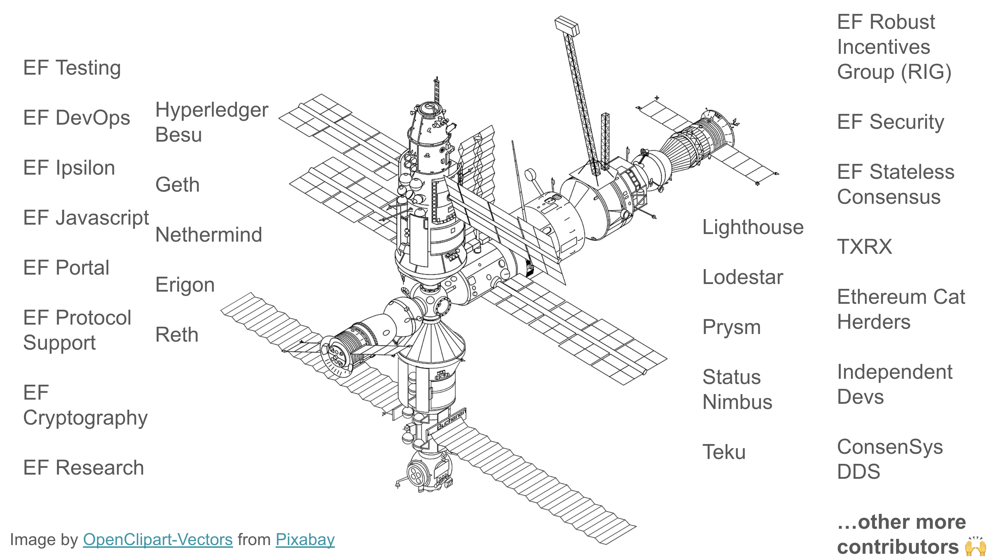

# Life of a Core Developer

[Hsiao-Wei Wang](https://github.com/hwwhww) shared the graphic above in a [presentation](https://www.youtube.com/watch?v=0lBrd2_fPPU) she gave at ETHGlobal Tokyo in April 2023. The presentation is titled “A Journey of an Ethereum Core Dev/Researcher” If you have seen this graphic in other presentations, please share!

The graphic symbolizes the connection between a space station and the efforts involved from various teams to bring it to life. You may have also heard Ethereum called the Infinite Garden. With respect to the graphic above, the Infinite Garden could be referred to as space.  

This page will provide an overview of each of the teams/contributors that make the Ethereum Protocol run and what is involved to keep the space station humming. 

One of the most important themes to understand about the different teams working together is that they are all working amongst themselves and amongst eachother in a very decentralized manner. Progress is achieved through discussions carried out in weekly meetings (Exeuction and Consensus Layer calls, EIPIP calls and various "Breakout Room" calls. Outside of calls, discussions are held in the Ethereum R&D Discord channel. Core Devs are writing EIPs, reviewing comments, debating issues/roadmap/frameworks/etc, testing BAU and getting ready for next big releases.  

This page will be split up into several categories: Ethereum Foundation (EF) teams, Execution Layer (EL) client teams, Consensus Layer (CL) client teams and other independent teams/contributors. 

**Ethereum Foundation (EF) teams:**

EF Testing:

EF DevOps:

EF Ipsilon:

EF Portal:

EF Protocol Support:

EF Cryptography:

EF Research:

EF Robust Incentives Group (RIG):

EF Security:

EF Stateless Consensus:

**Exeuction Layer (EL) client teams:**

Hyperledger Besu:

Geth:

Nethermind:

Erigon:

Reth:

EF Javascript:

**Consensus Layer (CL) client teams:**

Lighthouse:

Lodestar:

Prysm:

Status Nimbus:

Teku:

**Independent teams/contributors:**

TXRX:

Ethereum Cat Herders:

Independent Devs:

ConsenSys DDS:

Others:

**Questions to keep in mind:**

What is it like to work on the core protocol? 

What is it like to work in FOSS?

Do core developers get paid?

# Appendix

[Re: PATCH eventfs: Have inodes have unique inode numbers](https://lkml.iu.edu/hypermail/linux/kernel/2401.3/04208.html)

[George Hotz | Programming | rewriting linearizer (tinygrad) | Day In The Life Of A Software Engineer](https://www.youtube.com/watch?v=R-Xr1JRF6bY)

[A Day in the Life of a Dev: Ethereum’s Justin Florentine](https://www.coindesk.com/consensus-magazine/2023/02/22/a-day-in-the-life-of-a-dev-ethereums-justin-florentine/)

[Protocol Guild](https://protocol-guild.readthedocs.io/en/latest/)

[Protocol Guild: Funding Core Protocol Stewardship | Cheeky Gorilla - Protocol Guild ETHDenver 2024 Presentation](https://www.youtube.com/watch?v=9Tc2g7pu-gc&ab_channel=ETHDenver)

[Protocol Guild Pledge](https://tim.mirror.xyz/srVdVopOFhD_ZoRDR50x8n5wmW3aRJIrNEAkpyQ4_ng)

[Capital and enclosure in software commons: Linux & Ethereum](https://trent.mirror.xyz/GDDRqetgglGR5IYK1uTXxLalwIH6pBF9nulmY9zarUw)
