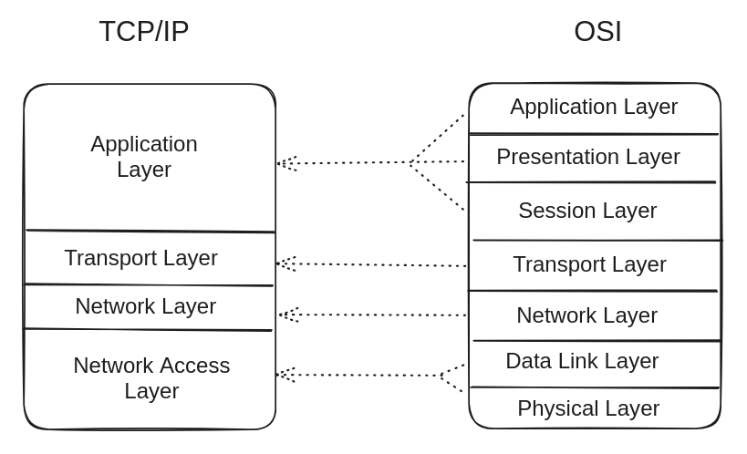

# Computer Science Resources

## Introduction / fundamentals

- 🎥 [Map of Computer Science](https://www.youtube.com/watch?v=SzJ46YA_RaA)
- 🎥 [A Crash Course in Computer Science](https://www.youtube.com/playlist?list=PL8dPuuaLjXtNlUrzyH5r6jN9ulIgZBpdo)
- 🎥 [Exploring How Computers Work](https://www.youtube.com/playlist?list=PLFt_AvWsXl0dPhqVsKt1Ni_46ARyiCGSq)
- Building a Modern Computer from First Principles, By Noam Nisan and Shimon Schocken
  - 🎥 [Nand to Tetris Part I](https://www.coursera.org/learn/build-a-computer)
  - 🎥 [Nand to Tetris Part II](https://www.coursera.org/learn/nand2tetris2)
  - 📘 [Book Elements of computing](https://mitpress.mit.edu/9780262640688/the-elements-of-computing-systems/)
- 📘 [Code: The Hidden Language of Computer Hardware and Software](https://www.amazon.com/Code-Language-Computer-Hardware-Software/dp/0137909101/)
- 📘 [Computer Science Distilled](https://www.amazon.com/Computer-Science-Distilled-Computational-Problems/dp/0997316020)
- 🎥 [Information theory | Khan Academy](https://www.khanacademy.org/computing/computer-science/informationtheory)

## Mathematics

- 🎥 [Introduction to Mathematical Thinking | Stanford](https://www.coursera.org/learn/mathematical-thinking)
- 🎥 [Essence of linear algebra](https://www.youtube.com/playlist?list=PLZHQObOWTQDPD3MizzM2xVFitgF8hE_ab)
- 📄 [Set Theory](https://www.youtube.com/playlist?list=PL5KkMZvBpo5AH_5GpxMiryJT6Dkj32H6N)
- 📄 [Basic number theory](https://www.codechef.com/wiki/tutorial-number-theory/)
- 🎥 [Mathematics for Computer Science | MIT](https://openlearninglibrary.mit.edu/courses/course-v1:OCW+6.042J+2T2019/course/)
- 📘 [Discrete Mathematics with Applications](https://www.amazon.com/Discrete-Mathematics-Applications-Susanna-Epp/dp/1337694193/)

## Cryptography

- 🎥 [Cryptography I | Stanford](https://www.coursera.org/learn/crypto)
- 🎥 [Cryptography | Khan Academy](https://www.khanacademy.org/computing/computer-science/cryptography)

## Algorithms

- 🎥 [Computer Science: Algorithms, Theory, and Machines | Princeton University](https://www.coursera.org/learn/cs-algorithms-theory-machines)
- 📘 [Grokking Algorithms](https://www.amazon.com/Grokking-Algorithms-Second-Aditya-Bhargava/dp/1633438538/)
- 📘 [Introduction to Algorithms | CLRS](https://www.goodreads.com/book/show/108986.Introduction_to_Algorithms) 
- 🎥 [Introduction to Algorithms | Course with assignments + solutions](https://ocw.mit.edu/courses/6-006-introduction-to-algorithms-spring-2020/)
- 📘 [Data Structures and Algorithms in C++, 2nd Edition](https://www.amazon.com/Data-Structures-Algorithms-Michael-Goodrich/dp/0470383275)

## Programming

- 🎥 [CS50x: Introduction to Computer Science | Harvard University](https://www.edx.org/learn/computer-science/harvard-university-cs50-s-introduction-to-computer-science)
- 🎥 [Berkeley CS 61A: Structure and Interpretation of Computer Programs](https://cs61a.org/)
- 🎥 [Parallel Programming](https://www.coursera.org/learn/scala-parallel-programming)
- 🎥 [Compilers](https://www.edx.org/course/compilers)
- [Mastering programming](https://tidyfirst.substack.com/p/mastering-programming)
- 📄 [Awesome c++ (or C)](https://github.com/fffaraz/awesome-cpp)
- 📄 [Awesome go](https://github.com/avelino/awesome-go)
- 📄 [Awesome rust](https://github.com/rust-unofficial/awesome-rust)
- 📄 [Awesome javascript](https://github.com/sorrycc/awesome-javascript)
- 📄 [Awesome python](https://github.com/vinta/awesome-python)
- 🎥 [George Hotz | Programming | rewriting linearizer (tinygrad) | Day In The Life Of A Software Engineer](https://www.youtube.com/watch?v=R-Xr1JRF6bY)

## Networking

This section covers a brief overview of the differences and similarities between the OSI (Open Systems Interconnection) and TCP/IP (Transmission Control Protocol/Internet Protocol) models,
as well as the protocols involved in the transport layer used in DevP2P: TCP and UDP.

In terms of networking, both models refer to the same process of communication between layers.
Just as Kurose and Ross explain (2020), the computer networks are divided into different layers, and each one of them has a specific responsibility. The OSI model has seven layers, while the TCP/IP model has four layers. The OSI model is more theoretical and the TCP/IP model is more practical.
The OSI model is a reference model created by the International Organization for Standardization (ISO) to provide a framework for understanding networks. The TCP/IP model was created by the Department of Defense (DoD) to ensure that messages could be transmitted between computers regardless of the types of computers involved.
The TCP/IP model is a concise version of the OSI model:

In summary, the OSI model layers are:
1. Physical layer: responsible for the transmission and reception of raw data between devices.
2. Data link layer: responsible for the node-to-node delivery of the message.
3. Network layer: responsible for the delivery of packets from the source to the destination.
4. Transport layer: responsible for the delivery of data between the source and the destination.
5. Session layer: responsible for the establishment, management, and termination of connections between applications.
6. Presentation layer: responsible for the translation, compression, and encryption of data.
7. Application layer: responsible for providing network services directly to the end-user.

Assuming the communication schema proposed by Claude Shannon (1948), every communication implies both a sender and a receiver, a message to be exchanged between them, a transmission medium, and a protocol to be followed.
This is important to mention because regardless of the computer architecture, it could be part of a network if it follows the communication and protocol specifications of the models mentioned above.

- 🎥 [Introduction to Computer Networking](https://www.youtube.com/playlist?list=PLEAYkSg4uSQ2dr0XO_Nwa5OcdEcaaELSG)
- 🎥 [Computers and the Internet | Khan Academy](https://www.khanacademy.org/computing/code-org/computers-and-the-internet)
- 🎥 [Computer Networking: a Top-Down Approach](https://gaia.cs.umass.edu/kurose_ross/online_lectures.htm)
- Clause E. Shannon (1948). "A Mathematical Theory of Communication". *Bell System Technical Journal*. Vol. 27.
- Jim Kurose and Keith Ross (2020). *Computer Networking: A Top-Down Approach*. 8th edition. Pearson.

## Distributed systems and blockchain

- 🎥 [Distributed Systems | MIT](https://pdos.csail.mit.edu/6.824/schedule.html)
- 📄 [Times, Clocks and Ordering of Events in Distributed Systems - Lamport's paper, the Quintessential distributed systems primer](http://research.microsoft.com/en-us/um/people/lamport/pubs/time-clocks.pdf)
- 📄 [The Byzantine Generals Problem](https://lamport.azurewebsites.net/pubs/byz.pdf)
- 📄 [Practical Byzantine Fault Tolerance](http://pmg.csail.mit.edu/papers/osdi99.pdf)
- 📄 [Bitcoin Whitepaper](https://bitcoin.org/bitcoin.pdf)
- 📄 [Ethereum Whitepaper](https://ethereum.org/en/whitepaper/)
- 📄 [Mastering Ethereum, by Andreas M. Antonopoulos, Gavin Wood](https://github.com/ethereumbook/ethereumbook)
- 📄 [Building Blockchain in Go](https://github.com/Jeiwan/blockchain_go)

## Security

- 🎥 [Security Engineering](https://www.cl.cam.ac.uk/~rja14/book.html)
- 🎥 [Computer Systems Security](https://ocw.mit.edu/courses/6-858-computer-systems-security-fall-2014/)
- 🎥 [CS 161: Computer Security](https://sp21.cs161.org/)
- 🎥 [Secure Software Development: Requirements, Design, and Reuse](https://www.edx.org/course/secure-software-development-requirements-design-and-reuse)
- 🎥 [Secure Software Development: Implementation](https://www.edx.org/course/secure-software-development-implementation)

## Terminals, shell scripting, and version control

- 🎥 [The Missing Semester of Your CS Education | MIT](https://missing.csail.mit.edu/)
- 🎥 [The Unix Workbench | Johns Hopkins](https://www.coursera.org/learn/unix)
- 📄 [Git tips and tricks](https://blog.gitbutler.com/git-tips-and-tricks/)
- 📄 [Popular Git config options](https://jvns.ca/blog/2024/02/16/popular-git-config-options/)

## Misc

- 📄 [Things Every Programmer Should Know](https://github.com/mtdvio/every-programmer-should-know)
- 📄 [What Every Programmer Should Know About Memory](https://akkadia.org/drepper/cpumemory.pdf)
- 📄 [What Every Computer Scientist Should Know About Floating-Point Arithmetic](https://docs.oracle.com/cd/E19957-01/806-3568/ncg_goldberg.html)
- 🗣️  [Big and Little Endian inside / out](https://www.youtube.com/watch?v=oBSuXP-1Tc0)
- 🎥 [The Perfect Dependency - SQLite Case Study](https://www.youtube.com/watch?v=ZP7ef4eVnac)

## Resources

- ["Teach Yourself Computer Science"](https://teachyourselfcs.com/)
- ["Open Source Society University"](https://github.com/ossu/computer-science)
- ["Coding Interview University"](https://github.com/jwasham/coding-interview-university)
- ["The Open Source Computer Science Degree"](https://github.com/ForrestKnight/open-source-cs)
