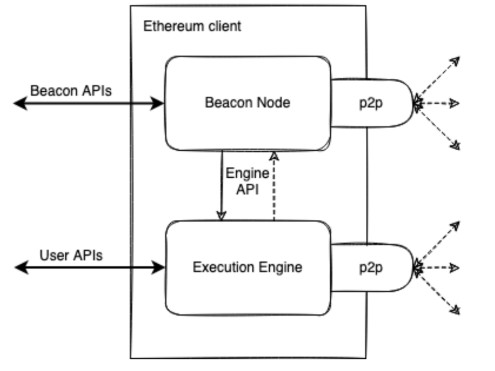
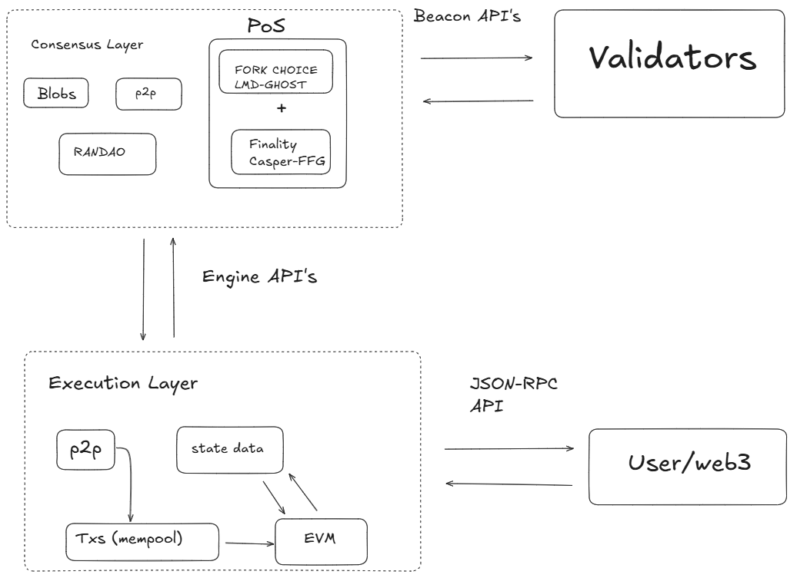

# Protocol Architecture Overview

> :warning: This article is a [stub](https://en.wikipedia.org/wiki/Wikipedia:Stub), help the wiki by [contributing](/contributing.md) and expanding it.

The current protocol architecture is a result of years of evolution. The protocol consists of 2 main parts - execution and consensus layer. The execution layer (EL) handles the actual transactions and user interactions, it's where the global computer executes its programs. The consensus layer (CL) provides the proof-of-stake consensus mechanism - a cryptoeconomic security making sure all nodes follow the same tip and drives the canonical chain of execution layer. 

In practice, these layers are implemented in its own clients connected via API. Each have their own p2p network handling different kind of data. 

Looking under the hood of each client, they consists of many fundamental functions: 

