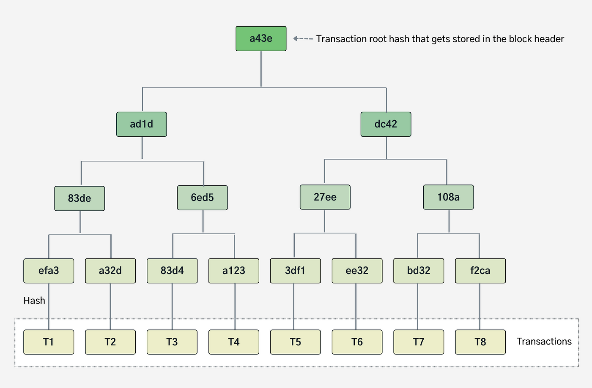
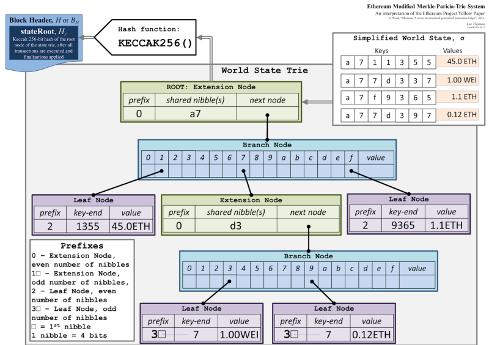

# Data Structures in Ethereum

## Primer on Merkle Tree

Merkle tree is a hash-based data structure which is very effecient at data integrity and verification. It is a tree based structure where the leaf nodes hold the data values and each non-leaf node is a hash of its child nodes.

A Merkle tree stores all the transactions in a block by producing a digital fingerprint of the entire set of transactions. It allows the user to verify whether a transaction is included in a block or not. Merkle trees are created by repeatedly calculating hashing pairs of nodes until there is only one hash left. This hash is called the **Merkle Root**, or the Root Hash. The Merkle Trees are constructed in a bottom-up approach.

It is important to note that Merkle trees are in a **binary tree**, so it requires an even number of leaf nodes. If there is an odd number of transactions, the last hash will be duplicated once to create an even number of leaf nodes.

Merkle Trees provide a tamper-proof structure to store transaction data. Hash functions have an Avalanche Effect i.e. a small change in the data will result in a huge change in the resulting hash. Hence, if the data in the leaf nodes are ever modified, the Root Hash will not match the expected value.
You can try out [SHA-256](https://emn178.github.io/online-tools/sha256.html) hashing function youself as well.
To learn more about Hashing, you may refer to [this](https://github.com/ethereumbook/ethereumbook/blob/develop/04keys-addresses.asciidoc)

Merkle Root is stored in the **Block Header**. Read more about the strucutre of a Block inside Ethereum (_will be linked this to relevant doc once its ready_)

The main parent node is called Root, hence the hash inside is Root Hash. There is infinitesimally small chance(1 in 1.16x10^77 for a single SHA-256 hash) to create two different states with the same root hash, and any attempt to modify state with different values will result in a different state root hash.

The image below depicts a simplified version of the working of a Merkle Tree:

- The lead nodes contain the actual data(for simplicity, we have taken numbers)
- Every non-leaf node is a hash of its children.
- The first level of non-leaf nodes contains the Hash of its child leaf nodes
  `Hash(1,2)`
- The same process continues till we reach the top of the tree, which the Hash of all the previous Hashes
  `Hash[Hash(1,2),Hash(3,4),Hash(5,6),Hash(7,8)]`

More on [Merkle Trees in Ethereum](https://blog.ethereum.org/2015/11/15/merkling-in-ethereum)

## Primer on Patricia Tree

Patricia Tries(also called Radix tree) are n-ary trees which unlike Merkel Trees,is used for storage of data instead of verification.

Simply put, Patricia Tries is a tree data structure where all the data is store in the leaf nodes, and each non-leaf nodes is a character of a unique string identifying the data. Using the unique string we navigate through the character nodes and finally reach the data. Hence, it is very efficient at data retrieval.

Patricia tries are designed to be more space-efficient than traditional trie structures by eliminating redundant nodes with single children. They achieve compactness by sharing prefixes among keys. This means that common prefixes are shared among different keys, reducing the overall storage requirements.

##### **TODO: Patricia Tree Diagram**

# Ethereum

Ethereum's primary data structure for storing the execution layer state is a **Merkle Patricia Trie** (pronounced "try"). It is named so, since it is a Merkle tree that uses features of PATRICIA (Practical Algorithm To Retrieve Information Coded in Alphanumeric), and because it is designed for efficient data retrieval of items that comprise the Ethereum state.

There are three types of nodes within the MPT:

- **Branch Nodes**: A branch node consists of a 17-element array, which includes one node value and 16 branches. This node type is the primary mechanism for branching and navigating through the trie.
- **Extension Nodes**: These nodes function as optimized nodes within the MPT. They come into play when a branch node has only one child node. Instead of duplicating the path for every branch, the MPT compresses it into an extension node, housing both the path and the child's hash.
- **Leaf Nodes**: A leaf node represents a key-value pair. The value is the MPT node's content, while the key is the node's hash. Leaf nodes store specific key-value data.

Every single node has a hash value. The node's hash is calculated as the SHA-3 hash value of its contents. This hash also acts as a key to refer that specific node.
Nibbles serve as the distinguishing unit for key values in the MPT. It represents a single hexadecimal digit. Each trie node can branch out to as many as 16 offshoots, ensuring a concise representation and efficient memory usage.

Ethereum state is stored in four different modified merkle patricia tries (MMPTs):

- Transaction Trie
- Receipt Trie
- World State Trie
- Account State Trie

At each block there is one transaction, receipt, and state trie which are referenced by their root hashes in the block Header.
For every contract deployed on Ethereum there is a storage trie used to hold that contract's persistent variables, each storage trie is referenced by their root hash in the state account object stored in the state trie leaf node corresponding to that contract's address.

## Transaction Trie

The Transaction Trie is a data structure responsible for storing all the transactions within a specific block. Every block has its own Transaction Trie, corresponding to the respective transactions that are included in that block.
Ethereum is a transaction based state machine. This means every action or change in Ethereum is due to a transaction. Every block is made up of a block header and a transaction list(among other things). Thus, once a transaction is executed and a block is finalized the transaction trie for that block can never be changed.(in contrast to the World State trie).

A transaction is mapped in the trie so that the key is a transaction index and the value is the transaction T . Both the
transaction index and the transaction itself are RLP encoded. It compose a key-value pair, stored in the trie:

`𝑅𝐿𝑃 (𝑖𝑛𝑑𝑒𝑥) → 𝑅𝐿𝑃 (𝑇)`

The structure `T` consists of the following:

- **Nonce**: For every new transaction submitted by the same sender, the nonce is increased. This value allows for tracking order of transactions and prevents replay attacks.
- **maxPriorityFeePerGas** - The maximum price of the consumed gas to be included as a tip to the validator.
- **gasLimit**: The maximum amount of gas units that can be consumed by the transaction.
- **maxFeePerGas** - the maximum fee per unit of gas willing to be paid for the transaction (including baseFeePerGas and maxPriorityFeePerGas)
- **from** – The address of the sender, that will be signing the transaction. This must be an externally-owned account as contract accounts cannot send transactions.
- **to**: Address of an account to receive funds, or zero for contract creation.
- **value**: amount of ETH to transfer from sender to recipien.
- **input data** – optional field to include arbitrary data
- **data**: Input data for a message call together with the message signature.
- **(v, r, s)**: Values encoding signature of a sender. Serves as identifier of the sender

##### TODO: Explain Receipt Trie

##### TODO: Explain World State Trie

##### TODO: Explain Storage Trie

## Future Implementations

##### TODO: Primer on Verkle Tree

## Resources

[More on Merkle Patricia Trie](https://ethereum.org/developers/docs/data-structures-and-encoding/patricia-merkle-trie)
