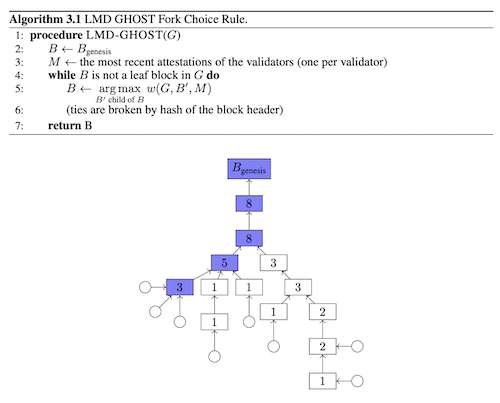

# [Protocol Design Philosophy](#protocol-design-philosophy)

These are the core tenets that sparked the work on Ethereum's architecture and implementation:

- **Simplicity**:
Since its inception, the Ethereum protocol was designed with simplicity in mind and an ambitious roadmap to add features along the way. This stemmed from the idea that any average programmer should ideally be able to understand and implement the entire specification, primarily to minimize the influence on the protocol by an individual or an elite group of developers. While this narrative has transmuted largely due to major changes that have been made to the protocol further. 

- **Universality**:
One of the fundamental doctrines of Ethereum's design philosophy is that Ethereum has no ***features***. Ethereum provides an internal Turing-complete virtual machine, called the [EVM](/wiki/EL/evm.md),which you can use to construct any smart contract or transaction type that can be mathematically defined. Ethereum aims to become a platform where new age developers can build decentralized and truly trustless applications without being prudent about the underlying complexity. 

- **Modularity**:
Making the Ethereum protocol modular is crucial to it being **future-proof**. While Ethereum is far from being perfect, there is a continuous and rigorous research and engineering effort that runs parallel to the existence of the protocol. Over the course of development, it should be easy to make a small protocol modification in one place and have the application stack continue to function without any further modification. Innovations such as Dagger, Patricia trees and SSZ have been implemented as separate libraries and made to be feature-complete even if Ethereum does not require certain features so as to make them usable in other protocols as well. With features such as [Proto-Danksharding](/wiki/research/scaling/core-changes/eip-4844.md), Ethereum provides building blocks for scaling of Layer 2 chains. Modularity derives itself from the idea of [encapsulated complexity](#https://vitalik.eth.limo/general/2022/02/28/complexity.html). Encapsulated complexity occurs when a system consists from sub-systems -- which are internally complex and are available to the outside by means of high level interfaces. Now, this engenders a lot of flexibility in terms of choice of sub-systems and better debugging of individual components.

- **Non-discriminant**:
Ethereum was born out of the pillars set by various movements like [**FOSS**](https://www.fsf.org/about/what-is-free-software) and [**Cypherpunk**](https://en.wikipedia.org/wiki/Cypherpunk). Non-discrimination is foundational to the fabric of Ethereum's design philosophy. The protocol does not attempt to actively restrict or prevent specific categories of usage, and all regulatory mechanisms in the protocol are designed to directly regulate the harm to the protocol itself, not attempt to oppose specific undesirable applications. You can even run an infinite loop script on top of Ethereum for as long as you are willing to keep paying the per-computational-step transaction fee for it within the acceptable limits defined by the protocol.

- **Agility**:
Details of the Ethereum protocol are not set in stone. The Ethereum Improvement Process is an open standard to propose new changes to the protocol. It's crucial to be extremely judicious about making modifications to high-level constructs such as the EVM and the address system, computational tests later on in the development process may lead to the discovery that certain modifications to the algorithm or the EVM will substantially improve scalability or security. If any such opportunities are found, they will be utilized.


# [Principles](#principles)

The Ethereum protocol evolves and changes over time but it always follow certain principles. These principles reflect values of the whole community and are reflected in some of the main design decisions of Ethereum.

- **Managing Complexity**: One of the main goals of Ethereum protocol design is to minimize complexity: make the protocol as simple as possible, while still making a blockchain that can do what an effective blockchain needs to do. The Ethereum protocol is far from perfect at this, especially since much of it was designed in 2014-16 when we understood much less, but we nevertheless make an active effort to reduce complexity whenever possible.
One of the challenges of this goal, however, is that complexity is difficult to define, and sometimes, you have to trade off between two choices that introduce different kinds of complexity and have different cost
    1. **Sandwich model complexity**:  The sandwich model focused simplifying the bottom layer of the architecture of Ethereum and the interface to Ethereum should be as easy to understand as possible. Where complexity is inevitable, it should be pushed into the "middle layers" of the protocol, that are not part of the core consensus but are also not seen by end users - high-level-language compilers, argument serialization and deserialization scripts, storage data structure models, the `leveldb` storage interface and the wire protocol, etc.
    2. **Encapsulated complexity**: This occurs when there is a system with sub-systems that are internally complex, but that present a simple "interface" to the outside. Systemic complexity occurs when the different parts of a system can't even be cleanly separated, and have complex interactions with each other. Often, the choice with less encapsulated complexity is also the choice with less systemic complexity, and so there is one choice that is obviously simpler. But at other times, you have to make a hard choice between one type of complexity and the other. What should be clear at this point is that complexity is less dangerous if it is encapsulated. The risks from complexity of a system are not a simple function of how long the specification is; a small 10-line piece of the specification that interacts with every other piece adds more complexity than a 100-line function that is otherwise treated as a black box. Here are few [examples](https://vitalik.eth.limo/general/2022/02/28/complexity.html)
The preference order for where the complexity goes in: layer 2 > client implementation > protocol spec

- **Freedom**: Users should not be restricted in what they use the Ethereum protocol for, and we should not attempt to preferentially favor or disfavor certain kinds of Ethereum contracts or transactions based on the nature of their purpose. This is similar to the guiding principle behind the concept of "net neutrality". One example of this principle not being followed is the situation in the Bitcoin transaction protocol where use of the blockchain for "off-label" purposes (eg. data storage, meta-protocols) is discouraged, and in some cases explicit quasi-protocol changes (eg. OP_RETURN restriction to 40 bytes) are made to attempt to attack applications using the blockchain in "unauthorized" ways. In Ethereum, instead strongly favor the approach of setting up transaction fees in such a way as to be roughly incentive-compatible, such that users that use the blockchain in bloat-producing ways internalize the cost of their activities (ie.[Pigovian taxation](https://en.wikipedia.org/wiki/Pigouvian_tax)).  

- **Generalization**: Protocol features and opcodes in Ethereum should embody maximally low-level concepts, so that they can be combined in arbitrary ways including ways that may not seem useful today but which may become useful later, and so that a bundle of low-level concepts can be made more efficient by stripping out some of its functionality when it is not necessary. An example of this principle being followed is our choice of a LOG opcode as a way of feeding information to (particularly light client) dapps, as opposed to simply logging all transactions and messages as was internally suggested earlier - the concept of "message" is really the agglomeration of multiple concepts, including "function call" and "event interesting to outside watchers", and it is worth separating the two.

- **We have no features**:  As a corollary to generalization, we often refuse to build in even very common high-level use cases as intrinsic parts of the protocol, with the understanding that if people really want to do it they can always create a sub-protocol (eg. ether-backed subcurrency, bitcoin/litecoin/dogecoin sidechain, etc) inside of a contract. An example of this is the lack of a Bitcoin-like "locktime" feature in Ethereum, as such a feature can be simulated via a protocol where users send "signed data packets" and those data packets can be fed into a specialized contract that processes them and performs some corresponding function if the data packet is in some contract-specific sense valid.


# [Blockchain level protocol](#blockchain-level-protocol)

### **Accounts over UTXOs**
Earliest implementations of blockchain including bitcoin and it's derivatives, store user balance in structure based in unspent transaction outputs (UTXOs). Ethereum on the other hand uses an account based model. The account based model is more flexible and allows for more complex transactions.

> **UTXO**: an unspent transaction output (UTXO) is a distinctive element in a subset of digital currency models. A UTXO represents a certain amount of cryptocurrency that has been authorized by a sender and is available to be spent by a recipient.

A user's "balance" in the system is thus the total value of the set of coins for which the user has a private key capable of producing a valid signature. The account based model is more flexible and allows for more complex transactions.

Ethereum follows an accounts based model over the UTXOs. While, UTXOs provide a higher degree of privacy, however, this also means more complexity for a system like Ethereum. Accounts also have a great deal of fungibility allowing higher level implementation flexibility such decentralised exchanges which Ethereum was originally intended for.

#### Benefits of Accounts
- **Space Saving**: for example, if an account has 5 UTXO, then switching from a UTXO model to an account model would reduce the space requirements from (20 + 32 + 8) * 5 = 300 bytes (20 for the address, 32 for the transactionId and 8 for the value) to 20 + 8 + 2 = 30 bytes (20 for the address, 8 for the value, 2 for a nonce(see below)). In reality savings are not nearly this massive because accounts need to be stored in a Patricia tree (see below) but they are nevertheless large. Additionally, transactions can be smaller (eg. 100 bytes in Ethereum vs. 200-250 bytes in Bitcoin) because every transaction need only make one reference and one signature and produces one output.

- **Great fungibility**: UTXOs are not perfectly fungible, as a UTXO can be tainted by being used in a transaction with a tainted UTXO, and there are some heuristics that can be used to track the history of a coin. Accounts are perfectly fungible, as any coin can be replaced by any other coin.

- **Simplicity**: Accounts are simpler to implement and reason about than UTXOs. UTXOs require a more complex transaction validation algorithm, and the UTXO model is less flexible and less powerful than the account model. For example, it is impossible to implement a decentralized exchange in the UTXO model, as the UTXO model does not allow for the existence of a "sell" order that is not tied to a specific UTXO.

One weakness of the account paradigm is that in order to prevent replay attacks, every transaction must have a [**nonce**](https://ethereum.stackexchange.com/questions/27432/what-is-nonce-in-ethereum-how-does-it-prevent-double-spending), such that the account keeps track of the nonces used and only accepts a transaction if its nonce is 1 after the last nonce used. This means that even no-longer-used accounts can never be pruned from the account state. A simple solution to this problem is to require transactions to contain a block number, making them un-replayable after some period of time, and reset nonces once every period.

### **Merkle Patricia Trie(MPT)**
Ethereum's data structure is a 'modified Merkle-Patricia Trie', named so because it borrows some features of PATRICIA (the Practical Algorithm To Retrieve Information Coded in Alphanumeric), and because it is designed for efficient data retrieval of items that comprise the Ethereum state.

A Merkle-Patricia trie is deterministic and cryptographically verifiable: The only way to generate a state root is by computing it from each individual piece of the state, and two states that are identical can be easily proven so by comparing the root hash and the hashes that led to it (a Merkle proof). Conversely, there is no way to create two different states with the same root hash, and any attempt to modify state with different values will result in a different state root hash. Theoretically, this structure provides the 'holy grail' of O(log(n)) efficiency for inserts, lookups and deletes.

Merkle-Patricia implemented trie are staged for deprecation to be replaced by a more efficient data structure called [**Verkle**](https://vitalik.ca/general/2022/02/28/complexity.html#verkle-trees).
### **Introduction to Verkle**

> :warning: Verkle trees are currently an active research area and this article may not be up to date with the latest developments. One can participate in the development and discussions on [Ethereum Research](https://ethresear.ch/t/portal-network-verkle/19339)

MPTs are currently employed in a variety of application in which membership proofs are sent across a network, including protocols, public-key directories, cryptocurrency such as Bitcoin and Secure File Systems. A Merkle Tree with $n$ leaves has $O(log{_2}{n})$-sized proofs. Although, $O(log{n})$ complexity can be quite comforting, however, in large trees, sending proofs can dominate bandwidth consumption. Verkle tree with branching factor $k$ achieve $O(kn)$ construction time and $O(log{_k}{n})$ membership proof-size. This means that the branching factor $k$ offers a trade-off between computational power and bandwidth. 


One of the pressing problems of Ethereum is the current state size. Estimate at around 1-2TB(at the time of writing this article). It is impractical for nodes to hold in working memory or even in slower permanent storage per se, thus, the need for statelessness becomes crucial to growth of the network. Verkle trees with it's vector commitments allow for much smaller proofs (**called witnesses**). Instead of needing to provide hashes of all "sibling nodes" at each level, Merkle Trees, the prover needs only to provide all parent nodes(plus an extra proof, called an optional) along the path from each each leaf to the root.

### **Recursive Length Prefix (RLP)**
Complete implementation and details can be found on [RLP page](/wiki/EL/RLP.md)

The rationale begin creating a new serialization scheme, lies in the 
probabilistic nature of other schemes. RLP solves this problem by being simple yet deterministic serialization; and guarantees absolute byte-perfect consistency. RLP does not attempt to define any specific data type such as boolean, floats, doubles or even integers -- instead, it simply exists to store structure, in the form of nested arrays. Key/value maps are also not explicitly supported; the semi-official suggestion for supporting key/value maps is to represent such maps as``` [[k1, v1], [k2, v2], ...]``` where ```k1, k2...``` are sorted using the standard ordering for strings.

The notion of complete anonymity of the data structure to the serialization algorithm over the course of time has turn out to inefficient in case of fixed length data types like boolean, integers. SimpleSerialize(SSZ) was introduced in Ethereum 2.0 which supported both variable sized and fixed sized data types with additional features like Merkleization.

### **Simple serialize (SSZ)**

Serialization is the process of converting data structures into format that can be transmuted, transmitted and reconstructed later. SSZ is a serialization format that is used in Ethereum 2.0 Beacon chain. Designed to be serialization scheme that is not self-describing -- rather it relies on a schema that must be known in advances. SSZ has a bunch of advantages over RLP, like efficient re-hashing of objects and fast indexing which RLP lacks resulting in $O(N)$ complexity.

Based on [Vitalik's comment](https://ethresear.ch/t/replacing-ssz-with-rlp-zip-and-sha256/5706/12), one of the major problem SSZ tries to solve is RLP doesn't allow Merkleization, and this would mean disqualifying any possibility of succinct light client proofs of anything. Thus, leaving no scope of achieving statelessness -- while statelessness remains a crucial objective of current Ethereum's R&D.

Further implementation and details can be found on [Simple Serialize page](/wiki/CL/ssz.md)

### **Hunt for Finality**
In Ethereum's proof-of-stake based consensus mechanisms, finality refers to the guarantee that a block cannot be altered or removed from the blockchain without burning at least 33% of the total staked ETH. The underlying consensus protocol to achieve this is called **Casper FFG**, more details on this type of attacks can be found [here](https://blog.ethereum.org/2016/05/09/on-settlement-finality)

- ***Casper FFG***
The [Casper FFG](https://arxiv.org/abs/1710.09437v4) is an overlay atop a proposal mechanism -- a mechanism which proposes blocks. Casper is responsible for finalizing these blocks, essentially selecting a unique chain which represents the canonical transaction in the ledger. This is achieved by employing [slashing](https://blog.ethereum.org/2014/01/15/slasher-a-punitive-proof-of-stake-algorithm) which was first proposed in 2014. Casper is follows a BFT tradition with some modifications to achieve PoS. 
Simply put, each validator will vote on the checkpoint, and after two rounds of voting, the checkpoint will be **finalized**. All the finalized checkpoints become the canonical chain(part of the blockchain history). While Casper is used to guarantee **finality**, brought about by attestations to the latest block addition to the canonical chain -- it requires a fork-choice rule where validators attest to blocks to signal support for those blocks.

- ***LMD GHOST***
Latest Message Driven Greediest Heaviest Observed Sub-Tree (LMD-GHOST) is a *fork choice rule* where validators attests to blocks to signal support for those blocks. This similar in some ways to the fork choice rule used in Proof-of-Work network -- where the fork with the most work done is selected to be the canonical chain.



Gapser is full proof-of-stake protocol that is an idealized abstraction of the Ethereum implementation. A combination of Casper FFG and LMD-GHOST driving the consensus mechanism for the Eth2.
# References

- https://web.archive.org/web/20211121044757/https://ethereumbuilders.gitbooks.io/guide/content/en/design_rationale.html

- https://vitalik.eth.limo/general/2022/02/28/complexity.html

- https://dankradfeist.de/ethereum/2021/02/14/why-stateless.html

- https://math.mit.edu/research/highschool/primes/materials/2018/Kuszmaul.pdf

- https://arxiv.org/pdf/2003.03052

- https://blog.ethereum.org/2014/01/15/slasher-a-punitive-proof-of-stake-algorithm
