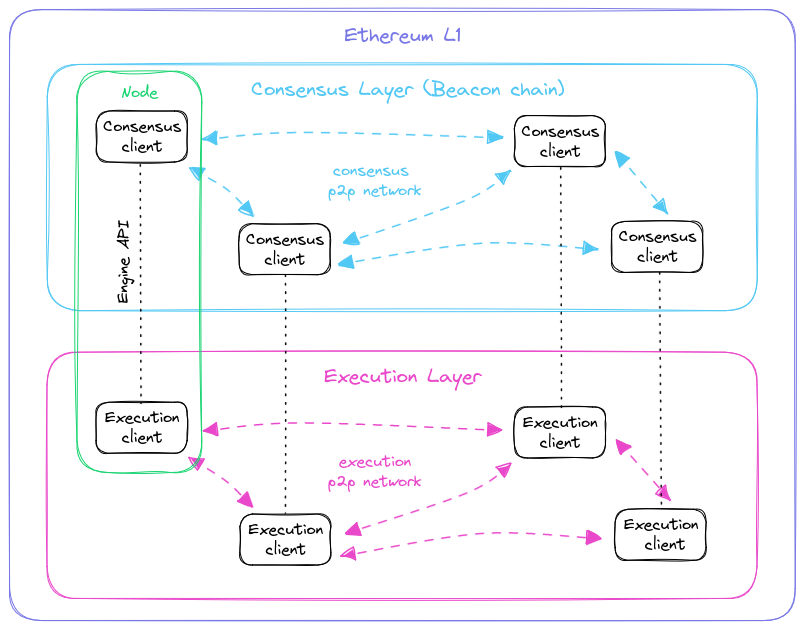

# History

## The DAO Hack and Ethereum Classic(ETC) fork
TODO

## The Merge.
On September 15, 2022, Ethereum implemented [EIP-3675](https://eips.ethereum.org/EIPS/eip-3675) (Upgrade consensus to Proof-of-Stake) through an event known as The Merge. The Merge has resulted in the deprecation of the Proof-of-Work consensus, which was previously implemented in the same logic layer as execution. Instead, it has been replaced by a much more complex and sophisticated Proof-of-Stake consensus that eliminates the need for energy-intensive mining. New Proof-of-Stake consensus Gasper runs on its own tech stack and p2p network, this new abstraction layer is known as Beacon Chain. The Beacon Chain has been running and achieving consensus since December 1st, 2020. After a prolonged period of consistent performance without any failures, it was deemed ready to become Ethereum's consensus provider, The Merge gets its name from the union of the two networks.

- Consensus Layer (Beacon Chain): Specifically designed to be really good to reaching consensus. In Ethereum, time is divided up into twelve second units called **slots**, the consensus is reached when a valid block has been proposed in a specific slot. However, occasionally validators might be offline when called to propose a block, meaning slots can sometimes go empty. 

- Execution Layer (State and Transactional Ledger): Driven by the consensus layer, it specializes in managing the transactions mempool, the Ethereum state, and Ethereum block construction and execution.

As result, an Ethereum node requires running two different software components: an execution client (or execution engine) driven by a consensus client through an internal communication protocol (Engine API). Note, that no additional trust assumptions need to be made for the execution Layer to follow and execute consensus decisions since each execution client receives information from the consensus Layer through its corresponding twin consensus client, and both clients operate within the same node’s trust domain.

Open source and public specifications for each client enhance client diversity. This is because a node can be set up with different combinations of client implementations from various software companies and developer communities. The goal is to achieve a client diversity in which the network is not dominated by a specific combination of execution client + consensus client implementation. This enhances the resilience of the network in case of bugs in the client implementations.

[EIP-3675: Upgrade consensus to Proof-of-Stake](https://eips.ethereum.org/EIPS/eip-3675), [archived](https://web.archive.org/web/20240213102133/https://eips.ethereum.org/EIPS/eip-3675)

[Gasper](https://ethereum.org/developers/docs/consensus-mechanisms/pos/gasper), [archived](https://web.archive.org/web/20240214225630/https://ethereum.org/developers/docs/consensus-mechanisms/pos/gasper)
