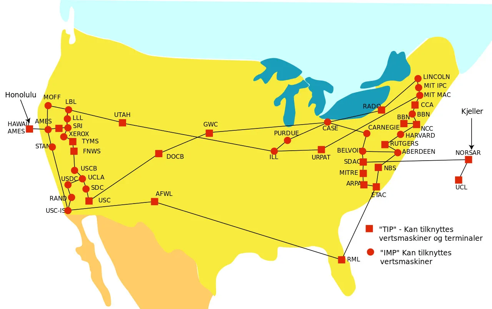
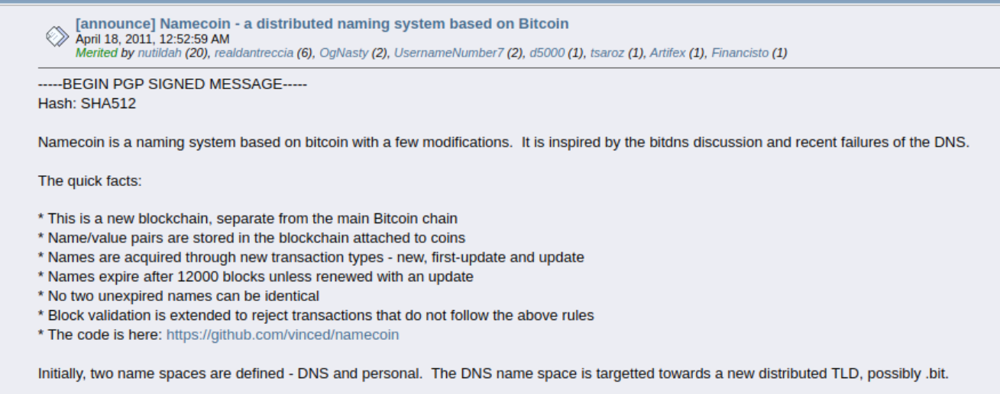
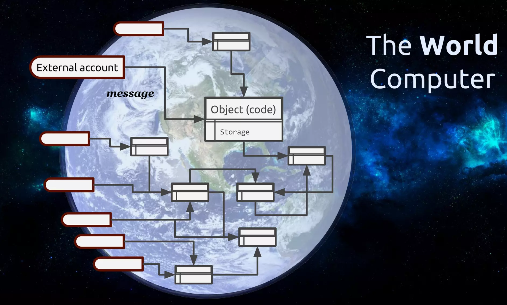

# Ethereum Overview

## Network coming online and peer-to-peer computing

The concept of peer-to-peer (P2P) networks, where computers communicate and share resources directly without a central authority, has a rich history dating back to the 1960s. Pioneering projects like the ARPANET, switched on in late October 1969 became the first wide-area packet-switched network, laid the groundwork for this decentralized approach. ARPANET demonstrated the model of distributed communication, where "every participating node could request and serve content".

> The map of ARPANET in the 1960s

This decentralized philosophy gained significant traction in the late 1990s with the rise of file-sharing platforms like [Napster](https://en.wikipedia.org/wiki/Napster) (1999). These platforms challenged the traditional client-server model, where users relied on a central server to access data. Napster, and subsequent platforms like [BitTorrent](https://en.wikipedia.org/wiki/BitTorrent) (2001), sparked new conversations and philosophies highlighting the potential for a more democratic and distributed online interaction.

## Introduction of Bitcoin

Introduced in a 2008 paper by Satoshi Nakamoto titled ["Bitcoin: A Peer-to-Peer Electronic Cash System"](https://bitcoin.org/bitcoin.pdf), blockchain established a distributed ledger system where data is cryptographically linked in chronological blocks. This innovation empowered the creation of Bitcoin, the first decentralized digital currency, eliminating the need for trusted third-party intermediaries like banks.

Bitcoin's focus on secure digital payments, while revolutionary, limited its ability to run more complex applications. Similar to how modern applications rely on HTTP for communication, early projects attempted to expand Bitcoin's functionality by leveraging its secure cryptographic and peer-to-peer foundation.

In 2011, Namecoin aimed to create a decentralized, censorship-resistant domain name system, but its reliance on Bitcoin's infrastructure limited its scalability and functionality compared to traditional DNS systems.

> [Namecoin Announcement](https://bitcointalk.org/?topic=6017.0): The first "application" based on Bitcoin network.

Similarly, Colored Coins (2012) was designed to represent real-world assets like gold or loyalty points on the Bitcoin blockchain. This was achieved by attaching additional data to Bitcoin transactions, essentially "coloring" them to signify ownership. However, Bitcoin's network only records binary state - a coin is either spent or not; hence it was impossible to store the semantics of information indicating what a token represents. These applications lacked storage of arbitrary number of states and were built using complex and not very scalable workarounds.

In 2014, Ethereum emerged as a solution address these challenges.

## The Ethereum world computer

Ethereum is a programmable blockchain with a built-in [Turing complete](https://en.wikipedia.org/wiki/Turing_completeness) computer with some unique guarantees. A Turing complete computer, much like personal computers, is capable of running any program imaginable. Ethereum's vision of this "world computer" is fundamentally unique in the following ways:

- **A global singleton shared state:** One of a kind computer that has a global shared state. All the transactions, and storage of all applications are accessible by anyone.

- **Cannot fail, be stopped, be censored:** Transactions on the Ethereum network essentially act as the computer's instructions. These transactions are tamper-proof and immutable - they either execute successfully or not at all.

- **Natively multi-user:** Ethereum is fundamentally multi-user with $2^{256}$ accounts. For some perspective, [that's more accounts than there are grains of sands on earth](https://www.talkcrypto.org/blog/2019/04/08/all-you-need-to-know-about-2256/). Each account has its own balance, code, and storage. These accounts are isolated from each other, meaning they cannot access each other's data. Accounts are also natively authenticated by Ethereum.

- **Inherently verifiable:** Since each transaction that changes the state of Ethereum is publicly accessible, it is inherently verifiable. Any change can be traced back to the transaction that caused it.

- **Determinism:** The Ethereum world computer guarantees certain properties when running code:
  1. **Atomicity** - The entire operation runs or nothing does.
  2. **Synchrony** - No two operation occur at the same time and thus does not interfere with each other.
  3. **Provenance** - All transactions can be inspected to determine the caller account.
  4. **Immutability** - All data stored on Ethereum is permanent and unalterable.

> The Ethereum world computer

These unique features empower Ethereum to create a new paradigm for decentralized computing.

## Applications

Ethereum establishes a foundation for secure and verifiable interaction over a public network. Several innovative applications take advantage of this capability:

- **Decentralized Finance (DeFi):** Borrow, lend, trade, and manage your assets without relying on traditional banks. DeFi empowers individuals to take control of their financial lives.
- **Non-Fungible Tokens (NFTs):** Own and trade unique digital assets like artwork, collectibles, and virtual experiences. NFTs unlock new possibilities for digital ownership and creative expression.
- **Decentralized Autonomous Organizations (DAOs):** Collaborate and make decisions democratically within organizations. DAOs empower communities to self-govern and manage resources transparently.
- **Gaming:** Play-to-earn games where you can own in-game assets and be rewarded for your participation. Ethereum brings a new dimension of value and ownership to the gaming world.
- **Prediction Markets:** Speculate on real-world events in a decentralized and transparent marketplace. Ethereum facilitates open and honest predictions.

As the platform continues to evolve, the landscape of decentralized applications built on Ethereum will only grow richer and more diverse.

## Resources

- Computer History Museum, ["The history of Computer Networking"](https://www.computerhistory.org/timeline/networking-the-web/)
- Wikipedia, ["ARPANET"](https://en.wikipedia.org/wiki/ARPANET)
- Satoshi Nakamoto, ["Bitcoin: A Peer-to-Peer Electronic Cash System"](https://bitcoin.org/bitcoin.pdf)
- Wikipedia, ["Namecoin"](https://en.wikipedia.org/wiki/Namecoin)
- Harry K. et al, ["An empirical study of Namecoin and lessons for decentralized namespace design"](https://www.cs.princeton.edu/~arvindn/publications/namespaces.pdf)
- Yoni A. et al. , [Colored Coins whitepaper](https://web.archive.org/web/20230404234458/https://www.etoro.com/wp-content/uploads/2022/03/Colored-Coins-white-paper-Digital-Assets.pdf)
- Nick Szabo, ["Formalizing and Securing Relationships on Public Networks"](https://web.archive.org/web/20040228033758/http://www.firstmonday.dk/ISSUES/issue2_9/szabo/index.html)
- Nick Szabo, ["The Idea of Smart Contracts"](https://web.archive.org/web/20040222163648/https://szabo.best.vwh.net/idea.html)
- Vitalik Buterin, ["Ethereum Whitepaper"](https://ethereum.org/content/whitepaper/whitepaper-pdf/Ethereum_Whitepaper_-_Buterin_2014.pdf)
- Vitalik Buterin, ["Ethereum at Bitcoin Miami 2014"](https://www.youtube.com/watch?v=l9dpjN3Mwps)
- Gavin Wood, ["Ethereum for Dummies"](https://www.youtube.com/watch?v=U_LK0t_qaPo)
