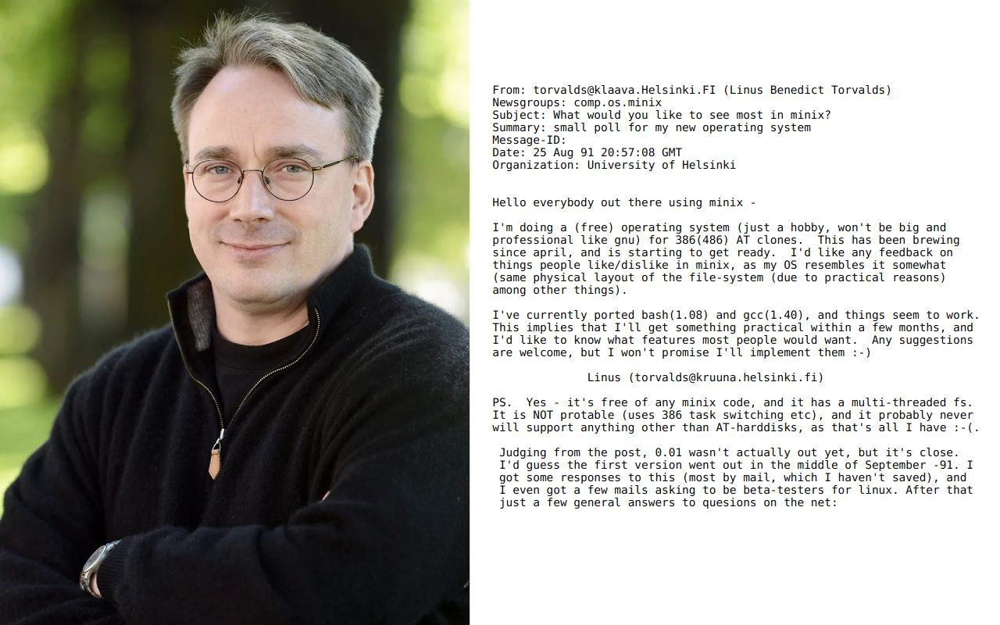

# Prehistory of Ethereum
> “Heroes are heroes because they are heroic in behavior, not because they won or lost.”\
> —  Nicholas Taleb

This article discusses the heroes who influenced Ethereum's lineage.

Ethereum has its roots in the early internet's open spirit, with its design philosophy echoing the Unix ideal of 'doing one thing and doing it well'. The rise of the free and open source movement, embodied by GNU/Linux, reaffirmed open standards in software. Meanwhile, breakthroughs in public key cryptography and its advocacy by the cypherpunks laid the groundwork for secure, transparent, and decentralized systems like Bitcoin which ultimately inspired Ethereum's vision of building a platform for a borderless, self-sovereign digital economy.

> “If you look at the people that were involved in the early stages of the Bitcoin space, their earlier pedigrees, if they had any pedigrees at all, were in open source—Linux, Mozilla, and cypherpunk mailing lists.”\
> — _Vitalik Buterin, Co-founder of Ethereum._

## The information super highway

From its humble beginnings in 1969 as a Cold War project ([ARPANET](https://en.wikipedia.org/wiki/ARPANET)), the internet has evolved into an unprecedented global phenomenon.

> "The Internet's pace of adoption eclipses all other technologies that preceded it. Radio was in existence 38 years before 50 million people tuned in; TV took 13 years to reach that benchmark. Sixteen years after the first PC kit came out, 50 million people were using one. Once it was opened to the general public, the Internet crossed that line in four years."\
> — [The Emerging Digital Economy,(July 1998).](https://www.commerce.gov/sites/default/files/migrated/reports/emergingdig_0.pdf)

**A map of internet cables from 1989 to 2021. [Source: The New York Times.](https://www.nytimes.com/interactive/2019/03/10/technology/internet-cables-oceans.html)**

What started as a research tool for a handful of institutions now connects billions worldwide, collapsing geographical borders and facilitating human interactions that were once inconceivable.

> "National borders are just speed bumps on the information superhighway."\
> — Timothy May, Cypherpunk.

## Unix & Bell Labs

Unix originated from the efforts to simplify the complexities of [MULTICS](https://en.wikipedia.org/wiki/Multics), a large and ambitious operating system project of the 1960s. As MULTICS became unwieldy, a small group including [Ken Thompson](https://en.wikipedia.org/wiki/Ken_Thompson) and [Dennis Ritchie](https://en.wikipedia.org/wiki/Dennis_Ritchie) at AT&T Bell Labs sought to create Unix - a more modular, simpler, and composable alternative:

>"At some point I realized that I was three weeks from an operating system. I'll needed an editor, assembler, and kernel overlay — call it an operating system. One week, one week, one week, and we had Unix."\
> — [_Ken Thompson in an interview_](https://www.youtube.com/watch?v=EY6q5dv_B-o)

In 1972, Dennis also wrote the influential [C language](https://en.wikipedia.org/wiki/C_(programming_language)).

**Ken Thompson and Dennis Ritchie.**

Bell Labs was an unparalleled incubator of the century's most defining technological building blocks:
> "You couldn't go to the store and buy a Bell Labs innovation, yet it was deep inside other things; it was platform innovation integral to communications infrastructure."\
> — Jon G., The Idea Factory

> 🎦 WATCH: [Jon talk about innovations at Bell Labs.](https://www.youtube.com/watch?v=OJsKgiGGzzs)

Unix introduced concepts like hierarchical file systems, the shell as a command-line interface, single-purpose utilities that could be combined to perform complex tasks.
These foundational principles laid the groundwork for what became known as the UNIX philosophy — favoring simplicity, flexibility, and reusability in software design. 

Today, UNIX and its derivatives continue to underpin much of modern computing, influencing everything from operating systems like Linux and macOS to the principles of timeless software development.

> 🎦 WATCH: [The Unix documentary.](https://www.youtube.com/watch?v=tc4ROCJYbm0)

The Unix legacy demonstrates the profound influence a small group of individuals can have on the world through software.

## Can we keep a secret?

Since the dawn of civilization, the need to convey messages in secrecy has been a constant human pursuit. From merchants concealing trade secrets to spies and the military transmitting critical information, cryptography has played a vital role. Early methods often used the same key for both encryption and decryption, making secure key distribution a nightmare:

>"The problem of producing, registering, distributing and canceling the keys, may seem slight to an individual who has not had experience with military communications, but in wartime the volumes of traffic stagger even the signal staffs."\
> — [David Kahn writes in _the codebreakers_](https://en.wikipedia.org/wiki/The_Codebreakers)

If a key fell into enemy hands, messages were vulnerable. This was evident in World War II with the cracking of the [Enigma machine](https://en.wikipedia.org/wiki/Enigma_machine), a sophisticated German cipher, by mathematician [Alan Turing](https://en.wikipedia.org/wiki/Alan_Turing) and his team. Their success significantly altered the outcome of the war.

**A statue of Alan Turing and the Enigma machine.**

How do you securely exchange keys over long distances, between people who have never met? Critics believed that cryptography was destined to be dependent on trust:

> "Few persons can be made to believe that it is not quite an easy thing to invent a method of secret writing which shall baffle investigation. Yet it may be roundly asserted that human ingenuity cannot concoct a cipher which human ingenuity cannot resolve."\
> — Edgar Allan Poe

Poe was proven wrong by a series of inventions from 1974-1978.

In 1974, [Ralph Merkle](https://en.wikipedia.org/wiki/Ralph_Merkle) devised [Merkle's Puzzles](https://en.wikipedia.org/wiki/Merkle%27s_Puzzles) - an initial method that allowed two parties to agree on a shared secret by exchanging messages, even if they have no secrets in common beforehand.

Two years later, in 1976, Merkle’s work inspired [Whitfield Diffie](https://en.wikipedia.org/wiki/Whitfield_Diffie) and [Martin Hellman](https://en.wikipedia.org/wiki/Martin_Hellman) to publish their historic paper ["New directions in cryptography"](https://ee.stanford.edu/~hellman/publications/24.pdf) that introduced [Diffie–Hellman key exchange algorithm.](https://en.wikipedia.org/wiki/Diffie%E2%80%93Hellman_key_exchange) This approach was significantly more mathematically robust than Merkle's puzzles - giving birth to trustless cryptography.

**Whitfield and Martin published "New directions in cryptography".**

In the following year, 1977, computer scientists [Ronald Rivest](http://amturing.acm.org/award_winners/rivest_1403005.cfm), [Adi Shamir](http://amturing.acm.org/award_winners/shamir_2327856.cfm), and [Leonard Adleman](http://amturing.acm.org/award_winners/adleman_7308544.cfm) developed the [RSA cryptosystem](https://en.wikipedia.org/wiki/RSA_(cryptosystem)) - the first working implementation of public key cryptography in a paper titled ["A Method for Obtaining Digital Signatures and Public-Key Cryptosystems"](https://people.csail.mit.edu/rivest/Rsapaper.pdf). Rivest sent a copy of the paper to mathematician Martin Gardner. Martin was so impressed that he broke his usual rule of planning his column several months in advance, and quickly wrote it up for [publication in the August 1977](https://web.archive.org/web/20230728001717/http://simson.net/ref/1977/Gardner_RSA.pdf) issue of Scientific American:

**Len, Adi, Ron at CRYPTO '82, and [the now-famous article](https://web.archive.org/web/20230728001717/http://simson.net/ref/1977/Gardner_RSA.pdf) by Martin Gardner published in Scientific American.**

In the article, Gardner included a RSA-129 cipher and offered $100 to the first person who solved it:

**MIT's RSA challenge.**

In 1994, a group of computer scientists and volunteers [cracked the cipher](https://en.wikipedia.org/wiki/The_Magic_Words_are_Squeamish_Ossifrage) and donated the money to the [Free Software Foundation.](https://www.fsf.org/) This effort highlighted a crucial point: perfect security in cryptography is an illusion. Encryption methods, like RSA, are constantly evolving, especially in anticipation of [quantum computers.](/wiki/Cryptography/post-quantum-cryptography.md)

Nevertheless, modern RSA encryption (1024 to 4096 bits) created a secure pathway on the information superhighway, enabling banks and credit card companies to protect financial transactions. This fostered trust and facilitated the growth of e-commerce and online banking.

**Inventors of modern cryptography: Adi Shamir, Ron Rivest, Len Adleman, Ralph Merkle, Martin Hellman, and Whit Diffie at Crypto 2000 [(courtesy of Eli B.)](https://www.ralphmerkle.com/merkleDir/KobayashiAward.html)**

In 1997, the British government declassified similar [research](https://cryptocellar.org/cesg/possnse.pdf) from 1970.

## Free as in freedom

Amidst a blizzard of advancing hardware and operating systems in the 1950s through 60s, early software was often primitive and required modification and software source code was no secret; in fact sharing source code was the norm. This fostered a hobbyist ["hacking culture"](https://en.wikipedia.org/wiki/Hacker_culture) that promoted exploration and exchange of knowledge. Anyone could inspect, modify, and provide feedback to the source code. Computer magazines would even feature printed [type-in programs](https://en.wikipedia.org/wiki/Type-in_program), that encouraged users to write software by hand:

**A type-in program to backup data, Compute! magazine [Source: commodore.ca.](https://www.commodore.ca/gallery/magazines/compute/Compute-004.pdf)**

As software sizes grew and the cost of storage declined, software began to be distributed on tapes, often bundled with computer hardware by manufacturers like IBM. This practice came to a halt due to the 1969 [US vs. IBM antitrust lawsuit](https://www.justice.gov/atr/case-document/united-states-memorandum-1969-case), which argued that users were compelled to purchase hardware to use the bundled software. Although the lawsuit was later dropped, it backfired – companies seized the opportunity to start charging separately for software. Software became a commodity.

Unix was another casualty of this trend. Initially distributed at no cost to government and academic researchers, by the early 1980s, AT&T ceased free distribution and started charging for system patches as Unix became more widespread. Due to the challenges of switching to alternative architectures, many researchers opted to pay for commercial licenses.

To boost revenues, a general trend emerged where companies ceased distributing source code. Some companies went out of their way to prevent software distribution. In an infamous [open letter](https://en.wikipedia.org/wiki/An_Open_Letter_to_Hobbyists), [Bill Gates](https://en.wikipedia.org/wiki/Bill_Gates) asked hobbyists to stop sharing BASIC source code:

> "Why is this? As the majority of hobbyists must be aware, most of you steal your software. Hardware must be paid for, but software is something to share. Who cares if the people who worked on it get paid?"\
> — Bill Gates, [An Open Letter to Hobbyists.](https://en.wikipedia.org/wiki/An_Open_Letter_to_Hobbyists)

Amidst the growing debate over software ownership, [Richard Stallman](https://en.wikipedia.org/wiki/Richard_Stallman), a research assistant at MIT's AI laboratory, found himself in a personal battle. He was frustrated by his inability to modify the source code of his newly installed Xerox printers. He believed such restriction to be "a crime against humanity:"

> "If you cook, you probably exchange recipes and share them with your friends, which they are free to change as they wish. Imagine a world, where you can't change your recipe because somebody went out of their way to set it up so that its impossible to change. And if you try to share the recipe with your friends, they would call you a **pirate** and put you in prison."\
> — Richard stallman, in a [documentary](https://www.youtube.com/watch?v=XMm0HsmOTFI)

In a 1983 [email](https://groups.google.com/g/net.unix-wizards/c/8twfRPM79u0), he declared his ambition to work on a free alternative to Unix called [GNU:](https://www.gnu.org/)

**Richard Stallman, and his [email announcement](https://groups.google.com/g/net.unix-wizards/c/8twfRPM79u0) of the GNU project.**

GNU is an in-your-face take on Unix and [recursively](https://en.wikipedia.org/wiki/Recursion) stands for “GNU's Not Unix". He decided to make the operating system compatible with Unix because the overall design was already proven and portable, and compatibility would make it easy for Unix users to switch from Unix to GNU.

As Richard explains, free software goes beyond just the cost aspect:
> "Free software", I should explain, refers to freedom, not price. It's unfortunate that the word "free", in english, is ambiguous - it has a
> number of different meanings. One of them means "zero price", but another meaning is "freedom".
> So think of "free speech", not "free beer".

> 🎦 WATCH: [Richard Stallman talks about Free Software and it's impact on the society.](https://www.youtube.com/watch?v=Ag1AKIl_2GM)

GNU started in January 1984. As part of this work, Richard wrote the [GNU General Public License](https://en.wikipedia.org/wiki/GNU_General_Public_License) (GPL). By 1990, GNU had either found or written all the major components for the operating system except one — the kernel.

Coincidentally, [Linus Torvalds](https://en.wikipedia.org/wiki/Linus_Torvalds), a computer science student, was developing a kernel called Linux:

**Linus Torvalds, and his [email announcement](https://groups.google.com/g/comp.os.minix/c/dlNtH7RRrGA/m/SwRavCzVE7gJ) of Linux.**

The first responses arrived within hours, several hundred joined the development over the course of next year. Linux was released under the GPL license, which completed GNU/Linux operating system.

During this course, Linux practically laid the blueprint for software development based on social consensus:

> "Very early in 1992, suddenly, I didn't know everybody anymore. It was no longer me and couple of friends. It was me and hundreds of people. That was a big step."\
> — Linus Torvalds

These diverse range of contributors, from individual enthusiasts to major corporations, collaborated to improve the kernel, fix bugs, and implement new features. It practically laid the blue print for what would later shape the open-source software movement.

The open-source movement diverges from the free software movement, focusing more on the practical benefits of accessible source code. This approach offered a balance between community-driven innovation and commercial viability which led to widespread business adoption. Free and open-source software (FOSS) is an inclusive umbrella term for free software and open-source software.

The GNU/Linux stands as a testament to the idea that software should empower, not restrict, its users.

## Cypherpunks write code

Since the end of World War II, governments a enjoyed stranglehold on advancements in cryptography, and guarded it accordingly. In the US,
encryption technology was controlled under the [Munitions List](https://en.wikipedia.org/wiki/United_States_Munitions_List). This meant that the [National Security Agency](https://en.wikipedia.org/wiki/National_Security_Agency) had a keen interest in cryptographic advancements. 

When the NSA received a copy the RSA paper from MIT, they attempted to classify the research but eventually allowed publication:

**NSA's response from a [2009 request under the Freedom of Information Act.](https://cryptome.org/2021/04/Joseph-Meyer-IEEE-1977.pdf)**

NSA's approach opened itself up for considerable public criticism when a personal letter from Joseph Mayer, an NSA employee, written to IEEE noting cryptology publications required government approval was published.

This marked the genesis of [Crypto Wars](https://en.wikipedia.org/wiki/Crypto_Wars) between the government and cryptography advocates.

**A Science magazine [publication](https://www.science.org/doi/10.1126/science.197.4311.1345) about the cryptology debate.**

The government's attempts to undermine cryptography were viewed as a means of surveilling public communications.

**A Science magazine [publication](https://www.science.org/doi/10.1126/science.199.4330.750) about wire tapping, and a related Banksy street art in England.**

Research on cryptography as a means to secure communication continued to evolve through the 1980s.

In 1985, cryptographer [David Chaum](https://en.wikipedia.org/wiki/David_Chaum) published his breakthrough paper [“Security without Identification: Transaction Systems to Make Big Brother Obsolete,”](https://dl.acm.org/doi/pdf/10.1145/4372.4373) in which he described schemes for transactions that provide security and privacy. He also presented the radical idea of “a digital pseudonym” for individuals using cryptography.

**David Chaum, and his paper.**

Crypto adoption for the general public was propelled by [Pretty Good Privacy](https://en.wikipedia.org/wiki/Pretty_Good_Privacy) (PGP), an an encryption program developed by Phil Zimmermann in 1991. PGP allowed individuals to secure their communications and data with strong encryption.

The Crypto Wars continued in 1993 when Zimmermann became the subject of a criminal investigation by the US Customs Service for allegedly violating export restrictions on cryptographic software.

In an iconic move, he published the entire source code of PGP in a [hardback book](https://philzimmermann.com/EN/essays/BookPreface.html) arguing that the export of books is protected by the [First Amendment](https://en.wikipedia.org/wiki/First_Amendment_to_the_United_States_Constitution). These books were exported from the USA in accordance with US Export Regulations, and the pages were then scanned and OCR-ed to make the source available in electronic form. In a show of support, some activists printed source code on t-shirts.

The case was dropped in 1996.

>"I used to feel like I was a flea on the back of a T-Rex. Now I feel I might be a small yapping poodle on the back of a T-Rex."\
> — Phil Zimmermann

**Phil Zimmermann, a t-shirt sporting the RSA source code, and a European volunteer scanning the PGP book; more than [70 people from all over Europe worked for over 1000 hours to make the PGP release possible outside US.](https://www.pgpi.didisoft.com/pgpi/project/scanning/)**

In early 1992, the same week was PGP 2.0 released, three Bay Area engineers— [Eric Hughes](https://en.wikipedia.org/wiki/Eric_Hughes_(cypherpunk)), [Timothy C. May](https://en.wikipedia.org/wiki/Timothy_C._May), and [John Gilmore](https://en.wikipedia.org/wiki/John_Gilmore_(activist)) — got together to start a mailing list named [Cypherpunk](https://mailing-list-archive.cryptoanarchy.wiki/) (cipher + [cyberpunk](https://en.wikipedia.org/wiki/Cyberpunk)).

Cypherpunk evolved into a defining movement, with over [700 activists and rebels, including Zimmerman](https://mailing-list-archive.cryptoanarchy.wiki/authors/notable/) ready to fight back with code:

> "Cypherpunks write code. We know that someone has to write software to defend privacy, and we're going to write it.
> [...]
> Cypherpunks are therefore devoted to cryptography. Cypherpunks wish to learn
> about it, to teach it, to implement it, and to make more of it. Cypherpunks know that
> cryptographic protocols make social structures. Cypherpunks know how to attack a
> system and how to defend it. Cypherpunks know just how hard it is to make good cryptosystems."\
> — Eric Hughes

**Tim, Eric, and John (top). Eric's cypherpunk [email](https://mailing-list-archive.cryptoanarchy.wiki/archive/1992/09/fdf9c19e77ec3f1a9bbc6bc19266d565b89d19dbd0ad369f5a2e800af3fc9558/) (bottom). [The Cypherpunk's Manifesto](https://www.activism.net/cypherpunk/manifesto.html) (right).**

During a 1994 conference, Tim [described](https://web.archive.org/web/20240415133242/http://www.kreps.org/hackers/overheads/11cyphernervs.pdf) Cypherpunks' core beliefs:

> There is nothing official (not much is), but there is an emergent, coherent set of
> beliefs which most list members seem to hold:
>
> * that the government should not be able to snoop into our affairs
> * that protection of conversations and exchanges is a basic right
> * that these rights may need to be secured through _technology_ rather than
> through law
> * that the power of technology often creates new political realities (hence the list
mantra: "Cypherpunks write code")

In his 1988 ["Crypto Anarchist Manifesto,"](https://groups.csail.mit.edu/mac/classes/6.805/articles/crypto/cypherpunks/may-crypto-manifesto.html) Tim introduced the political philosophy of "Crypto anarchism," which opposes all forms of authority and recognizes no laws except those described by cryptography and enforced by code.

**Anarchism, and Tim May's Crypto Anarchist Manifesto.**

The manifesto envisioned anonymous digital transactions as a cornerstone of individual liberty.

The missing piece: **A cryptonative-native [digital currency.](https://en.wikipedia.org/wiki/Digital_currency)**

## Search for the missing piece

Throughout the '90s cryptopunks made several attempts at creating a digital currency.

In 1990, David Chaum introduced [DigiCash](https://en.wikipedia.org/wiki/DigiCash) providing the first glimpse of an anonymous digital economy. However, it relied on existing financial infrastructure and was largely centralized. Ultimately, DigiCash filed for bankruptcy in 1998.

**DigiCash Homepage.**

E-gold emerged later in 1996 backed by physical gold held in reserve. At its peak, e-gold had [3.5 million registered accounts](https://web.archive.org/web/20061109161419/http://www.e-gold.com/stats.html) and facilitated transactions worth billions of dollars annually. However, in 2009, transfers were suspended due to legal issues.

Later schemes focused on moving away from collateral such as gold instead scarcity was digitally controlled. In 1998, [Wei Dai](https://en.wikipedia.org/wiki/Wei_Dai) proposed [B-money](https://web.archive.org/web/20220303184029/http://www.weidai.com/bmoney.txt) powered by a cryptographic function to create money. In 2005, [Nick Szabo](https://en.wikipedia.org/wiki/Nick_Szabo) designed [BitGold](https://web.archive.org/web/20240329075756/https://unenumerated.blogspot.com/2005/12/bit-gold.html) but was never implemented. Neither successfully garnered mainstream adoption but their designs influenced what would eventually make digital currency a reality - Bitcoin.

**Wei Dai and Nick Szabo.**

## Bitcoin

The 2008 financial crisis revived interest in digital currency experiments and especially brought BitGold back into the conversation.

A solution to the open problem of how to achieving consensus without a leader was introduced in a 2008 paper titled ["Bitcoin: A Peer-to-Peer Electronic Cash System"](https://bitcoin.org/bitcoin.pdf) by the pseudonymous author [Satoshi Nakamoto](https://en.wikipedia.org/wiki/Satoshi_Nakamoto). Bitcoin established itself as a distributed ledger system where data is cryptographically linked in chronological blocks. It also became the first decentralized digital currency, operating without  underlying collateral, and eliminating the need for trusted third-party intermediaries like banks.

**A statue dedicated to Satoshi, and Bitcoin announcement post.**

Bitcoin is also the largest socio-economic experiment the world has ever seen:

> "When Satoshi Nakamoto first set the Bitcoin blockchain into motion in January 2009, he was
> simultaneously introducing two radical and untested concepts. The first is the 'bitcoin', a decentralized
> peer-to-peer online currency that maintains a value without any backing, intrinsic value or central issuer. So
> far, the 'bitcoin' as a currency unit has taken up the bulk of the public attention.
>
> However, there is also another, equally important, part to Satoshi's grand experiment: the concept of a proof of
> work-based blockchain to allow for public agreement on the order of transactions."\
> — Vitalik Buterin

[Several](https://web.archive.org/web/20230404234458/https://www.etoro.com/wp-content/uploads/2022/03/Colored-Coins-white-paper-Digital-Assets.pdf) [attempts](https://en.wikipedia.org/wiki/Namecoin) were made to build applications on top of Bitcoin's network to leverage the newly created digital currency. However, for this purpose Bitcoin's network proved primitive, and the applications were built using complex and not very scalable workarounds.

Ethereum emerged as a solution to address these challenges.

## The Ethereum world computer

In 2012, [Vitalik Buterin](https://en.wikipedia.org/wiki/Vitalik_Buterin) and Mihai Alisie founded [Bitcoin Magazine](https://en.wikipedia.org/wiki/Bitcoin_Magazine) - the first serious publication dedicated to digital currencies. Vitalik soon discovered the limitations of Bitcoin and [proposed a platform](https://web.archive.org/web/20150627031414/http://vbuterin.com/ultimatescripting.html) that would support generalized financial applications.

In 2014, with the help of [Gavin Wood](https://en.wikipedia.org/wiki/Gavin_Wood), the [design of Ethereum was formalized](https://ethereum.github.io/yellowpaper/paper.pdf).

**Vitalik, Jeff, and Gavin working on Ethereum.**

On July 30, 2015, Ethereum [went live](https://etherscan.io/block/1) as a platform aimed at building tools for a self-sovereign economy using digital currency.

As of the time of writing, Ethereum has a market capitalization of **$400 billion.**

> 📄 READ: [Vitalik's post about the origin of Ethereum.](https://vitalik.eth.limo/general/2017/09/14/prehistory.html)

> 🎦 WATCH: [Mario Havel talks about the Ethereum philosophy.](https://streameth.org/ethereum_protocol_fellowship/watch?session=65d77e4f437a5c85775fef9d)

> 📄 READ: [Evolution of Ethereum.](/wiki/protocol/history.md)

## Resources

* 📄 Computer History Museum, ["The history of Computer Networking"](https://www.computerhistory.org/timeline/networking-the-web/)
* 📄 Wikipedia, ["ARPANET"](https://en.wikipedia.org/wiki/ARPANET)
* 📘 Brian K., ["Unix: A History and a Memoir"](https://www.amazon.com/dp/1695978552)
* 📄 CryptoCouple, ["A History of The World’s Most Famous Cryptographic Couple"](https://cryptocouple.com/)
* 📄 Steven E., ["The Day Cryptography Changed Forever"](https://medium.com/swlh/the-day-cryptography-changed-forever-1b6aefe8bda7)
* 📄 GNU, ["Overview of the GNU System"](https://www.gnu.org/gnu/gnu-history.en.html)
* 📄 Steven V., ["A look back at 40 Years of GNU and the Free Software Foundation"](https://www.zdnet.com/article/40-years-of-gnu-and-the-free-software-foundation/)
* 📄 David C., [“Security without Identification: Transaction Systems to Make Big Brother Obsolete”](https://dl.acm.org/doi/pdf/10.1145/4372.4373)
* 📄 Steven L., ["Wired: Crypto Rebels"](https://web.archive.org/web/20160310165713/https://archive.wired.com/wired/archive/1.02/crypto.rebels_pr.html)
* 📄 Arvind N., ["What Happened to the Crypto Dream?"](https://www.cs.princeton.edu/~arvindn/publications/crypto-dream-part1.pdf)
* 📄 Satoshi N., ["Bitcoin: A Peer-to-Peer Electronic Cash System"](https://bitcoin.org/bitcoin.pdf)
* 📄 Harry K. et al, ["An empirical study of Namecoin and lessons for decentralized namespace design"](https://www.cs.princeton.edu/~arvindn/publications/namespaces.pdf)
* 📄 Nick S,, ["Formalizing and Securing Relationships on Public Networks"](https://web.archive.org/web/20040228033758/http://www.firstmonday.dk/ISSUES/issue2_9/szabo/index.html)
* 📄 Nick S., ["The Idea of Smart Contracts"](https://web.archive.org/web/20040222163648/https://szabo.best.vwh.net/idea.html)
* 📄 Vitalik B., ["Ethereum Whitepaper"](https://ethereum.org/content/whitepaper/whitepaper-pdf/Ethereum_Whitepaper_-_Buterin_2014.pdf)
* 📄 Vitalik B., ["Ethereum at Bitcoin Miami 2014"](https://www.youtube.com/watch?v=l9dpjN3Mwps)
* 🎥 Gavin Wood, ["Ethereum for Dummies"](https://www.youtube.com/watch?v=U_LK0t_qaPo)
