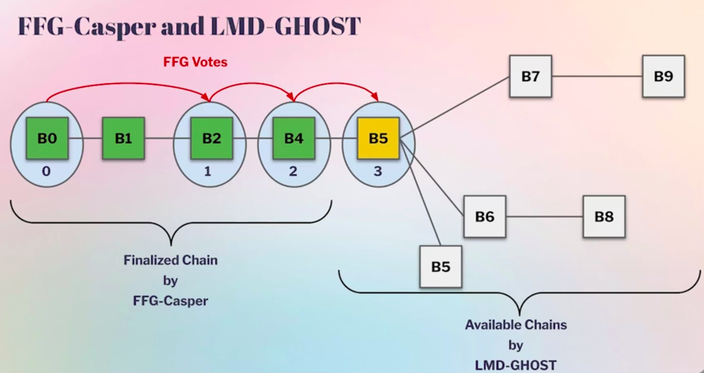

# Fast Confirmation Rule (FCR)

# Overview

**Fast Confirmation Rule (FCR)** is an algorithm that allows Ethereum nodes to determine whether a block will **never leave the canonical chain**, assuming good network conditions.

FCR outputs a simple decision:
- block is **confirmed**
- block is **not confirmed**

FCR is designed to provide **fast, safe block confirmation**, much earlier than Ethereum finalization, and to help bridge the gap until [**Single Slot Finality (SSF)**](https://ethereum.org/roadmap/single-slot-finality/) is implemented.

> canonical chain is the chain that is followed by the honest validators.
---

# Motivation

## Current Confirmation Mechanism

The only **Confirmation Rule** currently available in the Ethereum protocol, [Gasper](https://ethereum.org/developers/docs/consensus-mechanisms/pos/gasper/), is the **FFG Finalization Rule**. While this Confirmation Rule is extremely safe and works under **asynchronous** network conditions, finalization is **too slow** for many use cases. 

- Best case: ~13 minutes  
- Average: ~16 minutes  

A finalized block:
- will never conflict with the canonical chain of any honest validator
- can only be reverted if **> 1/3 of validators are slashed**

### UX Limitations

- Paying for everyday goods (e.g. coffee) requires waiting ~16 minutes
- Deposits to CEXs are unusable until finalization
- Wallets often mark transactions as “confirmed” as soon as they enter a block, which is **not safe**
- ...

---

>

>
<strong>Why FCR Exists if we will have SSF anyway</strong>

>
> Single Slot Finality:
> - is still far away
> - will only be considered *after*:
>   - Stateless Ethereum
>   - Verkle trees
>
> Until then, Ethereum lacks a **safe and fast confirmation rule**.
>
> This is why **centralized exchanges (CEXs)** and infrastructure providers are interested in FCR.

---

### Dangerous alternatives (heuristics) which users **should NOT use**

<strong>Heuristics that rely on Block Depth</strong>

- Confirms blocks after `N` descendants

<strong>Heuristics that rely on Justification-Based Heuristics</strong>

- Slightly better than block depth
- Still lacks information about confirmation

Neither approach satisfies the [**safety property**](/docs/wiki/research/FCR/FCR.md#properties-of-the-confirmation-rule).

---

## What FCR Guarantees

Fast Confirmation Rule relies on **synchrony** conditions, but provides a **best-case confirmation time** of **12 seconds** only, greatly improving on the latency of the FFG Finalization Rule.

**FCR never confirms a block that is not canonical.**

It provides a confirmation rule with formal guarantees.

### Properties of the Confirmation Rule

- **Safety**: confirmed blocks do not get reorged in honest view once confirmed
- **Monotonicity**: confirmed block never moves backward except when a “reset-to-finalized” is triggered (assumption failure signal)

### Practical Implications of FCR

<strong>Improved Wallet Reliability</strong>

- FCR provides a **provably safe confirmation signal**

<strong>Reduce CEX Risk Trade Reversals</strong>

- For exchanges that allow to optimistically trade immediately upon deposit

<strong>PBS Use Case</strong>

- Block builders gain indication about whether their block is unlikely to be reorged out

...

> Users can then rely on the Confirmation Rule that best suits their needs depending on their belief about the network conditions and the need for a quick response.

---

# Gasper Overview

Ethereum PoS consensus is defined by [**Gasper**](https://ethereum.org/developers/docs/consensus-mechanisms/pos/gasper/), where:
- Time unit is **Slot**: 12 seconds (currently)
- **Epoch**: 32 slots  
- Each epoch divides set of validators into 32 committees

Gasper consists of two sub-protocols:

### LMD-GHOST
- Fork-choice algorithm
- Determines the canonical chain head

### FFG-Casper
- Finalizes checkpoints chosen by LMD-GHOST

---
### Block Production Flow

1. At the start of each slot:
   - A proposer is randomly selected from the committee
2. The proposer propose a block on top of the canonical head
3. Other validators in the committee:
   - attest to the proposed block
4. Fork-choice rule:
   - determines the canonical head of the chain

> Under normal conditions, a fork choice rule is unnecessary - there is a single block proposer for every slot, and honest validators attest to it. It is only in cases of large network asynchronicity or when a dishonest block proposer has equivocated that a fork choice algorithm is required. However, when those cases do arise, the fork choice algorithm is a critical defense that secures the correct chain.

---

## Confirmation Rule for LMD-GHOST

The following **assumptions** are required for the confirmation algorithm:

1. Synchronous: Assumes a healthy network. Attestations sent by an honest validator in a slot are received by any other honest validator by the end of that slot
2. Max fraction **β** of the stake of any set of committees is dishonest
    - **β** = 20-25% (configurable)

The goal is to provide a **fast confirmation rule** that is safe under the assumptions above.

These assumptions hold most of the time, allowing the protocol to provide users with a much faster way to confirm blocks than finalization.

---

### Specification overview

(*) The current specification is available in the [**consensus-specs PR**](https://github.com/ethereum/consensus-specs/pull/4747)

---

The **input** to the confirmation rule is the previously confirmed block (stored in `store.confirmed_block`), and the algorithm attempts to advance confirmations along the current canonical chain.

The `get_latest_confirmed` function is the entry point of the confirmation rule and consists of two phases:

1. **Assumption checking**
    - Verifies whether the required assumptions are still holding
    
2. **Confirmation advancement**
   - Finds the latest confirmed descendant along the canonical chain, allowing the algorithm to fast-confirm new blocks relative to the previously confirmed block.

Depending on when the function is executed, a specific version of the logic is applied.

---

`isOneConfirmed` predicate 

- The algorithm searches for the longest prefix of the canonical chain for which `isOneConfirmed` evaluates to `true`.

- If a block passes this check, it has sufficient **LMD-GHOST** support to defeat any potential sibling takeover.
    - The predicate accounts for all possible things that could shift fork choice toward a conflicting chain, including:
        - proposer boost
        - adversarial budget β
        - equivocation
        - empty slot discounting

The check is applied iteratively along the suffix of the chain, starting from the latest confirmed block, and stops once `isOneConfirmed` no longer holds.

---

(*) **The complexity of the confirmation rule arises from the need to correctly handle all edge cases.**

---

## Summary

FCR provides:
- Fast confirmation with strong safety guarantees (1-2 slots best-case latency)
- Better UX without waiting for finalization
- Higher reliability for wallets and exchanges

Until Single Slot Finality becomes available, **FCR fills a critical gap in Ethereum’s confirmation model**.

# Documentation

- [html Paper: A Fast Confirmation Rule (aka Fast Synchronous Finality) for the Ethereum Consensus Protocol](https://arxiv.org/html/2405.00549v3)
- [Fast Confirmation Rule (FCR) breakout room playlist](https://www.youtube.com/watch?v=y5_75Y_09No&list=PLJqWcTqh_zKH4c_vgCCPZ33Ilb9SdEIcq)
- [Fast Confirmation Rule specs](https://github.com/ethereum/consensus-specs/pull/4747)
- Draft short FCR explainer - link will be added when completed 
- [Fast Confirmation Rule - <name>Roberto Saltini</name> (2025 video)](https://www.youtube.com/watch?v=dZU-Ch22MKY&list=PLCGgAwcxXAWyHcMm0X57jVuHtJ6e8gwIP&index=25)
- [Fast Confirmation Rule - Devcon SEA - Roberto & Luca (2024 video)](https://www.youtube.com/watch?v=p7JPRTELnJc&list=PLCGgAwcxXAWyHcMm0X57jVuHtJ6e8gwIP&index=25)

# Implementation
- [Prysm PR #15164](https://github.com/OffchainLabs/prysm/pull/15164)
- [Lighthouse PoC EPF work by <name>Harsh Pratap Singh</name>](https://hackmd.io/6H_e-WqaQFyBENsifLiH6g)

