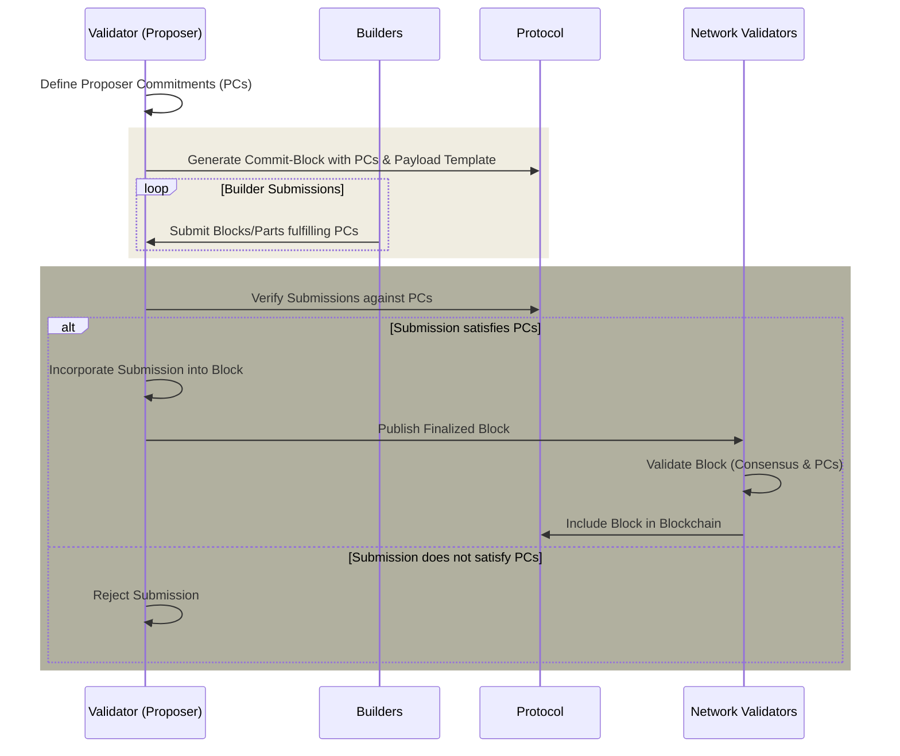

# Protocol-Enforced Proposer Commitments (PEPC)

Protocol-Enforced Proposer Commitments (PEPC), a conceptual extension and generalization of [PBS](/docs/wiki/research/PBS/pbs.md), introduces a more flexible and secure way for proposers (validators) to commit to the construction of blocks. Unlike the existing [MEV-Boost](/docs/wiki/research/PBS/mev-boost.md) mechanism, which relies on out-of-protocol agreements between proposers and builders/relays, PEPC aims to enshrine these commitments within the Ethereum protocol itself, offering a trustless and permissionless infrastructure for these interactions[^1][^2].

## Benefits of PEPC

The introduction of PEPC into Ethereum's ecosystem carries both promising benefits and notable disadvantages, reflecting the complex balance between innovation, security, scalability, and usability. Here's a detailed look at these aspects:

**Enhanced Security and Trustlessness:**

PEPC's primary advantage lies in its ability to enforce agreements between proposers and builders within the Ethereum protocol itself, minimizing trust assumptions. This internalization of commitments enhances security by making it harder for external parties to manipulate transaction inclusion or exploit the proposer-builder relationship.

**Increased Flexibility in Block Construction:**

By allowing for programmable contracts between proposers and builders, PEPC introduces a high degree of flexibility. This can accommodate a variety of block construction scenarios, from full blocks to partial blocks and future slot auctions, enabling more efficient use of block space.

**Decentralization of MEV Opportunities:**

PEPC could potentially lead to a more equitable distribution of MEV opportunities among validators. By embedding diverse commitment mechanisms into the protocol, it reduces the risk of centralizing these opportunities in the hands of a few large operators.

**Scalability and Efficiency Improvements:**

The system aims to optimize the process of block construction and validation, potentially reducing the overhead associated with these tasks. This could contribute to the overall scalability and efficiency of the Ethereum network, aligning with its long-term goals.

**Economic Innovation:**

PEPC opens up new avenues for economic innovation within Ethereum. By enabling different types of transactions and block construction contracts, it could foster novel economic models and incentives, enhancing the dynamism and diversity of the Ethereum economy.

## Disadvantages of PEPC

**Complexity and Implementation Challenges:**
The flexible and generalized nature of PEPC introduces significant complexity into the Ethereum protocol. Designing, implementing, and maintaining such a system poses substantial technical challenges, increasing the risk of bugs, vulnerabilities, and unintended consequences.

**Increased Computational Overhead:**
Enforcing proposer commitments within the protocol could lead to increased computational overhead for validators, impacting the network's performance. This might necessitate more powerful hardware or sophisticated optimization techniques to maintain efficiency.

**Potential for Centralization:**
While PEPC aims to decentralize MEV opportunities, its complexity could inadvertently favor large, technically sophisticated operators capable of navigating the intricacies of the system. This could counteract efforts to decentralize the network further.

**Economic Uncertainty:**
The introduction of PEPC could disrupt existing economic models and incentives within Ethereum, leading to uncertainty. Adjusting to new mechanisms for transaction inclusion and block construction may require time, potentially impacting network stability and user experience.

**Difficulty in Balancing Flexibility and Security:**
Finding the right balance between the flexibility offered by PEPC and the need to maintain a secure, reliable network is challenging. Too much flexibility could make the system unwieldy and difficult to secure, while too little could stifle innovation and efficiency.

## Tradeoffs of Implementation of PEPC

The implementation of PEPC in Ethereum involves several trade-offs, reflecting a balance between advancing the protocol's capabilities and managing new complexities and risks. These trade-offs highlight the nuanced considerations necessary to evolve Ethereum's infrastructure responsibly:

**Trade-off 1: Flexibility vs. Complexity**

- **Flexibility:** PEPC introduces a highly flexible framework for proposers and builders, allowing a variety of customized and programmable commitments. This flexibility can lead to more efficient use of block space and innovative economic arrangements.
- **Complexity:** With increased flexibility comes heightened complexity in protocol design, implementation, and operation. This complexity can raise the barrier to entry for validators and builders, potentially centralizing participation to those with significant technical resources.

**Trade-off 2: Security vs. Overhead**

- **Security:** By embedding proposer commitments directly into the protocol, PEPC enhances the trustlessness and security of block construction, reducing reliance on external parties and minimizing the potential for manipulation.
- **Overhead:** Implementing these commitments within the Ethereum protocol increases computational and operational overhead. Validators may face higher demands on processing and storage, impacting the network's efficiency and scalability.

**Trade-off 3: Economic Innovation vs. Stability**

- **Economic Innovation:** PEPC opens the door to new economic models and incentive structures within Ethereum, potentially improving the distribution of MEV and fostering a more dynamic and fair ecosystem.
- **Stability:** These new economic models introduce uncertainty and may disrupt existing revenue streams and participation incentives. Adjusting to these changes could pose challenges for validators, builders, and users, affecting network stability and predictability.

**Trade-off 4: Decentralization of MEV vs. Risk of Centralization**

- **Decentralization of MEV:** By enabling a broader range of proposer-builder arrangements, PEPC aims to distribute MEV opportunities more widely among participants, aligning with Ethereum's decentralization goals.
- **Risk of Centralization:** The complexity and technical demands of navigating PEPC could inadvertently favor larger, more sophisticated operators, potentially centralizing control and undermining the objective of broadening participation.

**Trade-off 5: Long-term Scalability vs. Short-term Performance**

- **Long-term Scalability:** PEPC's innovations could contribute to Ethereum's scalability over the long term by optimizing block space usage and enabling more sophisticated transaction inclusion mechanisms.
- **Short-term Performance:** The introduction of PEPC and the transition to its mechanisms may initially impact the network's performance, as validators and the infrastructure adapt to the increased complexity and computational demands.

## How would PEPC work?

_Figure – PEPC flow._

The operation of PEPC involves several key components and steps, which together ensure its seamless integration into the Ethereum ecosystem. Here’s an overview of how PEPC would work in practice:

**Step 1: Commit Phase**

- **Proposal Creation:** A validator (proposer) prepares to create a block by defining a set of commitments. These commitments represent agreements or contracts that specify how the block will be constructed. This could include, for example, commitments to include certain transactions, not to include others, or to structure the block in a specific way.

- **Commit Block Generation:** The proposer generates a commit-block that includes these proposer commitments (PCs) alongside the usual consensus data like attestations. This commit-block does not yet contain the full execution payload but specifies a payload template or placeholders for the expected content based on the commitments.

**Step 2: Reveal Phase**

- **Builder Submissions:** Builders, in response to the commitments published by the proposer, submit their proposed blocks or block parts to fulfill the commitments. This might involve submitting specific transactions, execution payloads, or other block components as defined by the initial commitments.

- **Commitment Verification:** Upon receiving submissions from builders, the proposer or the protocol itself verifies that these submissions satisfy the proposer commitments. This verification process ensures that only those blocks or block parts that meet the predefined criteria are considered for inclusion.

- **Block Finalization:** Once a submission from a builder is verified to fulfill the proposer commitments, the proposer finalizes the block by incorporating the builder's submission into the payload template or placeholders defined in the commit phase. The finalized block is then published to the network.

**Step 3: Validation and Inclusion**

- **Network Validation:** Other validators on the network validate the finalized block, ensuring it adheres to the Ethereum protocol rules and the specific proposer commitments. This step may involve standard block validation procedures, along with additional checks for commitment fulfillment.

- **Block Inclusion:** Upon successful validation, the block is included in the blockchain. This inclusion is contingent on the block satisfying both the usual Ethereum consensus rules and the specific proposer commitments outlined in the commit phase.

**PEPC's Mechanisms for Flexibility and Security**

- **Programmable Contracts:** PEPC allows proposers to enter into various programmable contracts with builders, ranging from full blocks to partial blocks, and even future slot auctions. This versatility enables a tailored approach to block construction, maximizing efficiency and optimizing block space usage.

- **Atomicity and Trustlessness:** The commit-reveal scheme ensures that either all parts of a commitment are fulfilled, or the block is rejected, maintaining atomicity. This process is enforced by the protocol, reducing reliance on external trust and minimizing the risk of manipulation.

- **Dynamic Block Construction:** By enabling a dynamic approach to block construction, PEPC allows for the real-time adjustment of block contents based on network conditions, user demands, and emerging opportunities, such as MEV extraction.

## PEPC Use Cases

PEPC offers several compelling use cases[^2]:

**Full-Block Auctions**

- Validators auction the right to construct entire blocks to builders. This mirrors the current MEV-Boost mechanism but with enhanced security and trustlessness by embedding the auction within the Ethereum protocol.
- Ensures a transparent and fair process for block construction, potentially leading to more competitive bidding and better rewards for validators.

**Partial Block Auctions**

- Validators can auction portions of a block's space to different builders, allowing multiple parties to contribute to a single block's construction.
- Increases block space utilization efficiency and encourages diversity in transaction inclusion, mitigating potential centralization in block construction.

**Parallel Block Auctions**

- Similar to partial block auctions but with the auction focused on separate, parallel components of block space, enabling a more granular approach to block construction.
- Offers validators more control over block contents and structure, potentially optimizing for various factors like gas usage, transaction priority, and MEV extraction.

**Slot vs. Block Auctions**

- Validators commit in advance to using blocks or block parts from specific builders, differentiating between commitments to "slots" (who will build) versus "blocks" (what will be built).
- Enhances predictability and planning for both validators and builders, potentially leading to more strategic block construction and MEV extraction opportunities.

**Future Slot Auctions**

- Validators auction the rights to construct blocks for future slots, essentially creating futures contracts for block space.
- Provides market participants with more tools for speculation and hedging, potentially stabilizing income for validators and offering builders advanced planning capabilities.

**Inclusion Lists**

- Validators commit to including specific transactions in their blocks, either through direct listing or by adhering to lists provided by third parties.
- Increases transparency and predictability for transaction inclusion, potentially reducing gas price volatility and improving user experience.

**Dynamic Block Configuration**

- Validators use PEPC to adjust block configurations dynamically, responding to real-time network conditions and demands.
- Enhances network responsiveness and efficiency, potentially improving throughput and reducing congestion during peak periods.

**Censorship Resistance**

- By making commitments to include certain transactions or follow specific inclusion patterns, validators can provide guarantees against censorship.
- Strengthens Ethereum's censorship-resistant properties, ensuring that the network remains open and accessible to all users.

**Protocol Upgrades and Feature Testing**

- PEPC can be used to test new protocol features or upgrades in a live environment without risking network stability, by making commitments to include transactions that utilize these features.
- Offers a safer pathway for innovation and evolution within the Ethereum protocol, allowing for more experimental approaches to development.

## Relationship and Differences to EigenLayer

PEPC and Eigenlayer have a complementary relationship, each addressing different aspects of Ethereum's scalability, security, and decentralization, while also sharing a common goal of enhancing the network's efficiency and flexibility[^3].

- **Security Layering:** Eigenlayer introduces a mechanism to extend Ethereum's security to additional layers and services. In contrast, PEPC focuses on embedding more sophisticated and flexible commitment mechanisms within the Ethereum protocol itself. While Eigenlayer seeks to augment Ethereum's security model externally, PEPC aims to enhance the internal workings of the Ethereum main chain, specifically around block proposal and transaction inclusion processes.

- **Validator Commitments:** Both PEPC and Eigenlayer involve validators making certain commitments, but the nature and scope of these commitments differ. In Eigenlayer, validators might commit to securing additional layers or services by restaking their ETH. In PEPC, validators make commitments regarding the construction of blocks, such as including certain transactions or adhering to specific block construction criteria.

- **MEV and Transaction Inclusion:** Both projects indirectly address issues related to MEV and transaction inclusion fairness. Eigenlayer can facilitate solutions that mitigate the negative aspects of MEV or improve transaction inclusion through additional consensus layers. PEPC, by allowing for more dynamic and programmable proposer-builder agreements, could lead to a more equitable distribution of MEV opportunities and more transparent transaction inclusion mechanisms.

**Economic Bound to Security in Eigenlayer**

In principle, if the value at stake in activities or assets secured by Eigenlayer exceeds the value of staked ETH in Ethereum, the economic incentives could potentially become misaligned, leading to concerns about the sufficiency of security provided [^2].

In a broader Ethereum ecosystem context, PEPC and Eigenlayer could be seen as complementary, with Eigenlayer expanding Ethereum's security and utility beyond its core protocol and PEPC enhancing the efficiency and flexibility within the core protocol itself. Implementing both could lead to a scenario where Ethereum not only becomes more efficient and adaptable in handling transactions and block construction but also extends its security guarantees to a broader range of decentralized applications and services.

## Resources 
- [Unbundling PBS: Towards protocol-enforced proposer commitments (PEPC)](https://ethresear.ch/t/unbundling-pbs-towards-protocol-enforced-proposer-commitments-pepc/13879/1)
- [PEPC FAQ](https://efdn.notion.site/PEPC-FAQ-0787ba2f77e14efba771ff2d903d67e4)
- [EigenLayer protocol](https://docs.eigenlayer.xyz/eigenlayer/overview/whitepaper)
- [Notes on Proposer-Builder Separation (PBS)](https://barnabe.substack.com/p/pbs)
- [Mike Neuder - Towards Enshrined Proposer-Builder Separation](https://www.youtube.com/watch?v=Ub8V7lILb_Q)
- [An Incomplete Guide to PBS - with Mike Neuder and Chris Hager](https://www.youtube.com/watch?v=mEbK9AX7X7o)
- [ePBS – the infinite buffet](https://notes.ethereum.org/@mikeneuder/infinite-buffet)

## References
[^1]: https://ethresear.ch/t/unbundling-pbs-towards-protocol-enforced-proposer-commitments-pepc/13879/1
[^2]: https://efdn.notion.site/PEPC-FAQ-0787ba2f77e14efba771ff2d903d67e4
[^3]: https://docs.eigenlayer.xyz/eigenlayer/overview/whitepaper
