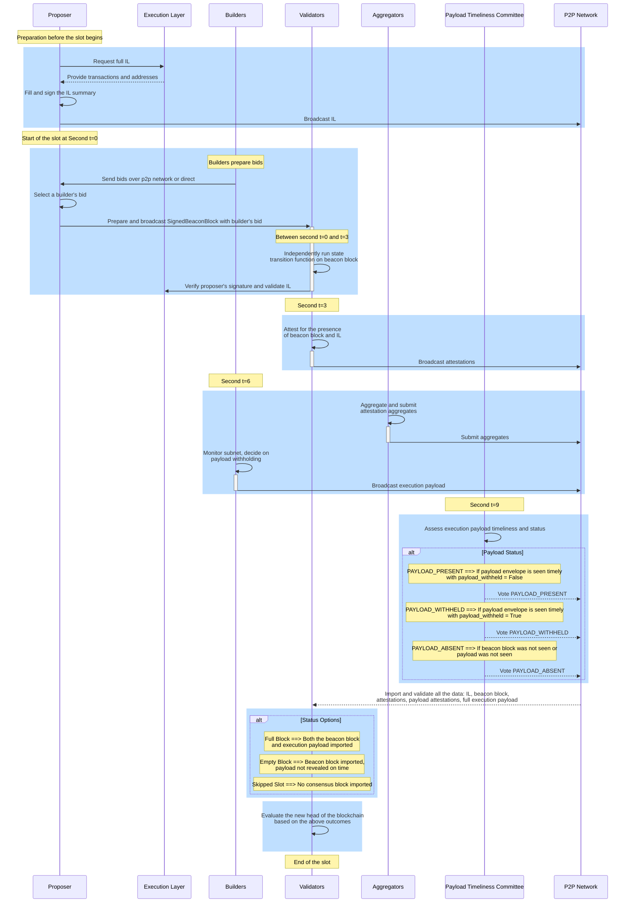

# ePBS Design Specifications

The current ePBS specification[^1][^2] addresses a critical issue in Ethereum's current implementation of PBS. Traditionally, both proposers and builders have had to rely on intermediaries through [MEV-Boost](/docs/wiki/research/PBS/mev-boost.md), which introduces trust and censorship concerns as outlined in the [ePBS document](/docs/wiki/research/PBS/ePBS.md). The ePBS specifications framework modifies this dynamic by changing the necessity of intermediaries ("must") to an option ("may"), allowing for a more trustless interaction within the Ethereum ecosystem. 

## Specifications Overview

The ePBS specification is divided into separate components to build on top of the existing specifications of Ethereum components. 
- `Beacon-chain.md`: This document specifies the beacon chain specifications of the ePBS feature[^6].
- `Validator.md`: This document specifies the honest validator behavior specifications of the ePBS feature[^7].
- `Builder.md`: This document specifies the honest builder specifications of the ePBS feature[^8].
- `Engine.md`: This document specifies the Engine APi changes due ePBS fork[^9].
- `fork-choice.md`: This document specifies the changes to the fork-choice due to the ePBS upgrade[^10].


## Main Improvements of the ePBS specification

**Trust Minimization**: It minimizes the necessity of trust in intermediaries by allowing proposers and builders to operate more independently, reducing the risk of manipulations and trust dependencies.

**Minimal Changes for Compatibility**: The design implements the least number of changes necessary to maintain compatibility with current consensus and execution client operations. It adheres to the existing 12-second slot time, ensuring continuity and stability in the network's operation.

**Censorship Resistance**: It enhances censorship resistance by incorporating forward forced inclusion lists as per [EIP-7547](https://eips.ethereum.org/EIPS/eip-7547), ensuring that certain transactions must be included, which helps in maintaining network integrity.

**Layer Enhancements**: The changes are primarily in the consensus layer (CL), with minimal adjustments required on the Execution Layer (EL), mainly related to the handling of inclusion lists.

**Safety Guarantees**:

- **Proposer Safety**: It ensures that proposers are protected against 1-slot reorganization attacks by colluding proposers and builders, even those controlling network topology with up to 20% of the stake.
- **Builder Safety**: Guarantees are in place for builders against collusion and manipulation by consecutive proposers, including measures to ensure the safety of both withheld and revealed payloads.
- **Unbundling Guarantees**: Builders are protected under all attack scenarios, ensuring integrity in transaction handling and execution.

**Self-Building for Validators**: Validators retain the capability to self-build their payloads, which is crucial for maintaining independence and flexibility.

**Composability**: The specification is designed to be composable with other mechanisms like slot auctions or execution ticket auctions, enhancing flexibility and potential for future innovations.


**Implementation Details:**

The ePBS specification introduces specific roles and responsibilities:

- **Builders**: Validators that submit bids for payload commitments.
- **PTC (Payload Timeliness Committee)**: A new committee that verifies the timeliness and validity of payloads.

During each slot, proposers collect bids, and upon selecting a bid, they submit their blocks with a signed commitment from the builder. Validators then adjust financial credits between builders and proposers based on these commitments. Builders later reveal their execution payloads, fulfilling their obligations. The slot outcomes can vary—missed, empty, or full—based on the production and revelation of the blocks, with the PTC playing a critical role in determining the nature of the slot's conclusion.

The implementation includes [EIP-7251](https://eips.ethereum.org/EIPS/eip-7251) and [EIP-7002](https://eips.ethereum.org/EIPS/eip-7002), which are essential for ePBS function. EIP-7251 increases the maximum balance for Ethereum validators to 2048 ETH, keeping a minimum of 32 ETH to reduce the number of validators without losing security[^3]. EIP-7002 allows validators to exit the beacon chain using special withdrawal credentials, enhancing staking flexibility and security[^4].

## Anatomy of a Slot Timeline




_Figure – New Slot Anatomy Flow based on the ePBS specs._


Explanation of the new slot anatomy flow based on the ePBS specs:

### Preparation Before the Slot

- **Proposer** prepares by requesting a full inclusion list from the EL[^9], filling and signing the summary, and then broadcasting it to the p2p network.

**New in ePBS:** The IL is new component in the EL for proposers to guarantee censorship resistance of the network. They operate on a forward inclusion basis, where proposers and validators interact to ensure that transactions are carried forward accurately and efficiently[^5].

**Inclusion List Containers:**
- **InclusionListSummary:** Contains the proposer's index, the slot, and a list of execution addresses.
- **SignedInclusionListSummary:** Includes the above summary with a proposer's signature.
- **InclusionList:** Comprises the signed summary, the parent block hash of the beacon block, and a list of transactions.

**Requesting IL from EL:**
- Proposer retrieves the transactions to be included in the next block from the execution layer by calling the function `get_execution_inclusion_list`, ensuring they are valid according to the current state. The response is a container `GetInclusionListResponse` that contains `transactions` (list of transaction objects as required by the EL) and `summary` (summary of `transactions`, including essential identifiers like "from" addresses).
**Building the IL:**
- Proposer calls the function `build_inclusion_list` to organize received transactions into a structured format, prepares the summary for signing, and ensures compliance with network standards. The response is a container `InclusionList` that contains `SignedInclusionListSummary`, a signed transaction summary, verifying authenticity and integrity and `transactions`, the list of validated transactions ready for inclusion.
**Broadcasting the IL:**
- Once the IL is prepared and signed, the proposer broadcasts it to the entire network via the p2p. 


### Start of the Slot at Second t=0

- **Builders** prepare their bids and send them to the proposer via the p2p network or directly.
- The **Proposer** selects a builder's bid, prepares, and broadcasts a **SignedBeaconBlock** containing the builder's bid.

**New in ePBS:** The inclusion of `inclusion_list_summary` attribute in `ExecutionPayload`. This field relates to the inclusion summary of certain transactions within the block, providing control over what is included in the block.

**Builders: Preparing and Sending Bids**
- Builders prepare bid using the `ExecutionPayloadHeader` container which contains essential details like the parent block hash, fee recipient, and proposed transaction fee, etc. 
- Builders create `SignedExecutionPayloadHeader`, a signed header `ExecutionPayloadHeader` and broadcast it.
- Bids are sent either directly to the proposer or broadcasted over the p2p network using the `execution_payload_header` topic.

**Proposers: Selecting Bids and Broadcasting the Signed Beacon Block**
- The proposer evaluates bids based on several criteria, such as the bid amount and the reliability or past performance of the builder. to select a bid. 
- The proposer constructs a `BeaconBlockBody`, which includes the `signed_execution_payload_header` among other standard elements.
- The function `process_block_header` processes the block header, ensuring all elements conform to the consensus rules and that the block is valid within the current chain context.
- The block, now containing the selected execution payload header, is signed by the proposer to produce `SignedBeaconBlock`. 
- The signed block is then broadcast over the p2p network using the `beacon_block` topic, making it available to all network participants.
- The `ExecutionPayloadHeader` within the `BeaconBlockBody` prepared by the proposer includes `parent_block_hash` linking to the parent block in the execution layer, ensuring continuity of the chain and `block_hash` will eventually link to the hash of the `ExecutionPayload` that the builder will produce and is crucial for validators to verify the integrity and continuity of the chain.


### Between Second t=0 and t=3

- **Validators** independently run the state transition function to validate the beacon block, verify the proposer's signature and validate the inclusion list.

**Validators: Validating the Beacon Block and Inclusion List**
- Upon receiving the `SignedBeaconBlock`, validators invoke the `process_block` function, which is a comprehensive function handling different aspects of the block processing including header validation, RANDAO, proposer slashings, attestations, and more. 
- For ePBS, particular attention is paid to `process_execution_payload_header`, which validates the execution payload header within the block.
- Validators verify the IL that is referenced within the `ExecutionPayloadHeader`. To do that, they use the `verify_inclusion_list` function to assess the correctness of the IL in terms of transaction validity, signature integrity of the summary, and alignment with the previously agreed state, and the proposer index within the IL corresponds to the expected proposer for the given slot. 
- If the block and IL are validated successfully, the state transition function `state_transition` updates the beacon state to reflect the new block. This includes updating validator statuses, adjusting balances based on attestations and slashings, and rotating committees.


### Around Second t=3

- **Validators** attest to the presence of the beacon block and the IL, ensuring everything is in order up to this point.

**Validators: Attesting to Beacon Block**
- Validators call the function `process_attestation` to verify and process each attestation made against the beacon block. This includes validating the beacon block's slot, the attestation's committee, and ensuring the correctness of the attestation data as per the consensus rules.


### Around Second t=6

- **Aggregators** aggregate and submit the attestation aggregates.
- **Builders** build and broadcast their execution payloads. They monitor network subnets and decide whether to withhold their payloads based on network conditions and voting.
- Builders package the execution payload, which includes all the necessary information for transaction execution, into the container `ExecutionPayloadEnvelope`. This encapsulation ensures that the payload is ready for integration into the beacon chain. They will set the field `payload_withheld` to be false. 
- Additionally, an honest builder can withhold the payload if they didn't see a consensus block on timely by setting `payload_withheld` to be true.
- They run the function `process_execution_payload` to process the execution payload against the current state to ensure its validity. It involves validating transactions, ensuring state transitions are correct, and checking that the payload aligns with the consensus rules.
- Then, they sign the container `ExecutionPayloadEnvelope` to generate `SignedExecutionPayloadEnvelope` before broadcasting to the topic `execution_payload` via p2p network.


### Around Second t=9 - Payload Timeliness Committee (PTC)

- At second t=9 of the slot, the PTC assesses the timeliness of the execution payload. This committee, consisting of 512 validators, votes based on their observation of the execution payload's presence and timing relative to the consensus block.

**New in ePBS:** The PTC is a new component introduced in this epbs specs. 
- **Composition and Function:**
  - **Committee Formation:** PTC members are selected from the first non-builder members of each beacon slot committee. This ensures that the committee is comprised solely of validators who are not concurrently serving as builders, thereby minimizing conflicts of interest.
  - **Attestation Rewards and Penalties:** PTC members receive standard attestation rewards for correctly attesting to the presence or absence of payloads. Accurate attestations align with the actual payload status (`full` or `empty`), for which validators receive full attestation credits (target, source, and head timely). Incorrect attestations result in penalties akin to missed attestations.
  - **Attestation Handling:** Attestations by PTC members to the CL block are disregarded to focus solely on payload verification tasks.
  - **Inclusion of Attestations in Blocks:** The proposer for slot `N+1` is responsible for including PTC attestations from slot `N` in the block. There are no direct incentives for including incorrect attestations; thus, typically only one PTC attestation per block is necessary.
- **Aggregation and Broadcast:** Two methods exist for importing PTC attestations. Aggregated attestations (`PayloadAttestation`) are included in blocks for the previous slot, while unaggregated attestations (`PayloadAttestationMessage`) are broadcasted and processed in real-time for the current slot.

**PTC Validators Assess and Vote on Execution Payload Timeliness**
- Each PTC validator independently checks if they have received a valid `ExecutionPayload` from the builder that was supposed to reveal it according to the signed `ExecutionPayloadHeader` included in the current beacon block. PTC Validators vote on the timeliness of the payload based on its presence and the timing of its reception.

**Broadcast Payload Timeliness Attestation**
- If the execution payload is confirmed to be present and timely, PTC validators produce and broadcast payload timeliness attestations, confirming these observations. `PayloadAttestation` container captures the validators' attestations regarding the payload's timeliness and presence.
- `get_payload_attesting_indices` function determines which validators in the PTC are attesting to the payload's presence and timeliness by checking their aggregation bits in the `PayloadAttestation`. 
- Attestations are broadcast on the p2p network via the `payload_attestation_message` topic.

**Aggregate and Include Payload Attestations in Beacon Blocks**
- Aggregators collect individual `PayloadAttestation` messages, aggregate them, and ensure their inclusion in upcoming beacon blocks to record and finalize the validators' consensus on payload timeliness. They are aggregated into an `IndexedPayloadAttestation` container, which includes a list of validator indices that attested, the payload attestation data, and a collective signature.

**Update Beacon Chain State Based on Attestations**
- `process_payload_attestation` function is invoked by the beacon chain to process and validate incoming payload attestations. It ensures that the attestation data is correct and that the signatures are valid, integrating this information into the beacon state. The beacon chain state is updated based on the payload attestations. 
- These attestations influence the fork choice by affecting the weights of various blocks and potentially leading to different chain reorganizations based on the perceived timeliness and presence of execution payloads.

**Reward Calculation and Distribution**: For each validator that correctly attested to the payload status, it sets participation flags and calculates rewards based on predefined weights (`PARTICIPATION_FLAG_WEIGHTS`). The rewards are aggregated, and the proposer of the attestation is rewarded proportionally, with the calculation considering various weights and denominators defined in the protocol specifications (`WEIGHT_DENOMINATOR`, `PROPOSER_WEIGHT`).

**Proposer Reward**: The function finally calculates the proposer's reward and updates the proposer's balance by calling `increase_balance` method.


### End of the Slot

- As the slot concludes, validators complete several crucial tasks:
  - **Importing and Validating**: Validators ensure they have imported and validated the inclusion list, the consensus block, all single bit and aggregated attestations, the payload attestations, and the full execution payload.
  - **Evaluating the Blockchain's New Head**: Based on the data validated, validators make a critical decision on the chain's state.They determine whether the slot results in:
    - **Full Block**: Both the consensus block and the corresponding execution payload have been successfully imported.
    - **Empty Block**: The consensus block was imported, but the associated execution payload was not revealed on time.
    - **Skipped Slot**: No consensus block was imported during the slot, leading to a skipped slot scenario.
- The fork choice function `get_head` determines the head of the chain after considering the latest block proposals, payload attestations, and any other pertinent information such as weights from attestations and balances.
- All nodes synchronize their states based on the fork choice's outcome, ensuring consistency across the network. This synchronization includes applying all the state transitions and updates from attested blocks and execution payloads.


## Inclusion List Timeline

**Gossip Layer Checks:**
- Inclusion lists are verified for timing, ensuring relevance to the current or next slot.
- Each proposer-slot pair is restricted to broadcasting one inclusion list on the network, although proposers may send different lists to different peers.
- The number of transactions must match the summary count and not exceed the set maximum in `MAX_TRANSACTIONS_PER_INCLUSION_LIST`.
- Inclusion list signatures are validated against the proposer's key, confirming their scheduled slot.

**Risks and Mitigations:**
- Broadcasting an inclusion list for the upcoming slot before a head change may lead to availability issues, although the list is still considered available.

**on_inclusion_list Handler:**
- Serves as a bridge to execution engine API calls, assuming the corresponding beacon block is processed.
- If a beacon block's parent was empty, any new inclusion list is automatically ignored to prevent backlog.

**Beacon State Tracking:**
- Tracks proposer and slot for the most recent and previous IL to manage fulfillment and update upon new valid blocks.

**EL Validation:**
- Checks that transactions `inclusion_list.transactions` are valid and includable using the current state.
- Ensures summary `inclusion_list.signed_summary.message.summary` accurately lists "from" addresses for the included transactions.
- Verifies that the total gas limit of transactions does not exceed the maximum allowed `MAX_GAS_PER_INCLUSION_LIST`.
- Ensures accounts listed have sufficient funds to cover the maximum potential gas fees `(base_fee_per_gas + base_fee_per_gas / BASE_FEE_MAX_CHANGE_DENOMINATOR) * gas_limit`.


## Execution Payload's Timeline

The processing of execution payloads in the ePBS system includes several critical steps distributed across gossip, consensus, and execution layers:

**Gossip** Execution payloads are shared via the `execution_payload` pubsub topic with key validations:
- Confirm the beacon block associated with the payload is valid.
- Verify builder index and payload hash against the beacon block.
- Validate the builder's signature.

**Consensus State Transition** Post-gossip, payloads undergo consensus validation through `on_execution_payload` fork choice handler:
- **Signature Verification:** Ensures the integrity of the payload signature.
- **Withdrawals and Inclusion List Verification:** Confirms correct processing of withdrawals and adherence to the inclusion list specified by the beacon state.
- **Payload Consistency and EL Validation:** Checks that all payload elements align with the beacon state commitments and sends the payload to the execution layer for further validation.
- **State Updates and Verification:** Updates beacon state records and verifies the new state root to confirm accurate state transitions, `latest_block_hash` and `latest_full_slot`.

**Execution Layer State Transition** The execution layer expands its role to validate `InclusionListSummary` satisfaction:
- **Transaction and Balance Verification:** Tracks addresses involved in transactions or balance changes.
- **Inclusion List Satisfaction:** Ensures each address in the `InclusionListSummary` is active in the payload, considering transactions and balance changes from current and previous payloads.
- **Special Case Handling:** Manages unique scenarios such as transactions enabled by [EIP-3074](https://github.com/ethereum/EIPs/blob/master/EIPS/eip-3074.md).


## Payload Attestation's Timeline

**Gossip** Payload attestations are broadcasted by PTC members using `PAYLOAD_ATTESTATION_MESSAGE` objects with stringent checks before propagation:
- **Current Slot Verification:** Only attestations for the current slot are gossiped.
- **Payload Status Validation:** Attestations must have a valid payload status to be gossiped.
- **Single Attestation Per Member:** Only one attestation per PTC member is shared.
- **Beacon Block Root Presence:** Attestations are linked to slots with a known beacon block root.
- **PTC Membership Check:** Validators must be confirmed members of the PTC.
- **Signature Verification:** Attestations must have a valid signature.

**Forkchoice Handler** Upon passing gossip validation, payload attestations are processed in the forkchoice through the `on_payload_attestation_message` handler, which includes:
- **Beacon Block Validation:** Confirms the associated beacon block is in the forkchoice store.
- **PTC Slot Validation:** Verifies the attester is in the PTC for the specified slot.
- **Slot Matching:** Checks that the beacon block corresponds to the attestation slot.
- **Current Slot and Signature Checks (if not from block):** For direct broadcasts, validates the slot is current and verifies the signature.
- **PTC Vote Update:** Updates the PTC vote tracked in the forkchoice for the given block root.


## Beacon Block's Timeline

**Gossip**
- **Initial Validation**: `SignedBeaconBlock` enters through gossip or RPC, with critical validations focusing on the legitimacy of the parent beacon block.

**on_block Handler**
- **Beacon Block Validation**: Validates blocks based on two parent elements: the consensus layer (via `block.parent_root`) and the execution layer derived from the `signed_execution_payload_header` entry in the `BeaconBlockBody`.
- **BeaconBlockBody Adjustments**: Modifications in `BeaconBlockBody` include removing execution payload and blob KZG commitments, adding `signed_execution_payload_header`, and new `payload_attestations`.

**State Transition**
- **Modified Functions**: `process_block` now adjusts for ePBS changes, including modifications to withdrawal processing and syncing the parent payload.
- **Withdrawals**: Managed in two phases; deductions during consensus block processing, and fulfillments verified during execution payload processing.
- **Execution Payload Header**: Validates builder's signature, funding, and the immediate transfer of bid amounts to the proposer, with state adjustments noted in the beacon state.

**Payload Attestations** Payload Attestations `PayloadAttestation` represent a significant component within the beacon block processing, adding a layer of verification for the execution payloads by the PTC.

- **PTC Committee Formation**
  - **Committee Selection**: The `get_ptc` function is designed to assemble the PTC by selecting validators from existing beacon committees, specifically targeting validators from the end of each committee list to form the PTC. The selection process ensures that the PTC is adequately populated while minimally impacting the structure and function of the standard beacon committees.

- **Processing Payload Attestations**
  - **Attestation Requirements**: Payload attestations are required to pertain to the previous slot and match the parent beacon block root, ensuring they are timely and accurately reference the correct beacon state.
  - **Incentives and Penalties**:
    - **Consistency Checks**: Each attestation is checked against the beacon state to determine consistency. Consistent attestations (e.g., `PAYLOAD_PRESENT` when the slot was indeed full) result in rewards for both the proposer and the attesting validators. This aligns their incentives with the accurate and honest reporting of payload statuses.
    - **Reward Calculation**: For consistent attestations, participation flags `PARTICIPATION_FLAG_WEIGHTS` are set for the attesting validators, and the proposer receives a reward `proposer_reward` calculated based on the base rewards of the attesters, ensuring that validators are motivated to participate actively and correctly in the PTC.
    - **Penalties for Inconsistencies**: If an attestation is found to be inconsistent (e.g., attesting to `PAYLOAD_ABSENT` when the payload was present), penalties are imposed. Both the proposer and the attesters are penalized to deter the inclusion of incorrect or misleading attestations. The penalty for the proposer `proposer_penalty` is notably doubled to prevent any potential collusion between proposers and attesters where they might benefit from including both consistent and inconsistent attestations.

- **Implementation and Justification**
  - **Avoiding Slashing Conditions**: There are no slashing conditions specifically for PTC attestation equivocations to prevent overly punitive measures that could discourage participation. However, penalties are structured to ensure that there is no net benefit to submitting equivocating attestations.
  - **Doubling the Proposer Penalty**: The rationale for doubling the penalty for the proposer is to ensure that there is no scenario where both a penalty and a reward would cancel each other out, thus maintaining a deterrent against the inclusion of conflicting attestations.


## Honest Validator Behavior

The roles and behaviors of validators are refined, especially for proposers and PTC members, due to the introduction of new mechanics such as fork choice considerations, execution payload validation, and timing of IL. 

**Proposer Responsibilities**
- **Execution Payload and Inclusion List Preparation**:
  - Prior to their designated slot, proposers need to select a `SignedExecutionPayloadHeader` from builders and request or construct an `InclusionList`.
  - These activities can be conducted before the slot begins to ensure readiness and efficiency.
- **Broadcast Timing**:
  - Proposers are incentivized to broadcast their IL early to increase the likelihood of their blocks being attested to, thus securing their block's position in the chain.

- **Builder Interaction**:
  - Validators can act as their own builders (self-building) or may engage with external builders. Direct interactions with builders (off-protocol methods) are encouraged as they may yield the most competitive bids in real-time.

- **Strategic Considerations**:
  - Due to potential MEV opportunities, proposers might strategically delay choosing or requesting a builder’s bid until the last feasible moment for block broadcasting. This tactic is to MEV from the available transaction pool.

**Head Determination for Proposers**
- **Basic Principle**: At the start of slot `N`, proposers must determine the head of the chain to propose a new block effectively. This involves evaluating various scenarios like skipped slots, missing payloads, and late payloads, and making a decision based on the most recent valid block data.

**PTC Member Duties**
- **Payload Timeliness Attestations**:
  - PTC members are tasked to verify the timeliness of the execution payload for the current slot and cast a `payload_attestation` based on their observations:
    - `PAYLOAD_PRESENT`: If both a valid consensus block for the current slot and the corresponding execution payload are observed.
    - `PAYLOAD_WITHHELD`: If a valid consensus block for the current slot is seen along with a `payload_withheld = true` message from the builder.
    - `PAYLOAD_ABSENT`: If a valid consensus block is seen without the corresponding execution payload.
    - No attestation is made if no consensus block for the current slot is observed.

- **Attestation Conditions**:
  - PTC members only import the first consensus block they observe and base their actions on it, ensuring a single, coherent response per slot.

**Constructing Payload Attestations**
- **Operational Window**:
  - PTC members prepare to attest approximately 9 seconds into the slot, evaluating whether the execution payloads are timely and accurately synced with the consensus blocks.
  - This includes assessing whether payloads are withheld correctly and ensuring that their attestation reflects the actual status of payload availability or absence.

**Validator Considerations**
- Validators must adeptly handle their roles, whether as proposers, PTC members, or general attestors, navigating the intricacies of new ePBS mechanics to maintain network integrity and security. This involves strategic decision-making, timely actions, and adherence to protocol to optimize their influence and rewards within the network.

## Honest Builder Behavior

**Preparing Multiple Payloads**
- **Adaptability**: Builders are expected to prepare different payloads for various potential parent heads. This preparation allows them to adapt to changes in the fork choice at the last moment.
- **Multiple Bids**: Builders can submit multiple bids ahead of their intended slot, increasing their chances of selection by proposers.

**Bid Submission Strategy**
- **Broadcasting Bids**: Builders can submit bids via off-protocol services directly to proposers. This strategy allows builders to continually update and refine their bids without exposing them to the entire network, which could potentially lead to the inclusion of suboptimal payloads.
- **First Seen Message Rule**: Validators will only gossip the first valid seen message for a particular combination of (builder, slot), which encourages builders to submit their best possible bids early in the process.

**Direct Bid Requests**
- **Enhanced API Specification**: Introducing direct bid requests through a `SignedBidRequest` mechanism would allow validators to request execution headers directly from builders. This minor modification to the builder API could utilize existing client code and enhance direct interactions between validators and builders.

```python
class BidRequest(container):
    slot: Slot
    proposer_index: Validator_index
    parent_hash: Hash32
    parent_block_root: Root

class SignedBidRequest(container):
    message: BidRequest
    signature: BLSSignature
```

- **Cryptographic Binding**: The direct request mechanism can be designed to cryptographically bind the request to the validator, preventing builders from adjusting their bids based on what others are offering, thereby reducing the risk of collusion and cartelization among builders.

**Gossip as Fallback**
- **Fallback Mechanism**: Despite the advantages of direct bid requests, maintaining a global topic for bid gossip provides a crucial fallback. This system supports validators running on lower-end hardware or those who prefer community-driven builders, ensuring they have access to competitive bids.
- **Anti-Censorship and Anti-Cartel Measures**: By setting a public minimum bid through community-driven builders, the system forces centralized builders to outbid these public offers if they wish to censor certain transactions. This feature serves as a baseline for competition and transparency in bid submission.
- **Spam Protection**: The global topic can be protected against spam by only allowing the highest value bid received for a given parent block hash to be gossiped, and restricting to one message per builder per slot.


## Security analysis of proposer and builder interactions

**Builder Reveal Safety**
- **Scenario**: Collusion between proposers to reorganize the payload of a builder who has revealed their payload timely.
- **Outcome**: The security design ensures that the builder's payload cannot be reorganized by subsequent proposers as long as the attackers do not control more than a specific threshold of the stake (up to 40% in this example).
- **Key Equation**: The revealed payload remains secure if \(RB > PB\), where \(RB\) is the builder's reveal boost and \(PB\) is the proposer boost.

**Builder Withholding Safety**
- **Scenario**: Builder decides to withhold the payload due to the late arrival of the consensus block, aiming to avoid penalties.
- **Outcome**: The (block, slot) voting mechanism supports the builder's decision to withhold the payload without penalties if the block is not the head of the chain or arrives late.
- **Effective Safety**: The builder is safeguarded against attacks where proposers manipulate block timing to force a payload reveal, ensuring the builder is not forced to pay if the conditions for a safe reveal are not met.

**Proposer Safety**
- **Scenario**: Attempts to reorganize the chain through collaboration between builders and the next proposer.
- **Outcome**: Analysis shows that as long as the attackers control less than 20% of the stake, proposers who act honestly and reveal their blocks timely are guaranteed inclusion on the chain.
- **Detailed Analysis**: Demonstrates the resilience of the system against both ex-anti and post-anti reorganization attempts, maintaining the integrity of honest proposers' blocks against collusion and network control.

**General Security Considerations**
- The proposed design handles different payload statuses effectively by ensuring that votes only support chains consistent with PTC decisions.
- Inclusion list availability plays a crucial role in determining the canonical head, enhancing ledger integrity by emphasizing validated inclusions.
- Payload boosts (both for revealing and withholding) play a critical role in adjusting the weight calculations during fork choice, which can influence chain reorganizations and stability based on payload availability and actions.


## Forkchoice Considerations

The introduction of the ePBS fork brings sophisticated changes to the forkchoice rules, specifically targeting builder and proposer safety. These changes are designed to accommodate network delays and strategic behaviors like payload withholding.

**Key Concepts in ePBS Forkchoice:**

- **(Block, Slot) Voting:**
  - This mechanism ensures that if a block arrives late, validators will support the last timely block instead of the late one.
  - Consistently, late blocks accumulate less weight as validators continue to support earlier, timely blocks.
- **Payload Status Handling:**
  - The status of payloads (missing, empty, full) influences validators' support for chains.
  - Votes support chains that are consistent with the PTC decisions on payload status, ensuring that payloads are either included or excluded based on timely availability.
- **Inclusion List Availability:**
  - The presence and validation of IL are crucial. Validators may base their head determinations on the latest block with a fully validated IL.
  - This consideration ensures that blocks built on properly included transactions are favored, enhancing the chain integrity.
- **Security Analysis of Payload Boosts:**
  - Builder's reveal boost (RB) and withholding boost (WB) are introduced to reward or protect builders based on their actions in revealing or withholding payloads.
  - These boosts significantly influence the forkchoice by altering the weight calculations, potentially leading to reorganizations or stabilization of the chain based on payload availability and integrity.

**Practical Examples:**
- **Happy cases** show normal operation where all blocks and payloads arrive on time and receive full support.
- **Late blocks and payloads** illustrate scenarios where validators shift their support to earlier blocks, affecting the weight distribution across potential chain forks.
- **Payload status scenarios** demonstrate how votes can either support or exclude certain blocks based on payload availability, aligning with PTC votes.
- **Inclusion list considerations** highlight the impact of these lists on determining the canonical head, especially in cases of missing or late inclusion data.


## Resources
- [ePBS specification notes](https://hackmd.io/@potuz/rJ9GCnT1C)
- [Minimal ePBS without Max EB and 7002](https://github.com/potuz/consensus-specs/pull/2)
- [EIP-7251 Maximum effective balance (MaxEB) ](https://eips.ethereum.org/EIPS/eip-7251)
- [EIP-7002 Execution layer triggerable withdrawals](https://eips.ethereum.org/EIPS/eip-7002)
- [epbs - beacon-chain specs](https://github.com/potuz/consensus-specs/blob/epbs_stripped_out/specs/_features/epbs/beacon-chain.md)
- [epbs - honest validator specs](https://github.com/potuz/consensus-specs/blob/epbs_stripped_out/specs/_features/epbs/validator.md)
- [epbs - honest builder specs](https://github.com/potuz/consensus-specs/blob/epbs_stripped_out/specs/_features/epbs/builder.md)
- [epbs - Engine API specs](https://github.com/potuz/consensus-specs/blob/epbs_stripped_out/specs/_features/epbs/engine.md)
- [epbs - fork-choice specs](https://github.com/potuz/consensus-specs/blob/epbs_stripped_out/specs/_features/epbs/fork-choice.md)
- [EIP-7547 Inclusion Lists](https://eips.ethereum.org/EIPS/eip-7547)


## References
[^1]: https://hackmd.io/@potuz/rJ9GCnT1C
[^2]: https://github.com/potuz/consensus-specs/pull/2
[^3]: https://eips.ethereum.org/EIPS/eip-7251
[^4]: https://eips.ethereum.org/EIPS/eip-7002
[^5]: https://eips.ethereum.org/EIPS/eip-7547
[^6]: https://github.com/potuz/consensus-specs/blob/epbs_stripped_out/specs/_features/epbs/beacon-chain.md
[^7]: https://github.com/potuz/consensus-specs/blob/epbs_stripped_out/specs/_features/epbs/validator.md
[^8]: https://github.com/potuz/consensus-specs/blob/epbs_stripped_out/specs/_features/epbs/builder.md
[^9]: https://github.com/potuz/consensus-specs/blob/epbs_stripped_out/specs/_features/epbs/engine.md
[^10]: https://github.com/potuz/consensus-specs/blob/epbs_stripped_out/specs/_features/epbs/fork-choice.md 