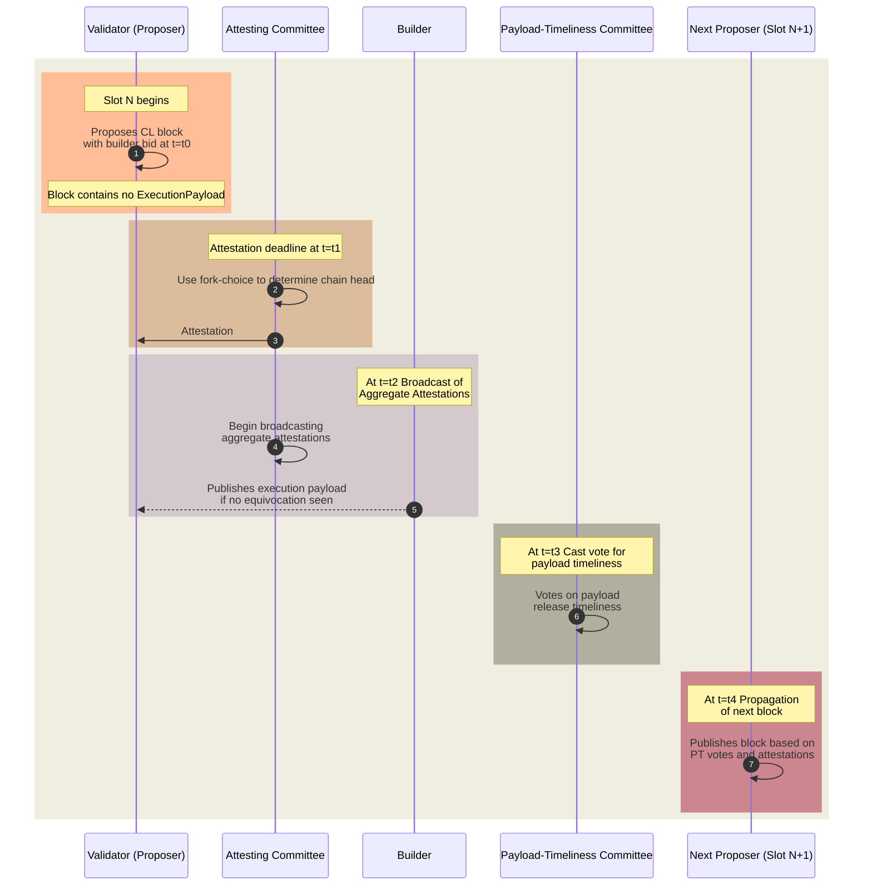

# Payload-Timeliness Committee (PTC) for EPBS

The Payload-Timeliness Committee (PTC) proposal is a design for enshrining PBS (ePBS) within the Ethereum protocol. It represents an evolution of the mechanism to determine block validity and includes a subset of validators who vote on the timeliness of a block's payload[^1][^2][^3].

## PTC Overview

_Figure – Payload-Timeliness Committee Flow._

The proposal introduces a new slot anatomy with an additional phase for Payload-Timeliness (PT) votes to propagate. It aims to refine the roles of proposers and builders in the block creation process, ensuring that proposers remain lightweight and unsophisticated entities for the goal of decentralization, and specialized builders can create high-value blocks efficiently.

1. **Block Propagation**: An elected Proof-of-Stake (PoS) validator, known as the proposer, broadcasts a CL block at the beginning of their slot (`t=t0`). This block contains a builder's bid but not the actual payload ( i.e. transactions).
2. **Attestation Aggregation**: At the attestation deadline (`t=t1`), validators, known as attestors, vote on the perceived head of the chain using their local fork-choice rule.

3. **Aggregation & Payload Propagation**: The builder sees the CL block and publishes the execution payload. The validator committee begins to broadcast aggregated attestations.

4. **Payload-Timeliness Vote Propagation**: At (`t=t3`), the Payload-Timeliness Committee casts their votes on whether the payload was timely released.

5. **Next Block Propagation**: At (`t=t4`), the next proposer publishes their block, deciding to build on either the full or empty block based on the PT votes they've observed.

#### Honest Attesting Behavior

Honest attestors will consider the payload-timeliness when casting their votes. Their behavior revolves around the PT votes, which influence the subsequent block choice. The votes indicate whether a payload is present, unavailable, or whether there's been an equivocation by the builder. The weight given to a full or empty block in the fork-choice is based on these PT votes.

## Properties and Potential New Attack Vectors

**Properties**:

- **Honest-Builder Payment Safety**: If a builder's bid is processed, their payload becomes canonical.

- **Honest-Proposer Safety**: If a proposer commits to a single block on time, they will receive the payment.

- **Honest-Builder Same-Slot Payload Safety**: An honest builder can ensure their payload for a slot cannot be overridden by another payload in the same slot.

**Non-Properties**:

- **Honest-Builder Payload Safety**: Builders can't be sure their payload will become canonical; the design does not protect from next-slot splitting.

**Potential New Attack Vectors**:

- **Proposer-Initiated Splitting**: A proposer could release their block close to the deadline, causing a split in the attesting committee's views.

- **Builder-Initiated Splitting**: Builders could selectively reveal payloads to part of the committee to influence the next proposer’s block, potentially causing it to be orphaned if the committee’s votes differ significantly.

**Builder Payment Processing**:

- Payments are processed if the builder’s payload header is part of the canonical chain and there's no evidence of proposer equivocation.

## Differences from Other Designs*

- The PT votes influence the fork-choice weight but do not create separate forks.
- The payload view informs subsequent committee votes, which usually align with the proposer.
- In the current ePBS design[^2][^3], builders receive a proposer boost. They don't explicitly create fork choice weight between different forks. Instead, they boost or "deboost" the current block by revealing or withholding it.

The [ePBS design specs](/docs/wiki/research/PBS/ePBS-Specs.md) has more details about the implementation specifications and flow.

## Resources 
- [Payload-timeliness committee (PTC) – an ePBS design ](https://ethresear.ch/t/payload-timeliness-committee-ptc-an-epbs-design/16054)
- [Consider the ePBS](https://notes.ethereum.org/@mikeneuder/consider-the-epbs)
- [ePBS Breakout Room](https://www.youtube.com/watch?v=63juNVzd1P4)
- [Notes on Proposer-Builder Separation (PBS)](https://barnabe.substack.com/p/pbs)
- [Mike Neuder - Towards Enshrined Proposer-Builder Separation](https://www.youtube.com/watch?v=Ub8V7lILb_Q)
- [ePBS design specs](/docs/wiki/research/PBS/ePBS-Specs.md)

## References
[^1]: https://ethresear.ch/t/payload-timeliness-committee-ptc-an-epbs-design/16054
[^2]: https://hackmd.io/@potuz/rJ9GCnT1C
[^3]: https://github.com/potuz/consensus-specs/pull/2
