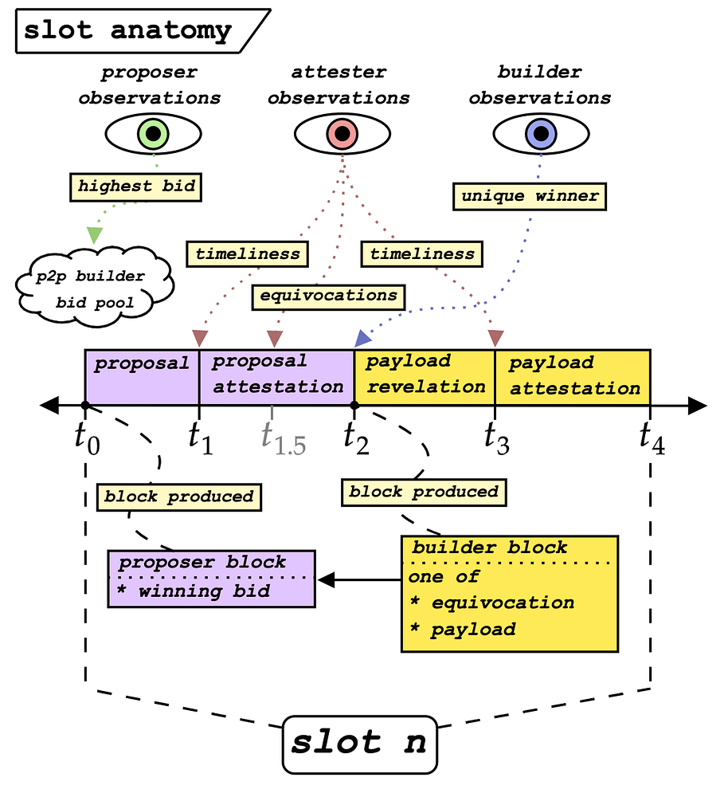

# The Two-Block HeadLock (TBHL) proposal for ePBS

The Two-Block HeadLock (TBHL) design represents an innovative approach to [proposer-builder separation (PBS)](/docs/wiki/research/PBS/pbs.md) within the Ethereum protocol, aiming to address both the operational and [strategic issues posed by MEV](https://ethresear.ch/t/why-enshrine-proposer-builder-separation-a-viable-path-to-epbs/). This design is a nuanced iteration of previous proposals, integrating elements of Vitalik Buterin's two-slot design and enhancing it with a headlock mechanism to safeguard builders from proposer equivocations. Here, we delve into the key components of TBHL and its operational mechanics, drawing on the detailed explanation provided[^1].

## TBHL Design Overview

TBHL modifies the conventional slot structure in Ethereum, introducing a dual-block system within a single slot timeframe, effectively producing a proposer block and a builder block. This system retains the essence of a single execution payload per slot, though with an additional round of attestations, potentially extending the slot duration. TBHL aligns closely with Ethereum's existing LMD-GHOST mechanism and adheres to six specified design properties, ensuring compatibility and integrity within the Ethereum ecosystem.

## Slot Anatomy and Operational Phases

_Figure – The slot anatomy of TBHL. Credit by mike neuder and justin drake._

The operational framework of TBHL is structured around four critical timestamps within a slot, delineated for specific actions by proposers, builders, and attesters:

1. **t=t0 - Proposal of the Winning Bid:** The proposer begins by evaluating bids within the bidpool, a peer-to-peer (P2P) topic where builders submit their bids. Upon selecting a bid, the proposer publishes a proposer block before moving to the next phase.

2. **t=t1 - Attestation Deadline for Proposer Block:** Here, the attesting committee assesses the timeliness of the proposer block. They vote for the first observed block, or in its absence, vote for an empty slot.

3. **t=t1.5 - Equivocation Check:** The attesting committee for the builder block evaluates the proposer blocks for equivocations. A unique proposer block prompts a proposer boost for the associated builder, enhancing the fairness and integrity of the process.

4. **t=t2 - Builder's Verification and Block Publication:** Builders verify their selection as the unique winner. In the event of an equivocation, they can produce a block containing proof to revert their payment. Otherwise, they proceed to publish their builder block, containing the transaction contents.

5. **t=t3 - Second Attestation Deadline:** This phase involves another round of attestations, this time for the builder block, solidifying its position within the blockchain.

## Satisfying ePBS Design Properties

TBHL effectively addresses several critical ePBS design properties:

- **Honest Builder Publication and Payment Safety:** Protection mechanisms ensure that builders can confidently publish blocks, with safeguards against proposer equivocations.

- **Honest Proposer Safety:** Commitments made by honest proposers are respected, with their blocks receiving necessary attestations and unconditional payments proceeding unless equivocation proof is presented.

- **Permissionlessness and Censorship Resistance:** The design promotes an open and competitive environment for builders while maintaining measures to combat censorship.

- **Roadmap Compatibility:** TBHL is poised to integrate seamlessly with Ethereum's roadmap, including single-slot finality (SSF) and MEV-burn mechanisms, illustrating its adaptability and foresight in addressing future network needs.

## Engineering Challenges of implementing TBHL

Implementing TBHL proposal introduces several nuanced challenges and engineering issues, reflective of the complex interplay between Ethereum's consensus mechanism, the dynamic MEV landscape, and the protocol's overarching design philosophy. Drawing from the detailed exploration within the ePBS discussion, here are the primary implementation issues and engineering drawbacks associated with TBHL:

- **Increased Protocol Complexity** TBHL significantly alters the traditional slot structure by introducing a dual-block mechanism within a single slot, complicating the consensus process. This complexity arises from managing two distinct types of blocks (proposer and builder blocks) and necessitates additional rounds of attestations to validate each. The complexity is further amplified by the need to detect and manage proposer block equivocations, requiring robust mechanisms to ensure builder safety and payment security.

- **Slot Timing and Network Latency** Implementing TBHL requires careful consideration of slot timing, as the additional attestation rounds could potentially extend the slot duration. This adjustment impacts network latency, potentially affecting the timeliness of block propagation and attestation aggregation. Ensuring the network's ability to efficiently handle these processes without introducing significant delays or vulnerabilities is a substantial engineering challenge. Besides increasing slot duration change is a very big engineering project in Ethereum post merge as it requires changes to CL, EL and other smart contracts layers.

- **Equivocation and Builder Safety Mechanisms** One of the critical components of TBHL is its approach to managing proposer equivocations to safeguard builders. Designing and implementing robust mechanisms to detect equivocations, allow builders to provide proof of such occurrences, and revert payments accordingly, introduces significant complexity. These mechanisms must be foolproof to prevent exploitation and ensure the system's integrity, demanding rigorous testing and potential iterations in response to discovered vulnerabilities.

- **Permissionlessness and Censorship Resistance** While TBHL aims to maintain a permissionless environment and combat censorship, achieving these goals within the new framework poses challenges. Ensuring that any builder can submit bids and that proposer blocks fairly represent the competitive landscape requires transparent and secure handling of the bidpool. Moreover, integrating forward inclusion lists or other censorship resistance mechanisms within the TBHL structure necessitates additional protocol considerations to prevent manipulation or exclusionary practices.

- **Compatibility with Existing and Future Ethereum Features** TBHL must seamlessly integrate with Ethereum's current protocol features and be adaptable to future innovations, such as single-slot finality (SSF) and MEV-burn mechanisms. Ensuring compatibility with these evolving aspects of the Ethereum ecosystem demands a forward-looking approach to design and implementation, capable of accommodating adjustments and enhancements without undermining the TBHL framework's integrity or efficacy.

- **Resource and Computational Overheads** The introduction of TBHL introduces new computational and resource overheads, particularly related to handling the increased data volume from the dual-block mechanism and the additional attestation rounds. Optimizing the protocol to manage these demands efficiently, without significantly increasing the computational burden on validators or compromising the network's performance, is an essential engineering concern.

The TBHL proposal stands as a testament to the ongoing efforts to refine Ethereum's PBS mechanisms, striving for a balance between operational efficiency, security, and the overarching ethos of decentralization. By addressing the nuances of proposer-builder dynamics and introducing robust safeguards, TBHL marks a significant step forward in the evolution of Ethereum's protocol design, offering a promising avenue for mitigating the challenges posed by MEV while enhancing the network's resilience and integrity.

You can learn more about different ePBs solutions at [PTC](/docs/wiki/research/PBS/PTC.md) and [PEPC](/docs/wiki/research/PBS/PEPC.md).

## Resources 
- [Why enshrine Proposer-Builder Separation? A viable path to ePBS](https://ethresear.ch/t/why-enshrine-proposer-builder-separation-a-viable-path-to-epbs/15710/1)
- [PBS](/docs/wiki/research/PBS/pbs.md)
- [ePBS](/docs/wiki/research/PBS/epbs.md)
- [Mike Neuder - Towards Enshrined Proposer-Builder Separation](https://www.youtube.com/watch?v=Ub8V7lILb_Q)

## References
[^1]: https://ethresear.ch/t/why-enshrine-proposer-builder-separation-a-viable-path-to-epbs/15710/1