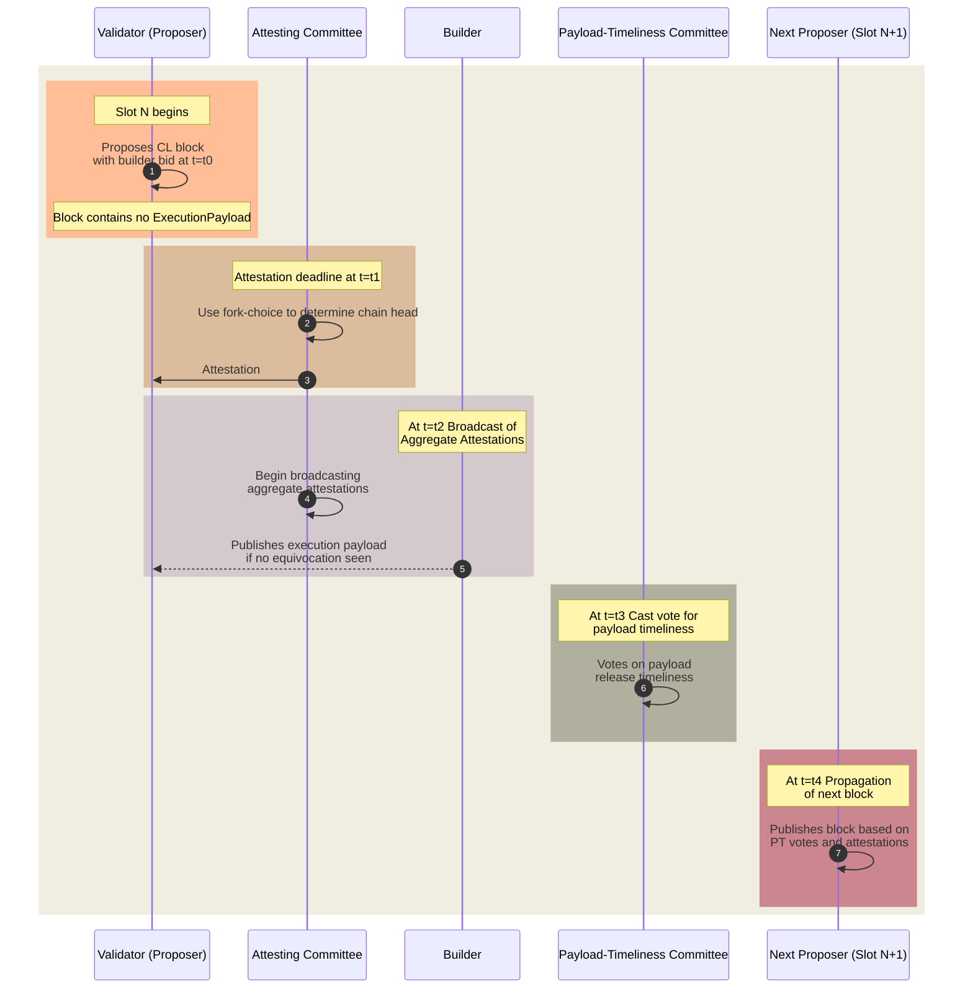
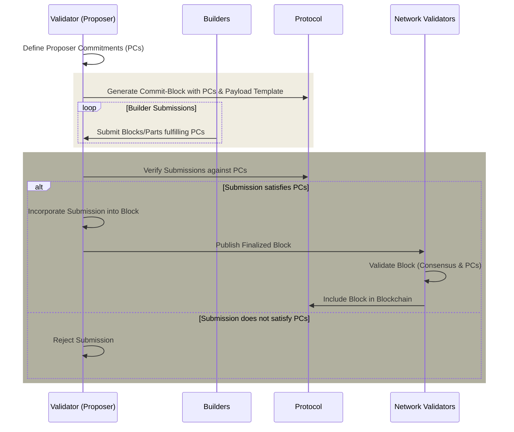
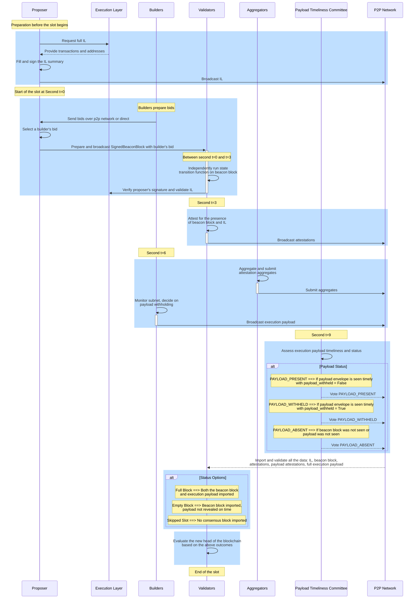

# Enshrined Proposer-Builder Separation (ePBS)

## TLDR;

Enshrined Proposer-Builder Separation (ePBS) refers to integrating the PBS mechanism directly into the Ethereum blockchain protocol itself, rather than having it operate through external services or addons. This integration aims to formalize and standardize the separation between the roles of block proposers and block builders within the core protocol rules, enhancing the system's efficiency, security, and decentralization.

## What is PBS

Proposer-Builder Separation (PBS) is a design philosophy[^1] and mechanism within the context of Ethereum, that aims to decouple the roles of proposing blocks (proposers) and constructing the content of those blocks (builders). This separation addresses various challenges and inefficiencies associated with block production, and in the context of maximizing extractable value (MEV). This entry assumes reader has some knowledge of [MEV](/wiki/research/PBS/mev.md), [PBS](/wiki/research/PBS/pbs.md), and [MEV-Boost](/wiki/research/PBS/mev-boost.md)

## Overview of ePBS

ePBS is a protocol-level enhancement for Ethereum that institutionalizes the division of labor between block proposers and block builders. Unlike the existing out-of-the-protocol solutions implementing [builder API](https://github.com/ethereum/builder-specs) in external software, like [MEV-Boost](/wiki/research/PBS/mev-boost.md), ePBS integrates this features directly into Ethereum clients, aiming to streamline and secure the process.

The key difference between ePBS and current mechanisms like MEV-Boost lies in the protocol's direct support for the separation, eliminating the need for external relays to mediate the transaction. This enshrinement is designed to reduce trust requirements, enhance transparency, and improve overall network efficiency by formally defining the roles and interactions within the protocol itself[^2][^3].

In the ePBS framework:

- **Proposers** are validators responsible for proposing new blocks to the network. Their role is limited to choosing which block to propose, without the need to construct the block themselves. All the communication via builder API is done within the client without an external tool.

- **Builders** are entities or algorithms that assemble blocks, optimizing the transaction order for profitability (e.g., maximizing MEV extraction) and offering these blocks to proposers through a transparent auction mechanism.

- **Relays**, in the traditional MEV-Boost context, serve as intermediaries that facilitate the communication between proposers and builders. Under ePBS, the reliance on external relays is diminished or redefined, as the protocol itself facilitates the direct interaction between proposers and builders. The role of Relays will be significantly different from today's notion.

### Transition from mev-boost to ePBS

The transition from MEV-Boost to ePBS represents a pivotal evolution in Ethereum's approach to handling MEV and improving the network's efficiency and fairness. Dependency on an external, third party software can be dangerous and lead to network incidents even if clients themselves behave correctly. In the next section, we will cover the details on why ePBS is needed and what will the ecosystem gain from this in-protocol approach to PBS.

## The Case for ePBS

The transition to ePBS from the current MEV-Boost system is motivated by several key reasons that align with Ethereum's core values of decentralization, security, and efficiency. Proponents of ePBS highlight the importance of integrating PBS directly into the Ethereum protocol to address several concerns arising from the reliance on relays and out-of-protocol mechanisms for block construction. Here's a detailed explanation of these aspects[^4]:

### Main Reasons for Transition to ePBS

1. **Decentralization**: ePBS aims to reduce the reliance on a few centralized relays by embedding the PBS mechanism directly within the Ethereum protocol. This move seeks to distribute the responsibility for block construction across a broader set of participants, enhancing the network's resilience and reducing central points of failure.

2. **Security**: By integrating PBS into the Ethereum protocol, ePBS ensures that the entire block construction process is governed by the same consensus rules and security guarantees that protect other aspects of the network. This contrasts with the current system, where off-chain relays operate without the direct oversight of Ethereum's consensus mechanisms.

3. **Efficiency and Fairness**: ePBS proposes to create a more transparent and competitive marketplace for block space, potentially reducing the inefficiencies and inequities associated with MEV extraction. It aims to ensure that validators have more control and visibility over the blocks they propose, contributing to a fairer distribution of MEV rewards.

### Contradiction of Core Values by Reliance on Relays

- **Centralization Risks**: The current reliance on a limited number of relays introduces centralization into a network that prizes decentralization as a core principle. Centralized relays can become single points of failure or control, undermining the network's distributed nature.

- **Security Vulnerabilities**: External relays, operating outside of Ethereum's consensus rules, could potentially be manipulated or attacked, posing security risks to the network. This external dependency contradicts Ethereum's goal of achieving robust, protocol-enshrined security.

### Perceived Risks and Inefficiencies with Out-of-Protocol PBS

- **MEV-Related Manipulations**: The current PBS mechanism, reliant on external relays, may not adequately protect against manipulative practices associated with MEV extraction, leading to unfair advantages and potential network instability.

- **Opaque Operations**: The operation of relays outside the Ethereum protocol can lead to a lack of transparency and accountability, making it difficult to monitor and regulate block construction practices effectively.

### Sustainability Concerns of Relays

- **Operational Sustainability**: The long-term operational viability of relays is uncertain, as they depend on continuous participation and support from the community. Any disruption in relay services could significantly impact the network's ability to process transactions efficiently.

- **Financial Model**: The financial sustainability of relays is also a concern. If the costs of running relays exceed the revenue generated from their operation, it could lead to a reduction in the number of relays, increasing centralization risks and affecting the competitive marketplace for block space.

The transition towards ePBS involves critical economic and security considerations, especially in the context of MEV and proposals like MEV burn. These considerations shape the debate around ePBS, highlighting its potential impact on the Ethereum ecosystem. Here's an exploration of these aspects:

### Economic Considerations

- **MEV Distribution**: One of the primary economic concerns revolves around how MEV is distributed among validators, builders, and users. ePBS aims to create a more transparent and equitable MEV market by ensuring that validators are fairly compensated for the blocks they propose. This could potentially alter the current dynamics, where certain participants may disproportionately benefit from MEV.

- **Market Efficiency**: By integrating PBS directly into the Ethereum protocol, ePBS is expected to foster a more competitive and efficient marketplace for block space. This could lead to better pricing mechanisms for transaction inclusion, benefiting users with fairer transaction costs and potentially reducing the prevalence of gas price auctions that lead to network congestion.

- **Sustainability of Relays**: ePBS addresses the operational and financial sustainability concerns of relays by potentially reducing their role in the MEV extraction process. A protocol-level solution could offer a more stable and predictable framework for handling MEV, alleviating the need for external relays and their associated costs.

### Security Considerations

- **Centralization Risks**: The current reliance on a limited set of MEV-Boost relays introduces centralization or cartelization risks, making the network more vulnerable to attacks or manipulations. ePBS seeks to mitigate these risks by decentralizing the process of block proposal and construction, aligning with Ethereum's security ethos.

- **Manipulative Practices**: External relays and opaque MEV extraction mechanisms can lead to manipulative practices, such as transaction reordering or sandwich attacks, that undermine network integrity. ePBS aims to provide a more regulated and transparent environment for handling MEV, enhancing overall network security.

- **Protocol-Enshrined Security**: Incorporating PBS directly into the Ethereum protocol ensures that block construction adheres to the same rigorous consensus and security standards that govern other aspects of the network. This unified approach to security is seen as a significant improvement over the current system, where external components like relays operate without direct protocol oversight.

### MEV Burn

The concept of MEV burn involves redirecting a portion of MEV profits towards burning Ether, reducing the overall supply and potentially increasing the value of the remaining Ether. This mechanism has been proposed as a way to align the interests of validators, builders, and the wider Ethereum community by ensuring that excessive MEV extraction does not lead to inflationary pressures or disproportionate benefits for certain network participants.

- **Inflationary Pressure Mitigation**: By burning a part of the MEV, Ethereum could potentially control inflationary pressures arising from new Ether issuance for block rewards.

- **Economic Stability**: MEV burn could contribute to the economic stability of Ethereum by ensuring that the benefits of MEV extraction are more evenly distributed across the ecosystem, including Ether holders who are not directly involved in MEV strategies.

- **Alignment of Incentives**: Implementing an MEV burn mechanism could help align the incentives of various network participants, ensuring that the pursuit of MEV does not compromise network security or efficiency.

The transition to ePBS from the current MEV-Boost system is driven by a combination of economic and security considerations, including concerns about MEV distribution, market efficiency, centralization risks, and the operational sustainability of relays. The potential implementation of an MEV burn mechanism further reflects Ethereum's commitment to aligning economic incentives with its core values of decentralization, security, and efficiency. This transition marks a pivotal moment in Ethereum's evolution, potentially reshaping the landscape of transaction ordering and MEV extraction in favor of a more secure, efficient, and equitable ecosystem.

## Counterarguments to ePBS

The discussion around the enshrinement of PBS (ePBS) within Ethereum's protocol has stirred significant debate, with various counterarguments presented by its critics. Proponents of ePBS, however, offer robust responses to these concerns, advocating for its necessity and integration into Ethereum's roadmap. Additionally, the discourse explores alternative methods for addressing MEV, weighing their sufficiency against the proposed ePBS system[^3].

### Primary Counterarguments Against ePBS

- **Complexity and Technical Risk**: Critics argue that incorporating ePBS into Ethereum's core protocol significantly increases its complexity and introduces new technical risks, potentially jeopardizing network stability and security.

- **Network Performance Concerns**: There is apprehension that ePBS could impact Ethereum's network performance, specifically relating to latency and block propagation times, which could, in turn, affect transaction processing efficiency.

- **Reduced Flexibility for Validators**: Some contend that ePBS might limit validators' flexibility in choosing block proposals, potentially centralizing decision-making power among a few large builders.

- **Premature Optimization**: Skeptics suggest that focusing on ePBS might be a case of premature optimization, diverting attention and resources from more pressing issues on Ethereum's roadmap.

- **Bypassability**: Bypassability refers to the ability of participants within the Ethereum ecosystem—be it validators, proposers, builders, or others—to sidestep or bypass the rules and mechanisms established by ePBS. This could occur through off-protocol agreements, alternative transaction ordering systems, or other means that effectively operate outside the constraints set by ePBS. The protocol will have no easy way to enforce ePBS rules on them[^8].

### If it ain't broke, don't fix it - counterarguments

The "If it ain't broke, don't fix it" perspective emerges as a significant counterargument against the ePBS within Ethereum's protocol. This viewpoint is grounded in caution and a preference for maintaining the status quo unless there's an unequivocal necessity for change. Here’s how this perspective shapes the counterarguments against ePBS:

**Reliance on Existing Systems**

Critics holding this perspective argue that the current mechanisms for handling MEV, including MEV-Boost and the relay system, have proven functional and effective in their operational context. They suggest that these systems have not only stabilized but also facilitated a certain equilibrium within Ethereum's ecosystem, balancing efficiency, security, and validator autonomy without necessitating a profound protocol overhaul.

**Risk of Unintended Consequences**

A fundamental concern is the potential for unintended consequences that a significant alteration like ePBS might introduce to the network. This viewpoint highlights the complexity and interdependence within Ethereum's system, where modifications at the protocol level could precipitate unforeseen vulnerabilities, security risks, or compromises in network performance. The argument posits that the benefits of ePBS might not justify the risks associated with disrupting a functioning system.

**Development Focus and Resource Allocation**

From the "If it ain't broke, don't fix it" standpoint, the emphasis on developing and implementing ePBS might divert valuable resources and attention from other critical areas within Ethereum's ecosystem that require immediate attention or offer clearer benefits. Critics suggest that Ethereum's development focus should prioritize scalability solutions, Layer 2 enhancements, and other upgrades that directly contribute to user experience and network capacity without introducing the complexities associated with ePBS.

**The Challenge of Proving Necessity**

This perspective demands a higher standard of proof for the necessity of ePBS. Critics argue that for a change of this magnitude to be justified, it must be clear that existing systems are not merely suboptimal but fundamentally broken in a way that directly impedes Ethereum's operation or principles. The call for ePBS is seen as a solution seeking a problem, rather than a response to a critical need.

**Emphasizing Evolution Over Revolution**

Finally, the "If it ain't broke, don't fix it" argument is rooted in a preference for evolutionary rather than revolutionary changes within the Ethereum protocol. Proponents of this view prefer incremental improvements and optimizations to existing systems over wholesale architectural changes, advocating for a cautious approach that values stability and predictability.

### Proponents' Responses and Advocacy for ePBS

- **Mitigating Complexity and Technical Risk**: ePBS advocates argue that while the proposal introduces new elements to the protocol, these are manageable and outweighed by the benefits of enhanced fairness, security, and MEV distribution efficiency. Rigorous testing and phased implementation are proposed to mitigate risks.

- **Addressing Network Performance**: Proponents maintain that ePBS can be designed with network efficiency in mind, leveraging advancements in technology and protocol engineering to minimize any adverse effects on latency or block propagation.

- **Enhancing Validator Decision-Making**: ePBS supporters argue that by structuring the builder market more transparently and competitively, validators will actually have more informed choices, not less, promoting healthier decentralization.

- **Strategic Importance on the Roadmap**: ePBS is considered by its advocates as not merely an optimization but a foundational improvement to Ethereum's economic and security models. It addresses pressing concerns related to MEV extraction practices and aligns with Ethereum's long-term goals of decentralization and scalability.

**Alternatives to ePBS and Their Evaluation**

- **Improved MEV-Boost and Relays**: Some suggest that refining the existing MEV-Boost system and enhancing relay operations could address many of the concerns ePBS aims to solve, without necessitating protocol-level changes.

- **MEV Burn Mechanisms**: Another alternative is the implementation of MEV burn mechanisms, where a portion of MEV profits is burned, potentially reducing the incentive for manipulative practices.

- **Layer 2 Solutions and Decentralized Relays**: Exploring layer 2 solutions for transaction ordering or developing decentralized relay networks are also proposed as ways to mitigate MEV issues without altering the core protocol.

ePBS proponents argue that while these alternatives offer partial solutions, they do not comprehensively address the root issues of fairness, security, and decentralization that ePBS aims to solve. Moreover, they maintain that ePBS is a strategic enhancement that supports Ethereum's long-term vision, arguing for its prioritization amidst other developments.

The debate over ePBS encapsulates a broader discussion about Ethereum's future direction, balancing innovation with caution. While counterarguments emphasize risks and alternatives, ePBS advocates underline its alignment with Ethereum's core principles and its necessity for ensuring a fair, secure, and efficient blockchain ecosystem[^5].

## Designing ePBS

### Desirable properties of ePBS mechanisms

The debate on the optimal ePBS mechanism and the concept of a minimum viable ePBS (MVePBS) revolves around identifying the core features and properties that such a system must possess to effectively address the challenges it aims to solve within the Ethereum ecosystem. This involves balancing the goals of decentralization, efficiency, security, and fairness, while also considering the practical implications of implementation and adoption. Here's a look at the central aspects of this debate and the properties considered essential for a minimum viable ePBS[^6].

**Core Properties of MVePBS**

- **Decentralization and Fair Access:** MVePBS must ensure that the process of proposing and building blocks remains decentralized, preventing any single entity from gaining disproportionate control or influence. This includes fair access to MEV opportunities and block space for all participants, maintaining Ethereum's ethos of decentralization.

- **Security and Integrity:** The design should not compromise the security of the Ethereum network. This includes safeguarding against attacks that could arise from the separation of proposing and building roles, such as censorship, double-spending, or reordering attacks that could undermine the integrity of transactions.

- **Efficiency and Scalability:** MVePBS should enhance, or at least not significantly detract from, the network's efficiency and scalability. This involves minimizing the added computational and communication overhead, ensuring that the system can scale with Ethereum's growth and increasing demand.

- **Transparency and Predictability:** The mechanism should provide transparency in transaction ordering and block production, allowing participants to understand how decisions are made within the ePBS framework. This predictability helps in managing MEV in a way that is consistent and fair to all network users.

- **Reduced Trust Requirements:** By enshrining PBS into the protocol, the system aims to reduce reliance on trust between different parties (e.g., between proposers and builders, or between users and relays). The design should minimize opportunities for off-protocol agreements that could bypass the intended fairness of the system.

- **Fairness in MEV Distribution:** ePBS should aim to level the playing field regarding access to MEV, ensuring that opportunities for value extraction are fairly distributed among participants. This involves creating mechanisms that prevent monopolistic control over MEV opportunities by a few large players.

- **Minimal Trust Assumptions:** The design should minimize the need for trust between proposers, builders, and validators. By enshrining PBS into the Ethereum protocol, ePBS mechanisms should leverage cryptographic and game-theoretic principles to ensure that participants can operate in a trust-minimized environment.

- **Economic Viability:** ePBS mechanisms must be economically viable for all participants, including proposers, builders, and validators. This involves ensuring that the costs associated with participating in the ePBS ecosystem (e.g., staking requirements, transaction fees) do not outweigh the potential benefits, thus encouraging broad participation.

- **Flexibility and Compatibility:** The ePBS framework should be flexible enough to accommodate future innovations and changes within the Ethereum ecosystem, including upgrades and new layer-2 solutions. It should also be compatible with existing infrastructure to facilitate a smooth transition.

- **Reduced Complexity for Users:** While ePBS introduces additional complexity at the protocol level, it should strive to minimize the impact of this complexity on end-users and developers. The system should be designed so that interacting with Ethereum remains as intuitive and straightforward as possible.

- **Incentive Alignment:** The incentives within the ePBS mechanism should be carefully designed to align the interests of all network participants, including users, proposers, builders, and validators. This alignment is crucial for ensuring the long-term health and stability of the network.

**Minimal trustless system for ePBS**

Integrating these below constraints provides a comprehensive view of the minimal trustless system envisioned for ePBS[^6]. It underscores the need for robust protections for both builders and proposers, ensuring fairness, reducing reliance on trust, and maintaining Ethereum's decentralized principles. This refined approach addresses the complex interplay between economic incentives, security considerations, and the overarching goal of enhancing Ethereum's protocol efficiency and integrity.

- **Honest Builder Publication Safety**: This constraint ensures that builders who follow protocol rules and publish their blocks in a timely manner are guaranteed that their blocks will be considered for inclusion in the blockchain, safeguarding against censorship and ensuring their efforts are recognized.

- **Builder Reveal Safety**: Protects builders when they reveal their bids and blocks. This means that even after revealing their proposed block content, they are protected against proposer equivocation or other actions that might compromise their position.

- **Mandatory Honest Reorgs**: Enforces that any reorganizations of the blockchain adhere to predefined rules that favor honesty, deterring malicious reorgs designed to censor or usurp valid transactions for MEV extraction.

- **Builder Withholding Safety**: Guarantees that builders cannot be unfairly penalized for withholding a block as a strategic response to network conditions or potential censorship, provided they act within the protocol's guidelines.

- **Unconditional Payment**: Ensures that builders receive payment for their work regardless of external factors, such as whether their block was ultimately included in the chain, provided they followed the protocol. This minimizes trust by making compensation mechanisms transparent and automatic.

- **Proposer Safety**: Protects proposers by ensuring that they can safely commit to including a block without the risk of losing out on transaction fees or other forms of compensation. This encourages active participation in the block proposal process.

- **Honest Builder Payment Safety**: This aspect guarantees compensation for builders who are selected and fulfill their block production duties according to the protocol's expectations.

- **Permissionlessness**: Maintains the Ethereum ethos of open participation by allowing any entity to act as a builder or proposer without needing authorization from a central authority, fostering a competitive and decentralized environment.

- **Censorship Resistance**: Essential for upholding Ethereum's decentralized nature by ensuring that blocks and transactions cannot be censored by a few powerful nodes, maintaining network integrity and openness.

- **Roadmap Compatibility**: Ensures that any ePBS mechanism aligns with Ethereum's technical development path, supporting seamless integration with future upgrades and changes to the ecosystem.

Additionally, in such a minimal trustless system for ePBS, there should be no inherent advantage for proposers, to sell their blocks to builders off-protocol.

**Debating the Optimal Mechanism**

The debate on the optimal ePBS mechanism involves weighing various design choices against these core properties, often requiring trade-offs[^9][^3].

- **Auction Mechanisms:** There's significant discussion around the best way to conduct auctions for block space and MEV opportunities—whether through second-price auctions, or more complex mechanisms like frequent batch auctions. Each has implications for fairness, efficiency, and vulnerability to manipulation.

- **Builder Selection and Staking:** Deciding how builders are selected for proposing blocks—whether through staking, reputation systems, or randomized selection—impacts decentralization and security. Staking, for example, could provide economic security but might also centralize opportunities among wealthier participants.

- **Inclusion and Censorship Resistance:** Ensuring the system resists censorship and includes transactions equitably is crucial. This may involve mechanisms for anonymous transaction submission or commitments to include certain transactions (e.g. Inclusion Lists), balancing against the potential for spam or malicious transactions.

- **Compatibility and Adaptability:** The ePBS must be compatible with existing Ethereum infrastructure and adaptable to future changes to meet the roadmap, including upgrades like sharding or new layer-2 solutions.

Determining the minimum viable ePBS involves a delicate balance of these properties, necessitating a mechanism that promotes decentralization, ensures security and efficiency, maintains transparency and fairness, and reduces reliance on trust. Ongoing discussions and research within the Ethereum community are crucial for refining these concepts and moving towards a consensus on the optimal ePBS mechanism.

## ePBS Solutions

### The Two-Block HeadLock (TBHL) proposal

The Two-Block HeadLock (TBHL) design represents an innovative approach to proposer-builder separation (PBS) within the Ethereum protocol, aiming to address both the operational and [strategic issues posed by MEV](https://ethresear.ch/t/why-enshrine-proposer-builder-separation-a-viable-path-to-epbs/). This design is a nuanced iteration of previous proposals, integrating elements of Vitalik Buterin's two-slot design and enhancing it with a headlock mechanism to safeguard builders from proposer equivocations. Here, we delve into the key components of TBHL and its operational mechanics, drawing on the detailed explanation provided[^4].

**TBHL Design Overview**

TBHL modifies the conventional slot structure in Ethereum, introducing a dual-block system within a single slot timeframe, effectively producing a proposer block and a builder block. This system retains the essence of a single execution payload per slot, though with an additional round of attestations, potentially extending the slot duration. TBHL aligns closely with Ethereum's existing LMD-GHOST mechanism and adheres to six specified design properties, ensuring compatibility and integrity within the Ethereum ecosystem.

**Slot Anatomy and Operational Phases**


_Figure – The slot anatomy of TBHL. Credit by mike neuder and justin drake._

The operational framework of TBHL is structured around four critical timestamps within a slot, delineated for specific actions by proposers, builders, and attesters:

1. **t=t0 - Proposal of the Winning Bid:** The proposer begins by evaluating bids within the bidpool, a peer-to-peer (P2P) topic where builders submit their bids. Upon selecting a bid, the proposer publishes a proposer block before moving to the next phase.

2. **t=t1 - Attestation Deadline for Proposer Block:** Here, the attesting committee assesses the timeliness of the proposer block. They vote for the first observed block, or in its absence, vote for an empty slot.

3. **t=t1.5 - Equivocation Check:** The attesting committee for the builder block evaluates the proposer blocks for equivocations. A unique proposer block prompts a proposer boost for the associated builder, enhancing the fairness and integrity of the process.

4. **t=t2 - Builder's Verification and Block Publication:** Builders verify their selection as the unique winner. In the event of an equivocation, they can produce a block containing proof to revert their payment. Otherwise, they proceed to publish their builder block, containing the transaction contents.

5. **t=t3 - Second Attestation Deadline:** This phase involves another round of attestations, this time for the builder block, solidifying its position within the blockchain.

**Satisfying ePBS Design Properties**

TBHL effectively addresses several critical ePBS design properties:

- **Honest Builder Publication and Payment Safety:** Protection mechanisms ensure that builders can confidently publish blocks, with safeguards against proposer equivocations.

- **Honest Proposer Safety:** Commitments made by honest proposers are respected, with their blocks receiving necessary attestations and unconditional payments proceeding unless equivocation proof is presented.

- **Permissionlessness and Censorship Resistance:** The design promotes an open and competitive environment for builders while maintaining measures to combat censorship.

- **Roadmap Compatibility:** TBHL is poised to integrate seamlessly with Ethereum's roadmap, including single-slot finality (SSF) and MEV-burn mechanisms, illustrating its adaptability and foresight in addressing future network needs.

**Engineering Challenges of implementing TBHL**

Implementing TBHL proposal introduces several nuanced challenges and engineering issues, reflective of the complex interplay between Ethereum's consensus mechanism, the dynamic MEV landscape, and the protocol's overarching design philosophy. Drawing from the detailed exploration within the ePBS discussion, here are the primary implementation issues and engineering drawbacks associated with TBHL:

- **Increased Protocol Complexity** TBHL significantly alters the traditional slot structure by introducing a dual-block mechanism within a single slot, complicating the consensus process. This complexity arises from managing two distinct types of blocks (proposer and builder blocks) and necessitates additional rounds of attestations to validate each. The complexity is further amplified by the need to detect and manage proposer block equivocations, requiring robust mechanisms to ensure builder safety and payment security.

- **Slot Timing and Network Latency** Implementing TBHL requires careful consideration of slot timing, as the additional attestation rounds could potentially extend the slot duration. This adjustment impacts network latency, potentially affecting the timeliness of block propagation and attestation aggregation. Ensuring the network's ability to efficiently handle these processes without introducing significant delays or vulnerabilities is a substantial engineering challenge. Besides increasing slot duration change is a very big engineering project in Ethereum post merge as it requires changes to CL, EL and other smart contracts layers.

- **Equivocation and Builder Safety Mechanisms** One of the critical components of TBHL is its approach to managing proposer equivocations to safeguard builders. Designing and implementing robust mechanisms to detect equivocations, allow builders to provide proof of such occurrences, and revert payments accordingly, introduces significant complexity. These mechanisms must be foolproof to prevent exploitation and ensure the system's integrity, demanding rigorous testing and potential iterations in response to discovered vulnerabilities.

- **Permissionlessness and Censorship Resistance** While TBHL aims to maintain a permissionless environment and combat censorship, achieving these goals within the new framework poses challenges. Ensuring that any builder can submit bids and that proposer blocks fairly represent the competitive landscape requires transparent and secure handling of the bidpool. Moreover, integrating forward inclusion lists or other censorship resistance mechanisms within the TBHL structure necessitates additional protocol considerations to prevent manipulation or exclusionary practices.

- **Compatibility with Existing and Future Ethereum Features** TBHL must seamlessly integrate with Ethereum's current protocol features and be adaptable to future innovations, such as single-slot finality (SSF) and MEV-burn mechanisms. Ensuring compatibility with these evolving aspects of the Ethereum ecosystem demands a forward-looking approach to design and implementation, capable of accommodating adjustments and enhancements without undermining the TBHL framework's integrity or efficacy.

- **Resource and Computational Overheads** The introduction of TBHL introduces new computational and resource overheads, particularly related to handling the increased data volume from the dual-block mechanism and the additional attestation rounds. Optimizing the protocol to manage these demands efficiently, without significantly increasing the computational burden on validators or compromising the network's performance, is an essential engineering concern.

The TBHL proposal stands as a testament to the ongoing efforts to refine Ethereum's PBS mechanisms, striving for a balance between operational efficiency, security, and the overarching ethos of decentralization. By addressing the nuances of proposer-builder dynamics and introducing robust safeguards, TBHL marks a significant step forward in the evolution of Ethereum's protocol design, offering a promising avenue for mitigating the challenges posed by MEV while enhancing the network's resilience and integrity.

### Payload-Timeliness Committee (PTC)

The Payload-Timeliness Committee (PTC) proposal is a design for enshrining PBS (ePBS) within the Ethereum protocol. It represents an evolution of the mechanism to determine block validity and includes a subset of validators who vote on the timeliness of a block's payload[^7][^12].

#### High-Level Overview




_Figure – Payload-Timeliness Committee Flow._


The proposal introduces a new slot anatomy with an additional phase for Payload-Timeliness (PT) votes to propagate. It aims to refine the roles of proposers and builders in the block creation process, ensuring that proposers remain lightweight and unsophisticated entities for the goal of decentralization, and specialized builders can create high-value blocks efficiently.

1. **Block Propagation**: An elected Proof-of-Stake (PoS) validator, known as the proposer, broadcasts a CL block at the beginning of their slot (`t=t0`). This block contains a builder's bid but not the actual payload ( i.e. transactions).
2. **Attestation Aggregation**: At the attestation deadline (`t=t1`), validators, known as attestors, vote on the perceived head of the chain using their local fork-choice rule.

3. **Aggregation & Payload Propagation**: The builder sees the CL block and publishes the execution payload. The validator committee begins to broadcast aggregated attestations.

4. **Payload-Timeliness Vote Propagation**: At (`t=t3`), the Payload-Timeliness Committee casts their votes on whether the payload was timely released.

5. **Next Block Propagation**: At (`t=t4`), the next proposer publishes their block, deciding to build on either the full or empty block based on the PT votes they've observed.

#### Honest Attesting Behavior

Honest attestors will consider the payload-timeliness when casting their votes. Their behavior revolves around the PT votes, which influence the subsequent block choice. The votes indicate whether a payload is present, unavailable, or whether there's been an equivocation by the builder. The weight given to a full or empty block in the fork-choice is based on these PT votes.

#### Properties and Potential New Attack Vectors

**Properties**:

- **Honest-Builder Payment Safety**: If a builder's bid is processed, their payload becomes canonical.

- **Honest-Proposer Safety**: If a proposer commits to a single block on time, they will receive the payment.

- **Honest-Builder Same-Slot Payload Safety**: An honest builder can ensure their payload for a slot cannot be overridden by another payload in the same slot.

**Non-Properties**:

- **Honest-Builder Payload Safety**: Builders can't be sure their payload will become canonical; the design does not protect from next-slot splitting.

**Potential New Attack Vectors**:

- **Proposer-Initiated Splitting**: A proposer could release their block close to the deadline, causing a split in the attesting committee's views.

- **Builder-Initiated Splitting**: Builders could selectively reveal payloads to part of the committee to influence the next proposer’s block, potentially causing it to be orphaned if the committee’s votes differ significantly.

**Builder Payment Processing**:

- Payments are processed if the builder’s payload header is part of the canonical chain and there's no evidence of proposer equivocation.

**Differences from Other Designs**:

- The PT votes influence the fork-choice weight but do not create separate forks.
- The payload view informs subsequent committee votes, which usually align with the proposer.
- In the current ePBS design[^12], builders receive a proposer boost. They don't explicitly create fork choice weight between different forks. Instead, they boost or "deboost" the current block by revealing or withholding it.

### Protocol-Enforced Proposer Commitments (PEPC)

Protocol-Enforced Proposer Commitments (PEPC), a conceptual extension and generalization of PBS, introduces a more flexible and secure way for proposers (validators) to commit to the construction of blocks. Unlike the existing MEV-Boost mechanism, which relies on out-of-protocol agreements between proposers and builders/relays, PEPC aims to enshrine these commitments within the Ethereum protocol itself, offering a trustless and permissionless infrastructure for these interactions[^10][^11].

#### Benefits of PEPC

The introduction of PEPC into Ethereum's ecosystem carries both promising benefits and notable disadvantages, reflecting the complex balance between innovation, security, scalability, and usability. Here's a detailed look at these aspects:

**Enhanced Security and Trustlessness:**

PEPC's primary advantage lies in its ability to enforce agreements between proposers and builders within the Ethereum protocol itself, minimizing trust assumptions. This internalization of commitments enhances security by making it harder for external parties to manipulate transaction inclusion or exploit the proposer-builder relationship.

**Increased Flexibility in Block Construction:**

By allowing for programmable contracts between proposers and builders, PEPC introduces a high degree of flexibility. This can accommodate a variety of block construction scenarios, from full blocks to partial blocks and future slot auctions, enabling more efficient use of block space.

**Decentralization of MEV Opportunities:**

PEPC could potentially lead to a more equitable distribution of MEV opportunities among validators. By embedding diverse commitment mechanisms into the protocol, it reduces the risk of centralizing these opportunities in the hands of a few large operators.

**Scalability and Efficiency Improvements:**

The system aims to optimize the process of block construction and validation, potentially reducing the overhead associated with these tasks. This could contribute to the overall scalability and efficiency of the Ethereum network, aligning with its long-term goals.

**Economic Innovation:**

PEPC opens up new avenues for economic innovation within Ethereum. By enabling different types of transactions and block construction contracts, it could foster novel economic models and incentives, enhancing the dynamism and diversity of the Ethereum economy.

#### Disadvantages of PEPC

**Complexity and Implementation Challenges:**
The flexible and generalized nature of PEPC introduces significant complexity into the Ethereum protocol. Designing, implementing, and maintaining such a system poses substantial technical challenges, increasing the risk of bugs, vulnerabilities, and unintended consequences.

**Increased Computational Overhead:**
Enforcing proposer commitments within the protocol could lead to increased computational overhead for validators, impacting the network's performance. This might necessitate more powerful hardware or sophisticated optimization techniques to maintain efficiency.

**Potential for Centralization:**
While PEPC aims to decentralize MEV opportunities, its complexity could inadvertently favor large, technically sophisticated operators capable of navigating the intricacies of the system. This could counteract efforts to decentralize the network further.

**Economic Uncertainty:**
The introduction of PEPC could disrupt existing economic models and incentives within Ethereum, leading to uncertainty. Adjusting to new mechanisms for transaction inclusion and block construction may require time, potentially impacting network stability and user experience.

**Difficulty in Balancing Flexibility and Security:**
Finding the right balance between the flexibility offered by PEPC and the need to maintain a secure, reliable network is challenging. Too much flexibility could make the system unwieldy and difficult to secure, while too little could stifle innovation and efficiency.

#### Tradeoffs of Implementation of PEPC

The implementation of PEPC in Ethereum involves several trade-offs, reflecting a balance between advancing the protocol's capabilities and managing new complexities and risks. These trade-offs highlight the nuanced considerations necessary to evolve Ethereum's infrastructure responsibly:

**Trade-off 1: Flexibility vs. Complexity**

- **Flexibility:** PEPC introduces a highly flexible framework for proposers and builders, allowing a variety of customized and programmable commitments. This flexibility can lead to more efficient use of block space and innovative economic arrangements.
- **Complexity:** With increased flexibility comes heightened complexity in protocol design, implementation, and operation. This complexity can raise the barrier to entry for validators and builders, potentially centralizing participation to those with significant technical resources.

**Trade-off 2: Security vs. Overhead**

- **Security:** By embedding proposer commitments directly into the protocol, PEPC enhances the trustlessness and security of block construction, reducing reliance on external parties and minimizing the potential for manipulation.
- **Overhead:** Implementing these commitments within the Ethereum protocol increases computational and operational overhead. Validators may face higher demands on processing and storage, impacting the network's efficiency and scalability.

**Trade-off 3: Economic Innovation vs. Stability**

- **Economic Innovation:** PEPC opens the door to new economic models and incentive structures within Ethereum, potentially improving the distribution of MEV and fostering a more dynamic and fair ecosystem.
- **Stability:** These new economic models introduce uncertainty and may disrupt existing revenue streams and participation incentives. Adjusting to these changes could pose challenges for validators, builders, and users, affecting network stability and predictability.

**Trade-off 4: Decentralization of MEV vs. Risk of Centralization**

- **Decentralization of MEV:** By enabling a broader range of proposer-builder arrangements, PEPC aims to distribute MEV opportunities more widely among participants, aligning with Ethereum's decentralization goals.
- **Risk of Centralization:** The complexity and technical demands of navigating PEPC could inadvertently favor larger, more sophisticated operators, potentially centralizing control and undermining the objective of broadening participation.

**Trade-off 5: Long-term Scalability vs. Short-term Performance**

- **Long-term Scalability:** PEPC's innovations could contribute to Ethereum's scalability over the long term by optimizing block space usage and enabling more sophisticated transaction inclusion mechanisms.
- **Short-term Performance:** The introduction of PEPC and the transition to its mechanisms may initially impact the network's performance, as validators and the infrastructure adapt to the increased complexity and computational demands.

#### How would PEPC work?




_Figure – PEPC flow._

The operation of PEPC involves several key components and steps, which together ensure its seamless integration into the Ethereum ecosystem. Here’s an overview of how PEPC would work in practice:

**Step 1: Commit Phase**

- **Proposal Creation:** A validator (proposer) prepares to create a block by defining a set of commitments. These commitments represent agreements or contracts that specify how the block will be constructed. This could include, for example, commitments to include certain transactions, not to include others, or to structure the block in a specific way.

- **Commit Block Generation:** The proposer generates a commit-block that includes these proposer commitments (PCs) alongside the usual consensus data like attestations. This commit-block does not yet contain the full execution payload but specifies a payload template or placeholders for the expected content based on the commitments.

**Step 2: Reveal Phase**

- **Builder Submissions:** Builders, in response to the commitments published by the proposer, submit their proposed blocks or block parts to fulfill the commitments. This might involve submitting specific transactions, execution payloads, or other block components as defined by the initial commitments.

- **Commitment Verification:** Upon receiving submissions from builders, the proposer or the protocol itself verifies that these submissions satisfy the proposer commitments. This verification process ensures that only those blocks or block parts that meet the predefined criteria are considered for inclusion.

- **Block Finalization:** Once a submission from a builder is verified to fulfill the proposer commitments, the proposer finalizes the block by incorporating the builder's submission into the payload template or placeholders defined in the commit phase. The finalized block is then published to the network.

**Step 3: Validation and Inclusion**

- **Network Validation:** Other validators on the network validate the finalized block, ensuring it adheres to the Ethereum protocol rules and the specific proposer commitments. This step may involve standard block validation procedures, along with additional checks for commitment fulfillment.

- **Block Inclusion:** Upon successful validation, the block is included in the blockchain. This inclusion is contingent on the block satisfying both the usual Ethereum consensus rules and the specific proposer commitments outlined in the commit phase.

**PEPC's Mechanisms for Flexibility and Security**

- **Programmable Contracts:** PEPC allows proposers to enter into various programmable contracts with builders, ranging from full blocks to partial blocks, and even future slot auctions. This versatility enables a tailored approach to block construction, maximizing efficiency and optimizing block space usage.

- **Atomicity and Trustlessness:** The commit-reveal scheme ensures that either all parts of a commitment are fulfilled, or the block is rejected, maintaining atomicity. This process is enforced by the protocol, reducing reliance on external trust and minimizing the risk of manipulation.

- **Dynamic Block Construction:** By enabling a dynamic approach to block construction, PEPC allows for the real-time adjustment of block contents based on network conditions, user demands, and emerging opportunities, such as MEV extraction.

#### PEPC Use Cases

PEPC offers several compelling use cases[^11]:

**Full-Block Auctions**

- Validators auction the right to construct entire blocks to builders. This mirrors the current MEV-Boost mechanism but with enhanced security and trustlessness by embedding the auction within the Ethereum protocol.
- Ensures a transparent and fair process for block construction, potentially leading to more competitive bidding and better rewards for validators.

**Partial Block Auctions**

- Validators can auction portions of a block's space to different builders, allowing multiple parties to contribute to a single block's construction.
- Increases block space utilization efficiency and encourages diversity in transaction inclusion, mitigating potential centralization in block construction.

**Parallel Block Auctions**

- Similar to partial block auctions but with the auction focused on separate, parallel components of block space, enabling a more granular approach to block construction.
- Offers validators more control over block contents and structure, potentially optimizing for various factors like gas usage, transaction priority, and MEV extraction.

**Slot vs. Block Auctions**

- Validators commit in advance to using blocks or block parts from specific builders, differentiating between commitments to "slots" (who will build) versus "blocks" (what will be built).
- Enhances predictability and planning for both validators and builders, potentially leading to more strategic block construction and MEV extraction opportunities.

**Future Slot Auctions**

- Validators auction the rights to construct blocks for future slots, essentially creating futures contracts for block space.
- Provides market participants with more tools for speculation and hedging, potentially stabilizing income for validators and offering builders advanced planning capabilities.

**Inclusion Lists**

- Validators commit to including specific transactions in their blocks, either through direct listing or by adhering to lists provided by third parties.
- Increases transparency and predictability for transaction inclusion, potentially reducing gas price volatility and improving user experience.

**Dynamic Block Configuration**

- Validators use PEPC to adjust block configurations dynamically, responding to real-time network conditions and demands.
- Enhances network responsiveness and efficiency, potentially improving throughput and reducing congestion during peak periods.

**Censorship Resistance**

- By making commitments to include certain transactions or follow specific inclusion patterns, validators can provide guarantees against censorship.
- Strengthens Ethereum's censorship-resistant properties, ensuring that the network remains open and accessible to all users.

**Protocol Upgrades and Feature Testing**

- PEPC can be used to test new protocol features or upgrades in a live environment without risking network stability, by making commitments to include transactions that utilize these features.
- Offers a safer pathway for innovation and evolution within the Ethereum protocol, allowing for more experimental approaches to development.

#### Relationship and Differences to EigenLayer

PEPC and Eigenlayer have a complementary relationship, each addressing different aspects of Ethereum's scalability, security, and decentralization, while also sharing a common goal of enhancing the network's efficiency and flexibility[^14].

- **Security Layering:** Eigenlayer introduces a mechanism to extend Ethereum's security to additional layers and services. In contrast, PEPC focuses on embedding more sophisticated and flexible commitment mechanisms within the Ethereum protocol itself. While Eigenlayer seeks to augment Ethereum's security model externally, PEPC aims to enhance the internal workings of the Ethereum main chain, specifically around block proposal and transaction inclusion processes.

- **Validator Commitments:** Both PEPC and Eigenlayer involve validators making certain commitments, but the nature and scope of these commitments differ. In Eigenlayer, validators might commit to securing additional layers or services by restaking their ETH. In PEPC, validators make commitments regarding the construction of blocks, such as including certain transactions or adhering to specific block construction criteria.

- **MEV and Transaction Inclusion:** Both projects indirectly address issues related to MEV and transaction inclusion fairness. Eigenlayer can facilitate solutions that mitigate the negative aspects of MEV or improve transaction inclusion through additional consensus layers. PEPC, by allowing for more dynamic and programmable proposer-builder agreements, could lead to a more equitable distribution of MEV opportunities and more transparent transaction inclusion mechanisms.

**Economic Bound to Security in Eigenlayer**

In principle, if the value at stake in activities or assets secured by Eigenlayer exceeds the value of staked ETH in Ethereum, the economic incentives could potentially become misaligned, leading to concerns about the sufficiency of security provided [^11].

In a broader Ethereum ecosystem context, PEPC and Eigenlayer could be seen as complementary, with Eigenlayer expanding Ethereum's security and utility beyond its core protocol and PEPC enhancing the efficiency and flexibility within the core protocol itself. Implementing both could lead to a scenario where Ethereum not only becomes more efficient and adaptable in handling transactions and block construction but also extends its security guarantees to a broader range of decentralized applications and services.

## ePBS Specifications

The current ePBS specification[^12][^13] addresses a critical issue in Ethereum's current implementation of PBS. Traditionally, both proposers and builders have had to rely on intermediaries through MEV-Boost, which introduces trust and censorship concerns as outlined above. The ePBS framework modifies this dynamic by changing the necessity of intermediaries ("must") to an option ("may"), allowing for a more trustless interaction within the Ethereum ecosystem. It incorporates [EIP-7251](https://eips.ethereum.org/EIPS/eip-7251) and [EIP-7002](https://eips.ethereum.org/EIPS/eip-7002), which are integral to its implementation. 

EIP-7251 aims to increase the maximum effective balance (Max EB) for Ethereum validators to 2048 ETH while keeping a minimum stake of 32 ETH, reducing the total number of validators without compromising security. EIP-7002 introduces a mechanism allowing validators to trigger exits from the beacon chain using their execution layer (0x01) withdrawal credentials, enhancing flexibility and security for staking operations.

### Specifications Overview

**Main Improvements of the ePBS specification:**

**Trust Minimization**: It minimizes the necessity of trust in intermediaries by allowing proposers and builders to operate more independently, reducing the risk of manipulations and trust dependencies.

**Minimal Changes for Compatibility**: The design implements the least number of changes necessary to maintain compatibility with current consensus and execution client operations. It adheres to the existing 12-second slot time, ensuring continuity and stability in the network's operation.

**Censorship Resistance**: It enhances censorship resistance by incorporating forward forced inclusion lists as per [EIP-7547](https://eips.ethereum.org/EIPS/eip-7547), ensuring that certain transactions must be included, which helps in maintaining network integrity.

**Layer Enhancements**: The changes are primarily in the consensus layer (CL), with minimal adjustments required on the Execution Layer (EL), mainly related to the handling of inclusion lists.

**Safety Guarantees**:

- **Proposer Safety**: It ensures that proposers are protected against 1-slot reorganization attacks by colluding proposers and builders, even those controlling network topology with up to 20% of the stake.
- **Builder Safety**: Guarantees are in place for builders against collusion and manipulation by consecutive proposers, including measures to ensure the safety of both withheld and revealed payloads.
- **Unbundling Guarantees**: Builders are protected under all attack scenarios, ensuring integrity in transaction handling and execution.

**Self-Building for Validators**: Validators retain the capability to self-build their payloads, which is crucial for maintaining independence and flexibility.

**Composability**: The specification is designed to be composable with other mechanisms like slot auctions or execution ticket auctions, enhancing flexibility and potential for future innovations.


**Implementation Details:**

The ePBS specification introduces specific roles and responsibilities:

- **Builders**: Validators that submit bids for payload commitments.
- **PTC (Payload Timeliness Committee)**: A new committee that verifies the timeliness and validity of payloads.

During each slot, proposers collect bids, and upon selecting a bid, they submit their blocks with a signed commitment from the builder. Validators then adjust financial credits between builders and proposers based on these commitments. Builders later reveal their execution payloads, fulfilling their obligations. The slot outcomes can vary—missed, empty, or full—based on the production and revelation of the blocks, with the PTC playing a critical role in determining the nature of the slot's conclusion.


### Detailed Processes and Timelines


#### Anatomy of a Slot Timeline




_Figure – New Slot Anatomy Flow based on the ePBS specs._


Explanation of the new slot anatomy flow based on the ePBS specs:

**Preparation Before the Slot**:
- **Proposer** prepares by requesting a full inclusion list from the EL, filling and signing the summary, and then broadcasting it to the p2p network.

**New in ePBS:** The IL is new component in the EL for proposers to guarantee censorship resistance of the network. They operate on a forward inclusion basis, where proposers and validators interact to ensure that transactions are carried forward accurately and efficiently.

**Inclusion List Containers:**
- **InclusionListSummary:** Contains the proposer's index, the slot, and a list of execution addresses.
- **SignedInclusionListSummary:** Includes the above summary with a proposer's signature.
- **InclusionList:** Comprises the signed summary, the parent block hash of the beacon block, and a list of transactions.

**Requesting IL from EL:**
- Proposer retrieves the transactions to be included in the next block from the execution layer by calling the function `get_execution_inclusion_list`, ensuring they are valid according to the current state. The response is a container `GetInclusionListResponse` that contains `transactions` (list of transaction objects as required by the EL) and `summary` (summary of `transactions`, including essential identifiers like "from" addresses).
**Building the IL:**
- Proposer calls the function `build_inclusion_list` to organize received transactions into a structured format, prepares the summary for signing, and ensures compliance with network standards. The response is a container `InclusionList` that contains `SignedInclusionListSummary`, a signed transaction summary, verifying authenticity and integrity and `transactions`, the list of validated transactions ready for inclusion.
**Broadcasting the IL:**
- Once the IL is prepared and signed, the proposer broadcasts it to the entire network via the p2p. 


**Start of the Slot at Second t=0**:
- **Builders** prepare their bids and send them to the proposer via the p2p network or directly.
- The **Proposer** selects a builder's bid, prepares, and broadcasts a **SignedBeaconBlock** containing the builder's bid.

**New in ePBS:** The inclusion of `inclusion_list_summary` attribute in `ExecutionPayload`. This field relates to the inclusion summary of certain transactions within the block, providing control over what is included in the block.

**Builders: Preparing and Sending Bids**
- Builders prepare bid using the `ExecutionPayloadHeader` container which contains essential details like the parent block hash, fee recipient, and proposed transaction fee, etc. 
- Builders create `SignedExecutionPayloadHeader`, a signed header `ExecutionPayloadHeader` and broadcast it.
- Bids are sent either directly to the proposer or broadcasted over the p2p network using the `execution_payload_header` topic.

**Proposers: Selecting Bids and Broadcasting the Signed Beacon Block**
- The proposer evaluates bids based on several criteria, such as the bid amount and the reliability or past performance of the builder. to select a bid. 
- The proposer constructs a `BeaconBlockBody`, which includes the `signed_execution_payload_header` among other standard elements.
- The function `process_block_header` processes the block header, ensuring all elements conform to the consensus rules and that the block is valid within the current chain context.
- The block, now containing the selected execution payload header, is signed by the proposer to produce `SignedBeaconBlock`. 
- The signed block is then broadcast over the p2p network using the `beacon_block` topic, making it available to all network participants.
- The `ExecutionPayloadHeader` within the `BeaconBlockBody` prepared by the proposer includes `parent_block_hash` linking to the parent block in the execution layer, ensuring continuity of the chain and `block_hash` will eventually link to the hash of the `ExecutionPayload` that the builder will produce and is crucial for validators to verify the integrity and continuity of the chain.


**Between Second t=0 and t=3**:
- **Validators** independently run the state transition function to validate the beacon block, verify the proposer's signature and validate the inclusion list.

**Validators: Validating the Beacon Block and Inclusion List**
- Upon receiving the `SignedBeaconBlock`, validators invoke the `process_block` function, which is a comprehensive function handling different aspects of the block processing including header validation, RANDAO, proposer slashings, attestations, and more. 
- For ePBS, particular attention is paid to `process_execution_payload_header`, which validates the execution payload header within the block.
- Validators verify the IL that is referenced within the `ExecutionPayloadHeader`. To do that, they use the `verify_inclusion_list` function to assess the correctness of the IL in terms of transaction validity, signature integrity of the summary, and alignment with the previously agreed state, and the proposer index within the IL corresponds to the expected proposer for the given slot. 
- If the block and IL are validated successfully, the state transition function `state_transition` updates the beacon state to reflect the new block. This includes updating validator statuses, adjusting balances based on attestations and slashings, and rotating committees.


**Around Second t=3**:
- **Validators** attest to the presence of the beacon block and the IL, ensuring everything is in order up to this point.

**Validators: Attesting to Beacon Block**
- Validators call the function `process_attestation` to verify and process each attestation made against the beacon block. This includes validating the beacon block's slot, the attestation's committee, and ensuring the correctness of the attestation data as per the consensus rules.


**Around Second t=6**:
- **Aggregators** aggregate and submit the attestation aggregates.
- **Builders** build and broadcast their execution payloads. They monitor network subnets and decide whether to withhold their payloads based on network conditions and voting.
- Builders package the execution payload, which includes all the necessary information for transaction execution, into the container `ExecutionPayloadEnvelope`. This encapsulation ensures that the payload is ready for integration into the beacon chain. They will set the field `payload_withheld` to be false. 
- Additionally, an honest builder can withhold the payload if they didn't see a consensus block on timely by setting `payload_withheld` to be true.
- They run the function `process_execution_payload` to process the execution payload against the current state to ensure its validity. It involves validating transactions, ensuring state transitions are correct, and checking that the payload aligns with the consensus rules.
- Then, they sign the container `ExecutionPayloadEnvelope` to generate `SignedExecutionPayloadEnvelope` before broadcasting to the topic `execution_payload` via p2p network.


**Around Second t=9 - Payload Timeliness Committee (PTC)**:
- At second 9 of the slot, the PTC assesses the timeliness of the execution payload. This committee, consisting of 512 validators, votes based on their observation of the execution payload's presence and timing relative to the consensus block.

**New in ePBS:** The PTC is a new component introduced in this epbs specs. 
- **Composition and Function:**
  - **Committee Formation:** PTC members are selected from the first non-builder members of each beacon slot committee. This ensures that the committee is comprised solely of validators who are not concurrently serving as builders, thereby minimizing conflicts of interest.
  - **Attestation Rewards and Penalties:** PTC members receive standard attestation rewards for correctly attesting to the presence or absence of payloads. Accurate attestations align with the actual payload status (`full` or `empty`), for which validators receive full attestation credits (target, source, and head timely). Incorrect attestations result in penalties akin to missed attestations.
  - **Attestation Handling:** Attestations by PTC members to the CL block are disregarded to focus solely on payload verification tasks.
  - **Inclusion of Attestations in Blocks:** The proposer for slot `N+1` is responsible for including PTC attestations from slot `N` in the block. There are no direct incentives for including incorrect attestations; thus, typically only one PTC attestation per block is necessary.
- **Aggregation and Broadcast:** Two methods exist for importing PTC attestations. Aggregated attestations (`PayloadAttestation`) are included in blocks for the previous slot, while unaggregated attestations (`PayloadAttestationMessage`) are broadcasted and processed in real-time for the current slot.

**PTC Validators Assess and Vote on Execution Payload Timeliness**
- Each PTC validator independently checks if they have received a valid `ExecutionPayload` from the builder that was supposed to reveal it according to the signed `ExecutionPayloadHeader` included in the current beacon block. PTC Validators vote on the timeliness of the payload based on its presence and the timing of its reception.

**Broadcast Payload Timeliness Attestation**
- If the execution payload is confirmed to be present and timely, PTC validators produce and broadcast payload timeliness attestations, confirming these observations. `PayloadAttestation` container captures the validators' attestations regarding the payload's timeliness and presence.
- `get_payload_attesting_indices` function determines which validators in the PTC are attesting to the payload's presence and timeliness by checking their aggregation bits in the `PayloadAttestation`. 
- Attestations are broadcast on the p2p network via the `payload_attestation_message` topic.

**Aggregate and Include Payload Attestations in Beacon Blocks**
- Aggregators collect individual `PayloadAttestation` messages, aggregate them, and ensure their inclusion in upcoming beacon blocks to record and finalize the validators' consensus on payload timeliness. They are aggregated into an `IndexedPayloadAttestation` container, which includes a list of validator indices that attested, the payload attestation data, and a collective signature.

**Update Beacon Chain State Based on Attestations**
- `process_payload_attestation` function is invoked by the beacon chain to process and validate incoming payload attestations. It ensures that the attestation data is correct and that the signatures are valid, integrating this information into the beacon state. The beacon chain state is updated based on the payload attestations. 
- These attestations influence the fork choice by affecting the weights of various blocks and potentially leading to different chain reorganizations based on the perceived timeliness and presence of execution payloads.

**Reward Calculation and Distribution**: For each validator that correctly attested to the payload status, it sets participation flags and calculates rewards based on predefined weights (`PARTICIPATION_FLAG_WEIGHTS`). The rewards are aggregated, and the proposer of the attestation is rewarded proportionally, with the calculation considering various weights and denominators defined in the protocol specifications (`WEIGHT_DENOMINATOR`, `PROPOSER_WEIGHT`).

**Proposer Reward**: The function finally calculates the proposer's reward and updates the proposer's balance by calling `increase_balance` method.


**End of the Slot**:
- As the slot concludes, validators complete several crucial tasks:
  - **Importing and Validating**: Validators ensure they have imported and validated the inclusion list, the consensus block, all single bit and aggregated attestations, the payload attestations, and the full execution payload.
  - **Evaluating the Blockchain's New Head**: Based on the data validated, validators make a critical decision on the chain's state.They determine whether the slot results in:
    - **Full Block**: Both the consensus block and the corresponding execution payload have been successfully imported.
    - **Empty Block**: The consensus block was imported, but the associated execution payload was not revealed on time.
    - **Skipped Slot**: No consensus block was imported during the slot, leading to a skipped slot scenario.
- The fork choice function `get_head` determines the head of the chain after considering the latest block proposals, payload attestations, and any other pertinent information such as weights from attestations and balances.
- All nodes synchronize their states based on the fork choice's outcome, ensuring consistency across the network. This synchronization includes applying all the state transitions and updates from attested blocks and execution payloads.


#### Inclusion List Timeline

**Gossip Layer Checks:**
- Inclusion lists are verified for timing, ensuring relevance to the current or next slot.
- Each proposer-slot pair is restricted to broadcasting one inclusion list on the network, although proposers may send different lists to different peers.
- The number of transactions must match the summary count and not exceed the set maximum in `MAX_TRANSACTIONS_PER_INCLUSION_LIST`.
- Inclusion list signatures are validated against the proposer's key, confirming their scheduled slot.

**Risks and Mitigations:**
- Broadcasting an inclusion list for the upcoming slot before a head change may lead to availability issues, although the list is still considered available.

**on_inclusion_list Handler:**
- Serves as a bridge to execution engine API calls, assuming the corresponding beacon block is processed.
- If a beacon block's parent was empty, any new inclusion list is automatically ignored to prevent backlog.

**Beacon State Tracking:**
- Tracks proposer and slot for the most recent and previous IL to manage fulfillment and update upon new valid blocks.

**EL Validation:**
- Checks that transactions `inclusion_list.transactions` are valid and includable using the current state.
- Ensures summary `inclusion_list.signed_summary.message.summary` accurately lists "from" addresses for the included transactions.
- Verifies that the total gas limit of transactions does not exceed the maximum allowed `MAX_GAS_PER_INCLUSION_LIST`.
- Ensures accounts listed have sufficient funds to cover the maximum potential gas fees `(base_fee_per_gas + base_fee_per_gas / BASE_FEE_MAX_CHANGE_DENOMINATOR) * gas_limit`.


#### Execution Payload's Timeline

The processing of execution payloads in the ePBS system includes several critical steps distributed across gossip, consensus, and execution layers:

**Gossip** Execution payloads are shared via the `execution_payload` pubsub topic with key validations:
- Confirm the beacon block associated with the payload is valid.
- Verify builder index and payload hash against the beacon block.
- Validate the builder's signature.

**Consensus State Transition** Post-gossip, payloads undergo consensus validation through `on_execution_payload` fork choice handler:
- **Signature Verification:** Ensures the integrity of the payload signature.
- **Withdrawals and Inclusion List Verification:** Confirms correct processing of withdrawals and adherence to the inclusion list specified by the beacon state.
- **Payload Consistency and EL Validation:** Checks that all payload elements align with the beacon state commitments and sends the payload to the execution layer for further validation.
- **State Updates and Verification:** Updates beacon state records and verifies the new state root to confirm accurate state transitions, `latest_block_hash` and `latest_full_slot`.

**Execution Layer State Transition** The execution layer expands its role to validate `InclusionListSummary` satisfaction:
- **Transaction and Balance Verification:** Tracks addresses involved in transactions or balance changes.
- **Inclusion List Satisfaction:** Ensures each address in the `InclusionListSummary` is active in the payload, considering transactions and balance changes from current and previous payloads.
- **Special Case Handling:** Manages unique scenarios such as transactions enabled by [EIP-3074](https://github.com/ethereum/EIPs/blob/master/EIPS/eip-3074.md).


#### Payload Attestation's Timeline

**Gossip** Payload attestations are broadcasted by PTC members using `PAYLOAD_ATTESTATION_MESSAGE` objects with stringent checks before propagation:
- **Current Slot Verification:** Only attestations for the current slot are gossiped.
- **Payload Status Validation:** Attestations must have a valid payload status to be gossiped.
- **Single Attestation Per Member:** Only one attestation per PTC member is shared.
- **Beacon Block Root Presence:** Attestations are linked to slots with a known beacon block root.
- **PTC Membership Check:** Validators must be confirmed members of the PTC.
- **Signature Verification:** Attestations must have a valid signature.

**Forkchoice Handler** Upon passing gossip validation, payload attestations are processed in the forkchoice through the `on_payload_attestation_message` handler, which includes:
- **Beacon Block Validation:** Confirms the associated beacon block is in the forkchoice store.
- **PTC Slot Validation:** Verifies the attester is in the PTC for the specified slot.
- **Slot Matching:** Checks that the beacon block corresponds to the attestation slot.
- **Current Slot and Signature Checks (if not from block):** For direct broadcasts, validates the slot is current and verifies the signature.
- **PTC Vote Update:** Updates the PTC vote tracked in the forkchoice for the given block root.


#### Beacon Block's Timeline

**Gossip**
- **Initial Validation**: `SignedBeaconBlock` enters through gossip or RPC, with critical validations focusing on the legitimacy of the parent beacon block.

**on_block Handler**
- **Beacon Block Validation**: Validates blocks based on two parent elements: the consensus layer (via `block.parent_root`) and the execution layer derived from the `signed_execution_payload_header` entry in the `BeaconBlockBody`.
- **BeaconBlockBody Adjustments**: Modifications in `BeaconBlockBody` include removing execution payload and blob KZG commitments, adding `signed_execution_payload_header`, and new `payload_attestations`.

**State Transition**
- **Modified Functions**: `process_block` now adjusts for ePBS changes, including modifications to withdrawal processing and syncing the parent payload.
- **Withdrawals**: Managed in two phases; deductions during consensus block processing, and fulfillments verified during execution payload processing.
- **Execution Payload Header**: Validates builder's signature, funding, and the immediate transfer of bid amounts to the proposer, with state adjustments noted in the beacon state.

**Payload Attestations** Payload Attestations `PayloadAttestation` represent a significant component within the beacon block processing, adding a layer of verification for the execution payloads by the PTC.

- **PTC Committee Formation**
  - **Committee Selection**: The `get_ptc` function is designed to assemble the PTC by selecting validators from existing beacon committees, specifically targeting validators from the end of each committee list to form the PTC. The selection process ensures that the PTC is adequately populated while minimally impacting the structure and function of the standard beacon committees.

- **Processing Payload Attestations**
  - **Attestation Requirements**: Payload attestations are required to pertain to the previous slot and match the parent beacon block root, ensuring they are timely and accurately reference the correct beacon state.
  - **Incentives and Penalties**:
    - **Consistency Checks**: Each attestation is checked against the beacon state to determine consistency. Consistent attestations (e.g., `PAYLOAD_PRESENT` when the slot was indeed full) result in rewards for both the proposer and the attesting validators. This aligns their incentives with the accurate and honest reporting of payload statuses.
    - **Reward Calculation**: For consistent attestations, participation flags `PARTICIPATION_FLAG_WEIGHTS` are set for the attesting validators, and the proposer receives a reward `proposer_reward` calculated based on the base rewards of the attesters, ensuring that validators are motivated to participate actively and correctly in the PTC.
    - **Penalties for Inconsistencies**: If an attestation is found to be inconsistent (e.g., attesting to `PAYLOAD_ABSENT` when the payload was present), penalties are imposed. Both the proposer and the attesters are penalized to deter the inclusion of incorrect or misleading attestations. The penalty for the proposer `proposer_penalty` is notably doubled to prevent any potential collusion between proposers and attesters where they might benefit from including both consistent and inconsistent attestations.

- **Implementation and Justification**
  - **Avoiding Slashing Conditions**: There are no slashing conditions specifically for PTC attestation equivocations to prevent overly punitive measures that could discourage participation. However, penalties are structured to ensure that there is no net benefit to submitting equivocating attestations.
  - **Doubling the Proposer Penalty**: The rationale for doubling the penalty for the proposer is to ensure that there is no scenario where both a penalty and a reward would cancel each other out, thus maintaining a deterrent against the inclusion of conflicting attestations.


#### Honest Validator Behavior
The roles and behaviors of validators are refined, especially for proposers and PTC members, due to the introduction of new mechanics such as fork choice considerations, execution payload validation, and timing of IL. 

**Proposer Responsibilities**
- **Execution Payload and Inclusion List Preparation**:
  - Prior to their designated slot, proposers need to select a `SignedExecutionPayloadHeader` from builders and request or construct an `InclusionList`.
  - These activities can be conducted before the slot begins to ensure readiness and efficiency.
- **Broadcast Timing**:
  - Proposers are incentivized to broadcast their IL early to increase the likelihood of their blocks being attested to, thus securing their block's position in the chain.

- **Builder Interaction**:
  - Validators can act as their own builders (self-building) or may engage with external builders. Direct interactions with builders (off-protocol methods) are encouraged as they may yield the most competitive bids in real-time.

- **Strategic Considerations**:
  - Due to potential MEV opportunities, proposers might strategically delay choosing or requesting a builder’s bid until the last feasible moment for block broadcasting. This tactic is to MEV from the available transaction pool.

**Head Determination for Proposers**
- **Basic Principle**: At the start of slot `N`, proposers must determine the head of the chain to propose a new block effectively. This involves evaluating various scenarios like skipped slots, missing payloads, and late payloads, and making a decision based on the most recent valid block data.

**PTC Member Duties**
- **Payload Timeliness Attestations**:
  - PTC members are tasked to verify the timeliness of the execution payload for the current slot and cast a `payload_attestation` based on their observations:
    - `PAYLOAD_PRESENT`: If both a valid consensus block for the current slot and the corresponding execution payload are observed.
    - `PAYLOAD_WITHHELD`: If a valid consensus block for the current slot is seen along with a `payload_withheld = true` message from the builder.
    - `PAYLOAD_ABSENT`: If a valid consensus block is seen without the corresponding execution payload.
    - No attestation is made if no consensus block for the current slot is observed.

- **Attestation Conditions**:
  - PTC members only import the first consensus block they observe and base their actions on it, ensuring a single, coherent response per slot.

**Constructing Payload Attestations**
- **Operational Window**:
  - PTC members prepare to attest approximately 9 seconds into the slot, evaluating whether the execution payloads are timely and accurately synced with the consensus blocks.
  - This includes assessing whether payloads are withheld correctly and ensuring that their attestation reflects the actual status of payload availability or absence.

**Validator Considerations**
- Validators must adeptly handle their roles, whether as proposers, PTC members, or general attestors, navigating the intricacies of new ePBS mechanics to maintain network integrity and security. This involves strategic decision-making, timely actions, and adherence to protocol to optimize their influence and rewards within the network.

#### Honest Builder Behavior

**Preparing Multiple Payloads**
- **Adaptability**: Builders are expected to prepare different payloads for various potential parent heads. This preparation allows them to adapt to changes in the fork choice at the last moment.
- **Multiple Bids**: Builders can submit multiple bids ahead of their intended slot, increasing their chances of selection by proposers.

**Bid Submission Strategy**
- **Broadcasting Bids**: Builders can submit bids via off-protocol services directly to proposers. This strategy allows builders to continually update and refine their bids without exposing them to the entire network, which could potentially lead to the inclusion of suboptimal payloads.
- **First Seen Message Rule**: Validators will only gossip the first valid seen message for a particular combination of (builder, slot), which encourages builders to submit their best possible bids early in the process.

**Direct Bid Requests**
- **Enhanced API Specification**: Introducing direct bid requests through a `SignedBidRequest` mechanism would allow validators to request execution headers directly from builders. This minor modification to the builder API could utilize existing client code and enhance direct interactions between validators and builders.

```python
class BidRequest(container):
    slot: Slot
    proposer_index: Validator_index
    parent_hash: Hash32
    parent_block_root: Root

class SignedBidRequest(container):
    message: BidRequest
    signature: BLSSignature
```

- **Cryptographic Binding**: The direct request mechanism can be designed to cryptographically bind the request to the validator, preventing builders from adjusting their bids based on what others are offering, thereby reducing the risk of collusion and cartelization among builders.

**Gossip as Fallback**
- **Fallback Mechanism**: Despite the advantages of direct bid requests, maintaining a global topic for bid gossip provides a crucial fallback. This system supports validators running on lower-end hardware or those who prefer community-driven builders, ensuring they have access to competitive bids.
- **Anti-Censorship and Anti-Cartel Measures**: By setting a public minimum bid through community-driven builders, the system forces centralized builders to outbid these public offers if they wish to censor certain transactions. This feature serves as a baseline for competition and transparency in bid submission.
- **Spam Protection**: The global topic can be protected against spam by only allowing the highest value bid received for a given parent block hash to be gossiped, and restricting to one message per builder per slot.


#### Security analysis of proposer and builder interactions


#### Forkchoice Considerations


## Open Questions in ePBS

There are some interesting and challenging open questions highlighted by Mike in enshrining PBS (ePBS) in Ethereum Protocol[^5].

### What does bypassability imply?

Bypassability highlights a crucial challenge in the transition to ePBS: the possibility that validators and builders might continue relying on external relays or solutions instead of the enshrined protocol. The concern here is twofold: first, it questions the efficacy of ePBS if a significant portion of network participants opts out; second, it probes the feasibility of designing a system that cannot be bypassed without imposing unreasonable constraints on validators' autonomy or Ethereum's decentralized ethos.

### What does enshrining aim to achieve?

Enshrining PBS aims to introduce a neutral, trustless relay within the Ethereum protocol to standardize and secure the proposer-builder relationship. This initiative seeks to mitigate centralization risks inherent in out-of-protocol solutions like MEV-Boost, enhance censorship resistance, and potentially serve as a foundational step towards addressing MEV-related issues more systematically. Enshrining PBS, despite bypassability, could provide a reliable fallback mechanism, encourage more validators to engage directly with the protocol, and align with long-term goals such as MEV redistribution mechanisms (e.g., MEV-burn).

### What are the exact implications of not enshrining?

Choosing not to enshrine PBS essentially yields significant control over block construction and MEV distribution to external systems, potentially exacerbating centralization and security vulnerabilities. This concession may necessitate prioritizing funding and support for neutral relays as critical infrastructure to maintain a level playing field and safeguard against monopolistic practices in the MEV market.

### What is the real demand for ePBS?

The real demand for ePBS within the Ethereum ecosystem is driven by multiple factors that address current limitations and future-proof the network for scalability, security, and decentralization. These demands stem from the evolving landscape of Ethereum's block production and the growing complexity of MEV opportunities. Quantifying the real demand for ePBS is big challenge but it is a reflection of the broader needs of the Ethereum community to address current challenges and anticipate future demands.

### How much can we rely on altruism and the social layer?

The social layer, Ethereum community norms and values, plays a pivotal role in guiding behavior that protocol mechanics alone cannot enforce. While altruism or long-term self-interest might motivate some large ETH holders to support the enshrined solution, relying solely on these motivations is unreliable. The integrity and decentralization of Ethereum should ideally be underpinned by robust, enforceable mechanisms rather than voluntary adherence to ideals.

### How important is L1 ePBS in a future with L2s and OFAs?

As Ethereum's roadmap evolves, with increasing activity on L2 solutions and the development of OFAs, the direct impact of L1 MEV might diminish. However, the principles and infrastructure laid out by ePBS could still play a critical role in shaping secure and decentralized mechanisms for managing MEV across layers, maintaining the relevance of ePBS in a multilayered ecosystem.

### What priority should ePBS have in light of other protocol upgrades?

Given the complex landscape and the potential for significant shifts in Ethereum's MEV dynamics, the prioritization of ePBS relative to other upgrades (e.g., censorship resistance enhancements, single-slot finality) necessitates a strategic approach. The community might consider focusing on upgrades with clearer immediate benefits and lower implementation risks, while continuing to research and develop ePBS frameworks that could be rapidly deployed if and when the need becomes more pressing.

## Resources
- [Notes on Proposer-Builder Separation (PBS)](https://barnabe.substack.com/p/pbs)
- [Mike Neuder - Towards Enshrined Proposer-Builder Separation](https://www.youtube.com/watch?v=Ub8V7lILb_Q)
- [An Incomplete Guide to PBS - with Mike Neuder and Chris Hager](https://www.youtube.com/watch?v=mEbK9AX7X7o)
- [Why enshrine Proposer-Builder Separation? A viable path to ePBS](https://ethresear.ch/t/why-enshrine-proposer-builder-separation-a-viable-path-to-epbs/15710/1)
- [ePBS – the infinite buffet](https://notes.ethereum.org/@mikeneuder/infinite-buffet)
- [ePBS design constraints](https://hackmd.io/ZNPG7xPFRnmMOf0j95Hl3w)
- [Payload-timeliness committee (PTC) – an ePBS design ](https://ethresear.ch/t/payload-timeliness-committee-ptc-an-epbs-design/16054)
- [Consider the ePBS](https://notes.ethereum.org/@mikeneuder/consider-the-epbs)
- [ePBS Breakout Room](https://www.youtube.com/watch?v=63juNVzd1P4)
- [Unbundling PBS: Towards protocol-enforced proposer commitments (PEPC)](https://ethresear.ch/t/unbundling-pbs-towards-protocol-enforced-proposer-commitments-pepc/13879/1)
- [PEPC FAQ](https://efdn.notion.site/PEPC-FAQ-0787ba2f77e14efba771ff2d903d67e4)
- [ePBS specification notes](https://hackmd.io/@potuz/rJ9GCnT1C)
- [Minimal ePBS without Max EB and 7002](https://github.com/potuz/consensus-specs/pull/2)
- [EigenLayer protocol](https://docs.eigenlayer.xyz/eigenlayer/overview/whitepaper)


## [References]
[^1]: https://barnabe.substack.com/p/pbs
[^2]: https://www.youtube.com/watch?v=Ub8V7lILb_Q
[^3]: https://www.youtube.com/watch?v=mEbK9AX7X7o
[^4]: https://ethresear.ch/t/why-enshrine-proposer-builder-separation-a-viable-path-to-epbs/15710/1
[^5]: https://notes.ethereum.org/@mikeneuder/infinite-buffet
[^6]: https://hackmd.io/ZNPG7xPFRnmMOf0j95Hl3w
[^7]: https://ethresear.ch/t/payload-timeliness-committee-ptc-an-epbs-design/16054
[^8]: https://notes.ethereum.org/@mikeneuder/consider-the-epbs
[^9]: https://www.youtube.com/watch?v=63juNVzd1P4
[^10]: https://ethresear.ch/t/unbundling-pbs-towards-protocol-enforced-proposer-commitments-pepc/13879/1
[^11]: https://efdn.notion.site/PEPC-FAQ-0787ba2f77e14efba771ff2d903d67e4
[^12]: https://hackmd.io/@potuz/rJ9GCnT1C
[^13]: https://github.com/potuz/consensus-specs/pull/2
[^14]: https://docs.eigenlayer.xyz/eigenlayer/overview/whitepaper