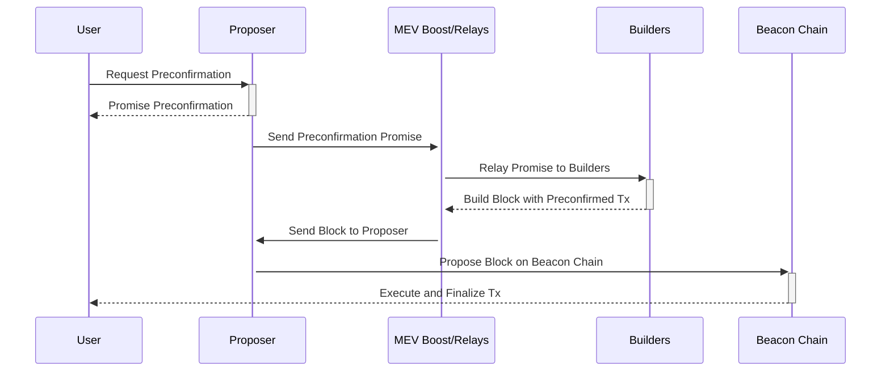

# Ethereum Based Sequencing with Preconfirmations

## [Overview](#overview)

Ethereum's evolving ecosystem is set to introduce new paradigms for rollups and chain interactions, emphasizing seamless transitions and enhanced user experiences. This wiki article introduces a framework for Ethereum sequencing and preconfirmations, originally proposed by Justin Drake[^1][^4], a step toward realizing this vision, offering a unified platform for all Ethereum chains and rollups. 

## [Motivation](Motivation)

### [United Chains of Ethereum](#united-chains-of-ethereum)

The vision for Ethereum is not just a network of isolated chains but a cohesive ecosystem where all rollups and chains coexist without friction, termed the "United Chains of Ethereum." This concept envisions a scenario where users can move between different states (rollups) with ease, akin to crossing state lines without the need for passports or the imposition of tariffs. Such an environment would not only enhance user experience but also foster a more integrated and efficient blockchain ecosystem.

_Figure: United Chains of Ethereum, Credit Justin Drake_

### [Ethereum's Services for Rollups](#ethereums-services-for-rollups)

- **Current Services:** Ethereum currently provides two critical services to rollups: settlement and data availability. These services lay the foundation for rollups to operate effectively on Ethereum's decentralized platform.

- **Introduction of Ethereum Sequencing:** Ethereum sequencing[^2][^3], is proposed to complement the existing ones, offering a new resource that rollups can leverage to further optimize their operations. Although sequencing has always been inherent to Ethereum, its potential as a dedicated service for rollups represents an innovative application, akin to the adaptive use of core data for new functionalities.

### [Current Sequencing Options](#current-sequencing-options)

_Figure: Different Sequencing Options and their Problem Space, Credit Justin Drake_

#### [Decentralized Sequencing](#decentralized-sequencing)

**Overview:** Decentralized sequencing distributes the responsibility of transaction ordering among multiple nodes rather than a single central authority. This method enhances security and resistance to censorship, as no single node can dictate the transaction order by itself.

**Problems and Challenges:**
- **Complexity in Coordination:** Since multiple nodes are involved in transaction ordering, achieving consensus can be challenging and complex, particularly when the nodes have varying incentives.
- **Network Integrity Maintenance:** Ensuring that all participating nodes follow the protocol without any malicious behavior can be difficult to enforce.
- **Front-Running and MEV:** Miners or validators might exploit their ability to order transactions to extract maximal extractable value (MEV), which can lead to unfair transaction processing and a negative user experience.
- **Resilience to Censorship:** Although decentralized sequencing makes censorship more difficult, it doesn't eliminate the possibility, especially if a collusion of nodes occurs.

#### [Shared Sequencing](#shared-sequencing)

**Concept:** Shared sequencing is a form of decentralized sequencing where the task of ordering transactions is shared among several entities, typically across different layers or platforms. This approach is designed to further decentralize the process and reduce the influence any single participant might have over the sequence of transactions.

**Application:** In Ethereum, shared sequencing could involve various rollups solutions that coordinate to manage transaction order. This coordination can help ensure that transactions are processed efficiently and fairly, reducing the potential for bottlenecks or biased sequencing practices.

**Benefits:** Shared sequencing aims to promote scalability by distributing the load of transaction processing and enhancing the network’s throughput. It also strives for neutrality and fairness in transaction handling, critical for maintaining trust in a decentralized ecosystem.

**Problems and Challenges:**
- **MEV Sharing:** Coordinating MEV sharing, like the approach Espresso is investigating, requires sophisticated mechanisms to fairly distribute MEV across participating rollups and chains[^5].
- **Deposits Sharing:** Solutions like zkSync's deposit sharing are innovative but require widespread adoption and trust among different rollups to function effectively, potentially leading to centralization of trust[^6].
- **Execution Sharing:** Implementation of execution sharing strategies, such as Polygon's aggregation layer, requires standardization and integration across different rollups to ensure compatibility and trustless atomicity[^7].

**Based Sequencing:**

**Concept:** A specialized form of decentralized sequencing that uses the base layer of a Ethereum, Beacon chain, to manage transaction ordering. This method leverages the security and consensus mechanisms of the Beacon chain to ensure that transactions are sequenced in a trustless manner.

**Focus:** Based sequencing aims to integrate the robust security features of the Beacon chain into transaction sequencing, reducing dependency on external sequencers or centralized systems. It aligns with Ethereum's decentralized principles by using the existing Ethereum infrastructure to secure transaction order.

**Integration with Shared Sequencing:** Based sequencing can be a pivotal part of a larger shared sequencing strategy, providing a reliable, secure foundation that other layers or rollups can build upon. It ensures that at least one layer of the transaction ordering process is closely tied to the highly secure, well-tested consensus mechanisms of the Ethereum blockchain.

**Problems and Challenges:**
- **Proposer Responsibility:** Proposers must opt into based sequencing by posting collateral, adding financial risk and responsibility to their role.
- **Inclusion List Management:** The concept of inclusion lists must be maintained and managed carefully to ensure fair transaction inclusion.
- **Consensus Mechanism Dependence:** Based sequencing is inherently tied to the underlying consensus mechanism, which means any issues with the consensus could directly affect transaction sequencing.
- **Preconfirm Complexity:** Implementing preconfirm mechanisms, where users get assurance of transaction execution from proposers, adds complexity to transaction processing and requires a new level of trust and interaction between users and proposers.

## [Technical Construction](#technical-construction)

### [Based Sequencing](#based-sequencing)

- **Mechanism:** The proposal for based sequencing involves utilizing the beacon chain's look-ahead period to invite proposers to opt into providing sequencing services by posting collateral. This approach leverages Ethereum's existing structure to introduce a new layer of functionality for rollups.

- **Look-Ahead Period:** By capitalizing on the beacon chain's ability to predict the next set of proposers, the system can prepare and designate specific proposers to take on the additional role of sequencers, ensuring that rollups have predictable and reliable sequencing services.

### [Preconfirm Mechanism](#preconfirm-mechanism)

In the [Preconfirmations](/docs/wiki/research/Preconfirmations/Preconfirmations.md) article, I explained the details on how Preconfirmations work and the promise acquisition process flow[^2][^3]. 

- **User Interaction with Proposers:** Users can identify which proposers within the look-ahead period have opted for based sequencing and request preconfirmations from them. These preconfirmations are akin to promises that the user's transaction will be included and executed in the future, with penalties applied for non-fulfillment.

- **Slashing for Non-Fulfillment:** The system imposes penalties, or slashing, for proposers who fail to fulfill their preconfirmations. This adds a layer of accountability, ensuring that proposers are incentivized to honor their commitments.

### [Look-Ahead Preconf Construction](#look-ahead-preconf-construction)

_Figure: Look-ahead mechanism for Preconfirmations, Credit Justin Drake_

- **Lookahead Period:** On the Ethereum Beacon chain, there is a lookahead period where upcoming proposers for block slots are known ahead of time. This period can typically include a set number of the next 32 slots.
- **Preconfirmation Request:** A user who wants to make a transaction sends a preconfirmation request to a proposer who is scheduled to create a block in the near future (within the lookahead period). The request includes the transaction details and possibly a fee offer.
- **Promise Issuance:** Upon receiving the preconfirmation request, the chosen proposer – referred to as a preconfer – assesses the transaction and decides whether or not to make a promise. If the proposer agrees, they issue a promise to the user, committing to include and execute the transaction in a future block when their turn to propose comes up. This promise is backed by collateral that the proposer has posted, which can be slashed if they fail to honor their promise.
- **Inclusion of the Preconfirmed Transaction:** When the proposer's slot (n+1 in the above figure) arrives, they must include and execute the preconfirmed transaction as they promised. If the proposer fails to do so without a valid reason, they risk being slashed.
- **Sharing of the Preconfirmation:** The promise made by the proposer may need to be communicated to others in the network, especially if there are multiple proposers who might include the transaction before the proposer’s slot arrives. This communication can be facilitated through various means, including MEV boost relays, to ensure that the transaction is settled and included appropriately.
- **Execution of the Transaction:** Once the proposer’s turn comes, and if they have not been preempted by an earlier proposer, they include the preconfirmed transaction in the block they are proposing. This ensures that the transaction is executed on-chain as was promised to the user.

### [Communication through MEV Boost](#communication-through-mev-boost)

The integration of preconfirmations with MEV Boost represents a critical aspect of the technical construction, facilitating the efficient flow of information between users, proposers, builders, and the Ethereum network. By routing preconfirmation details through MEV Boost, the system ensures that builders are aware of preconfirmed transactions and can construct blocks accordingly. This process not only optimizes the inclusion of transactions but also maintains the integrity and value of the constructed blocks, aligning with the overarching goals of the Ethereum sequencing and preconfirmation framework.

## [Preconfirmations Flow through MEV Boost](#preconfirmations-flow-through-mev-boost)

*Figure: Preconfirmations Flow through MEV Boost*

The process of how preconfirmations would flow through MEV Boost within the context of Ethereum's base layer sequencing and preconfirmations involves several key steps and entities and it is valuable to discuss in details. This mechanism aims to ensure that transactions preconfirmed by proposers (who have opted into providing sequencing services) are communicated effectively to builders through Relays in MEV Boost and ultimately included in the constructed blocks. Here's a detailed step-by-step explanation of the process:

- **User Requests Preconfirmation:**
  - A user identifies proposers within the beacon chain's look-ahead period who have opted into providing based sequencing by posting collateral.
  - The user then sends a preconfirmation request to one of these proposers, seeking assurance that their transaction will be included and executed in a future slot.

- **Proposer Provides Preconfirmation:**
  - The selected proposer evaluates the request and, if accepted, provides the user with a preconfirmation. This preconfirmation is essentially a promise to include and execute the user's transaction in a specified future slot, subject to certain conditions and penalties for non-fulfillment.

- **Proposer to MEV Boost Communication:**
  - Once a proposer issues a preconfirmation, they communicate this information to MEV Boost. MEV Boost acts as an intermediary that facilitates the communication between proposers (now acting as sequencers for their respective slots), builders, and ultimately, the Ethereum network.

- **MEV Boost Relays Preconfirmations to Builders:**
  - MEV Boost relays the preconfirmation details to builders, who are responsible for constructing the blocks. Builders receive information about all preconfirmed transactions, which they must consider while building their blocks.

- **Builders Construct Blocks Considering Preconfirmations:**
  - With the preconfirmation details at hand, builders construct blocks that honor these preconfirmations. This involves including the preconfirmed transactions in the block for the specified slot and ensuring that the execution conditions promised in the preconfirmations are met.

- **Blocks Are Proposed to the Network:**
  - Once builders construct a block that respects all preconfirmations and optimizes for other factors (like MEV), the block is proposed to the Ethereum network. The proposer for the relevant slot, who initially issued the preconfirmation, is responsible for ensuring that this block gets submitted.

- **Execution and Settlement:**
  - If the block is successfully included in the blockchain, the preconfirmed transactions are executed as promised, fulfilling the proposer's commitment to the user. If a proposer fails to fulfill the preconfirmation, penalties (slashing) may be applied depending on the nature of the fault (e.g., liveness fault, safety fault).

**Additional Considerations:**

- **Slashing Mechanism:** The process incorporates a slashing mechanism to penalize proposers if they fail to honor their preconfirmations. This ensures a level of accountability and trust in the system.
- **Dynamic Communication:** The flow of information through MEV Boost allows for dynamic adjustments based on real-time conditions, such as changes in transaction priority or network congestion.

## [Future Areas of Research](#future-areas-of-research)

Previous discussions on Ethereum Based Sequencing with Preconfirmations[^4] revealed that the design space of this framework involves many complex topics and left with several open questions and concerns raised by community. Below are the some of the areas of research and complexities involved:

- **Suboptimal Block Value**: Preconfirmations could lead to less valuable blocks for validators, as constraints imposed by preconfirmed transactions could limit MEV opportunities.
- **Complexity with Multiple Preconfirms**: Managing and coordinating multiple preconfirms can complicate the execution state and challenge the uniformity of transaction sequencing.
- **Pricing and Economic Incentives**: Determining the right price for preconfirmation tips is complex, as preconfirms could affect the expected MEV and thus the economic incentives for proposers and users.
- **Execution Guarantees**: Variability in the execution guarantees of preconfirms might require different levels of sophistication from proposers, with more complex preconfirms potentially necessitating higher capabilities.
- **Centralization Risks**: Some expressed concerns that the preconfirmation system could lead to centralization, with a few entities controlling the sequence of transactions.
- **Liveness and Safety Faults**: Understanding and implementing the proper response to liveness and safety faults within the system, including the correct attribution of faults and management of associated slashing, is complex.
- **Infrastructure Requirements**: The need for validators to run full nodes, manage bandwidth, and provide Denial-of-Service protection adds to the operational complexity.
- **Collateral Posting**: Managing the posting and efficiency of collateral for preconfirms is a significant consideration, particularly concerning the scaling of collateral relative to the value of transactions.
- **User Experience**: How users experience the process, including the speed and reliability of preconfirmations, and the transparency of the system.
- **Relay Trust**: Trust in relays and their role in the preconfirmation process, considering that relays must balance the interests of various network participants and manage the associated risks.
- **Communication Channels**: Establishing secure and efficient channels for communication between users, proposers, relays, and builders.
- **Lookahead and Selection Mechanisms**: The lookahead mechanism's impact on preconfer selection and whether an alternative selection mechanism would be more advantageous.
- **Layer 1 and Layer 2 Coordination**: Coordinating between Beacon Chain proposers and Layer 2 sequencers, particularly with rollups designating their own sequencers, can be challenging.
- **Legal and Regulatory Considerations**: Potential legal and regulatory implications of the preconfirmation process, especially regarding financial transactions.
- **Technological Adaptability**: The need for the system to adapt to new technologies, like the eventual integration of execution tickets, which could alter the preconfirmation landscape.

## Resources
- [Ethereum Sequencing](https://docs.google.com/presentation/d/1v429N4jdikMIWWkcVwfjMlV2LlOXSawFCMKoBnZVDNU/)
- [Based preconfirmations](https://ethresear.ch/t/based-preconfirmations/17353)
- [Preconfirmations](/docs/wiki/research/Preconfirmations/Preconfirmations.md)
- [Ethereum Sequencing and Preconfirmations Call #1](https://youtu.be/2IK136vz-PM)
- [Espresso Shared Sequencing](https://hackmd.io/@EspressoSystems/SharedSequencing)
- [Zksync Deposit Sharing](https://docs.zksync.io/zk-stack/components/shared-bridges.html)
- [Polygon Aggregate Layer](https://polygon.technology/blog/aggregated-blockchains-a-new-thesis)

## References
[^1]: https://docs.google.com/presentation/d/1v429N4jdikMIWWkcVwfjMlV2LlOXSawFCMKoBnZVDNU/
[^2]: https://ethresear.ch/t/based-preconfirmations/17353
[^3]: https://epf.wiki/#/wiki/research/Preconfirmations/Preconfirmations
[^4]: https://youtu.be/2IK136vz-PM
[^5]: https://hackmd.io/@EspressoSystems/SharedSequencing
[^6]: https://docs.zksync.io/zk-stack/components/shared-bridges.html
[^7]: https://polygon.technology/blog/aggregated-blockchains-a-new-thesis
