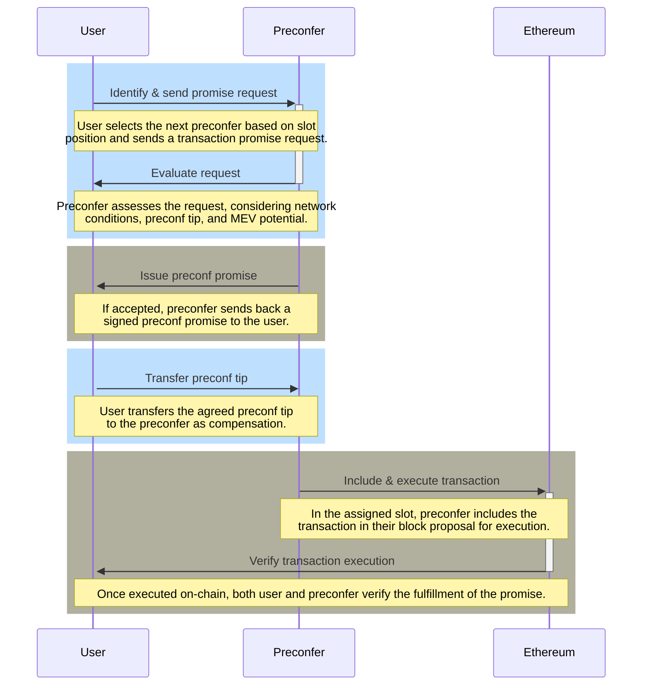

# Ethereum Based Preconfirmations

## [Overview](#overview)

Based preconfirmations (preconfs) represent a significant advancement in Ethereum transaction processing, offering users swift and reliable execution. Through a combination of on-chain infrastructure, proposer accountability mechanisms, and flexible promise acquisition processes, preconfs stand to significantly enhance the user experience in Ethereum interactions. This technology not only reduces transaction latency but also introduces a layer of security and efficiency previously unseen in the ecosystem[^1].

## [Construction of Preconf Promises](#construction-of-preconf-promises)

Preconfirmation promises, or "preconfs," rely on two foundational on-chain infrastructure components:

- **Proposer Slashing:** Proposers can opt into additional slashing conditions to ensure reliability and accountability. This approach draws inspiration from EigenLayer's model, which employs restaking as a means of enforcing these slashing mechanisms.

- **Proposer Forced Inclusions:** To ensure the seamless execution of transactions, proposers have the authority to mandate the inclusion of specific transactions on-chain. This power is crucial in situations where the separation between proposers and builders (PBS) renders self-building uneconomical. The implementation of this mechanism typically involves the use of inclusion lists.

When a L1 proposer decides to become a "preconfer," they are essentially agreeing to adhere to two distinct slashing conditions related to preconf promises. In return for their service, preconfers issue signed promises to users and are compensated with tips for successfully fulfilling these promises. The hierarchy among preconfers is determined based on their position in the slot order, with precedence given to those with earlier slot assignments.

A transaction that secures a preconf promise gains the eligibility for immediate inclusion and execution on-chain by any proposer positioned before the issuer of the promise (preconfer). The primary obligation of the preconfer is to honor all such promises during their designated slot, utilizing the inclusion list to facilitate this process.

There are two main types of promise-related faults, each carrying the potential for slashing:

1. **Liveness Faults:** These faults occur when a preconfer fails to include a promised transaction on the chain because their designated slot was missed.

2. **Safety Faults:** These arise when the preconfer includes transactions on-chain that directly contradict the promises made, despite not missing their slot.

To ensure that transactions with preconf promises are given priority, a specific execution queue is established for transactions lacking such promises. This arrangement guarantees that preconfed transactions are executed ahead of others.

Preconfers are not limited to a single type of preconfirmation promise. They can offer a spectrum of promises, ranging from strict execution guarantees based on specific state roots to simpler promises of transaction inclusion. This flexibility allows preconfers to cater to a wide array of user needs and preferences.

## [Key Elements of Preconfs](#key-elements-of-preconfs)

The process towards securing a preconfirmation promise for transactions within the Ethereum network is initiated by establishing a connection with the next available preconfer. This process entails a series of critical steps and factors, including:

- **Endpoints:** Preconfers may offer direct API endpoints or utilize decentralized peer-to-peer (p2p) networks for the exchange of promises, striking a balance between quick response times and widespread availability.

- **Latency:** Utilizing direct communication channels, the process aims to achieve preconfirmation times as swift as 100 milliseconds, ensuring rapid transaction handling.

- **Bootstrapping:** A substantial participation rate among L1 validators as preconfers is crucial. This ensures that within the proposer lookahead window, there is always a significant chance of encountering a preconfer ready to issue promises.

- **Liveness Fallback:** Users can enhance their transaction's reliability by securing promises from several preconfers, thus safeguarding against the possibility of any single preconfer failing to fulfill their promise due to missed slots.

- **Parallelization:** The system accommodates various promise types, ranging from strict commitments on post-execution state to more flexible, intent-based promises.

- **Replay Protection:** Ensures transactions are protected from replay attacks, vital for maintaining the integrity and security of preconf transactions.

- **Single Secret Leader Election (SSLE):** This mechanism allows for the confidential identification of preconfers within the lookahead period, enabling them to validate their status without revealing their identity prematurely.

- **Delegated Preconf:** Offers a provision for proposers constrained by limited network bandwidth or processing capability, allowing them to delegate their preconfirmation duties to ensure efficient processing of promises.

- **Fair Exchange:** The system addresses the fair exchange dilemma between users and preconfers concerning promise requests and the collection of preconf tips. Solutions include public streaming of promises for transparency, intermediation by trusted relays, or the use of cryptographic fair exchange protocols to balance the interests of all parties involved.

- **Tip Pricing:** The negotiation of preconf tips considers the transaction's potential impact on a proposer’s ability to extract MEV. Through mutual agreement or the assistance of trusted relays, users and preconfers can determine fair compensation for preconfirmations.

- **Negative Tips:** Preconfers may accept negative tips for transactions that enhance their MEV opportunities, such as those affecting DEX prices and creating arbitrage prospects.

Each of these elements plays a crucial role in the functionality and efficiency of based preconfirmations, ensuring transactions are not only processed swiftly but also securely and fairly within the Ethereum ecosystem.

## [Preconfs Acquisition Process Flow](#preconfs-acquisition-process-flow)

*Figure: Preconf Promise acquisition process flow. Source: Justin Drake*

*Here is a sequence diagram explaining the interactions in a typical Preconfs Acquisition Process Flow*

The promise acquisition process in the context of Ethereum's sequencing and pre-confirmation mechanism is a critical aspect, ensuring transactions receive a preconfirmation or "promise" from a proposer or sequencer. This process involves several steps, each integral to securing a promise that a transaction will be included and executed on-chain within a specified time frame. The above figure shows the preconf promise acquisition flow through a sequence of interactions. Below is a detailed explanation of the acquisition process flow:

**1. User Identifies Next Preconfer**

- **Starting Point:** A user or a smart contract initiates the process by identifying the next available preconfer (a proposer who has opted in to provide preconfirmation services) within the Ethereum network's proposer lookahead window.

- **Selection Criteria:** The selection is based on the proposer's slot position in the proposer lookahead, where proposers have declared their capability and willingness to issue preconfirmations by posting collateral.

**2. Promise Request Sent to Preconfer**

- **Initiation:** The user sends a promise request to the identified preconfer. This request includes details of the transaction for which the preconfirmation is sought, along with any specific conditions or requirements.

- **Communication Channel:** The request can be sent through various off-chain communication channels established by the preconfer, such as a dedicated API endpoint or a peer-to-peer messaging system.

**3. Preconfer Evaluates the Request**

- **Assessment:** Upon receiving the request, the preconfer evaluates it based on several factors, including the current network conditions, the preconf tip amount proposed by the user, and the overall risk of executing the transaction.

- **Decision Making:** The preconfer decides whether to accept or reject the promise request. This decision may involve calculating the potential MEV and assessing whether the transaction aligns with the preconfer's criteria.

**4. Issuance of Preconf Promise**

- **Promise Generation:** If the preconfer decides to accept the request, they generate a signed preconf promise. This promise includes the preconfer's commitment to ensuring the transaction's inclusion and execution within their upcoming slot, adhering to the agreed conditions.

- **Communication of Promise:** The preconf promise is then communicated back to the user, providing them with a guarantee of transaction execution. The communication method used is like that of the initial request, ensuring secure and verifiable delivery.

**5. Payment of Preconf Tip**

- **Tip Transfer:** Upon receipt of the preconf promise, the user transfers the agreed preconf tip to the preconfer. This tip serves as compensation for the service provided and incentivizes the preconfer to honor the commitment.

- **Escrow Mechanisms:** In some implementations, the tip may be held in escrow until the promise is fulfilled, adding an extra layer of security for the user.

**6. Inclusion and Execution of Transaction**

- **On-Chain Fulfillment:** The preconfer includes the preconfirmed transaction in their proposed block during their assigned slot, executing it according to the terms outlined in the preconf promise.

- **Verification of Fulfillment:** Once the transaction is included and executed on-chain, both the preconfer and the user can verify that the promise has been fulfilled, completing the process.

**Additional Considerations:**

- **Fallback Mechanisms:** In case of unexpected issues or if the first preconfer fails to include the transaction, users may have fallback options, such as requesting promises from multiple preconfers in parallel.

- **Dispute Resolution:** The system may include mechanisms for resolving disputes in cases where there's disagreement about whether the promise was adequately fulfilled.

## References
[^1]: https://ethresear.ch/t/based-preconfirmations/17353 
