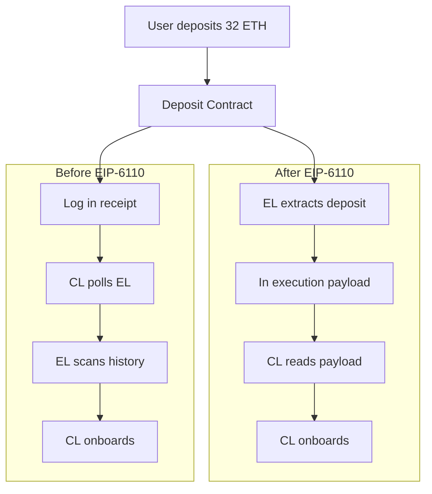
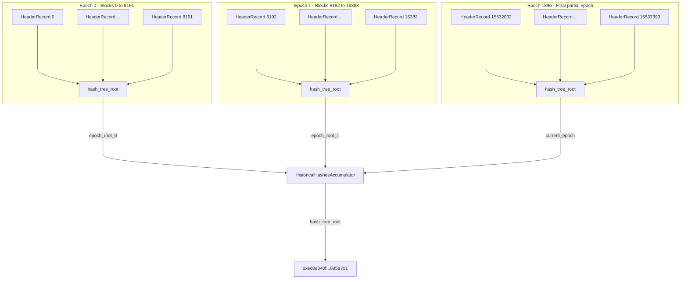

# History Expiry In Ethereum

> **Recommended pre-reading**
> - [Ethereum Node Architecture](/wiki/EL/el-specs.md)
> - [Execution Layer Specification](/wiki/EL/el-specs.md)
> - [DevP2P protocol](/wiki/EL/devp2p.md)
> - [Data structures and encoding](/wiki/EL/data-structures.md)
> - [EIP-4444: Bound Historical Data in Execution Clients](https://eips.ethereum.org/EIPS/eip-4444)
> - [EIP-7643: History Accumulator for Pre-PoS Data](https://eips.ethereum.org/EIPS/eip-7643)

History expiry is the idea that nodes should not be required to store historical data forever. Every Ethereum full node stores two categories of data. State is the current account, contract storage, and code. History is past block headers, bodies, and receipts.

Up until recently, full nodes were expected to store and serve all historical data, over the peer-to-peer network, even if the data is not needed to validate a block. That data has grown with every block since genesis. Today, running a full node takes well over a terabyte of disk space, and both client load and sync times keep increasing even as the chain's capacity remains the same. Removing this data might sound risky, but Ethereum's default sync strategy already does not validate every block from genesis. [Snap sync](https://ethereum.org/en/developers/docs/nodes-and-clients/#snap-sync) starts from a recent state snapshot and [weak subjectivity checkpoints](https://epf.wiki/#/wiki/CL/syncing) anchor the chain to a trusted finalized point. Although historical validation is still possible, it is not compulsory.

To solve this, [EIP-4444](https://eips.ethereum.org/EIPS/eip-4444) proposes that nodes may prune historical data and receipts older than a set threshold and stop serving them over the peer-to-peer network. Once a client has synced to the tip of the chain, historical data is only retrieved when requested explicitly over the JSON-RPC or when a peer attempts to sync. For this to work, the peer-to-peer protocol itself needed to change.

## DevP2P Changes

Under `eth/68` and older `eth` protocols, nodes assumed every peer stored the full chain from genesis. A node pruning old history while still advertising itself on `eth/68` would break that assumption and disrupt sync for peers requesting old blocks. [EIP-7642](https://eips.ethereum.org/EIPS/eip-7642) introduces `eth/69`, which removes this assumption. Prior to `eth/69`, when two nodes connect, they exchange a Status message containing the network ID, genesis hash, fork ID, and the hash of the node's latest block, but now the status handshake includes two new fields, `earliestBlock` and `latestBlock` that store the block range.

```python
    # Old eth/68 Status
    # [version, networkid, td, blockhash, genesis, forkid]

    # New eth/69 Status
    # Now includes earliestBlock and latestBlockHash.
    # td (totalDifficulty) is removed as it is useless since the merge.
    # [version, networkid, genesis, forkid, earliestBlock, latestBlock, latestBlockHash]

    # BlockRangeUpdate message, sent when a node's range changes.
    # Sent at most once per epoch (32 blocks).
    # [earliestBlock, latestBlock, latestBlockHash]
```

`eth/69` also adds a new message, BlockRangeUpdate. As a node prunes more data or downloads more history, it sends this message to its connected peers so they can update their view of what blocks that node can serve. This only needs to be sent once per epoch.

`eth/69`'s linear range works for Phase 1 where nodes either hold pre-Merge (old PoW chain) data or they don't. For Phase 2, where nodes may hold non-contiguous slices of history, proposals like [EIP-7801](https://eips.ethereum.org/EIPS/eip-7801), introduce a bitmask-based subprotocol called `etha` that lets nodes advertise exactly which segments of the chain they store. While the eth protocol continues to handle live chain operations like block propagation, transaction gossip, and syncing to the tip, the `etha` subprotocol is dedicated entirely to serving historical data. This means historical block requests will no longer travel over the same channel as live chain, so a node that is looking for old blocks queries peers over etha, and nodes that do not support history sharding are never bothered with those requests again.

The core idea of `etha` is that the chain history will be divided into repeating windows of 1,064,960 blocks. Each window is split into 10 equal spans of 106,496 blocks. Each bit in the bitmask represents one of those spans. If a node sets bit 3, that node is committing to hold every third span out of ten not just in the segment alone, but the entire chain from blocks 0 through 1,064,960, and from blocks 1,064,960 through 2,129,920, and so on all the way to the chain head. As new blocks are produced and new spans are created, the node must continue storing the spans that correspond to its committed bit.

**Window: Blocks 0 — 1,064,960**

|              | Span 0 | Span 1 | Span 2 | Span 3 | Span 4 | Span 5 | Span 6 | Span 7 | Span 8 | Span 9 |
|--------------|--------|--------|--------|--------|--------|--------|--------|--------|--------|--------|
| Node A       |   X    |        |        |        |        |        |        |        |        |        |
| Node B       |        |        |        |   X    |        |        |        |        |        |        |
| Node C       |        |        |        |        |        |        |        |   X    |        |        |
| Node D       |        |   X    |        |        |        |        |        |        |        |        |
| Node E       |        |        |        |        |        |   X    |        |        |        |        |
| Node F       |        |        |        |        |        |        |        |        |        |   X    |

The span sizes of 106,496 are not arbitrary. Each span is a multiple of 8,192 blocks, which is the maximum block range of an ERA1 file. This makes a node's storage and retrieval align directly with how data is packaged for distribution, and backfilling a shard straightforward. The minimum requirement is that each participating node retains at least one bit, which translates to roughly 10% of total chain history giving a 90% storage reduction compared to holding everything. A syncing node finding a particular shard depends on how many of its peers hold it. The probability that none of a node's peers hold a given shard is modeled as $(0.9)^n$, where $n$ is the number of connected peers. With 25 peers, there is roughly a 7% chance a shard is missing and with 32 peers that drops to about 3.4%.

| Number of Connected Peers ($n$) | Probability No Peer Holds a Given Shard $P = (0.9)^n$ | Probability At Least One Peer Holds It $1 - (0.9)^n$ |
|---------------------------------|-------------------------------------------------------|-------------------------------------------------------|
| 10                              | 34.9%                                                 | 65.1%                                                 |
| 15                              | 20.6%                                                 | 79.4%                                                 |
| 20                              | 12.2%                                                 | 87.8%                                                 |
| 25                              | 7.2%                                                  | 92.8%                                                 |
| 32                              | 3.4%                                                  | 96.6%                                                 |
| 50                              | 0.5%                                                  | 99.5%                                                 |

When two nodes connect over etha, they exchange a handshake containing the same fields as eth/69 plus the `blockBitmask`. From that point, the node can serve historical data using four messages reused directly from eth/69 with identical encoding such as `GetBlockBodies`, `BlockBodies`, `GetReceipts`, and `Receipts`. This makes the data retrieval process work the same way, and no new message types are needed.

```python
    # eth/69 Status Handshake
    # [version, networkid, genesis, forkid, earliestBlock, latestBlock, latestBlockHash]

    # etha Handshake (EIP-7801)
    # Same fields as eth/69, plus a 10-bit blockBitmask
    # [version, networkid, genesis, forkid, blockhash, blockBitmask]

    # etha reuses these four messages from eth/69 with identical encoding
    # GetBlockBodies  (0x05)
    # BlockBodies     (0x06)
    # GetReceipts     (0x0f)
    # Receipts        (0x10)
```

## Deposit Log Dependency

History expiry does not only affect the execution layer but it poses a direct problem for the consensus layer. Before the [Pectra hardfork](https://eips.ethereum.org/EIPS/eip-7600), when someone deposits 32 ETH to become a validator, that transaction goes to the deposit contract on the execution layer, and then emits a `DepositEvent` log that contains the validator's public key, withdrawal credentials, deposit amount, signature, and index. The consensus layer needs this information to onboard the validator.

```python
    # From github.com/ethereum/consensus-specs
    # event DepositEvent(
    #     bytes pubkey,                  # The validator's public key
    #     bytes withdrawal_credentials,  # Address to receive the validator's balance when it exits
    #     bytes amount,                  # How much ETH was deposited
    #     bytes signature,               # Validator's signature
    #     bytes index                    # Index tracks the number of deposits
    # )
```

Consensus layer clients got this data through a mechanism called the Eth1Data poll. Every beacon block included an `eth1_data` field where the block proposer voted on a recent state of the deposit contract. To be able to vote, the consensus client of the proposer would query the execution client over JSON-RPC, asking it to read the deposit contract's logs from historical execution layer blocks. The execution client would scan back through old blocks to find the relevant deposit events, and that is exactly where history expiry breaks things.



These deposit logs live inside historical blocks, and if the execution client node has pruned its history, the consensus client can no longer read the deposit logs it depends on. The `Eth1Data` poll mechanism would fail because the data it polls no longer exists on the node.

Aside from the history expiry issue, the `Eth1Data` poll flow was brittle. Consensus clients depended on JSON-RPC calls to execution clients, and inconsistencies between different execution client implementations caused failures. Block proposers needed to maintain and distribute deposit contract snapshots just to participate. The delay between a deposit transaction landing on the execution layer and the consensus layer processing it was roughly 12 hours. And the whole voting mechanism, where proposers vote on what they think the deposit contract state looks like, introduced attack surface that a direct reading would not have.

Now to solve all of the above issues, [EIP-6110](https://eips.ethereum.org/EIPS/eip-6110) proposes including deposit processing as part of the execution payload sent on every block from the execution layer to the consensus layer. So when a deposit transaction is included in a block, the execution client parses the `DepositEvent` logs from that block's receipts right then, packages them into a `deposit_requests` list, and includes them in the execution payload. This kills the `Eth1Data` voting mechanism, and removes the consensus layer's dependency on historical execution layer data entirely. EIP-6110 shipped as part of the [Pectra upgrade](https://eips.ethereum.org/EIPS/eip-7600), clearing this dependency.

## ERA Files

Once nodes stop serving old history, that data still needs to be retrievable somewhere. ERA files are flat-file archives containing finalized historical blocks. They are built on top of [e2store](https://github.com/status-im/nimbus-eth2/blob/stable/docs/e2store.md), a Type-Length-Value file format designed for long-term cold storage of Ethereum data. Each entry in an e2store file has an 8-byte header, followed by the data itself. The header is broken into

- 2 bytes for the type
- 4 bytes for the length
- 2 bytes reserved

There are several [e2store formats](https://github.com/eth-clients/e2store-format-specs), and each covers its own slice of the data. ERA1 files store pre-merge execution layer history. Each ERA1 file packages 8,192 blocks worth of headers, bodies, receipts, and total difficulty values, all snappy-compressed. ERA files store post-merge beacon chain history, including beacon blocks and states, also in batches of 8,192 slots (~27 hours of chain time). E2HS files cover full execution layer history from genesis to latest, with headers accompanied by proofs of canonicalness. Erb files, still under development, are the equivalent for blob sidecars. E2SS files store execution state snapshots.

```python
    # e2store entry layout
    # [type: 2 bytes | length: 4 bytes | reserved: 2 bytes | data: length bytes]

    # ERA1 file structure
    # era1 := Version | block-tuple* | other-entries* | Accumulator | BlockIndex
    # block-tuple := CompressedHeader | CompressedBody | CompressedReceipts | TotalDifficulty
```

The 8,192-block batch size comes from the accumulator size limit defined in [EIP-7643](https://eips.ethereum.org/EIPS/eip-7643). Each ERA1 file includes an accumulator, which is the SSZ hash tree root of up to 8,192 header records. A header record is a pair of block hash and total difficulty. The accumulator serves as a cryptographic commitment to the contents of the file.

```python
    # Header record used in the accumulator
    # header_record = { block_hash: Bytes32, total_difficulty: Uint256 }

    # Accumulator is the hash tree root of up to 8192 header records
    # accumulator = hash_tree_root(List[header_record], max_length=8192)
```

Anyone downloading an ERA1 file can reconstruct the epoch accumulator from the block headers inside it and compare the result against the known accumulator root. The full set of pre-merge accumulator roots is defined in EIP-7643, and the hash tree root of the entire `HistoricalHashesAccumulator` for all data before block 15,537,394 (the merge block) is a single fixed value, making it trustless.

### Accumulator Verification

The accumulator works with three data structures.

```python
    EPOCH_SIZE = 8192  # blocks per ERA1 file
    MAX_HISTORICAL_EPOCHS = 2048  # upper bound on pre-merge epochs

    # A record for a single block
    # HeaderRecord = Container[
    #     block_hash: bytes32,
    #     total_difficulty: uint256
    # ]

    # All header records within a single 8192-block epoch
    # EpochRecord = List[HeaderRecord, max_length=EPOCH_SIZE]

    # The top-level accumulator
    # HistoricalHashesAccumulator = Container[
    #     historical_epochs: List[bytes32, max_length=MAX_HISTORICAL_EPOCHS],
    #     current_epoch: EpochRecord
    # ]
```

A `HeaderRecord` pairs a block's hash with its total difficulty at that height. An `EpochRecord` collects up to 8,192 of these records. The `HistoricalHashesAccumulator` stores the Merkle roots of all completed epochs in `historical_epochs`, plus whatever partial epoch remains in `current_epoch`.

For example, if you take the first three blocks on mainnet, each block produces a `HeaderRecord`.

```python
    # Block 0 (genesis)
    # header_record_0 = { block_hash: 0xd4e5..c520, total_difficulty: 17_179_869_184 }

    # Block 1
    # header_record_1 = { block_hash: 0x88e9..4c2d, total_difficulty: 34_359_738_368 }

    # Block 2
    # header_record_2 = { block_hash: 0xb495..cd62, total_difficulty: 51_539_607_552 }

    # ... continue for all 8192 blocks in epoch 0
```

Once all header records for epoch 0 are collected, the epoch root is computed through SSZ Merkle tree hashing. It takes the list of 8,192 `HeaderRecords`, serializes each one as SSZ (block_hash as bytes32 + total_difficulty as uint256, giving 64 bytes per record), then builds a binary Merkle tree over the leaves. Each pair of leaves is hashed together with SHA256, then each pair of intermediate nodes is hashed again, up to the root. Since the list has a max length of 8,192, the tree is always padded to 8,192 leaves ($\log_2(8192) = 13$ levels deep). A final "mix in length" step hashes the tree root with the actual list length to produce the epoch root.

```python
    # epoch_root_0 = hash_tree_root([header_record_0, header_record_1, ..., header_record_8191])
    # epoch_root_0 = 0x5ec1ffb8c3b146f42606c74ced973dc16ec5a107c0345858c343fc94780b4218
```

The root just computed is the first entry in the `historical_epochs` list. The same process repeats for every block batch across the entire pre-merge chain.



The merge happened at block 15,537,394. That means there are 1,896 complete epochs (1,896 × 8,192 = 15,531,008 blocks) plus a final partial epoch of 6,386 blocks (15,537,394 − 15,531,008). The complete epochs go into `historical_epochs` as a list of 1,896 roots. The final 6,386 header records go into `current_epoch`. The `hash_tree_root` of the entire `HistoricalHashesAccumulator` produces a single fixed value that is hardcoded into clients. It never changes because the pre-merge chain is frozen.

```python
    # Final pre-merge accumulator root (from EIP-7643)
    # 0xec8e040fd6c557b41ca8ddd38f7e9d58a9281918dc92bdb72342a38fb085e701
```

When a node downloads an ERA1 file, verification works in four steps. Extract all block headers from the file. Build a `HeaderRecord` for each block. Compute `hash_tree_root` over the records. Compare the result against the known epoch root from EIP-7643's published table. If the roots match, the file is canonical. If they don't, the file is corrupted or tampered with and should be rejected.

### Proof of Inclusion

The accumulator also enables compact Merkle proofs for individual blocks. Before EIP-7643, proving that a specific block was canonical required walking backwards through the entire parent hash chain, which is $O(n)$. With the accumulator, a Merkle proof from the leaf (the specific `HeaderRecord`) to the epoch root is $O(\log n)$, specifically $O(\log_2 8192) = 13$ hashes for any block within an epoch. To prove against the full accumulator root, you add one more proof step from the epoch root to the `HistoricalHashesAccumulator` root.

Taking block 500,000 as an example

$$\text{epoch} = \left\lfloor \frac{500{,}000}{8{,}192} \right\rfloor = 61$$

$$\text{position within epoch} = 500{,}000 \mod 8{,}192 = 888$$

The Merkle proof from `HeaderRecord` at index 888 to `epoch_root_61` requires

$$\log_2(8192) = 13 \text{ sibling hashes}$$

The Merkle proof from `epoch_root_61` to the full accumulator root requires

$$\log_2(2048) = 11 \text{ sibling hashes}$$

The total proof size is

$$13 + 11 = 24 \text{ hashes} \times 32 \text{ bytes} = 768 \text{ bytes}$$

to prove any pre-merge block is canonical.

This is the verification mechanism the [Portal Network](https://www.ethportal.net/) was designed to use. When a node requests a historical block from the network, the response includes the block data plus a Merkle proof against the accumulator.

### Distribution

ERA1 files follow the naming convention `<network>-<epoch>-<hexroot>.era1`, for example `mainnet-00000-5ec1ffb8.era1` for the first 8,192 blocks on mainnet. The hex portion is a truncated accumulator root, so the filename itself is a quick integrity check. The BlockIndex at the end of the file stores relative offsets to each block tuple, making random access by block number possible without scanning the entire file.

The [eth-clients/history-endpoints](https://github.com/eth-clients/history-endpoints) registry maintains a community list of providers serving ERA1 and ERA files over HTTP and torrents. Providers like [ethPandaOps](https://ethpandaops.io/data/history/) host the full set of mainnet ERA1 files with SHA256 checksums for verification. Files can also be shared over [BitTorrent](magnet:?xt=urn:btih:edcc7c112bae520e3226065a61817d3575904e0d&dn=EthereumMainnetPreMergeEraFiles&xl=458498121702&tr=udp%3A%2F%2Ftracker.opentrackr.org%3A1337%2Fannounce&tr=udp%3A%2F%2Fopen.tracker.cl%3A1337%2Fannounce&tr=udp%3A%2F%2Fbt1.archive.org%3A6969%2Fannounce). The goal is that no single provider is required and the data remains available through multiple independent channels.

Client support is already in place. [Geth](https://geth.ethereum.org/docs/fundamentals/downloadera), [Nimbus](https://nimbus.guide/era-store.html), [Besu](https://besu.hyperledger.org/public-networks/how-to/era1-file-full-sync), and [Reth](https://reth.rs/docs/reth_era/index.html) all support ERA1 imports. Each etha span of 106,496 blocks is exactly 13 ERA1 files (13 × 8,192 = 106,496), so a node's storage boundaries under etha map directly to whole ERA1 files.

## Portal Network

ERA files solve the archival problem but they are static. A node that needs a single old block should not have to download an entire 8,192-block file to get it. The [Portal Network](https://www.ethportal.net/) provides the on-demand retrieval layer. It is a lightweight peer-to-peer network where each participating node stores a small slice of Ethereum's data and serves it when requested. Unlike the existing DevP2P network where every full node is expected to hold everything, Portal is designed so that every node that joins adds capacity rather than consuming it.

Portal runs on top of [Discovery v5](https://github.com/ethereum/devp2p/blob/master/discv5/discv5.md) over UDP and is split into independent sub-networks for history, beacon chain data, and state. Each sub-network forms its own overlay DHT. Data enters through bridge nodes that pull from full nodes over JSON-RPC and push into the appropriate sub-network. Every piece of data is identified by a content key and each node stores content based on its XOR distance to that key, controlled by a self-declared radius. Retrieval is verified using accumulator proofs for pre-merge data and beacon chain `historical_summaries` for post-merge data.

However, Portal Network development has largely stalled and it is not currently an active part of
the history expiry roadmap. Four client implementations exist ([Trin](https://github.com/ethereum/trin),
[Fluffy](https://github.com/status-im/nimbus-eth1/tree/master/fluffy),
[Ultralight](https://github.com/ethereumjs/ultralight),
[Shisui](https://github.com/optimism-java/shisui)) although active work has slowed down significantly.


## Current Status

Phase 1 of history expiry is already underway with EIP-6110 shipped as part of the Pectra upgrade. Phase 1 targets pre-Merge (PoW) history, which accounts for the bulk of stored data on most nodes. Phase 2 covers post-Merge history with non-contiguous sharding through etha (EIP-7801) and is still in active development.


## Resources

- [EIP-4444: Bound Historical Data in Execution Clients](https://eips.ethereum.org/EIPS/eip-4444), [archived](https://web.archive.org/web/20240601000000*/https://eips.ethereum.org/EIPS/eip-4444)
- [EIP-6110: Supply validator deposits on chain](https://eips.ethereum.org/EIPS/eip-6110), [archived](https://web.archive.org/web/20240601000000*/https://eips.ethereum.org/EIPS/eip-6110)
- [EIP-7642: eth/69 - history expiry and simpler receipts](https://eips.ethereum.org/EIPS/eip-7642), [archived](https://web.archive.org/web/20240601000000*/https://eips.ethereum.org/EIPS/eip-7642)
- [EIP-7643: History accumulator for pre-PoS data](https://eips.ethereum.org/EIPS/eip-7643), [archived](https://web.archive.org/web/20240601000000*/https://eips.ethereum.org/EIPS/eip-7643)
- [EIP-7801: etha - Sharded Blocks Subprotocol](https://eips.ethereum.org/EIPS/eip-7801), [archived](https://web.archive.org/web/20240601000000*/https://eips.ethereum.org/EIPS/eip-7801)
- [e2store format specifications](https://github.com/eth-clients/e2store-format-specs)
- [ERA1 format specification](https://github.com/eth-clients/e2store-format-specs/blob/main/formats/era1.md)
- [Ethereum historical data endpoints](https://eth-clients.github.io/history-endpoints/)
- [Portal Network specifications](https://github.com/ethereum/portal-network-specs)
- [Portal Network design requirements](https://blog.ethportal.net/posts/design-requirements-for-portal-network)
- [Portal Network FAQ](https://notes.ethereum.org/@Kolby-ML/HJ-9D5aYp)
- [ethPandaOps ERA1 data](https://ethpandaops.io/data/history/)
- [Nimbus ERA store guide](https://nimbus.guide/era-store.html)
- [Geth ERA download guide](https://geth.ethereum.org/docs/fundamentals/downloadera)
- [Besu ERA1 import guide](https://besu.hyperledger.org/public-networks/how-to/era1-file-full-sync)
- [The Portal Network on ethereum.org](https://ethereum.org/developers/docs/networking-layer/portal-network/)