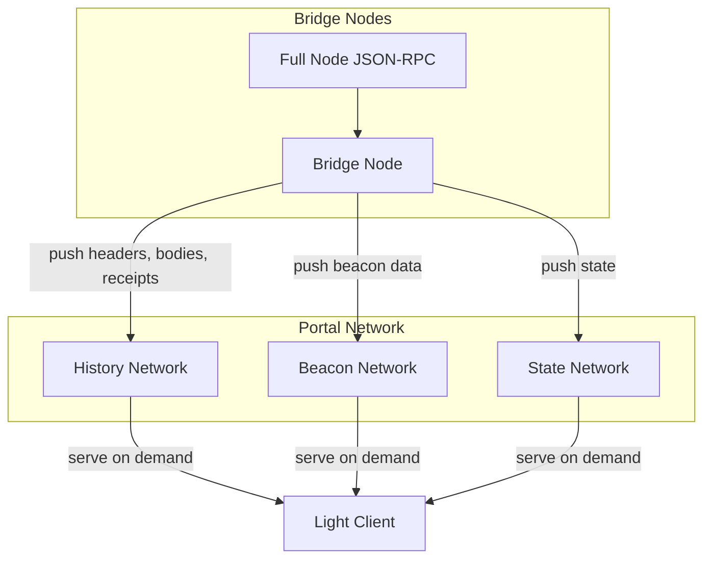
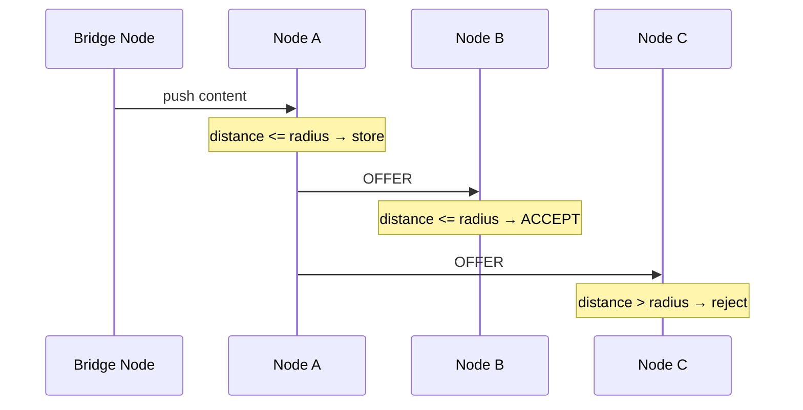

# Portal Network

> :warning: This document covers a project that is no longer under active development. The Portal Network never reached production readiness and active maintenance across most client implementations has stopped. Content may be outdated at time of reading.


> **Recommended pre-reading**
> - [Execution Layer Specification](/wiki/EL/el-specs.md)
> - [DevP2P protocol](/wiki/EL/devp2p.md)
> - [Data structures and encoding](/wiki/EL/data-structures.md)
> - [History Expiry in Ethereum](/wiki/research/history-expiry/history-expiry.md)
> - [EIP-4444: Bound Historical Data in Execution Clients](https://eips.ethereum.org/EIPS/eip-4444)

The Portal Network is a lightweight peer-to-peer network built on top of Discovery v5, where each participating node stores a small slice of Ethereum's data and serves it on request. The term "portal" is used to indicate that these networks provide a view into the protocol but are not critical to the operation of the core Ethereum protocol.

The network is composed of multiple independent overlay networks, each serving a specific type of data such as block history, chain state, or beacon chain information. Nodes participate only in the sub-networks they choose, and each sub-network maintains its own routing table independently of the others. Portal clients are designed for a small resource footprint, requiring no chain sync or block execution, and minimal local storage, making them practical for integration into browser extensions, mobile applications, and other lightweight environments. Active development across Portal client teams has slowed significantly, and the project is no longer under active maintenance.


## Architecture

Portal runs on top of [Discovery v5](https://github.com/ethereum/devp2p/blob/master/discv5/discv5.md) over UDP, using the built-in `TALKREQ` and `TALKRESP` messages to build custom sub-protocols. Each sub-protocol in Portal forms its own **overlay DHT**, a separate routing table managed independently of the base Discovery v5 DHT and of every other sub-protocol, for example, a node participating in the History Network maintains a different routing table from a node in the State Network, and a node can join one without joining the other.
 

### Sub-protocols

The Portal Network is divided into multiple sub-protocols, each delivering a specific unit of functionality. Some of these sub-protocols as detailed in the [spec](https://github.com/ethereum/portal-network-specs) include:

- **Execution History Network** is the primary active sub-protocol. It serves block headers, bodies, and receipts, with all data retrieval done by block number. Participants are assumed to store all historical headers locally and use them to verify content retrieved from the network.
- **Execution Legacy History Network** is similar to the current history network above but it retrieves content by block hash rather than block number, and assumes participants have access to the canonical header chain for verification.
- **Execution State Network** facilitates on-demand retrieval of state values like account balances, nonces, contract code, and contract storage values. The network depends on bridge nodes to continuously feed updated state from the full node as new blocks are produced. The spec notes that querying should be fast enough for wallet operations like estimating gas or reading contract state.
- **Execution Head-MPT State Network** was designed to serve state from the current Merkle Patricia Trie at the chain head. It has never been implemented.
- **Beacon Chain Network** supplies light client data including sync committee bootstraps, updates, and finality updates, enabling lightweight verification of the beacon chain without downloading the full beacon state.
- **Execution Canonical Transaction Index Network** (preliminary) would enable looking up individual transactions by their hash, returning a Merkle proof against the block header's transactions trie.
- **Execution Transaction Gossip Network** (preliminary) would allow Portal nodes to broadcast transactions for block inclusion without connecting to a full node's mempool. Transactions would be bundled with a proof of the sender's balance and nonce for DOS prevention. This is a pure gossip network with no content lookup or retrieval.
- **Execution Verkle State Network** (preliminary) is designed for when Ethereum transitions from Merkle Patricia Tries to Verkle Trees for state storage.


### Bridge Nodes

Data enters the Portal Network through **bridge nodes**. A bridge node connects to a standard full node over JSON-RPC, pulls data from it, and pushes that data into the respective Portal sub-networks. From the perspective of the protocol there is nothing special about bridge nodes as any client with valid data can act as one.

Bridge nodes are important because Portal nodes do not connect to the main Ethereum DevP2P network. A Portal client does not sync blocks, does not participate in transaction gossip, and does not execute transactions. It only stores and serves data within its own overlay DHT. Without bridge nodes actively pulling new data from full nodes and injecting it into the Portal Network, the data would never enter the network in the first place.

The network is designed to remain healthy even with a small number of bridge nodes, and once a bridge node pushes a piece of content into the network, the **OFFER/ACCEPT** propagation mechanism distributes it across all nodes whose radii cover that content. A single bridge node pushing a new block's data is all that is needed for the entire network to receive it, multiple bridge nodes might mitigate risk, but they are not strictly required for coverage.



### Content Keys and Storage

Every piece of data in the Portal Network is identified by a **content key**. A content key is a byte string composed of a single-byte type identifier followed by the block hash. The [History Network](https://github.com/ethereum/portal-network-specs) defines four content types.

```python
# History Network Content Types
# 0x00 = Block Header
# 0x01 = Block Body
# 0x02 = Receipt
# 0x03 = Header Epoch Accumulator (pre-merge only)
# A content key is constructed as
# content_key = content_type_byte + block_hash
# Example: content key for block body of block with hash 0xabc...
# content_key = 0x01 + 0xabc...
```

The content key is hashed to produce a **content ID**. Each node in the network has a **node ID** derived from its [ENR](https://eips.ethereum.org/EIPS/eip-778) (Ethereum Node Record). Whether a node stores a particular piece of content is determined by the XOR distance between the node ID and the content ID, compared against the node's self-declared **radius**.

$$\text{store if } \quad d(\text{node\_id}, \ \text{content\_id}) \leq \text{radius}$$
where
$$d(a, b) = a \oplus b$$
$$\text{content\_id} = \text{sha256}(\text{content\_key})$$

The radius is a 256-bit integer ranging from $0$ to $2^{256} - 1$. A node that sets its radius to $2^{256} - 1$ is willing to store everything that falls near it in the DHT address space, consequently, a node with a small radius stores very little. Each node advertises its current radius in `PING` and `PONG` messages so peers know what to expect from it.

```python
# Storage decision for a node
#
# node_id     = derived from the node's ENR
# content_id  = sha256(content_key)
# radius      = node's self-declared storage radius (0 to 2^256 - 1)
#
# if XOR(node_id, content_id) <= radius:
#     store the content
# else:
#     do not store, but can route the request to a closer node
```

Nodes do not set their radius once and leave it fixed when they newly join a portal network. As a node's local database fills up, it shrinks its radius to stop accepting content that is far from its node ID. If storage frees up, the node can expand its radius again. This is exactly how each node independently decides how much it stores based on its own capacity without any central coordination.

Most times, multiple nodes will have overlapping radii covering the same region of the address space. The redundancy is intentional because if one node goes offline, the content still remains available from other nodes nearby in the DHT. So it follows that if there are more nodes in the network, the more resilient the network becomes.

Lastly, when a node receives new content either from a bridge node or from another peer, the content doesn't just sit passively on that node waiting to be requested. It offers that content to other nodes whose node IDs are close to the content ID, and they accept if the content falls within their own radii.



### Retrieval and Verification

When a client wants a historical block, it constructs the content key, computes the content ID, and queries nodes that are closest to that content ID in the DHT. The [Portal wire protocol](https://github.com/ethereum/portal-network-specs/blob/master/portal-wire-protocol.md) defines the following core messages for this.

```python
# Portal Wire Protocol Messages
#
# PING / PONG              -> liveness check, includes radius
# FINDNODES / NODES        -> discover peers
# FINDCONTENT / CONTENT    -> request specific content by content key
# OFFER / ACCEPT           -> proactively push content to nearby nodes
```

If a client sends a `FINDCONTENT` request to a node, it doesn't always return the content. It can take three forms. If the node has the content and it fits in a single UDP packet, it returns the raw bytes directly. If the node has the content but it is too large for one packet, it initiates a **uTP** stream to transfer it. If the node does not have the content, it returns a list of ENRs of other nodes that are closer to the content ID. The requesting node then queries those closer nodes, and the process repeats. Each round narrows the XOR distance to the target content ID, and this concept is known as the **Kademlia lookup pattern**. With Kademlia pattern, every node in the network maintains a detailed knowledge of peers near itself and progressively less detailed knowledge of peers far away, organized into k-buckets by binary prefix distance. The result is that any piece of content can be located in $O(\log n)$ hops regardless of network size. A network with a million nodes would require roughly 20 hops to find any content.

For large data transfers that exceed the size of a single UDP packet, the protocol uses **uTP** (micro Transport Protocol) tunneled over Discovery v5.

All data retrieved from the Portal Network is immediately verifiable by the requesting node. For block headers, the node already knows the expected block hash and rejects any response with a mismatched hash. For block bodies, the node verifies the response against the `transactionsRoot` in the corresponding header. For receipts, the node verifies against the `receiptsRoot`. For pre-merge headers specifically, the node verifies using accumulator Merkle proofs defined in [EIP-7643](https://eips.ethereum.org/EIPS/eip-7643), where a double-batched Merkle log accumulator built from every pre-merge header allows $O(\log n)$ inclusion proofs without requiring the full header chain.

$$\text{Pre-merge verification: Merkle proof against EIP-7643 accumulator}$$

$$\text{Post-merge verification: proof against beacon chain } \texttt{historical\_summaries}$$

Post-merge historical data is verified using the beacon chain's built-in history accumulators. Before the Capella upgrade, this used `historical_roots`. After Capella, it uses `historical_summaries`. This is why the Beacon sub-network exists alongside the History sub-network.

It is worth emphasizing that the requesting node never has to trust the peer serving the data. Every response is verified locally against known cryptographic commitments like block hashes, Merkle roots, or accumulators. A malicious node can refuse to respond, but it cannot serve fake data that passes verification. This shows the stark difference between the Portal Network and centralized retrieval services like Etherscan or Infura where you're trusting the provider to return correct data.

## Client Implementation

Four Portal Network client implementations were developed, each in a different language:

- **Trin** was the reference implementation developed by the Ethereum Foundation's Portal team. It was the most feature-complete Portal client, supporting the History and Beacon sub-networks. It is no longer actively maintained.
- **Fluffy** is the Nim implementation built by the Nimbus team, designed to be lightweight enough to embed in wallets and mobile devices. It has since been renamed to Nimbus Portal Client and continues under independent development.
- **Ultralight** was the TypeScript implementation from the EthereumJS team, originally built with the goal of running a Portal Network client in the browser through a UDP proxy. Development stopped when the EF JavaScript team was dissolved.
- **Shisui** is the Go implementation, originally developed under the `optimism-java` organization and since migrated to `zen-eth`. It is built on top of go-ethereum and continues under independent development.

| Client | Language | Team | Status |
|---|---|---|---|
| [Trin](https://github.com/ethereum/trin) | Rust | Ethereum Foundation | Inactive |
| [Fluffy](https://github.com/status-im/nimbus-eth1/tree/master/fluffy) | Nim | Nimbus / Status | Active |
| [Ultralight](https://github.com/ethereumjs/ultralight) | TypeScript | EthereumJS | Inactive |
| [Shisui](https://github.com/zen-eth/shisui) | Go | Zen-eth (Community) | Active |

None of the four clients reached a production release. Cross-client interoperability was tested through portal-hive, a Portal-specific extension of the Ethereum [Hive](https://github.com/ethereum/hive) testing framework. Network-wide health was monitored through [GlaDOS](https://glados.ethportal.net/), which tracked content availability and retrieval success rates across implementations.


## Current Status

As of mid-2025, active development across Portal client teams has slowed significantly. Of the four client implementations, [Trin](https://github.com/ethereum/trin) (Rust) and [Ultralight](https://github.com/ethereumjs/ultralight) (TypeScript) are no longer actively maintained. [Fluffy](https://github.com/status-im/nimbus-eth1/tree/master/fluffy) (now Nimbus Portal Client) and [Shisui](https://github.com/zen-eth/shisui) (Go) continue under independent teams.

Portal was originally designed to let lightweight clients serve the full Ethereum JSON-RPC API without relying on centralized providers, but network latencies made this impractical for endpoints like `eth_call`, and the project narrowed its scope to just historical data retrieval. This positioned Portal as the natural retrieval layer for [EIP-4444](https://eips.ethereum.org/EIPS/eip-4444) history expiry, which allows execution clients to drop historical data but requires that the data remain retrievable through some alternative route. However, none of the Portal client implementations reached a production release, and only the History sub-network managed to approach operational maturity, making it impractical for client teams to depend on. Thus, History expiry moved forward without Portal, with [ERA files](https://geth.ethereum.org/docs/fundamentals/downloadera) served over HTTP and [EIP-7801](https://eips.ethereum.org/EIPS/eip-7801)'s DevP2P range filling the retrieval gap instead.

## Resources

- [Portal Network specifications](https://github.com/ethereum/portal-network-specs), [archived](https://web.archive.org/web/2024/https://github.com/ethereum/portal-network-specs)
- [Portal Network website](https://www.ethportal.net/)
- [Portal Network FAQ](https://ethportal.net/resources/faq)
- [Portal Network design requirements](https://blog.ethportal.net/posts/design-requirements-for-portal-network)
- [The Portal Network on ethereum.org](https://ethereum.org/developers/docs/networking-layer/portal-network/)
- [Vitalik Buterin — Possible futures of the Ethereum protocol, part 5: The Purge](https://vitalik.eth.limo/general/2024/10/26/futures5.html)
- [EIP-4444: Bound Historical Data in Execution Clients](https://eips.ethereum.org/EIPS/eip-4444), [archived](https://web.archive.org/web/2024/https://eips.ethereum.org/EIPS/eip-4444)
- [EIP-7643: History accumulator for pre-PoS data](https://eips.ethereum.org/EIPS/eip-7643), [archived](https://web.archive.org/web/2024/https://eips.ethereum.org/EIPS/eip-7643)
- [Discovery v5 specification](https://github.com/ethereum/devp2p/blob/master/discv5/discv5.md)
- [Portal wire protocol specification](https://github.com/ethereum/portal-network-specs/blob/master/portal-wire-protocol.md)
- [History Network Fully Operational tracking issue](https://github.com/ethereum/portal-network-specs/issues/398)
- [GlaDOS — Portal Network health monitor](https://glados.ethportal.net/)
- [Trin client](https://github.com/ethereum/trin)
- [Fluffy client](https://github.com/status-im/nimbus-eth1/tree/master/fluffy), [guide](https://fluffy.guide/)
- [Ultralight client](https://github.com/ethereumjs/ultralight)
- [Shisui client](https://github.com/zen-eth/shisui)