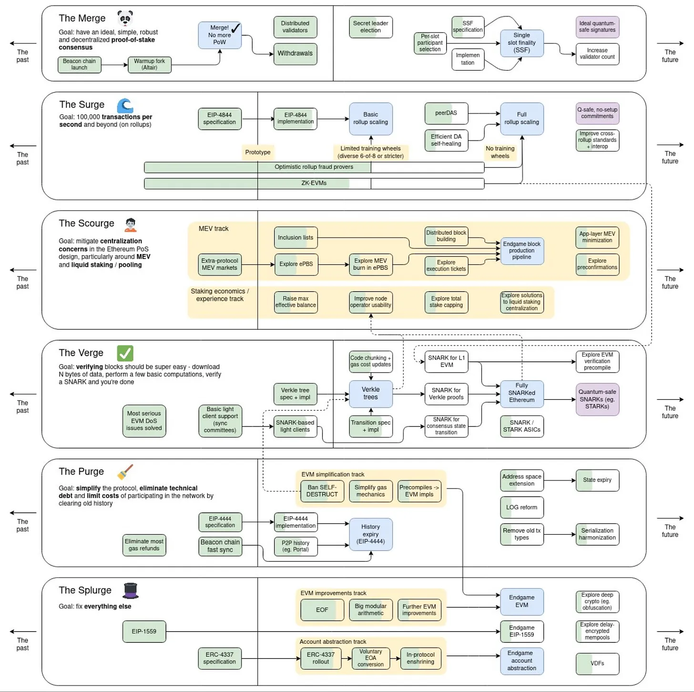

# Ethereum Protocol Roadmap 

The development philosophy of Ethereum is open to protocol evolution and certain risk aversion for benefits which are worth the change. As our knowledge and experience of Ethereum grows, researchers and developers are crafting ideas on how to tackle challenges and limitations of the network. There has been [many changes](/wiki/protocol/history.md) to the core protocol over many years of its existence. Most of these changes are part of some common goals we could call a roadmap. 

Even though there is no official roadmap and no authority which could dictate it, there are wide community discussions steering the protocol development in certain ways. By agreeing on some goals and reaching consensus about current state of the development, the community, dev and research teams work together to progress in this abstract roadmap. 

## The Infinite Garden

> *Ethereum is NOT a zero sum game with a clear finish line, but rather a game that we want to play continuously. For that to be a reality, the Infinite Garden needs to upgrade regularly, on topics like its security, scalability or sustainability, until it reaches ossification. After that point there will probably be, just some trims - here and there.*

## Core R&D

The discussion, resources and all research and development on the core protocol is fully open, free and public. Anyone can learn about it (as you are probably doing in this wiki) and further more, anyone can participate. There is no set of individuals which could push core protocol changes, the Ethereum community can raise the voice to help steer the discussion. To learn more about the core R&D shaping the protocol, read the [wiki page about it](/wiki/dev/core-development.md).

## Roadmap overview 

While there is not a single roadmap that Ethereum development follows, we can track the current R&D efforts to map what changes are happening and might happen in the future. 
A popular overview mapping many domains of the current core research and development is Vitalik's chart (December 2023):

In this overview, different domains are coupled to related categories forming various 'urges'. Many of these boxes have their own page on this wiki where you can study more.  

### The Merge

Upgrades relating to the switch from proof-of-work to proof-of-stake. The Merge was successfully achieved at Thu Sep 15 06:42:42 2022 UTC, reducing the network's annualized electricity consumption by more than 99.988%. However, this category also tracks subsequent upgrades which can be done to improve the consensus mechanism and smooth issues we encounter after The Merge. 

**IMPLEMENTED**
| Upgrade                              |                                             Description                                             |                                                                                                      Effect                                                                                                       | State of the art                                     |
|:------------------------------------ |:---------------------------------------------------------------------------------------------------:|:-----------------------------------------------------------------------------------------------------------------------------------------------------------------------------------------------------------------:|:---------------------------------------------------- |
| Launch the Beacon Chain              |             A crucial step in Ethereum's shift to a proof-of-stake consensus mechanism              |                                         Beacon Chain was launched as an independent network connected to Ethereum, bootstrapping validators in preparation for the Merge.                                          | shipped   EIP-2982[^1] |
| Merge Execution and Consensus Layers |              Ethereum's execution layer merged with the Beacon chain (consensus layer)              | Proof-of-work activities ceased and the network's consensus mechanism shifted to proof-of-stake. Validators have the role and responsibility for processing the validity of all transactions and proposing blocks | shipped                                              |
| Enable Withdrawals                   | The last of the three-part process of Ethereum's transition to a proof-of-stake consensus mechanism |                                                             Validators can add their withdrawal credentials and Beacon Chain sweeps all inactive ETH                                                              | shipped  EIP-4895[^2]                            |

**TODO** 
| Upgrade                              |                                                                 Description                                                                  |                                                                                                                                                                                                                  Expected effect                                                                                                                                                                                                                   | State of the art                                                                                                  |
| :----------------------------------- | :------------------------------------------------------------------------------------------------------------------------------------------: | :------------------------------------------------------------------------------------------------------------------------------------------------------------------------------------------------------------------------------------------------------------------------------------------------------------------------------------------------------------------------------------------------------------------------------------------------: | :---------------------------------------------------------------------------------------------------------------- |
| Single slot finality (SSF)           |                                           Blocks could be proposed and finalized in the same slot                                            | (i) More convenient for apps (transactions finalization time improved by an order of magnitude, i.e. 12 seconds instead of 12 minutes means better UX for all. Under [full rollup scaling](#the-surge), with real-time SNARK proofs implemented, single slot finality would also mean faster bridging for L2s ), (ii) Much more difficult to attack (multi block MEV re-orgs can be eliminated and the complexity in consensus mechanism, reduced) | in research  (i) VB's SSF notes[^3]  (ii) 8192 signatures post-SSF[^4]  (iii) simple SSF protocol[^5] |
| Single Secret Leader Election (SSLE) |                        Allow elected block proposers to remain private until block publishing, to prevent DoS attacks                        |                                                                                                                                                                                     Only the selected validator knows it has been selected to propose a block.                                                                                                                                                                                     | in research  EIP-7441[^6]                                                                                     |
| Enable more Validators               | The technical challenge of efficiently coordinating an ever increasing number of validators to achieve SSF with the best trade-offs possible |                                                                                                                                                                   Greater redundancy, a broader range of proposers, a wider array of attesters, and overall increased resilience                                                                                                                                                                   | in research   (i) EIP-7514[^7]  (ii) EIP-7251[^8]   (iii) 8192 signatures[^5]                         |
| Quantum-safe signatures              |                               Proactive research and integration of quantum-resistant cryptographic algorithms                               |                                                                                                                                                                        Quantum-safe, aggregation-friendly signatures will enhance protocol security against quantum attacks                                                                                                                                                                        | in research   (i) lattice-based[^9]  (ii) STARK-based [^10] systems                                      |
### The Surge
Upgrades related to scalability by Roll-ups and Data Sharding. 

**IMPLEMENTED**
| Upgrade            | Track |        Topic         |                                                                            Description                                                                             |          Effect           | State of the art           |
| :----------------- | :---: | :------------------: | :----------------------------------------------------------------------------------------------------------------------------------------------------------------: | :-----------------------: | :------------------------- |
| Proto-danksharding |   -   | Basic rollup scaling | We can stop storing Rollup data permanently on Ethereum and move the data into a temporary 'blob' storage that gets deleted from Ethereum once is no longer needed | Reduced transaction costs | shipped  EIP-4844[^11] |

**TODO** 
| Upgrade                                         | Track |            Topic            |                                                                Description                                                                 |                                                                                                                                                                                                                                                   Expected effect                                                                                                                                                                                                                                                    | State of the art                                                                                                                                                                                                                                               |
| :---------------------------------------------- | :---: | :-------------------------: | :----------------------------------------------------------------------------------------------------------------------------------------: | :------------------------------------------------------------------------------------------------------------------------------------------------------------------------------------------------------------------------------------------------------------------------------------------------------------------------------------------------------------------------------------------------------------------------------------------------------------------------------------------------------------------: | :------------------------------------------------------------------------------------------------------------------------------------------------------------------------------------------------------------------------------------------------------------- |
| Danksharding                                    |   -   |     Full rollup scaling     |                       Danksharding is the full realization of the rollup scaling that began with Proto-Danksharding                        |                                                                                                                                                                                                              Massive amounts of space on Ethereum for rollups to dump their compressed transaction data                                                                                                                                                                                                              | in research                                                                                                                                                                                                                                                |
| Data Availability Sampling (DAS)                |   -   |     Full rollup scaling     | Data Availability Sampling is a way for the network to check that data is available without putting too much strain on any individual node |                                                                                (i) ensure rollup operators make their transaction data available after EIP-4844 (ii) ensure block producers are making all their data available to secure light clients (iii) under proposer-builder separation, only the block builder would be required to process an entire block, other validators would verify using data availability sampling                                                                                 | in research   EIP-7594[^12]                                                                                                                                                                                                                                |
| Removing Rollup Training Wheels                 |   -   | Basic & Full rollup scaling |                        (i) Optimistic Rollup Fault Provers   (ii) ZK-EVMs    (iii) Rollup interoperability                         | (i) Optimistic rollups having live proof systems will address the L2's censorship risk  (ii)  Massive improvements to Ethereum's scalability and privacy without sacrificing the security and decentralization aspects of the chain via zkEVMs (EVM-compatible virtual machines that supports zero-knowledge proof computation)   (iii) L1 Sequencers, or Ethereum L1 proposers with given rollup sequencing rights will bring better credible-neutrality and security, and offer roll-ups L1 compatibility | in research   (i)Arbitrum BoLD[^13]   Optimism Cannon[^14]   (ii) ZK-EVMs [^15] [^16] [^17]   (iii) [ET](/wiki/research/PBS/ET.md),   [Based Sequencing with Preconfirmations](/wiki/research/Preconfirmations/BasedSequencingPreconfs.md) |
| Quantum-safe and Trusted-Setup-Free Commitments |   -   |              -              |                      replace KZG commitments with commitments that don't require a trusted setup and are quantum safe                      |                                                                                                                                                                                                                                               Quantum-safe Commitments                                                                                                                                                                                                                                               | in research                                                                                                                                                                                                                                                |

### The Scourge
Upgrades related to censorship resistance, decentralization and mitigating protocol risks from MEV  and liquid staking/pooling. 

**IMPLEMENTED**
| Upgrade   |   Track   |               Topic               |        Description         |                                                                 Effect                                                                  | State of the art                                 |
| :-------- | :-------: | :-------------------------------: | :------------------------: | :-------------------------------------------------------------------------------------------------------------------------------------: | :----------------------------------------------- |
| MEV-Boost | MEV-Track | Endgame Block Production Pipeline | Extra-protocol MEV markets | Ethereum community successfully commoditized MEV (partially), via an extra-protocol market. The majority of MEV goes now to Validators. | [shipped](/wiki/research/PBS/mev-boost.md)   |

**TODO** 

| Upgrade                            |   Track   |               Topic               |                                                                       Description                                                                        |                                                                                                                                                                                                                             Expected effect                                                                                                                                                                                                                              | State of the art                                                                                           |
| :--------------------------------- | :-------: | :-------------------------------: | :------------------------------------------------------------------------------------------------------------------------------------------------------: | :----------------------------------------------------------------------------------------------------------------------------------------------------------------------------------------------------------------------------------------------------------------------------------------------------------------------------------------------------------------------------------------------------------------------------------------------------------------------: | :--------------------------------------------------------------------------------------------------------- |
| ePBS                               | MEV-Track | Endgame Block Production Pipeline |        Enshrinement of block Proposer and block Builder separation at protocol level, because of anti-censorship and MEV risk mitigation reasons         |                                                                       (i) creates opportunities to prevent transaction censorship at the protocol level   (ii) prevents hobbyist validators from being out-competed by institutional players that can better optimize the profitability of their block building   (iii) helps with scaling Ethereum by enabling the Danksharding upgrades                                                                        | [in research](/wiki/research/PBS/ePBS.md)[^18]                                                         |
| MEV - Burn                         | MEV-Track | Endgame Block Production Pipeline |                                           A simple enshrined PBS add-on to smooth and redistribute MEV spikes                                            |                                                                                                                                                                           The extracted ETH would be burned, therefore benefiting all ETH holders, rather than only those running validators.                                                                                                                                                                            | [in research](/wiki/research/PBS/ePBS.md#mev-burn)[^19]                                                    |
| ET                                 | MEV-Track | Endgame Block Production Pipeline |                               A permissionless market allowing buyers to purchase the right to propose execution payloads.                               |                               Attester - Proposer separation: the beacon proposer is unconcerned with execution proposer. Execution proposer is selected from the permissionless execution tickets market and has the option to transfer the execution building right to a third party.  Since ET market will be a protocol gadget, the protocol will have introspection over who comes to market and how much they are willing to pay                               | [ET](/wiki/research/PBS/ET.md),  APS-Burn[^20]                                                         |
| IL                                 | MEV-Track | Endgame Block Production Pipeline | Inclusion lists - a way for the most decentralized set of Ethereum to fight censorship by inputting their preferences onto the construction of the chain | Prevents block builders from censoring blocks. Allow Proposers to retain some authority by providing a mechanism by which transactions can be forcibly included, avoiding the current situation, when without any forced transaction inclusion mechanism, the proposer is faced with the choice of either having to say no, on the transactions that get included, or they build the block locally (having the final say on transactions) and sacrifice some MEV rewards | [in research](/wiki/research/inclusion-lists.md)[^21]   Multiplicity gadgets [^22]   COMIS [^23]   |
| Distributed Block Building         | MEV-Track | Endgame Block Production Pipeline |                                               Decentralize the block building process, by distributing it                                                |                                                                              Decentralize different parts of the Builder:   (i) the algorithms for choosing transactions (the block building transaction ordering)   (ii) resources for block construction, especially under full Danksharding (split-up big blocks)    (iii) add extra builder services (e.g.Preconfirmations)                                                                              | in research   [Preconfirmations](/wiki/research/Preconfirmations/Preconfirmations.md),  SUAVE[^24] |
| Application Layer MEV Minimization | MEV-Track |                 -                 |                                                         App layer effort to minimize harmful MEV                                                         |                                                                                                                                                                                        The minimization techniques target:  (i) frontrunning, and  (ii) sandwich attacks                                                                                                                                                                                         | Examples[^25]                                                                                              |
| Preconfirmations                   | MEV-Track |                 -                 |                       Users preconfirmations on transaction execution, for a competitive user experience in Ethereum interactions                        |                                                                                                                                  Block builders could publicly agree to include transactions with a priority fee over a certain amount, and send users a receipt indicating their intent to include the transaction in a specific block                                                                                                                                  | [in research](/wiki/research/Preconfirmations/Preconfirmations.md)[^26]                                    |
| Increase MAX_EFFECTIVE_BALANCE | Staking Economics | Raising Validator Cap | Increase the max balance for Ethereum validators from 32 ETH to reduce overhead for large stakers | Consolidates validators, reduces network load, simplifies operations for large stakers | [in research](/wiki/research/eODS.md)[^27], confirmed for Pectra upgrade |
| Cheaper Nodes  | Staking Economics | Improve Node Operator Usability| Make nodes cheaper and easier to operate using verkle trees and SNARKs | Lower SSD requirements, faster sync times, easier node operation | Research/Proposal: [in eps node workshop](/docs/eps/nodes_workshop.md)[^28] |
| Capping Validator Set | Staking Economics | Explore Total Stake Capping | Cap the total amount of stake to manage communication overhead between validators | Prevents excessive validator participation, maintains network efficiency | Research/Proposals: [in research](/wiki/research/eODS.md)[^29] |
|Combat LST Centralization | Staking Economics |  Explore Solutions to Liquid Staking Centralization | Solutions to reduce centralization in the Liquid Staking Token (LST) market | Prevents large LST providers from gaining too much control over the network | Research/Proposals: [^30], [^31], [^32], [^33],[^34] |

                                              
### The Verge
Upgrades related to verifying blocks more easily
Succinct proofs for light-client security and state verification.

| Upgrade                          | Track           | Topic                    | Description                                                              | Expected effect                                       | State of the art           |
|:--------------------------------:|:---------------:|:------------------------:|:------------------------------------------------------------------------:|:-----------------------------------------------------:|:--------------------------:|
| Data Availability Sampling (DAS)| Full rollup     | Blob data verification   | Probabilistic blob sampling for light clients without full downloads.     | Secures L2 DA & light clients with minimal overhead.  | in research / EIP-7594 ([eips.ethereum.org](https://eips.ethereum.org/EIPS/eip-7594?utm_source=chatgpt.com))         |
| Verkle Tree Commitments          | Statelessness   | Verifiable trie proofs   | Replace Merkle proofs with vector commitments for O(1)-sized proofs.      | Dramatically smaller proofs; leaner light clients.     | draft / EIP-7736 ([eips.ethereum.org](https://eips.ethereum.org/EIPS/eip-7736?utm_source=chatgpt.com))              |

### The Purge  

Targets protocol and data bloat by pruning historical and inactive state.  

Vitalik’s “Possible Futures” Part 5: “The Purge” stresses history and state expiry to balance permanence with efficiency  ([Possible futures of the Ethereum protocol, part 5: The Purge](https://vitalik.eth.limo/general/2024/10/26/futures5.html?utm_source=chatgpt.com)).  

| Upgrade                          | Topic                  | Description                                                                                                                 | Expected effect                                 | State of the art                                                      |
|:---------------------------------|:-----------------------:|:---------------------------------------------------------------------------------------------------------------------------:|:-----------------------------------------------:|:--------------------------------------------------------------------:|
| History Expiry (EIP-4444)        | Prune old blocks        | Clients prune execution-layer blocks and receipts older than ~1 year, bounding disk usage.                                  | Lowers storage requirements for full nodes.     | draft / EIP-4444[^2search0]                                           |
| State Expiry (EIP-7736)          | Verkle-based expiry     | Remove inactive Verkle leaves not accessed for a defined period; resurrect via proofs when needed.                         | Shrinks active state size to ~20–50 GB.         | draft / EIP-7736[^3search0]                                            |

---

### The Splurge  

Encompasses additional features that, while non-urgent, greatly improve usability, security, and long-term resilience.  

| Upgrade                             | Category               | Description                                                                                                                   | Expected effect                                   | State of the art                                                                        |
|:------------------------------------|:----------------------:|:-----------------------------------------------------------------------------------------------------------------------------:|:-------------------------------------------------:|:---------------------------------------------------------------------------------------:|
| Account Abstraction (EIP-4337)       | UX / Wallets           | Introduces UserOperation mempool, bundlers, and paymasters for smart-contract wallet txs without consensus changes.           | Enables social recovery, sponsored txs, batched ops. | shipped / EIP-4337[^5search0]                                                             |
| Quantum-Safe Signatures             | Future-proofing        | Research into hash-based, lattice-based, and STARK-based multi-signature schemes to replace BLS/ECDSA for validator and user signatures. | Protects PoS and user accounts from quantum attacks. | research / hash-based PQS[^6search1], NIST PQC overview[^6search3]                           |
| Formal Verification Tooling         | Safety / Audits        | Expand toolchain for proving correctness of protocol clients and smart contracts using Coq, SMT, TLA+, Dafny, Isabelle/HOL. | Higher assurance of protocol invariants and client safety. | evolving / [ethereum.org][^7search0], benchmarking tools[^7search1] |

---

## Resources

[^1] : [EIP-2982: Serenity Phase 0](https://eips.ethereum.org/EIPS/eip-2982), [[archived]](https://web.archive.org/web/20230928204358/https://eips.ethereum.org/EIPS/eip-2982)

[^2] : [EIP-4895: Beacon chain push withdrawals](https://eips.ethereum.org/EIPS/eip-4895), [[archived]](https://web.archive.org/web/20240415201815/https://eips.ethereum.org/EIPS/eip-4895)

[^3] : [VB's SSF notes](https://notes.ethereum.org/@vbuterin/single_slot_finality), [[archived]](https://web.archive.org/web/20240330010706/https://notes.ethereum.org/@vbuterin/single_slot_finality)

[^4] : [Sticking to 8192 signatures per slot post-SSF](https://ethresear.ch/t/sticking-to-8192-signatures-per-slot-post-ssf-how-and-why/17989). [[archived]](https://web.archive.org/web/20240105131126/https://ethresear.ch/t/sticking-to-8192-signatures-per-slot-post-ssf-how-and-why/17989)

[^5] : [A simple Single Slot Finality protocol](https://ethresear.ch/t/a-simple-single-slot-finality-protocol/14920), [[archived]](https://web.archive.org/web/20231214080806/https://ethresear.ch/t/a-simple-single-slot-finality-protocol/14920)

[^6] : [EIP-7441: Upgrade BPE to Whisk](https://eips.ethereum.org/EIPS/eip-7441), [[archived]](https://web.archive.org/web/20231001031437/https://eips.ethereum.org/EIPS/eip-7441)

[^7] : [EIP-7514: Add Max Epoch Churn Limit](https://eips.ethereum.org/EIPS/eip-7514), [[archived]](https://web.archive.org/web/20240309191714/https://eips.ethereum.org/EIPS/eip-7514)

[^8] : [EIP-7251:Increase the MAX_EFFECTIVE_BALANCE](https://eips.ethereum.org/EIPS/eip-7251), [[archived]](https://web.archive.org/web/20240324072459/https://eips.ethereum.org/EIPS/eip-7251)

[^9] : [Medium post on lattice encryption](https://medium.com/asecuritysite-when-bob-met-alice/so-what-is-lattice-encryption-326ac66e3175), [[archived]](https://web.archive.org/web/20230623222155/https://medium.com/asecuritysite-when-bob-met-alice/so-what-is-lattice-encryption-326ac66e3175)

[^10] : [VB's hackmd post on STARK signature aggregation](https://hackmd.io/@vbuterin/stark_aggregation), [[archived]](https://web.archive.org/web/20240313124147/https://hackmd.io/@vbuterin/stark_aggregation)

[^11] : [EIP-4844: Shard Blob Transactions](https://eips.ethereum.org/EIPS/eip-4844), [[archived]](https://web.archive.org/web/20240326205709/https://eips.ethereum.org/EIPS/eip-4844)

[^12] : [EIP-7594: PeerDAS](https://github.com/ethereum/EIPs/pull/8105) 

[^13] : [BoLd: dispute resolution protocol](https://github.com/OffchainLabs/bold/blob/e00b1c86124c3ca8c70a2cc50d9296e7a8e818ce/docs/research-specs/BOLDChallengeProtocol.pdf)

[^14] : [Fault proofs bring permissionless validation to the OP Sepolia testnet](https://blog.oplabs.co/open-source-and-feature-complete-fault-proofs-bring-permissionless-validation-to-the-op-sepolia-testnet/)

[^15] : [Parallel Zero-knowledge Virtual Machine](https://eprint.iacr.org/2024/387), [[archived]](https://web.archive.org/web/20240415180222/https://eprint.iacr.org/2024/387)

[^16] : [What is zkEVM](https://www.alchemy.com/overviews/zkevm), [[archived]](https://web.archive.org/web/20240129204732/https://www.alchemy.com/overviews/zkevm)

[^17] : [Types of ZK-EVMs](https://vitalik.eth.limo/general/2022/08/04/zkevm.html), [[archived]](https://web.archive.org/web/20240329112600/https://vitalik.eth.limo/general/2022/08/04/zkevm.html)

[^18] : [Barnabe - More pictures about proposers and builders](https://mirror.xyz/barnabe.eth/QJ6W0mmyOwjec-2zuH6lZb0iEI2aYFB9gE-LHWIMzjQ), [[archived]](https://web.archive.org/web/20240424010902/https://mirror.xyz/barnabe.eth/QJ6W0mmyOwjec-2zuH6lZb0iEI2aYFB9gE-LHWIMzjQ)

[^19] : [MEV burn—a simple design](https://ethresear.ch/t/mev-burn-a-simple-design/15590), [[archived]](https://ethresear.ch/t/mev-burn-a-simple-design/15590)

[^20] : [APS-Burn](https://mirror.xyz/barnabe.eth/QJ6W0mmyOwjec-2zuH6lZb0iEI2aYFB9gE-LHWIMzjQ#heading-aps-burn)

[^21] : [Inclusion lists](https://eips.ethereum.org/EIPS/eip-7547), [[archived]](https://web.archive.org/web/20240309191147/https://eips.ethereum.org/EIPS/eip-7547)

[^22] : [ROP-9: Multiplicity gadgets](https://efdn.notion.site/ROP-9-Multiplicity-gadgets-for-censorship-resistance-7def9d354f8a4ed5a0722f4eb04ca73b)

[^23] : [Committee-enforced inclusion sets (COMIS)](https://ethresear.ch/t/the-more-the-less-censored-introducing-committee-enforced-inclusion-sets-comis-on-ethereum/18835), [[archived]](https://web.archive.org/web/20240310000045/https://ethresear.ch/t/the-more-the-less-censored-introducing-committee-enforced-inclusion-sets-comis-on-ethereum/18835)

[^24] : [SUAVE](https://writings.flashbots.net/the-future-of-mev-is-suave), [[archived]](https://writings.flashbots.net/the-future-of-mev-is-suave)

[^25] : [Examples of app layer MEV minimization](https://herccc.substack.com/i/142947825/examples-of-the-defensive-side-of-mev)

[^26] : [Based preconfirmations](https://ethresear.ch/t/based-preconfirmations/17353), [[archived]](https://ethresear.ch/t/based-preconfirmations/17353)

[^27] : [EIP-7251: Increase the MAX_EFFECTIVE_BALANCE](https://eips.ethereum.org/EIPS/eip-7251)

[^28] : [Spin Up Your Own Ethereum Node - Ethereum.org](https://ethereum.org/en/developers/docs/nodes-and-clients/run-a-node/)

[^29] : [Paths to SSF](https://ethresear.ch/t/orbit-ssf-solo-staking-friendly-validator-set-management-for-ssf/19928)

[^30] : [Enshrining Liquid Staking/Decentralized Liquid Staking](https://notes.ethereum.org/@vbuterin/H1_5auGQd)

[^31] : [Enshrined LST from Arixon](https://ethresear.ch/t/enshrined-lst-allocating-stake-to-node-operators/11053)

[^32] : [Unbundling staking: towards rainbow staking](https://ethresear.ch/t/unbundling-staking-towards-rainbow-staking/11054)

[^33] : [Liquid Staking Maximalism design by Dankrad](https://ethresear.ch/t/liquid-staking-maximalism/11050)

[^34] : [Two-tiered staking from Mike Neuder](https://ethresear.ch/t/two-tiered-staking/11049)

[ethereum/EIPs github repository](https://github.com/ethereum/EIPs/tree/master#ethereum-improvement-proposals-eips)

[Roadmap on Ethereum.org](https://ethereum.org/en/roadmap/)

[ethroadmap.com](https://ethroadmap.com/)

