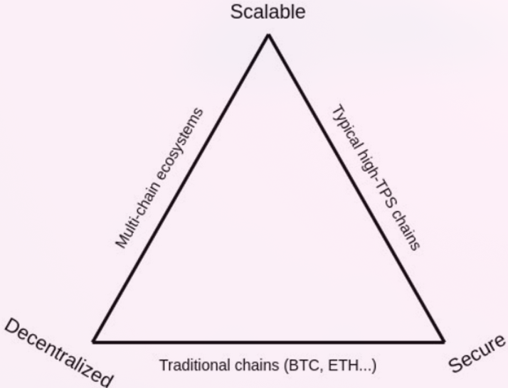

# Scaling
In computer systems, scalability refers to the ability of a system to perform well under increased or expanding workloads. The primary purpose of blockchain is to handle users' transactions and manage network's ledger state. An increase in workload may result from either a higher demand for transactions by existing users or an increase in the volume of users.
> **Scalability of a blockchain system can be defined as its capacity to process increasing volumes operations, i.e. more transactions without raising demands on network node operators**.

## Scalability Limits
For each block included in the chain, a general agreement on its validity must be reached among a certain percentage of validator nodes, the consensus mechanism is the methodology to achieve this agreement. The **block latency** is the time that takes to a valid block to be included in the chain. 
Ethereum uses a  proof-of-stake (PoS) based consensus protocol known as [Gasper](https://eips.ethereum.org/assets/eip-2982/arxiv-2003.03052-Combining-GHOST-and-Casper.pdf) with an ideal block latency fixed in the specification by the constant  `SECONDS_PER_SLOT` (12 seconds), however real block latency could be slightly different since blocks could be missed by a specific validator and not to be included in a specific slot.
 
 Another fundamental blockchain design parameter is the **block size** that is the limit on the amount of data that can be stored in a single block. Ethereum has a config parameter called `gas_limit` to cap the computational effort needed to process a block, which effectively also limits the size of a block. Each operation that takes place within Ethereum,  requires a certain amount of "gas" to complete. The total amount of gas for all operations within a block can't exceed Ethereum's `gas_limit`. This approach ensures the network's processing capacity isn't overextended. [EIP-1559](https://eips.ethereum.org/EIPS/eip-1559) defines Ethereum gas pricing mechanism that allows to dynamically adjust the block size to deal with transient network congestions (without never exceed the limit of 30M gas units) and incentivize the network to target a gas amount defined by `gas_target` (15M). A gas limitation restricts the number of transactions (and their computational complexity) that can be included in an Ethereum block.

The block latency and block size directly determine the transactional throughput of the blockchain, which is measured by the **TPS** (transactions per second) metric.  Block latency can be influenced by a variety of factors, such as the computational power of the network nodes, the complexity of the consensus mechanism, the network traffic congestion and the block size. Hence, a network made up of a few high-performance nodes tightly connected to each other and using large block sizes can result in an exceptional blockchain with high TPS and remarkably low block latency. However, such a network would likely be highly centralized and require users to make significant trust assumptions.

Another obstacle to decentralization is the size of the blockchain state. **The property of data being accessible when it is needed is known as data availability**. Availability of state data must be guaranteed, including availability of enough data to allow any new node in the network to reconstruct the latest version of the blockchain without any trust assumptions. Have to hold all the data to guarantee data availability can result in high storage requirements for nodes and a lengthy synchronization process for new ones, which can hinder decentralization. Handling a large amount of data is also problematic in terms of network congestion and will require demanding high connection bandwidth from node operators. Ethereum discourages the indiscriminate state growth by making operations that read or write state very expensive.

Note the tight relationship between the design and tuning of a blockchain (consensus mechanics, node requirements, state structure and size… ) and its capabilities of decentralization. High hardware or network bandwidth requirements to run a node result in harsh and expensive conditions that make it difficult to do so, directly impacting the number of nodes a blockchain will have. **To ensure decentralization, it is essential to make running a node affordable and feasible for everyone and incentivize users to do it**.

As part of the game-theory mechanism, to maintain the network sustainability, users must pay a fee to include their transactions. In Ethereum the price of fees is determined by the base fee of the protocol, the amount of gas consumed by a specific transaction and a priority market, those who pay higher priority fees are prioritized. Due to limited TPS, including a transaction in a high decentralized blockchain like Ethereum has become a valuable service. An increase transaction demand for a limited and fixed TPS raises fees to the network usability threshold and requires sacrificing decentralization and/or security in order to scale.

> **Recalling the definition of scalability, classical blockchain systems are not scalable for mass adoption without sacrificing certain levels of decentralization.** 

This problem is widely known as the **Blockchain Trilemma**, which states that blockchain networks must sacrifice either security, decentralization, or scalability, and maximizing all three at once is difficult. The holy grail of blockchain technology is to create a secure and decentralized transactional network that can achieve a high TPS rate.

##  Blockchain Modularity
Modern blockchain designs propose a "divide et impera" approach dividing the system into different specific functional components to independently maximize each vertex of the trilemma. This approach encapsulates the complexity in each part of the system and reduces the systemic complexity through the definition of simpler interaction interfaces for system components. 
Functional components of a blockchain:

- Consensus: Agreement mechanics among nodes of block building and transaction ordering.
- Execution: Transaction execution mechanics that define the state evolution.
- Data availability: Data availability mechanics that ensures that the data is available to be queried when it is required.
- Settlement: Mechanics that guarantee the finality and immutability of transactions.

Modular blockchain approach suggests dividing a blockchain system into different logical layers. This results in a design with reduced systemic complexity, and simpler components that can be more easily optimized and re-enginered to introduce new scaling solutions.

## Scaling Ethereum
The primary objective of Ethereum's scalability efforts is to increase TPS metric without compromising decentralization or security. 

Layer 1 scaling is the set of all those techniques that increases the TPS of the underlying blockchain protocol itself. blockchains with "bigger blocks" have a major TPS but are more difficult to verify and likely to become more centralized. For this reason, an increase in the capacity of each block must be accompanied by various modifications to the protocol that allow decentralization to be maintained. Examples of layer 1 scaling solutions include Sharding, Proof-Of-Stake consensus mechanisms, and protocol upgrades aimed at optimizing block processing efficiency.

> In Ethereum, an increase of gas limits will effectively expand the amount of computation and data that Ethereum can hold but will also raise the demands on network node operators.

Layer 2 scaling is the set of solutions built on top of Layer 1 blockchain protocols that can achieve a higher TPS without requiring an increase in Layer 1 resource consumption, while still relying on its security model. These solutions typically process transactions off-chain or by using alternative consensus mechanisms that are faster and more scalable than the main blockchain. Examples of Layer 2 scaling solutions include, State Channels, Plasma Chains, or Rollups.

 The solution predominantly adopted by the Ethereum community to solve the scalability problem is a multi-rollup-centric approach. Here,  Ethereum acts as fundamental secure layer of Settlement, and Data Availability, while the majority of Execution tasks are delegated to upper layers referred to as Rollups.R ollups bundle multiple Layer 2 transactions into a single Layer 1 transaction. These transactions are stored in Layer 1, but the their execution is delegated to off-chain mechanisms. This allows for significant scalability improvements without sacrificing security. Ethereum's high level of programmability makes possible to create scalable solutions on top of the platform through Ethereum smart contracts. As previously mentioned, to maintain a high level of decentralization, Ethereum imposes limitations on the computational and storage resources that can use the transactions included in the blocks through gas limitations. 

> **Rollups can be seen as a way to compress transaction execution, reducing the computational burden on the Layer 1 blockchain, thereby providing the possibility to increase the TPS while still maintaining the security level of Layer 1 for the Layer2 transactions.**

#### Split consensus from execution (The Merge).
On September 15, 2022, Ethereum implemented [EIP-3675](https://eips.ethereum.org/EIPS/eip-3675) (Upgrade consensus to Proof-of-Stake) through an event known as The Merge. The Merge has resulted in the deprecation of the Proof-of-Work consensus, which was previously implemented in the same logic layer as execution. Instead, it has been replaced by a much more complex and sophisticated Proof-of-Stake consensus that eliminates the need for energy-intensive mining. New Proof-of-Stake consensus Gasper runs on its own tech stack and p2p network, this new abstraction layer is known as Beacon Chain. The Beacon Chain has been running and achieving consensus since December 1st, 2020. After a prolonged period of consistent performance without any failures, it was deemed ready to become Ethereum's consensus provider, The Merge gets its name from the union of the two networks.

- Consensus Layer (Beacon Chain): Specifically designed to be really good to reaching consensus. In Ethereum, time is divided up into twelve second units called **slots**, the consensus is reached when a valid block has been proposed in a specific slot. However, occasionally validators might be offline when called to propose a block, meaning slots can sometimes go empty. 

- Execution Layer (State and Transactional Ledger): Driven by the consensus layer, it specializes in managing the transactions mempool, the Ethereum state, and Ethereum block construction and execution.

As result, an Ethereum node requires running two different software components: an execution client (or execution engine) driven by a consensus client through an internal communication protocol (Engine API). Note, that no additional trust assumptions need to be made for the execution Layer to follow and execute consensus decisions since each execution client receives information from the consensus Layer through its corresponding twin consensus client, and both clients operate within the same node’s trust domain.

Open source and public specifications for each client enhance client diversity. This is because a node can be set up with different combinations of client implementations from various software companies and developer communities. The goal is to achieve a client diversity in which the network is not dominated by a specific combination of execution client + consensus client implementation. This enhances the resilience of the network in case of bugs in the client implementations.

Open source and public specifications for each client enhance client diversity. This is because a node can be set up with different combinations of client implementations from various software companies and developer communities. The goal is to achieve a client diversity in which the network is not dominated by a specific combination of execution client + consensus client implementation. This enhances the resilience of the network in case of bugs in the client implementations.

#### EIP-4844: Shard Blob Transactions (Proto-DankSharding)
TODO

#### Full Data Sharding (Danksharding)
TODO

### Ethereum Layer 2 scaling
## ZK Rollups
TODO

## Optimistic Rollups
TODO

Resources:

[Ethereum Consensus Mechanism](https://ethereum.org/developers/docs/consensus-mechanisms), [archived](https://web.archive.org/web/20240214225609/https://ethereum.org/developers/docs/consensus-mechanisms)

[Gasper](https://ethereum.org/developers/docs/consensus-mechanisms/pos/gasper), [archived](https://web.archive.org/web/20240214225630/https://ethereum.org/developers/docs/consensus-mechanisms/pos/gasper)

[Ethereum Proof-of-Stake Consensus Specifications](https://github.com/ethereum/consensus-specs/tree/dev?tab=readme-ov-file#ethereum-proof-of-stake-consensus-specifications), [archived](https://web.archive.org/web/20240208050731/https://github.com/ethereum/consensus-specs/tree/dev)

[Ethereum Proof-of-Stake Consensus Specifications](https://ethereum.github.io/consensus-specs/), [archived](https://web.archive.org/web/20240217155014/https://ethereum.github.io/consensus-specs/)

[Vitalik The Limits to Blockchain Scalability](https://vitalik.eth.limo/general/2021/05/23/scaling.html), [archived](https://web.archive.org/web/20240205202358/https://vitalik.eth.limo/general/2021/05/23/scaling.html)

[Ethereum Scaling](https://ethereum.org/en/developers/docs/scaling), [archived](https://web.archive.org/web/20240209083702/https://ethereum.org/en/developers/docs/scaling)

[An Incomplete Guide to Rollups](https://vitalik.eth.limo/general/2021/01/05/rollup.html), [archived](https://web.archive.org/web/20240212014637/https://vitalik.eth.limo/general/2021/01/05/rollup.html)

[Gemini Cryptopedia The Blockchain Trilemma: Fast, Secure, and Scalable Networks](https://www.gemini.com/cryptopedia/blockchain-trilemma-decentralization-scalability-definition), [archived](https://web.archive.org/web/20240209073156/https://www.gemini.com/cryptopedia/blockchain-trilemma-decentralization-scalability-definition)

[Combining GHOST and Casper](https://eips.ethereum.org/assets/eip-2982/arxiv-2003.03052-Combining-GHOST-and-Casper.pdf), [archived](https://web.archive.org/web/20230907004049/https://eips.ethereum.org/assets/eip-2982/arxiv-2003.03052-Combining-GHOST-and-Casper.pdf)

[EIP-3675: Upgrade consensus to Proof-of-Stake](https://eips.ethereum.org/EIPS/eip-3675), [archived](https://web.archive.org/web/20240213102133/https://eips.ethereum.org/EIPS/eip-3675)

[Ethereum Blocks](https://ethereum.org/developers/docs/blocks), [archived](https://web.archive.org/web/20240214052915/https://ethereum.org/developers/docs/blocks)