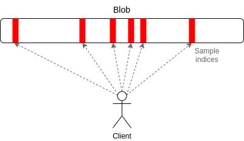

# Data Availability

A core responsibility of any layer-1 blockchain is to guarantee _data availability_.

Data availability refers to the availability of transactions in a block that is appended to the tip of the chain. During consensus, validators download the block to verify its availability. If the block contains any transactions that are withheld by a validator, the block is unavailable and will be rejected as invalid. A node needs to verify transactions and validate blocks to be able to operate trustlessly and build the state which requires historical and latest data.

A “monolithic” blockchain like Ethereum solves the data availability problem by requiring full nodes to download each block (and reject it if part of the data is unavailable).

Optimistic fraud-proof-based systems, like Optimism, require data availability for verification, and even validity-proof-based systems, like StarkNet or Aztec, require data availability to ensure liveness (e.g., to prove asset ownership for a rollup’s escape hatch or forced transaction inclusion mechanism). A transaction achieves finality when the L1 block including it has been finalized (it is approved by ⅔ of validators and cannot be reorganized), and the network has proof of the transaction’s validity [(unfinalized - _safe_)](https://info.etherscan.com/epoch-in-ethereum/).

Thus, the data availability problem for rollups (and other off-chain scaling protocols) is proving to the base layer (L1) that data for recreating the L2 state is available without requiring L1 nodes to download blocks and store copies of the data.

## The Ethereum Approach (pre-4844)

Rollups on Ethereum are operated by a _sequencer_: a full node that accepts transactions from users on a L2, processes those transactions (using the rollup's virtual machine), and produces L2 blocks that update the state of contracts and accounts on the rollup.

To enable Ethereum to monitor and enforce a rollup’s state transitions, a special “consensus” contract stores a state root—a cryptographic commitment to the rollup’s canonical state (similar to a block header on the L1 chain) that is generated after processing all transactions in a new batch.

At intervals, the sequencers arranges transactions in a new batch, and publishes the batch to the L1 by calling the L1 contract that stores rollup batches and passing the compressed data as _calldata_ to the batch submission function.

This was a significant cost overhead for L2s for which _blobs_ were introduced as an alternative. Compression techniques, such as removing redundancy, using bitmaps, exploiting common function signatures, employing scientific notation for large numbers, and utilizing contract storage for repetitive data, enabled the reduction of calldata size, leading to substantial gas savings.

## Data Availability Sampling

The purpose of sampling is to provide the node a probabilistic guarantee that data is available. Light nodes do require a connection to other (honest) nodes to make samples. This is also true for full nodes in all blockchains – they don’t conduct data availability sampling but they require a connection to at least one other node that will provide them with historical data over the p2p network.

In DAS, each node only ends up downloaing a small portion of the data, but the sampling is done _client-side_, and within each blob rather than between blobs. Each node (including client nodes that are not participating in staking) checks every blob, but instead of downloading the whole blob, they privately select N random indices in the blob (eg. N = 20), and attempt to download the data at just those positions.

The goal of this task is to verify that at least half of the data in each blob is _available_.

### Erasure Coding

Erasure coding allows us to encode blobs in such a way that if at least half of the data in a blob is published, anyone in the network can reconstruct and re-publish the rest of the data; once that re-published data propagates, the clients that initially rejected the blob will converge to accept it.

On a high level, an erasure correcting code works like this: A vector of `k` information chunks gets encoded into a _longer_ vector of `n` coded chunks. The rate `R = k/n` of the code measures the redundancy introduced by the code. Subsequently, from certain subsets of the coded chunks we can decode the original information chunks.

If the code is [_maximum distance separable_](https://www.johndcook.com/blog/2020/03/07/mds-codes/) (MDS), then the original information chunks can be recovered from any subset of size of coded chunks, a useful efficiency and robustness guarantee. The concept works on the simple principle that if you know 2 points of a line, you can uniquely determine the entire line. In other words: Once you know the polynomial’s evaluation at `t` distinct locations, you can obtain its evaluation at any other location (by first recovering the polynomial, and then evaluating it).

We require blocks to commit to the Merkle root of this "extended" data, and have light clients probabilistically check that the majority of the extended data is available, on which one of the three things is true

- The entire extended data is available, the erasure code is constructed correctly, and the block is valid.
- The entire extended data is available, the erasure code is constructed correctly, but the block is invalid.
- The entire extended data is available, but the erasure code is constructed incorrectly.

In case (1), the block is valid and the light client can accept it. In case (2), it is expected that some other node will quickly construct and relay a fraud proof. In case (3), it is also expected that some other node will quickly construct and relay a specialized kind of fraud proof that shows that the erasure code is constructed incorrectly. If a light client receives no fraud proofs for some time, it will take that as evidence that the block is in fact valid.

An interesting implementation to study can be found [here](https://github.com/ethereum/research/tree/master/erasure_code/ec65536).

Other resources:

- https://github.com/ethereum/research/wiki/A-note-on-data-availability-and-erasure-coding#what-is-the-data-availability-problem
- https://hackmd.io/@alexbeckett/a-brief-data-availability-and-retrievability-faq
- https://arxiv.org/abs/1809.09044
- https://ethereum.org/en/developers/docs/data-availability/
