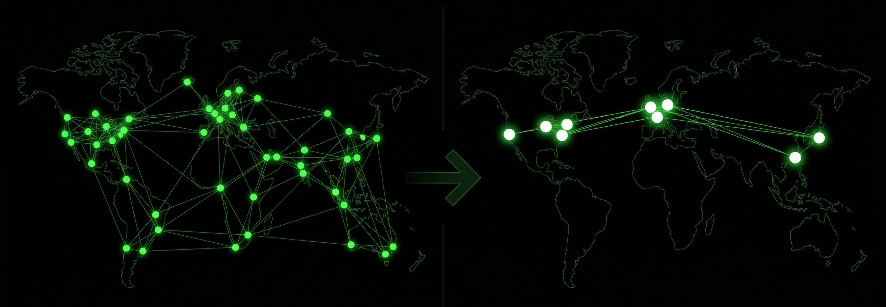

**Statelessness** is a concept that could be applied in many other fields, not only in Ethereum. 

For Ethereum, however, it will become essential in the coming years. ⚠️ 

# Idea of statelessness

The idea of statelessness comes from an **unresolved problem** caused by the **continuous growth** of the Ethereum state.
If we want Ethereum to stay **decentralized**, we must not allow the state to **keep growing**, because that would mean that only **large clients** could **run it**, while **smaller ones** would **run out of disk space**.

> A visual representation of the number of active nodes, illustrating the long-term impact of ignoring to address ongoing state growth:



In the case of **unaddressed continuous state growth**, even the security of the entire network and the Ethereum ecosystem would be called into question.

So we need to find an effective solution.

Either we introduce expiry for old and unpaid state, or we introduce a concept that allows a node to perform validation, block production, and attestation in the network without requiring it to store the whole Ethereum state.

> If statelessness enables EL clients to run without storing the state on disk,
> then they can be run on:
> - a laptop,
> - a phone,
> - a Raspberry Pi,
> - or even in a browser (theoretically).
>
> and decentralization is not compromised.

Stateless principle solves the problem, but it opens a new question: **Who is going to keep the state?**

## Current state

Currently, the state is stored in a **Merkle tree**, and only a **small portion** of the state is **read/written** in **each block**.
However, in the current protocol, every client (validator or proposer) is still required to store the entire state locally, with state proofs derived from it, relying on computing cryptographic hashes and comparing them to the expected tree root.

In a stateless design, all the required information and proofs would instead be included within the block.

----

First, let’s define how we look at **processing a block in a blockchain**.

We can think of it as a **state transition function**, where:
1. We get some previous state
2. Then we process a block
3. Then we get some new state

- Original state transition function:  ```stf(state, block) -> new_state```
- Stateless state transition function: ```stf'(state_root, block, witness) -> new_state_root```

    > - witness = the portions of the state that are read and modified, along with the proofs
    > - Instead of the client holding a state, the client holds the state root

=> If we can efficiently prove the Ethereum state, we unlock entirely new possibilities for **scaling** and **decentralization**.

---

### Current pain points in client development
- **I/O** - writing data to disk (main problem)
- **Sync** - joining the network can take a day in the best case
    - re-executing everything from genesis can take 2–3 weeks
- **Block production**
    <!-- > - parallelism will be useful
    > - once the I/O problem is solved, this becomes the next major area for improvement -->


#### Benefits of a stateless design:
- Reduced validator hardware requirements: IO, disk space, and computation
- Faster sync times (near-zero sync time), since a node does not need more than an EL block to join the network
- Clients can choose which parts of the state to store and compete with RPC providers by serving that data
- More people can become validators -> stronger decentralization
- The gas limit can be increased
- Easy [**state expiry**](/docs/wiki/research/stateless/stateless.md#state-expiry)
- Clients can validate blocks out of order

#### With stateless design:
- It becomes easier to build and implement new EL clients
- We got zk-friendly L1 where we remove heavy use of non-zk-friendly hashes (i.e: [keccak256](/docs/wiki/Cryptography/keccak256.md))

> But before statelessness, other roadmap items need to be completed first, such as [Verkle Trees](https://ethereum.org/roadmap/verkle-trees/) and [Proposer-builder separation](https://ethereum.org/roadmap/pbs/).

## State expiry

While statelessness removes the need for clients to store the full state, it does not address unbounded state growth on its own.

However, with a stateless design, it becomes feasible to safely expire or deactivate unused state without harming network participants.

When to expire: 
1. **Expire by rent**
    - Direct rent
    - Rent via time-to-live (TTL)
2. **Expire by time**
    - Refresh by touching
    - Everything expires at regular intervals ([ReGenesis proposal](https://hackmd.io/@vbuterin/state_size_management?stext=8196%3A18%3A0%3A1768226177%3AVh_fUA))

    >**Refresh by touching** is beneficial because:
    >- it avoids requiring applications to add complex economic mechanisms to pass state rent costs on to their users;
    >- it ensures a clear hard bound on the active state size at all times: (`block_gas_limit / cost_to_touch_state_object * time_to_live_period`).

    >**ReGenesis:** Having large amounts of state expire at regular discrete intervals (ie. ReGenesis) also has these benefits, and it has interesting tradeoffs
    >- **key benefit** - easier expiry - no need to walk through the tree and expire things one by one
    >- **key downside** - more variability in how much witness data needs to be provided depending on how far into an epoch you are

### State expiry challenge

The challenge with state expiry arises when RPC providers need to store both **expired** and **unexpired** state.

### Alternative approach
An **alternative approach** would be to distribute the data across the validator network using different strategies, thereby **decentralizing state storage** in a **market-driven** way, while still **preserving data availability** for the entire network.

Each validator could be incentivized to act as an RPC provider for the subset of the state it chooses to store.
The validity of this data would be guaranteed by proofs provided alongside it.
> Such a design would require a global load balancer capable of routing requests for specific parts of the state to the clients that store them.

----

# Levels of statelessness

Statelessness can be implemented at different levels.

These models differ in their trade-offs between implementation complexity, resource requirements, and decentralization guarantees.

In practice, this leads to two main approaches: **(1) weak statelessness** and **(2) strong statelessness**.

## (1) Weak statelessness
Only block producers need access to the full(or required) state.
Other nodes can verify blocks without storing a local state database.

In this model:
- proposing a block is expensive
- verifying a block is cheap

=> This implies that fewer operators may choose to run block-proposing nodes.

But **decentralization** of **block proposers** is **not critical** as long as as many participants as possible can independently **verify** that the blocks they propose are valid.
> For more details: [Why is it ok to have expensive proposers](https://notes.ethereum.org/WUUUXBKWQXORxpFMlLWy-w#So-why-is-it-ok-to-have-expensive-proposers)


>Even with state-storing nodes having higher hardware requirements and being able to store the full state, at some point they will still face the problem of the state size outgrowing even their hardware capacity.
>Because of this, either the previously mentioned [**state expiry**](/docs/wiki/research/stateless/stateless.md#state-expiry) or the concept of **sharding** should be implemented.
>
><details>
><summary><strong>Sharding</strong></summary>
>Sharding is another scaling technique that addresses the state growth issue by dividing the state into multiple shards, so that no validator ever needs to store the full state. It turns out that if we combine stateless validation with sharding, we can design a highly scalable blockchain that is also very decentralized.
></details>


#### MEV considerations

At first look, this model may seem problematic, as it appears to increase the advantage and profitability of large, well-resourced operators and companies, especially in the context of [MEV](https://chain.link/education-hub/maximal-extractable-value-mev) extraction.

However, this can be handled by Encrypted mempools ([intro video](https://www.youtube.com/watch?v=mUoWwRoHrvk)) - which prevent builders and proposers from knowing the contents of transactions until after the block is broadcast.

Additionally, once [Proposer-Builder Separation (PBS)](https://ethereum.org/roadmap/pbs/#pbs-and-mev) is implemented, the block builders might have done sophisticated MEV extraction, but the reward for it goes to the block proposer.
Since the proposer is randomly selected from the entire validator set for each slot, even if a small pool of specialized builders dominates MEV extraction, the reward for it could go to **any validator** on the network, including individual home stakers.

#### Summary

In weak statelessness: 
- block proposers use full state data to construct witnesses
- a witness is the minimal set of state data and proofs required to validate the state changes in a block
- other validators do not store the full state - they only store the state root (a hash of the entire state)

Validators receive a block together with its witness and use them to update their state root.
This makes validating nodes extremely lightweight.

Weak statelessness is expected to be **sufficient for Ethereum’s scaling needs**.

---
## (2) Strong statelessness

In strong statelessness, no nodes have access to the full state data.

This would enable extremely lightweight nodes, but comes with  trade-offs, including making interactions with smart contracts more difficult.

Strong statelessness is **not currently expected** to be part of Ethereum’s roadmap.

---

# Merkelization and hash functions
The choice of hash function matters for performance in two ways:

- **Out of circuit** - How fast it is to calculate the hash function result on a regular CPU.
- **In circuit** - How fast this can be calculated within a SNARK circuit under a particular proving system.

The current [Merkle Patricia Trie (MPT)](https://ethereum.org/developers/docs/data-structures-and-encoding/patricia-merkle-trie/) uses Keccak, which is fast **out-of-circuit** but inefficient in **in-circuit**.

MPT has an arity of **16** which reduces tree depth and disk lookups, but results in significantly **larger state proofs** - so the **witness** that needs to be transferred between peers is **too large** to safely broadcast within a 12 second slot.
> This is because the witness is a path connecting the data, which is held in leaves, to the root hash. To verify the data it is necessary to have not only all the intermediate hashes that connect each leaf to the root, but also all the "sibling" nodes. Each node in the proof has a sibling that it is hashed with to create the next hash up the trie. This is a lot of data.

### Proposed tree strategies

To solve such a thing, we would have to introduce a new tree design - like [Verkle Trees](https://stateless.fyi/trees/vkt-tree.html) and [Binary Tree](https://stateless.fyi/trees/binary-tree.html) proposals, both of which solve disadvantages of the current MPT.
Both of them provide to us:
- A more efficient encoding of data inside the tree.
- Including the account’s code inside the tree, allowing size-efficient partial code proving.
- A more convenient merkelization strategy to generate and verify proofs more efficiently.

for first 2 points Verkle and Binary tree shares the same [strategy](https://stateless.fyi/trees/data-encoding.html).

> Verkle trees reduce the witness size by shortening the distance between the leaves of the tree and its root and also eliminating the need to provide sibling nodes for verifying the root hash. Even more space efficiency will be gained by using a powerful **[polynomial commitment](/docs/wiki/research/stateless/stateless.md#polynomial-commitments-simplified)** scheme instead of the hash-style vector commitment. The polynomial commitment allows the **witness** to have a **fixed size** regardless of the number of leaves that it proves.

>In a stateless design, trees are structured to work in both ZK and non-ZK environments, allowing for flexible switching between hash functions.
> As ZK proofs become more widely adopted and trusted, it is expected that the system can transition to them without requiring major protocol upgrades.

## Polynomial commitments (simplified)
Polynomial commitments are a special kind of "**hash**" of a polynomial (where that hash has extra properties). 

One of the main extra properties is that:
- If the prover has polynomial `P`, and a coordinate `z`
    - he can produce an opening proof `Q` that allows a verifier to check that `P(z) = a`.

This lets us represent data as a polynomial and prove values.

### Two main families of polynomial commitments
1. **Kate** commitments
    - To prove that `P(z) = a`, we check that `(X - z)` is a factor of `P(x) - a`
        > in other words we prove it by proving that `P(x) - a` has `0` at `z`
    - This is done by providing a commitment to `Q(x) = (P(x) - a) / (X - z)`
    - The verifier can then check the equation: `Q(x) * (X - z) + a = P(x)`.
        > This proves that `P(x)` has the value `a` at `z`.
    - We can verify this equation with [elliptic curve pairing](https://medium.com/@VitalikButerin/exploring-elliptic-curve-pairings-c73c1864e627).

2. **FRI** commitments
    - Is hash-based polynomial commitment scheme (**post quantum secure** and **potentially faster to prove**)
    - This is a different process where the polynomial is recursively split into **even** and **odd** parts and **combined randomly** at each step until a constant polynomial is obtained (or low enough degree polynomial which is easy for direct check/verify).
    
### **Multi openings**

Key staff with polynomial commitments is that they are especially useful for multi-openings, i.e., proving multiple values of a polynomial at once

Instead of proving `P(z1) = a1, P(z2) = a2, ...`, separately, we can subtract a polynomial (e.g. [Lagrange polynomial](https://en.wikipedia.org/wiki/Lagrange_polynomial)) that interpolates all desired points.

This produces one proof (witness) that can verify all points at once.

This is very valuable for stateless clients, because it allows them to verify a large number of values efficiently with minimal data.

> You can hear more about polynomial commitments from Justin Drake in these videos: [video 1](https://www.youtube.com/watch?v=bz16BURH_u8&list=PLCGgAwcxXAWwr4l-v_v48wrSJusYGwYLk), [video 2](https://www.youtube.com/watch?v=BfV7HBHXfC0&list=PLCGgAwcxXAWwr4l-v_v48wrSJusYGwYLk&index=3), [video 3](https://www.youtube.com/watch?v=TbNauD5wgXM&list=PLCGgAwcxXAWwr4l-v_v48wrSJusYGwYLk&index=4)

----

# Current challenges
- All required EIPs for statelessness must be implemented before the transition.
- Block verification must be fast(so proofs should not be large).
- State availability in wallets is still a question - a solution like the Portal Network could be useful.
- In the current MPT, every value can be accessed via its key, where the key is a hash of the account address or storage slot. Since we are changing the hash function, we need to rehash the entire state, which cannot be done in one slot and could take months to complete.
    > the conversion process is described here: [The Verge - Converting the Ethereum state to Verkle trees](https://www.youtube.com/watch?v=F1Ne19Vew6w)

# Documentation

- [Ethereum stateless book](https://stateless.fyi/)
- [Statelessness, state expiry and history expiry](https://ethereum.org/roadmap/statelessness/)
- [video: Stateless client witnesses by Vitalik Buterin)](https://www.youtube.com/watch?v=kbcj1TKXaN4)
- [Why is it ok to have expensive proposers](https://notes.ethereum.org/WUUUXBKWQXORxpFMlLWy-w#So-why-is-it-ok-to-have-expensive-proposers)
- [video: Anatomy of a stateless client by Guillaume Ballet](https://www.youtube.com/watch?v=yFJxVSbQNcI)
- [video: The Verge - Converting the Ethereum state to Verkle trees by Guillaume Ballet](https://www.youtube.com/watch?v=F1Ne19Vew6w)
- [VOPS/Partial Stateless nodes by CPerezz](https://cperezz.github.io/presentations/partial-statefulness-ethcc2026.html)
- [A Theory of Ethereum State Size Management by Vitalik Buterin](https://hackmd.io/@vbuterin/state_size_management)
- [The Stateless Client Concept by Vitalik Buterin](https://ethresear.ch/t/the-stateless-client-concept/172)
- [Why it's so important to go stateless by Dankrad Feist](https://dankradfeist.de/ethereum/2021/02/14/why-stateless.html#:~:text=,blocks%20requires%20the%20full%20state)
- [Verkle trees by Vitalik Buterin](https://vitalik.eth.limo/general/2021/06/18/verkle.html)
- [presentation by EF Stateless consensus team](https://docs.google.com/presentation/d/1ObHPXLOGqEzCCQvF_aBg2l_RYiX_5wxKIaLZ0zPNScw/edit?slide=id.g2c6554f624f_0_50#slide=id.g2c6554f624f_0_50)
- [What are polynomial commitments?](https://ethresear.ch/t/using-polynomial-commitments-to-replace-state-roots/7095#p-20182-what-are-polynomial-commitments-2)
- [Stateless validation in a sharded blockchain](https://ethresear.ch/t/stateless-validation-in-a-sharded-blockchain/18763)