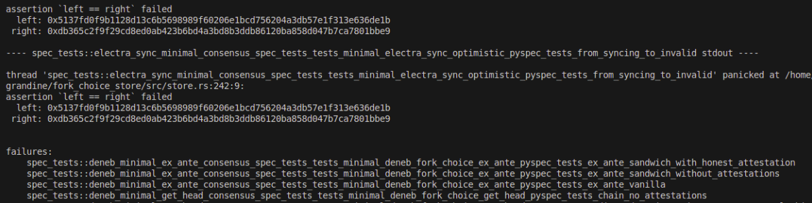
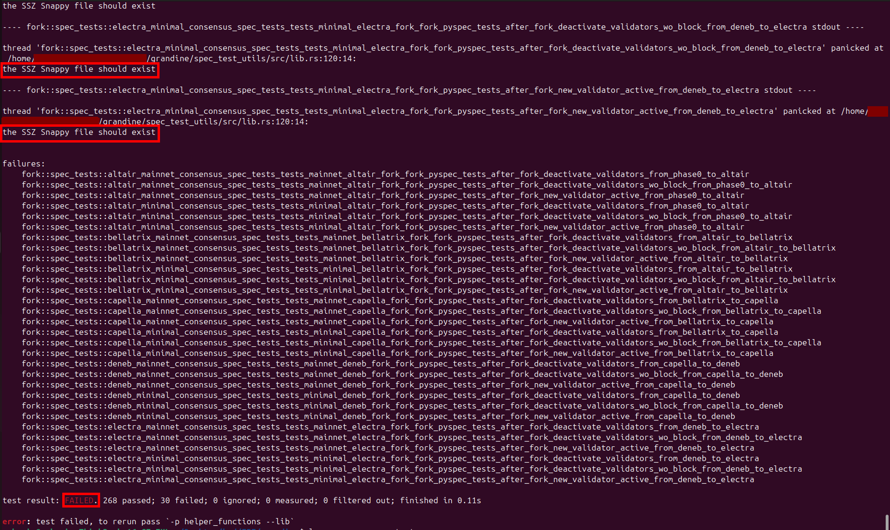

# Consensus-spec tests

> :warning: This article is a [stub](https://en.wikipedia.org/wiki/Wikipedia:Stub), help the wiki by [contributing](/contributing.md) and expanding it.

The [consensus-spec-tests](https://github.com/ethereum/consensus-spec-tests) repository contains a collection of test vectors generated from the Ethereum consensus specifications.  
These tests are used to verify the correctness of consensus client implementations against the [Ethereum consensus-specs](https://github.com/ethereum/consensus-specs).

Client developers use these tests to confirm that changes to the protocol are implemented consistently across all consensus clients.  

---

> ### Practical notes
>
>The `consensus-spec-tests` repository is quite large and can take several gigabytes of disk space.  
When running multiple consensus clients that rely on the same test vectors, it is technically possible to save space by creating **symlinks** from each client’s expected test directory to a single shared copy of `consensus-spec-tests`.
>
>However, this approach comes with risks:
>- Different clients may depend on **different versions** of the test suite.  
  Using the wrong version can result in **false negatives** (tests failing even though the client implementation is correct).
    
>    
>- Manually switching (`git checkout`) to the required test version for a client and rerunning the tests can cause **issues with unpacking SSZ Snappy files** and lead to failing tests.
    
> See [issue](https://github.com/sntntn/grandine/issues/15) for a concrete example.
>
> Because of this, the **recommended practice** is to **keep separate copies** of `consensus-spec-tests` for each consensus client, even if it requires more disk space.

Resources:  
- [consensus-spec-tests repo](https://github.com/ethereum/consensus-spec-tests)  
- [Ethereum consensus-specs](https://github.com/ethereum/consensus-specs) (source of truth for test generation)  
- [SimpleSerialize (SSZ) specification](https://ethereum.github.io/consensus-specs/ssz/simple-serialize/)  

