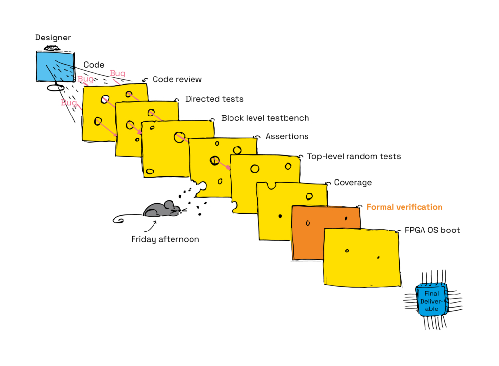

# A brief introduction to formal verification

## Mathematics and the art of abstraction

Imagine that you are in charge of organizing this year's office party. It has been decided that a team of 5 people will share a crate of beer. It's a generous party! There are 83 people at the office. How many crates should you order?

Scribbling some quick arithmetic: $\frac{83}{5} = 16.6$ Rounding up we get 17 crates of beer.

Let's step back and absorb how got the answer.

We started with a question: "How many crates of beer should be ordered for a certain number of people given a specific condition?"

The number `83` is an "abstraction" for the total number of people at the office.

"Abstraction" is an interesting concept. It originates from the Latin word `abstrahō`, meaning "[to] draw away" or "separate." Abstraction is the _art_ of selectively separating essential features of information for a given purpose. We abstracted all the people to a simple number: `83`. We ignored everything else about them, their designation, education, favorite sports team because it was simply _not relevant_ in this case.

Similarly, the number `5` is an abstraction for a team; and the answer `16.6` abstractly represents the total crates of beer required, which we rounded up to `17` because we wanted to order whole crates. That we quickly perform these abstractions and interpret the result effortlessly in our minds doesn't take away from the fact that abstraction is a powerful tool.

Our algorithm can be outlined as:

1. For a given problem, abstract away the irrelevant details from the input.
2. Use a mathematical model to find a solution.
3. Map the solution back to the original context.

This is a fundamental theme in problem solving. Computers do this too. The words on your screen are abstractly [represented in binary on a computer](https://en.wikipedia.org/wiki/ASCII) for transmission and storage.

> Mathematics is the language of precision. Abstraction allows us to precisely define the input focused only on relevant features for a given problem. The result of which can be mathematically solved and interpreted as required.

## Formal verification

Formal verification, like the previous example, helps find the answer to a simple question: "Does a system correctly meet its required specifications?"

> Specifically, formal verification is a verification technique that abstracts a system as a mathematical model and proves or disproves its correctness.

A "system" is defined as a mechanism that is able to execute all of the functions given by its external interface. 

"Invariants" are properties that remains unchanged for a system, regardless of its current state. For example, an invariant of a vending machine is: Nobody should be able to dispense a product for free.

Formal verification tests the correctness of a system by checking if all its invariants holds true.

The philosophical roots of formal methods reach back to ancient Greece with Plato's exploration of theory of forms in his book "Sophist", while mathematicians in the 17th century further developed the concept through abstract algebra. German polymath, Gottfried Leibniz's vision laid the groundwork for what we now call formal reasoning. In the 19th century, pioneering work by George Boole on analysis and Friedrich Frege on propositional logic provided the foundation for formal semantics.

There are several types of formal methods used to verify a system design:

- **Model checking / assertion-based checking**: Models a system as a finite state machine and verifies its correctness and liveness using propositional logic.
- **Temporal logic**: Models a system whose propositions varies with time.
- **Equivalence checking**: Verifies if two models of the same specification but varying implementations produce the same result.

Popular tools verification systems are:

- The  [TLA+-based model checker](https://www.microsoft.com/en-us/research/wp-content/uploads/2016/12/Specifying-Concurrent-Systems-with-TLA.pdf)  by Leslie Lamport
- The  [CSP-based verification](http://dl.acm.org/citation.cfm?doid=359576.359585) by Tony Hoare
- The  [Alloy language](http://alloytools.org/) from Daniel Jackson at MIT
- The  [Event-B language](http://www.event-b.org/), [Z-notation](https://en.wikipedia.org/wiki/Z_notation), and proof tools from Jean-Raymond.

## Example

The first step of formal verification is abstracting the system. Any system can be selectively abstracted for the purpose of testing its correctness.

E.W Dijkstra elegantly describes:

> I have grown to regard a program as an ordered set of pearls, a “necklace”. The top pearl describes the program in its
> most abstract form, in all lower pearls one or more concepts used above are explained (refined) in terms of concepts
> to be explained (refined) in pearls below it, while the bottom pearl eventually explains what still has to be explained
> in terms of a standard interface (=machine). The family becomes a given collection of pearls that can be strung
> into a fitting necklace.

Let's write a quick TLA+ spec to model that abstracts a traffic controller.

```bash
-------------- MODULE TrafficController --------------

CONSTANTS MaxCars
VARIABLES carsWaiting, greenSignal

Init == /\ carsWaiting = 0
        /\ greenSignal = FALSE

Arrive(car) == IF carsWaiting < MaxCars THEN carsWaiting' = carsWaiting + 1 ELSE UNCHANGED carsWaiting

Depart == IF carsWaiting > 0 THEN carsWaiting' = carsWaiting - 1 ELSE UNCHANGED carsWaiting

ChangeSignal == /\ carsWaiting > 0
                /\ greenSignal' = TRUE

Next == \/
         \E car \in {0, 1}: Arrive(car)
         \/ Depart
         \/ ChangeSignal

Invariant == carsWaiting <= MaxCars

Spec == Init /\ [][Next]_<<carsWaiting, greenSignal>> /\ []Invariant

=======================================================

```

Note how this abstraction conveniently ignores all the irrelevant interactions at a traffic signal (honking, anyone?).

**Efficient abstraction is an art.**

Understanding the TLA+ semantics are not important for this discussion. Here is a brief of what it does:

`Init` initializes the system with no cars waiting. The `Arrive` models the arrival of cars, increasing the count of waiting cars if the maximum capacity has not been reached. Conversely, the `Depart` simulates cars departing from the controller, decrementing the count of waiting cars if there are any. Lastly ,`ChangeSignal` dictates that if cars are waiting, the traffic signal switches to green.

The invariant `Invariant == carsWaiting <= MaxCars` ensures the number of cars waiting never exceeds `MaxCars`, a defined constant.

## Ethereum and formal verification

Formal verification plays a critical role in verifying safety and liveliness of Ethereum's decentralized infrastructure and its applications. This rigorous method achieves the highest ranking on the [EAL scale](https://en.wikipedia.org/wiki/Evaluation_Assurance_Level#EAL7:_Formally_Verified_Design_and_Tested), signifying its profound impact on security.

### Protocol verification

[KEVM](https://github.com/runtimeverification/evm-semantics) builds upon [K framework](https://kframework.org/) for crafting formal semantics and conducting verification of the [Ethereum Virtual Machine (EVM)](/wiki/EL/evm.md) specification for correctness.

Formal verification is an essential tool in the test suite and was used to discover a subtle [array-out-of-bound runtime error](https://consensys.io/blog/formal-verification-of-ethereum-2-0-part-1-fixing-the-array-out-of-bound-runtime-error) within the state transition component.


> Formal verification a slice of a Swiss cheese model in a test suite – [Source: Codasip](https://codasip.com/2023/09/19/formal-verification-best-practices-to-reach-your-targets/).

### Verifying optimizations

Equivalence checking is extensively used for software optimization. For example, an optimized smart contract can be tested for correctness against its previous version to confirm that the optimization hasn't introduced any unintended behavior.

### Smart contract verification

Bugs or vulnerabilities in smart contracts can have devastating consequences, leading to financial losses and undermining user trust. Formal verification tools like tools [Certora Prover](https://docs.certora.com/en/latest/docs/prover/index.html) and [halmos](https://github.com/a16z/halmos) helps identify these issues.

Formal verification has always been an integral part of the [Solidity](https://soliditylang.org/) language. Here Christian from the solidity team from an early workshop:

<iframe width="560" height="315" src="https://www.youtube.com/embed/rx0NPckEWGI?si=GYGPPGGA7aY2k4Ci" title="YouTube video player" frameborder="0" allow="accelerometer; autoplay; clipboard-write; encrypted-media; gyroscope; picture-in-picture; web-share" referrerpolicy="strict-origin-when-cross-origin" allowfullscreen></iframe>

---

Solidity compiler also implements a [formal verification approach based on SMT (Satisfiability Modulo Theories) and Horn solving](https://docs.soliditylang.org/en/latest/smtchecker.html).

Leo from the team explains how to use this feature:

<iframe width="560" height="315" src="https://www.youtube.com/embed/QQbWpN76HEg?si=CI0cPCVgAkfAM_V2" title="YouTube video player" frameborder="0" allow="accelerometer; autoplay; clipboard-write; encrypted-media; gyroscope; picture-in-picture; web-share" referrerpolicy="strict-origin-when-cross-origin" allowfullscreen></iframe>

## Closing thoughts

Formal verification is hard. The process itself can be [complex and time-consuming,](https://www.hillelwayne.com/post/why-dont-people-use-formal-methods) requiring specialized skills and tools. Additionally, formal verification can only guarantee the correctness of the model, not necessarily the underlying implementation itself. Errors in the translation process between code and model can still introduce vulnerabilities.

Formal verification relies on efficient abstraction of a system. And abstraction is hard. If you leave an important detail out of the abstraction it can introduce safety issues. For this reason, often times [engineers use a complementary simulation method like fuzzing](https://blog.trailofbits.com/2024/03/22/why-fuzzing-over-formal-verification/) to test a system using random input.

Despite these challenges, formal verification is a powerful technique that can help define safe and efficient systems. We'll close on this insightful quote from Dijkstra:

> “Program testing can be used to show the presence of bugs, but never to show their absence!”

## Resources

- NASA, [What is formal methods](https://shemesh.larc.nasa.gov/fm/fm-what.html)
- Aximoise, [Formal verification: A quick primer](https://www.youtube.com/watch?v=J4hwfTbfhVU)
- Andrew H., [Formal Verification, Casually Explained](https://ahelwer.ca/post/2018-02-12-formal-verification/)
- Bernie C., [A Brief History of Formal Methods](https://www.researchgate.net/publication/233960390_A_Brief_History_of_Formal_Methods)
- Martin D., [Martin Davis on Computability, Computational Logic, and Mathematical Foundations](https://link.springer.com/book/10.1007/978-3-319-41842-1)
- Ashish D., [A Brief History of Formal Verification](http://homepages.cs.ncl.ac.uk/brian.randell/NATO/nato1969.PDF)
- Serokell, [Formal Verification: History and Methods](https://serokell.io/blog/formal-verification-history)
- Pawel S., [Formal verification applied (with TLA+)](https://www.youtube.com/watch?v=l9XZYI3jta0)
- Amazon, [How Amazon Web Services Uses Formal Methods](https://cacm.acm.org/research/how-amazon-web-services-uses-formal-methods/)
- Codasip, [Formal verification best practices to reach your targets](https://codasip.com/2023/09/19/formal-verification-best-practices-to-reach-your-targets/)
- Siemens, [How Can You Say That Formal Verification Is Exhaustive?](https://blogs.sw.siemens.com/verificationhorizons/2021/09/16/how-can-you-say-that-formal-verification-is-exhaustive/)
- Siemens, [3 Notable Formal Verification Conference Papers of 2020](https://blogs.sw.siemens.com/verificationhorizons/2021/02/09/3-notable-formal-verification-conference-papers-of-2020/)
- Siemens, [Formal Verification Methods](https://verificationacademy.com/topics/formal-verification/)
- Stanford, [Introduction to First Order Logic](https://plato.stanford.edu/entries/logic-classical/)
- NYU, [Introduction to Satisfiability Modulo Theories](https://cs.nyu.edu/~barrett/pubs/BT14.pdf)
- Sebastian U, [A Formal Verification of Rust's Binary Search Implementation](https://kha.github.io/2016/07/22/formally-verifying-rusts-binary-search.html)
- Jack V., [Primer on TLA+](https://jack-vanlightly.com/blog/2023/10/10/a-primer-on-formal-verification-and-tla)
- Martin L., [Symbolic execution for hevm](https://fv.ethereum.org/2020/07/28/symbolic-hevm-release)
- The Royal Society, [Formal verification: will the seedling ever flower?](https://royalsocietypublishing.org/doi/10.1098/rsta.2015.0402)
