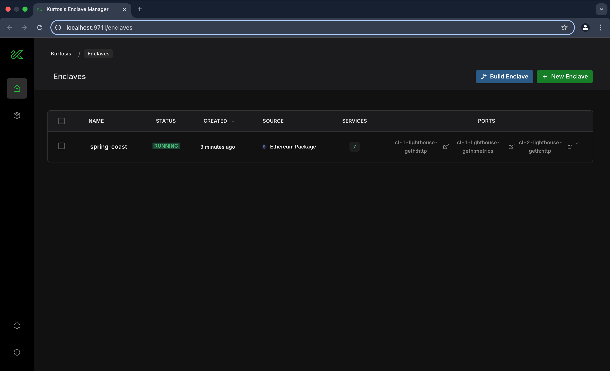

# Kurtosis for Local Devnets

## Overview 
[**Kurtosis**](https://docs.kurtosis.com/) is a development and testing platform designed to package and launch environments of containerized services efficiently. Kurtosis serves as a build system for multi-container test environments, helping developers set up Ethereum network instances that can be easily reproduced locally. The [**Ethereum package**](https://github.com/ethpandaops/ethereum-package), built on top of Kurtosis, enables the rapid setup of a customizable, scalable, and private Ethereum testnet using Docker or Kubernetes. It supports all major Execution Layer (EL) and Consensus Layer (CL) clients, efficiently managing local port mappings and service connections for validation and testing of Ethereum core infrastructure.

This article provides a brief introduction to Kurtosis, how to install and use it, and some essential commands for working with Ethereum devnets.

## Installing Kurtosis

Before installing Kurtosis, ensure the following dependencies are pre-installed on your system:

- Docker (required to run Kurtosis containers)
- Git (to clone repositories)

You can install Kurtosis by following the official installation guide [here](https://docs.kurtosis.com/install).

Once installed, verify your setup by running:

```sh
kurtosis version
```

For upgrade instructions, refer to the [Kurtosis upgrade guide](https://docs.kurtosis.com/upgrade).

## Kurtosis Engine

The Kurtosis engine is the core service that runs the devnet infrastructure. It starts automatically as soon as you launch the devnet. However, here are some useful commands for interacting with the engine:

```sh
# Start the engine
kurtosis engine start

# Stop the engine
kurtosis engine stop

# Check the status of the engine
kurtosis engine status
```

## Quick Start: Ethereum Package

You can quickly set up a default Ethereum devnet using the Ethereum package by following the instructions from the [ethereum-package GitHub page](https://github.com/kurtosis-tech/ethereum-package).

The shortest way to launch the devnet after installation is to run the package with default configurations:

```sh
kurtosis run github.com/ethpandaops/ethereum-package
```

The running enclave status will appear:


Run this command to open Kurtosis web interface:

```sh
kurtosis web
```



## Kurtosis Enclave

An **enclave** in Kurtosis is an isolated environment where services are deployed. It allows developers to create multiple devnets without interference. Key commands include:

```sh
# List existing enclaves
kurtosis enclave ls

# Inspect an enclave
kurtosis enclave inspect <enclave-name>

# Example
kurtosis enclave inspect my-testnet

# Delete an enclave
kurtosis enclave rm <enclave-name> -f

```

Explore the enclave in the web interface by clicking on the enclave's name:


You can run multiple enclaves at the same time, but be cautious of your machine's resources to avoid performance issues. Additionally, assigning a custom name to each enclave can be useful when managing several enclaves simultaneously.

```sh
# assigning your name to enclave
kurtosis --enclave my-testnet run github.com/ethpandaops/ethereum-package
```

## Cleaning Up Resources

After testing, you may want to relaunch the devnets with new parameters or clean up resources to free disk space. Use the following command to remove stopped enclaves, as well as stopped engine containers:

```sh
kurtosis clean -a
```

> [!CAUTION]
> All the enclaves will be deleted.

## Customizing Devnets

Devnets in Kurtosis are configured using YAML files stored locally or in the network. These files allow customization of parameters such as participants, network parameters, additional services. If a parameter is not specified in the file, the default value is used. An exhaustive list of all possible configuration parameters can be found [here](https://github.com/ethpandaops/ethereum-package?tab=readme-ov-file#configuration).  A common practice is to build client Docker images locally and add them to the configuration file using the `cl_image` or `el_image` parameters for testing purposes.&#x20;

Example file:

```yaml
participants:
 - el_type: geth   
   el_image: geth:latest   
   cl_type: teku
   cl_image: consensys/teku:develop
additional_services
  - dora
  - prometheus_grafana
network_params:
  seconds_per_slot: 4
global_log_level: debug

```

To run Kurtosis with these parameters, use the `--args-file` flag. For remote files, provide the raw URL of the desired file:

```sh
# local file
kurtosis run github.com/ethpandaops/ethereum-package --args-file ./custom.yaml

# remote file
kurtosis run github.com/ethpandaops/ethereum-package --args-file https://raw.githubusercontent.com/ethpandaops/ethereum-package/main/.github/tests/mix.yaml
```

You can find a detailed description of all parameters [here](https://github.com/ethpandaops/ethereum-package?tab=readme-ov-file#configuration).

## Customizing Ethereum Package

You can clone the Ethereum package repository and develop on top of it. To run your own modifications, use the following command:

```sh
kurtosis run .

# Example
kurtosis run . --args-file ./custom.yaml
```

## Tooling

Kurtosis provides several built-in tools to interact with Ethereum devnets. Here are some examples:

- [**dora**](https://github.com/ethpandaops/dora): A lightweight Beacon Chain explorer.

- [**xatu**](https://github.com/ethpandaops/xatu): A centralized Ethereum network monitoring tool for data pipelining.

- [**assertoor**](https://github.com/ethpandaops/assertoor): Used for writing assertions to verify network behavior.

Example YAML file:

```sh
- el_type: nethermind
  cl_type: prysm
additional_services:
  - dora
  - assertoor
```

The full list of services can be found [here](https\://ethpandaops.io/posts/kurtosis-deep-dive/#tooling).

Some of these tools have a web interface. To open the interface, use the link provided in the user services list:


Dora is one of the most commonly used tools for the Beacon Chain. Here is how its interface looks like:


## Working with Logs

Reading logs is an important part of debugging and monitoring the devnet. Logs can be accessed using the CLI:

```sh
kurtosis service logs <enclave-id> <service-name> -f

# Example
kurtosis service logs my-testnet cl-1-teku-geth -f
````

Logs can also be written to a file for further analysis:

```sh
kurtosis service logs <enclave-name> <instance> > <file-name>

# Example
kurtosis service logs my-testnet cl-1-teku-geth > kurtosis.log
```

Alternatively, Docker logs can be used to inspect Kurtosis containers:

```sh
docker logs <container-id>
```

## References

- [Ethereum Package GitHub Repository](https://github.com/kurtosis-tech/ethereum-package)
- [Kurtosis GitHub Repository](https://github.com/kurtosis-tech/kurtosis)
- [Kurtosis Official Documentation](https://docs.kurtosis.com)
- [Kurtosis Deep Dive (EthPandaOps blog post)](https://ethpandaops.io/posts/kurtosis-deep-dive/)
- [Kurtosis Workshop by EthPandaOps Team (Youtube)](https://www.youtube.com/watch?v=mywpmp2sPt0)
